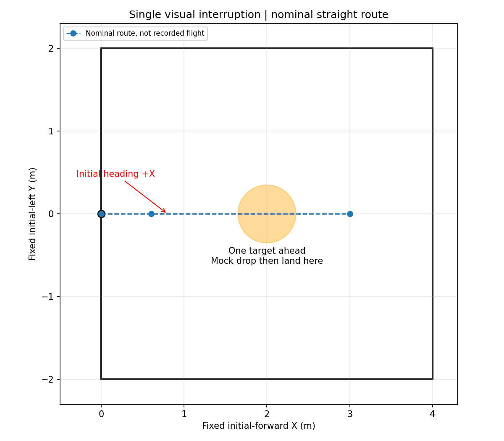

# 专项1：直飞→视觉中断→对齐→一次模拟投递→原地降落

场地总面积4×4m，起飞点在近侧边中点。+X是初始机头正前方，+Y向左。前方约2m、Y≈0放置一个**bridge、panzer或red_cross**靶；这些是当前策略会主动中断搜索的三类。建议先只摆一个，避免场外海报/其他靶进入视场。



## 本套执行内容

1. 原地起飞到FC离地1.4m，操作员启动任务后沿中心线朝前，名义航点(0.6,0)→(3.0,0)。不走矩形或牛耕路线。
2. 发现合格高权重目标后，中断直飞，进入原有接近、视觉对齐、下降和释放许可链。
3. 在独立配置的FC离地0.60m模拟投递。只有原链成功ACK及恢复完成后，才结束本测试；不把检测到目标直接当成投递成功。
4. 恢复到1.4m稳定后，在该目标当前XY**直接进入降落交接**。不继续前飞，不返回起飞点，也不增加一个零距离返航规划步骤；稳定满足条件后请求AUTO.LAND。

模拟投递仅调用独立mock，无真实舵机/PWM。脚本不自动解锁、启动任务或强制停桨。前两套降落不要求H；第三套专门测试H视觉降落。

## 启动

先按[公共说明](../README.md)在独立板端工程构建，准备MAVROS、driver2、标定相机和RKNN模型。旧整机应用必须先退出。

```bash
# 工程根目录；无需输入ground_z或外参
bash deployment/board_trials_4x4/01_visual_interrupt/start.sh preview
```

确认相机图像/CameraInfo正常、数值坐标转换就绪，Ctrl+C退出preview，再启动：

```bash
bash deployment/board_trials_4x4/01_visual_interrupt/start.sh flight
```

看到READY并确认模型/地图工作后，飞手按现场流程选择模式/解锁并确认1.4m悬停；另一个终端：

```bash
rosservice call /navigation/start_mission "{}"
```

`preview`不会飞；`flight`接通控制输出，但任务仍需上述显式启动。严禁同时开preview、flight或另一套任务。自动地面基准及已知外参见公共说明，`settings.yaml`只保留本测试必要高度等参数；默认无需修改。

## 看什么、在哪里回看

- 应看到SEARCH中断→APPROACH/ALIGN→模拟释放1次→恢复→LAND→AUTO.LAND落地；确认数必须为1，不能继续第二投。
- 靶未确认、直线走完仍无投递或视觉事务失败，应记录失败并接管，不伪报一次投递成功。
- 若对准等待过长，查看像素偏差、几何精修/关联、释放证据及地图坐标，不只看YOLO置信度。
- 完成落地且飞控解除武装后自动收尾；若现场飞控不自动解除武装，确认已落地再Ctrl+C。模式接管后不会自动抢回OFFBOARD。

每次输出 `logs/board_visual_interrupt_<时间>/index.html`。同时保留原相机录像、带YOLO/几何/任务标注录像、逐帧时间、轨迹、视觉事件和`result.json`。PASS要求一次任务确认的模拟投递以及自动落地交接/落地确认；预览或中途停止标为INCOMPLETE。

本套已准备离线检查；实物动态表现仍需本次试飞验证，不代表正式比赛或真实机构验收。
