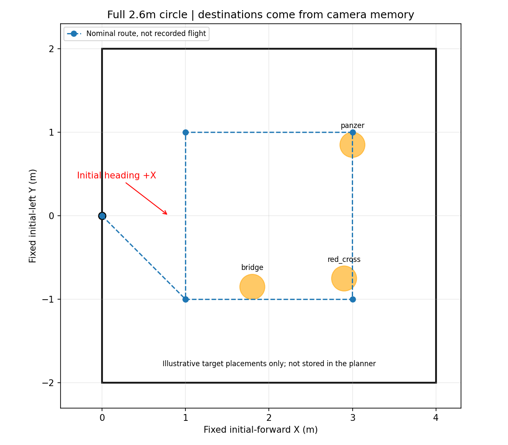

# 专项2：2.6m完整高位一圈→记忆目标→逐个低位模拟投递→末目标处降落

场地总面积4×4m，原点为近侧边中点，+X朝机头前方、+Y向左。摆放1–3个不同类别的bridge/panzer/red_cross靶，每种最多一个；这三类是当前高位策略的记忆/优先投递集合。重复同类但位置不同会成为冲突线索，不应当作多个独立可靠记忆靶。



图中靶位仅为摆放建议，**不会写入导航/视觉记忆**。真实目标坐标必须由相机解算。目标与区域边缘留出机体和靶面空间，首轮先空障碍场验证该链条。

## 本套与整场仿真的区别

- 起飞低空1.4m，启动任务后升至FC离地2.6m，按(1,-1)→(3,-1)→(3,1)→(1,1)→(1,-1)完整一圈。
- **不因提前找到三类而中断高位。** 只有全圈正常完成才冻结本轮合格记忆清单，数量可以是1、2或3。
- 回到1.4m低位后，按感知地图给出的访问代价逐个重访；访问次序不加入“最后返回起点”的虚构路程项。实际轨迹仍由原3D规划器自主避障。
- 每个目标必须低位新鲜重捕、对齐及通过原释放许可，才在默认FC AGL0.60m完成模拟投递。
- 清单全部完成即结束：1个记忆就只投1次，2个就2次，3个就3次；不虚构缺失目标，不为了凑三次投递追加牛耕搜索。
- 最后一次模拟投递恢复稳定后，**直接在最后目标当前XY交接AUTO.LAND**，不回起飞点，不要求摆H。

全圈航点失败、没有有效记忆或已记忆目标无法完成时保留失败/中止并由飞手处理，不把跳过高位航点称为“转完一圈”，也不把失败目标称为已投递。

## 启动

先完成[公共准备](../README.md)，旧应用退出，设备MAVROS/driver2/相机保持运行。

```bash
bash deployment/board_trials_4x4/02_high_view_revisit/start.sh preview
# Ctrl+C退出preview后再运行：
bash deployment/board_trials_4x4/02_high_view_revisit/start.sh flight
```

脚本自动采样任务系地面高度、统一所有local Z，继承上次板端已知外参；不用手填`ground_z`。看到READY，飞手按现场流程选择模式/解锁，确认1.4m悬停后：

```bash
rosservice call /navigation/start_mission "{}"
```

此后才会升到2.6m执行高位试验。`flight`没有自动解锁或启动任务。所有投递均为mock，不连接真实机构。

## 验收和回看

重点检查：全圈是否确实完成；冻结清单的类别/数量/坐标；1.4m低位是否找回同一实物；模拟投递确认次数是否等于清单数；末次投递后是否留在最后目标附近降落。

`logs/board_high_view_<时间>/index.html`可看原相机与标注录像；`vision_events.jsonl`含高位状态和冻结清单，`result.json`列出预期与实际模拟投递数。检测框只在图像时间匹配时叠加，不把旧框强行当作当前观测。

地图使用0.10m栅格的局部配置，高位排序仅1–3点、最多6个顺序，感知代价图最多1Hz更新；录像640宽/5fps、无bag。板端实际并发资源与识别效果尚需现场确认。

这是一套独立板端测试适配器，不通过伪造`use_sim_time`绕开原仿真专用入口。正式整场默认提前中断策略保持原样；本套仅在本地，不推远端、不替换正赛入口。

本专项PASS表示冻结清单全部完成，不表示场内真实靶标召回率100%。例如实际摆了3个但只形成2个合格记忆，应通过录像检查漏识别/类别冲突，不能把该PASS当作三个全找到。

本分支同步：默认alignment_mode=legacy_static、virtual_ceiling_enabled=false，共享自动高度精度、控制器READY及真实离地后落地收尾修复；控制Z限幅保留。


2026-09-26共同更新：继承当前板端相机方向/槽位；起飞初始前视0.25m、巡航0.50m，限速仍0.5m/s。恢复目标高于交接门槛10cm；统一三维膨胀25/20/10cm，仅第二套增加中部柱，虚拟顶棚仍关闭。[原因与验证](../../../docs/planning/obstacle_board_alignment_20260926/REPORT.md)。本轮未重新上板。
