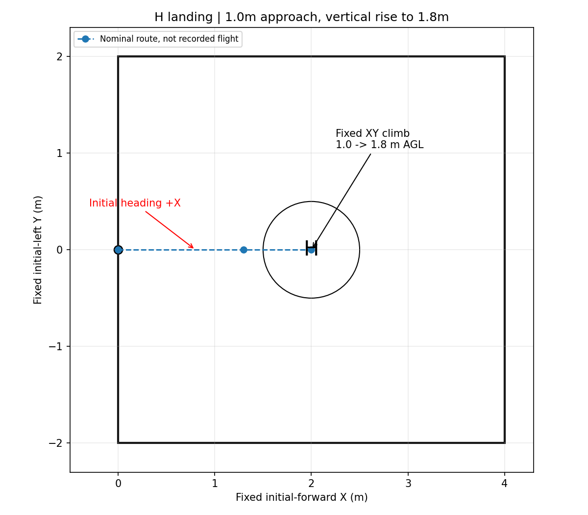

# 专项3：前方H→低空接近→定点爬升→视觉对齐→H降落

场地总面积4×4m，起飞点在近侧边中点，+X是机头前方、+Y向左。H中心放在约(2.0,0.0)，保持靶面平整且无其他类似黑圈干扰。



## 执行过程

1. 原地起飞到FC离地1.0m，启动任务后先到(1.3,0)，再到H的大致位置(2.0,0)，仍保持1.0m。
2. XY保持(2.0,0)，**单独升到1.8m**。该升高是明确的垂直航段，不依赖H先被识别，便于检验定点爬升。
3. 进入原H视觉降落流程，要求新的合法H观测、稳定对齐和高度交接，再请求AUTO.LAND落到H上。

前两个点只提供H附近的大致位置；最终对齐依靠CV，不把预设(2,0)当作识别成功。本套不启动释放许可/投递代理或mock服务，不执行任何投递。当前默认高度都已配好；H摆放约2m、低空1.0m、识别1.8m可在本目录`settings.yaml`集中调整，不需手动换算local Z。

## 启动

完成[公共准备](../README.md)并停止旧应用，MAVROS、driver2和标定相机先运行。

```bash
bash deployment/board_trials_4x4/03_h_landing/start.sh preview
# Ctrl+C退出preview后再运行：
bash deployment/board_trials_4x4/03_h_landing/start.sh flight
```

脚本继承公共已知外参，在未解锁静置时自动建立地面基准；飞控停地Z约0不需要人为改成地面真值。看到READY后由飞手按现场流程选择模式/解锁，确认1.0m悬停，再显式启动：

```bash
rosservice call /navigation/start_mission "{}"
```

`preview`只看定位、地图、视觉与录像，不飞；`flight`接通飞控输出但不自动解锁/启动任务。不要与其他两套或旧整机同时启动。

## 重点观察

- 在同一XY位置能否稳定从1.0m升到1.8m，是否出现坐标突然跳变或指令横向偏转。
- 进入LAND后是否取得新鲜H观测、对齐到H中心，再降低高度；正常识别爬升不应误当越限。
- 如果没有H或H不可识别，不应仅凭预设坐标宣称视觉降落成功。及时接管；失败/手动收尾保留INCOMPLETE。
- 最终判断结合相机H标记、任务LAND结果及MAVROS ON_GROUND/解除武装状态。程序不强制停桨，不自动改飞控降落参数。

每次回看入口为`logs/board_landing_<时间>/index.html`；原始/标注相机录像、地图/视觉结果和位姿均保留。原有CV模式随任务阶段切换，预览阶段未出现H对齐标记不等于已经进入LAND验收。

本次是待上板的专项配置与离线验证，不把配置准备完成当成实机H降落已通过。
