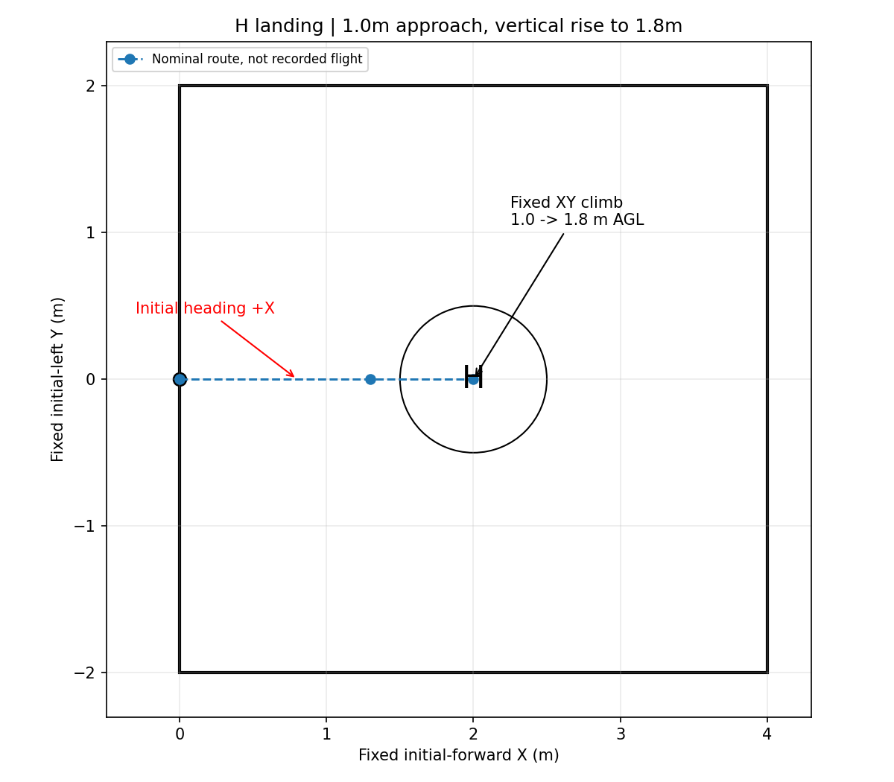

# 专项3：前方H→低空接近→定点爬升→视觉对齐→H降落

> 2026-10-06：现场80×80cm H靶，FC中心离地1.0m接近、1.2m识别；必须飞手手动解锁并拨入OFFBOARD，稳定起飞后自动进入任务。H专项最终视觉AUTO.LAND，不使用普通组的30cm悬停。

2026-09-27更新：原四组已继承最新板端/研究修复；共同三维膨胀改为27.5/20/10cm，静态TF与关闭虚拟顶棚保持。最新入口见[八组说明](../MODULES.md)，[本次实跑及录像](../../../docs/verification/board_modules_20260927/REPORT.md)。本文旧日期段落只描述当时版本。

场地总面积4×4m，起飞点在近侧边中点，+X是机头前方、+Y向左。H中心放在约(2.0,0.0)，保持靶面平整且无其他类似黑圈干扰。



## 执行过程

1. 原地起飞到FC离地1.0m，启动任务后先到(1.3,0)，再到H的大致位置(2.0,0)，仍保持1.0m。
2. XY保持(2.0,0)，**单独升到1.2m**。该升高是明确的垂直航段，不依赖H先被识别，便于检验定点爬升。
3. 进入与08完整任务相同的H视觉降落流程，要求新的合法H观测、稳定对齐和高度交接，再请求AUTO.LAND落到H上。

共同入口显式开启`/landing_detector/landing_enable_h_stroke_fallback=true`，覆盖03、04和08的LAND阶段。完整圆环及内部H校验仍优先，失败时才尝试H笔画兜底；默认预览/接近阶段保持检测关闭，进入真正LAND后再接受新帧。投影使用实际CameraInfo和图像时刻TF，保留现场相机安装外参。

末端门槛与完整任务相同：XY误差不超过8cm，累计10个新的合法H帧，观测年龄不超过0.5s；满足后锁定地图H中心，向FC离地0.40m下降，在FC离地不超过0.55m且XY仍合格时请求AUTO.LAND。人工接管或链路失效会取消旧LAND事务，重新拨回OFFBOARD不会自动恢复该事务。高度以外不另造专项降落控制逻辑。

前两个点只提供H附近的大致位置；最终对齐依靠CV，不把预设(2,0)当作识别成功。本套不启动释放许可/投递代理或mock服务，不执行任何投递。当前默认高度都已配好；H摆放约2m、低空1.0m、识别1.2m可在本目录`settings.yaml`集中调整，不需手动换算local Z。

## 启动

完成[公共准备](../README.md)并停止旧应用，MAVROS、driver2和标定相机先运行。

```bash
bash deployment/board_trials_4x4/03_h_landing/start.sh preview --site-config deployment/site_20260928/h_landing_test_area.yaml
# Ctrl+C退出preview后再运行：
bash deployment/board_trials_4x4/03_h_landing/start.sh flight --site-config deployment/site_20260928/h_landing_test_area.yaml
```

脚本继承公共已知外参，在未解锁静置时自动建立地面基准；飞控停地Z约0不需要人为改成地面真值。现场入口加载`deployment/site_20260928/h_landing_test_area.yaml`，看到READY后由飞手人工解锁并拨入OFFBOARD，在1.0m起飞高度稳定后自动启动任务，不需再手动调用start_mission。未加载现场配置的直接模块入口，应核对实际auto_start_after_arm参数后使用。

`preview`只看定位、地图和视觉，不飞；`flight`接通飞控输出，解锁及OFFBOARD均由飞手操作。板端默认不增加相机录像/JPEG编码。不要与其他两套或旧整机同时启动。

## 重点观察

- 在同一XY位置能否稳定从1.0m升到1.2m，是否出现坐标突然跳变或指令横向偏转。
- 进入LAND后是否取得新鲜H观测、对齐到H中心，再降低高度；正常识别爬升不应误当越限。
- 如果没有H或H不可识别，不应仅凭预设坐标宣称视觉降落成功。及时接管；失败/手动收尾保留INCOMPLETE。
- 最终判断结合相机H标记、任务LAND结果及MAVROS ON_GROUND/解除武装状态。程序不强制停桨，不自动改飞控降落参数。

每次回看入口为`logs/board_landing_<时间>/index.html`；原始/标注相机录像、地图/视觉结果和位姿均保留。原有CV模式随任务阶段切换，预览阶段未出现H对齐标记不等于已经进入LAND验收。

本次是待上板的专项配置与离线验证，不把配置准备完成当成实机H降落已通过。

本分支同步：默认alignment_mode=legacy_static、virtual_ceiling_enabled=false，共享自动高度精度、控制器READY及真实离地后落地收尾修复；控制Z限幅保留。


2026-09-26共同更新：继承当前板端相机方向/槽位；起飞初始前视0.25m、巡航0.50m，限速仍0.5m/s。恢复目标高于交接门槛10cm；统一三维膨胀25/20/10cm，仅第二套增加中部柱，虚拟顶棚仍关闭。[原因与验证](../../../docs/planning/obstacle_board_alignment_20260926/REPORT.md)。本轮未重新上板。

高度口径：`ground_z = 静置FC局部Z - fc_ground_clearance`，识别目标为`ground_z + 1.2`，不是固定local Z=1.2。现有静置FC离地0.22m、相机位于FC下方0.16m时，静置local Z=0对应识别local Z=0.98m，水平姿态镜头离地约1.04m。H检测按图像结构及相机/位姿投影，不通过写入0.8m靶宽推定高度；80cm真靶在该高度的完整视野与反光识别仍需现场验证。整机和走廊+H专项高度未被本次覆盖。
