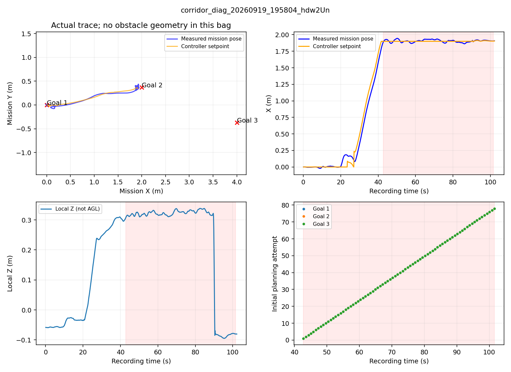
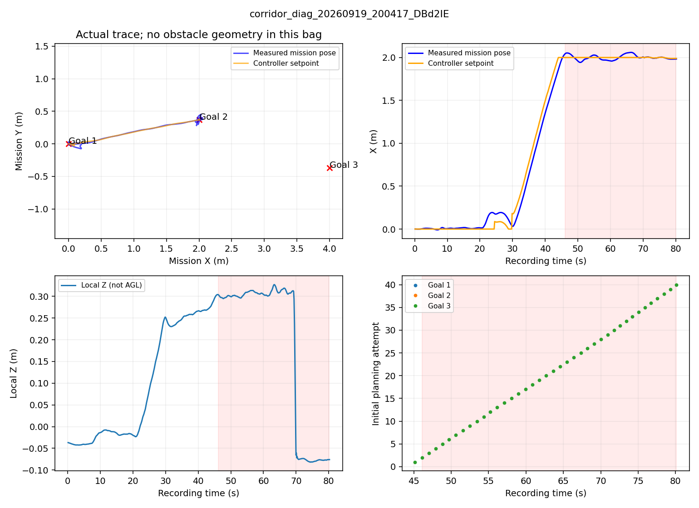
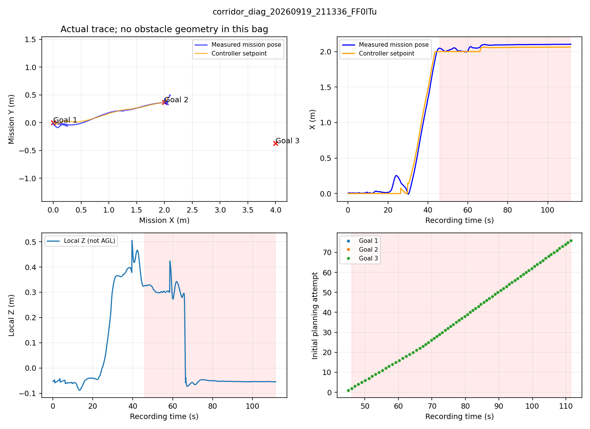
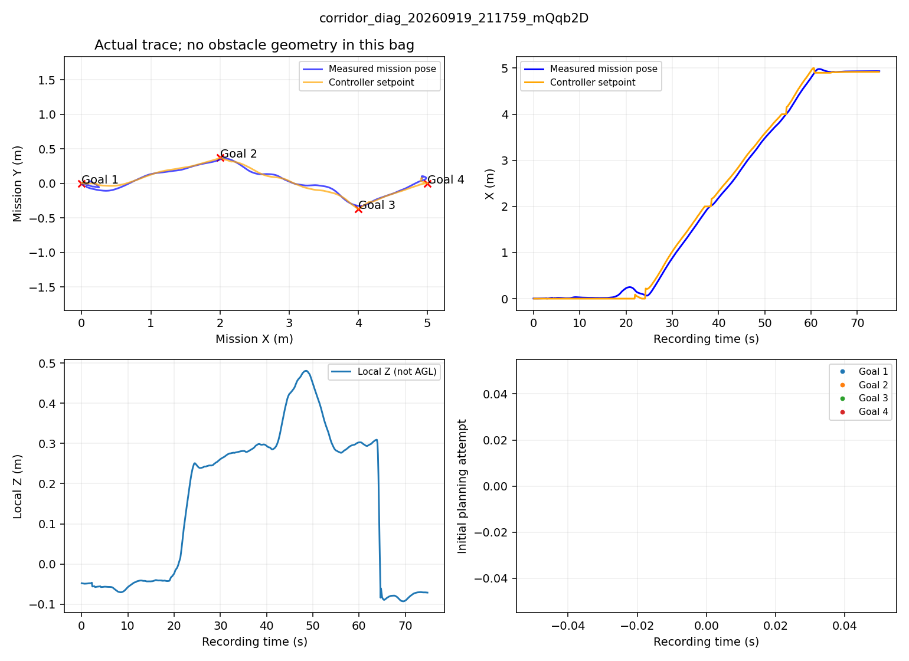
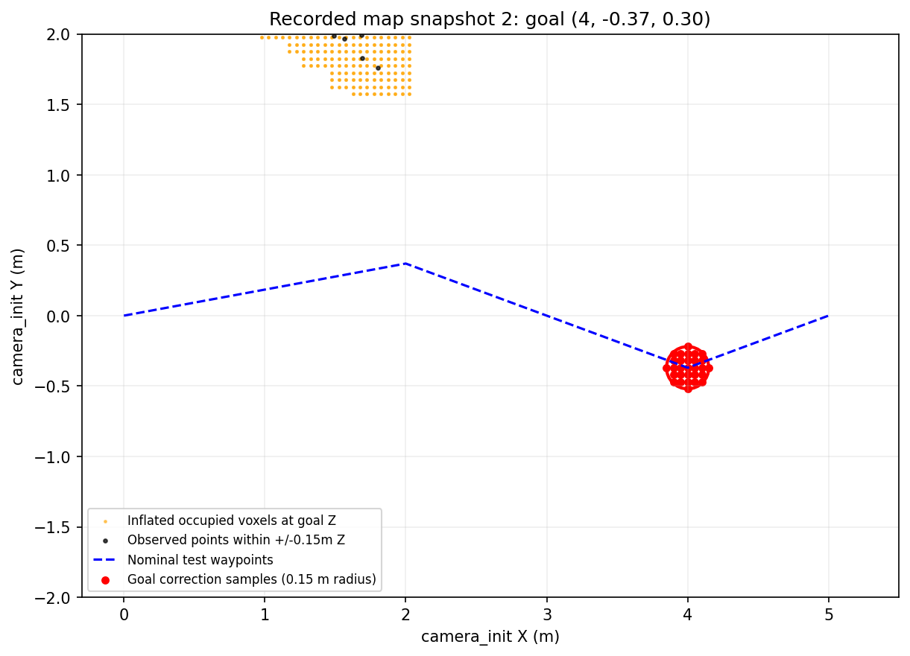
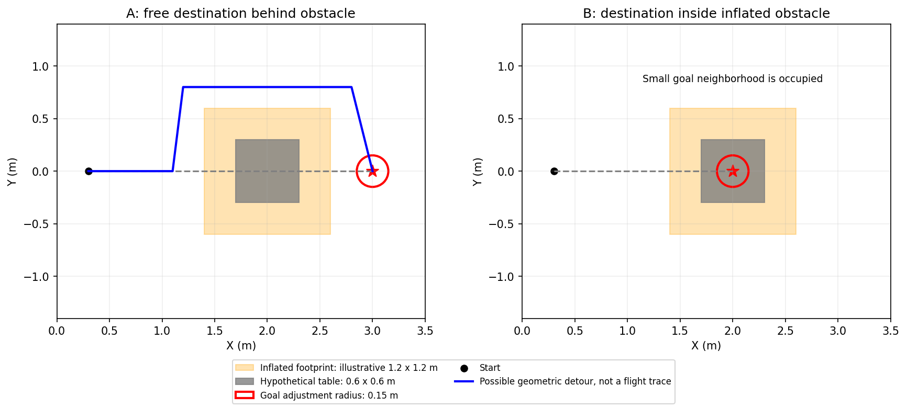
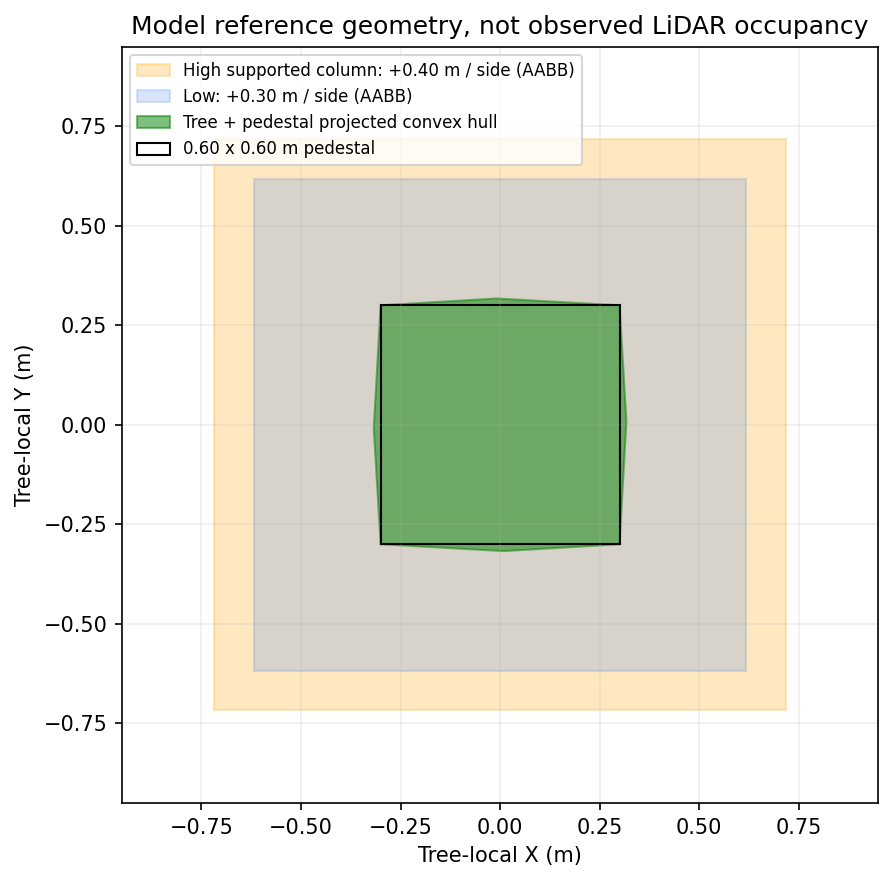

# 茶几前停滞、实机参数继承与仿真树尺寸复核

## 结论与材料范围

供电恢复后已读回9月19日晚三份完整导航bag的轻量导出，并在临时副本上恢复第四份`.bag.active`和一段未索引地图bag；原始bag未修改。用户确认这些就是叠放茶几的测试。分析基于原始事件/位姿与参数快照，现场是否移动茶几或重启地图仍待确认。

三套已继承必要的坐标、外参与地图发布接线，但没有逐值照搬旧4×4全部现场参数。尤其障碍膨胀、栅格和规划边界不同，因此不能保证旧场地的绕行表现无需再验证。不得把“部署成功”解释成“所有现场避障问题已解决”。

## 路线图方向

起飞点是(0,0)，+X为初始机头朝场内，图上向右；+Y为机体初始左侧，图上向上。旧红色斜箭头是文字引线，指向蓝色名义航线，不表示沿斜线朝向。三张图已改为从原点出发的红色水平+X箭头和绿色竖直+Y箭头。

蓝虚线是名义航点顺序，不是实飞轨迹。高位圈的第一段蓝线有斜向分量，也不改变固定起飞+X轴。飞行中转头不会旋转任务坐标系。

## 实飞日志已确认的事情

路线实际是`corridor-waypoint-test-r1`：`(0,0,0.3) → (2,0.37,0.3) → (4,−0.37,0.3) → (5,0,0.3)`，单位米、camera_init，Z不是离地高度。它不是旧4×4默认的+Y航点表，不能直接当成三套4×4的回归。

| 录制轮次 | 实际XY膨胀/栅格 | 4米目标结果 | 记录中的失败次数 |
|---|---|---|---|
| 19:58 | 0.10/0.10m | 无有效新轨迹，停在约(1.90,0.37) | 首轨迹78次；其中62次在OFFBOARD |
| 20:04 | 0.20/0.05m | 无有效新轨迹，停在约(2.00,0.37) | 重规划1次＋首轨迹39次 |
| 21:13 | 0.20/0.05m | 无有效新轨迹，停在约(2.03,0.38) | 重规划1次＋首轨迹75次 |
| 21:18补录 | 0.20/0.05m | 生成新轨迹、继续到5米末点 | 该段无失败；不能据此宣称整机比赛Gate通过 |

四轮均记录`horizontal_avoidance/enabled=false`，目标修正半径0.15m；起终快照存在时这些参数一致。此前根据源码看到的“10cm膨胀/5cm栅格”**并非每轮实跑参数**。后续20:04/21:13/21:18的参数更接近，但不能保证中途所有地图/场地条件相同。完整数值见[实际参数](actual_flight_params.json)。

前三轮反复出现`kinodynamic goal occupied or outside map`和`No collision-free goal within requested waypoint neighborhood`。4米目标发出后没有新的Bspline，轨迹服务器保持上一段附近设定点。日志支持**终点合法性检查及小邻域换点失败**，不能将其归成“轨迹服务器收到有效绕行曲线却一直不推进”。按记录的12×12×4m地图配置，目标在名义地图体积内，因此占据是主要怀疑项；但前三轮没录地图，无法重建当时是哪一片点云/体素堵住目标。

19:58首次至末次失败跨度约58.8s；后两轮首轨迹失败跨度约34.0/65.4s。记录后半段包含飞手POSCTL接管后继续产生的规划尝试，不能把整个跨度都算作OFFBOARD悬停。详见[逐轮事件摘要](real_flight_stalls.json)。

### 后续现场补充：末轮可能移走了茶几

用户随后说明“最后成功轮好像挪走了茶几才成功”。本项为现场回忆，尚非逐帧视频确认，但与补录地图的航路附近空闲现象相符。**末轮不能作为带茶几绕行成功的证据，也不能用来反驳前三轮目标被茶几/其膨胀占据挡住的可能性。**它只能说明末轮地图条件下能通行。

重新直接读取前三轮/tf_static及成功补录obstacle_map_0.bag中的/tf_static，四轮都是`map → camera_init`，平移[0,0,0]、四元数[0,0,0,1]。与这次三套的实测滤波`camera_init → map`不同；但四轮内部并没有这项TF设置变化，不能把末轮成功归因于换了TF。变换方向互为逆；单位值反向数值不变，并不证明两个实际坐标系天然重合。

相机/IMU安装外参仍是vision_body→mapping_imu的Z+0.05m，以及mapping_imu→相机的Z−0.21m与原光学旋转；这些在三套中保持一致。变动的是两个世界坐标系之间的关系，不是相机安装外参。

补录地图不是完全没有障碍：保留的目标高度切片可见侧面占据，约在X=1–2m、Y=1.6–2m附近；4米目标及主要直行带附近空闲。全高度点云还有其他点，不能用一个高度切片声称整场空无一物，也不能仅凭点云确定某个物体就是茶几。判断应限定为“末轮未证明避开仍在航路上的茶几”。

### 补录地图能说明什么

在21:18:34.999的已录膨胀图中，4米目标及半径0.15m内29个5cm采样点没有占据体素；最近占据中心与目标相距约0.177m，位于更低Z层。约4.46秒后，该目标成功生成轨迹。三份所取快照均得到类似空闲结论，见[查询结果](real_map_goal_checks.json)和[快照时刻](snapshots.json)。

这张图是**成功补录轮**，不是前三轮失败时刻的地图；其中没有障碍占据不能反推前三轮也空闲。成功轮局部Z曾从约0.3升到0.48m，且水平柱关闭，不能将它直接当成“按当前禁止越障柱策略在相同高度成功侧绕”的证据，也不能仅凭高度变化就断言它飞过了茶几。

恢复只发生在`/tmp`副本。后续部分地图分片缺索引或不完整，本次仅恢复所需片段，未修改原始记录，也未把4.4GB全量地图拷到笔记本。轻量原始导出和裁剪点云保留在本工作树`logs/board_stall_review_20260920/`，报告不伪装成完整失败地图取证。

## 现场版本与本机三套逐项核对

| 项目 | 取回的旧板端4×4源码 | 当前三套 | 结论 |
|---|---|---|---|
| 机体→IMU | Z +0.05m | 同值 | 已继承 |
| IMU→相机 | Z −0.21m | 同值 | 已继承；相机相对FC −0.16m |
| 光学旋转 | q=[−0.70710678,0.70710678,0,0] | 同值，像素矩阵[0,−1,−1,0]配套 | 已继承实机安装，未套仿真新FOV |
| 任务/控制坐标转换 | navigation_frame_adapter，任务camera_init、飞控map | 同一数值双向适配 | 已继承；不是改frame_id |
| map→camera_init关系 | 后期改成单位静态TF | 同机体两路实测对齐 | 有意保留实测方案；详见README，不把两系天然重合当事实 |
| LIO及FreeDOM接线 | cloud_registered_body、mapping_imu、camera_init；同一competition_freedom配置 | 相同链路与外参 | 已继承；/Laser_map仅显示，/freedom/static_pointcloud供规划 |
| FAST-LIO显示地图 | 有订阅者时1Hz导出内部树 | 同补丁与参数 | 已继承 |
| Livox源码类型 | 取回源码仍有driver1引用 | driver2并已在板端编译 | 保留明确要求的driver2，不退回旧类型；旧实跑类型待日志核验 |
| 地面高度 | 每次手填ground_z | 未解锁静置FC位姿−已知0.22m | 不需重复手填；更换机架尺寸需更新公共rig |
| 巡航高度 | 0.5m AGL | 常规1.4m、高位2.6m；H接近1.0m、捕获1.8m | 用户指定的不同测试工况 |
| 巡航上限/加速度 | 0.8/0.8 | 0.5/0.35 | 按本轮指令，不照搬现场提速 |
| 水平膨胀 | 0.10m | 0.30m | **没有照搬；可通行空间变窄** |
| 向上/向下膨胀 | 0.10/0.10m | 0.10/0.30m | 没有照搬，保留既有机体保护口径 |
| 地图栅格 | 0.05m | 0.10m | **新配置更粗**，窄通道/小换点邻域更敏感 |
| 地图体积 | 6×10×1.5m | 10×6×3.8m | 与+X朝场内及高空专项对应 |
| 规划搜索边界 | 原horizontal_avoidance区域只限定障碍柱，并非硬围栏 | 显式search_region中心范围X≈[−0.35,3.4]，Y≈[−1.4,1.4]，随初始化位置平移 | **新的硬约束可能减少绕行空间**；不是整个4×4面积都可用于飞机中心 |
| 虚拟顶面 | −0.1，关闭 | 地面+3.0m；高位结束低位重访切+2.0m | 未继承关闭顶面；已不使用旧+0.8m矮顶面 |
| 障碍柱垂直支持跨度 | 0.10m | 0.20m | 不完全同参；叠放物仍很容易提供足够高度结构 |
| 终点修正半径 | 0.10m | 通常0.15m | 新值并未比旧值更小，但仍可能不足以移出大障碍 |
| traj_server源码 | 相对旧本机未找到对应现场补丁 | 保留研究版后续弧长/停滞修改 | 不用旧文件覆盖新修复；没有证据证明旧单点问题只由服务器造成 |
| YOLO显示/RViz | 有独立显示工具、启动开关 | 三套原图+标注录像 | 显示工具不是规划必要修复，未照搬整套RViz节点 |
| C++OpenCV | 同机有4.2及/usr/local 3.4 | 已显式选4.2并补cv_bridge构建依赖；八程序链接检查通过 | 已处理，不需现场手工重改库 |

完整原始文本差异见board_vs_laptop_4x4.diff（阅读用，末尾空白已规整）。上表针对三套实际使用的入口；旧competition_hardware里的其他接线或历史仿真代码不能全部覆盖过来。当前运行时RKNN模型、消息、包路径与六入口已在上次部署中检查，但这些静态检查不证明实时定位/视觉/绕行无误。

## 15cm限制的是终点，不是绕行宽度

`nearbyFreeGoal()`以**原始请求目标**为中心，固定Z，在圆形邻域里找满足膨胀占据和净空要求的替代终点。0.15m半径配0.10m采样步长，最多只有9个XY采样点（含中心）；旧0.10m/0.05m组合为13个。这是终点修正采样，并不是A*允许探索的全部节点。

图为假设0.6×0.6m茶几、两侧各膨胀0.3m的几何示意，不是现场测量、规划器实跑或已验证动力学轨迹。

- **目标在茶几后方且目标处为空**：终点不必移动。A*原则上可以离开直线很远，从侧面绕到同一个目标；并无“航迹只能偏15cm”的规则。此时应检查起点占据、侧面通道、硬边界、地图残影及动力学/时间预算，而不能只增大终点修正半径。
- **目标在膨胀后的茶几内部**：小圆内全被占据，就找不到替代终点。即使障碍旁边有绕行空间，仍无法到达一个非法终点。这里用户的推测成立。
- **当前位置已在膨胀区内**：这是起点问题，修改终点半径也未必有用。

## 叠放茶几为何可能比单个树干难绕

同XY上下叠放不会自动把水平宽度翻倍；若错位摆放，则联合投影变宽。真正相关的是点云所见整体外形、腿/桌面多层结构、周边空间，而非茶几数量本身。

当前障碍柱机制不做“这是树”的语义识别：区域内、离地阈值以上、邻域有至少3点且垂直跨度达到0.20m，就可能将其XY占据延伸到飞行顶面。叠放茶几可能因此变成贯穿航高的障碍，不能靠升高跨过去；平面点仍保留正常三维膨胀。高位阶段还会对受支持的柱额外扩0.10m。

若实际茶几宽D，低位理想轴向占据宽约`D+0.60m`；例如D=0.4/0.6/1.0m，对应1.0/1.2/1.6m，再受栅格取整和噪声影响。因此“接近1m阻塞”完全可能，但**1m阻塞本身不意味着4m场地内一定无路**。必须看相对于边界、其他障碍、起终点的位置。不要再把55cm机体宽重复加到已经包含机体保护意图的膨胀量上。

## 仿真树究竟多大

从当前field.world的碰撞mesh、Collada节点变换和scale重算，见tree_dimensions.json。树不是统一圆柱，下面用轴向包围尺寸描述，不能只看细树干。

| 量 | 参考值 |
|---|---|
| 缩放后树冠mesh XY宽 | 约0.634×0.634m |
| 垫箱 | 0.60×0.60×0.30m |
| 树体高度/含垫箱总高 | 约1.20m/1.50m |
| 树+箱水平凸包最长跨度 | 约0.849m，主要由箱角对角线决定，并非圆柱直径 |
| 按旧板端每侧0.10m膨胀举例 | 轴向参考宽约0.834m |
| 按当前每侧0.30m膨胀举例 | 轴向参考宽约1.234m |
| 高位受支持柱再每侧+0.10m | 轴向参考宽约1.434m |

上述后两项是同一朝向的完整模型参考包围框加方形膨胀，不是某时刻LiDAR占据图的测量值。树旋转后地图轴向包围宽会变化；点云采样、树叶遮挡、体素取整、额外净空均有影响。规划使用的是观测地图，不直接读取仿真真值mesh。

## 如何处理

1. **先分清失败位置**：本轮已读到前三轮失败事件与后续成功地图；下一次失败要同步保存该轮启动参数、goal_status、请求与有效终点、odom、Bspline、pos_cmd及局部地图。定位第一次FAILED_ATTEMPT，区分目标占据、起点占据、路径搜索/曲线校验失败和无进展。若只留下rosout，没有地图或位置采样，就应明确无法恢复当时占据几何，不能据此定案。
2. **终点确实被挡**：把“任务原始目标”和“临时绕行/观察点”分开。对普通经过点可按任务语义有限调整；对投递目标/H不能简单移走终点并宣告到达，应该找合法观察/接近点，重新视觉确认。扩大候选区域必须联动可达性、边界和到达判定，不能只改一个半径。
3. **目标空闲但侧路求解失败**：优先检查地图和实际侧面余量。必要时在当前地图上生成少量左右绕行中间点，再由同一动力学规划器验证；限制尝试次数/期限，不持续重求同一无解问题。已有高位记忆并不等于所有底层运动阶段都有这种绕行恢复。
4. **栅格/膨胀问题**：可优先评估恢复旧5cm栅格对窄路的影响，但高位地图体素数会从约22.8万增至182.4万，约8倍，需要检查板端耗时，不能把内存够用当CPU一定够用。30cm改10cm会扩大通路，但也改变机体保护，不直接照搬为默认。对4×4硬搜索边界也应结合整机包络重新确认，不能任意越场。
5. **停滞保护**：给首次无有效轨迹的阶段补齐独立有限恢复，保留原任务终点与失败原因。只把超时缩短或速度调快，不构成根因修复。

本轮修正图示、读取实飞日志并补充核对/处理建议；没有修改膨胀、栅格、目标半径、边界或控制策略，没有仿真或实飞。首要后续是将“失败时终点占据/净空”记录齐全，再区分场地变化、真实遮挡和地图异常；不能直接把全局修正半径改大当成已验证修复。
