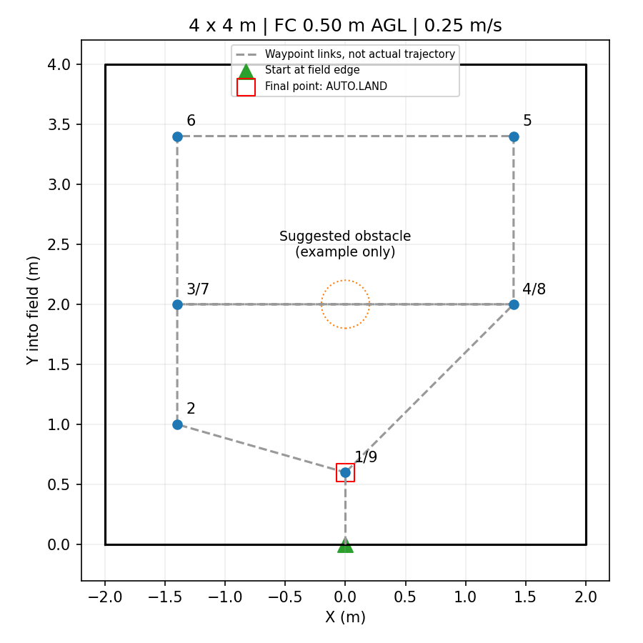

# 4×4 m 实机避障测试配置

2026-09-12：用户确认巡航高度为**飞控中心离地 0.50 m**。本次仅准备和静态验证配置，未启动试飞。

## 场地与路线

起飞点为近侧边中点 (0,0)，+Y 朝场内，场地 X∈[-2,2]、Y∈[0,4]。初始化时核对 camera_init 朝向，不能把任意朝向自动当成场地坐标。起飞点就在边缘，机体包络会跨出边界；进入场内后的航点至少留 0.6 m 余量。



航点依次为 (0,0.60)、(-1.4,1.0)、(-1.4,2.0)、(1.4,2.0)、(1.4,3.4)、(-1.4,3.4)、(-1.4,2.0)、(1.4,2.0)、(0,0.60)。全部使用同一巡航目标高度。连线表示航点顺序，不是实际轨迹；图中障碍圆是建议布设位置，不写入规划地图。

速度 0.25 m/s、加速度 0.35 m/s²，位置指令前导距离 0.15 m，水平障碍膨胀 0.30 m。先空场确认航线，再放置雷达能够清晰观测的障碍验证绕行。

## 文件与入口

- `uav_mission/config/obstacle_4x4/control.yaml`：关闭投递和旧视觉降落，由独立测试节点在末点请求 AUTO.LAND。
- `uav_mission/config/obstacle_4x4/planner.yaml`：5 cm 栅格、6×10×1.5 m 地图，约72万体素；地图以原点对称，需要覆盖 Y=4。不是板端实测内存。
- `uav_mission/config/obstacle_4x4/runtime.yaml`：复用 post_delivery 航点验证模式，不搜索、不选靶、不释放。
- `uav_mission/obstacle_4x4_hardware.launch`：独立测试入口，不覆盖正赛配置。

默认 `enable_control_output=false`：不加载 patrol_control，规划桥不输出指令，坐标适配器不发布飞控设定点。它仍会启动定位、建图和规划，不能与整机入口同时运行。driver2 与 MAVROS 由设备侧单独启动。

## 高度基准

必须填写地面在 camera_init 中的 `ground_z`，没有默认值：

`cruise_z = ground_z + 0.50`

只有实测地面为 -0.22 m 时，巡航 local Z 才是 0.28 m。-0.22 仅用于本次静态检查，不是现场测量。安装外参沿用板端配置，换机架后需重测。

虚拟顶面为地面+0.80 m，控制指令上限地面+0.65 m，障碍柱候选最低高度为地面+0.10 m。普通三维占据仍保留。50 cm 是巡航目标，不代表整个避障轨迹严格等高。

## 使用边界

先验证双向坐标转换：MAVROS 的 map 位姿/里程计转入 camera_init，控制设定点反向转回 map，不能只改 frame_id。此前坐标转换7项单测在 WSL 与板端通过，实时采样因现场停止 LIO/TF 未完成，不能称试飞已验收。

只检查参数、不启动节点：

```bash
roslaunch --dump-params uav_mission obstacle_4x4_hardware.launch ground_z:=<实测地面Z>
```

实际启动留待试飞授权后执行。`enable_control_output=true` 才接通控制链，入口没有自动解锁或任务启动辅助节点。本测试复用 post_delivery 模式：人工完成起飞并稳定悬停后，再启动既有导航任务服务，不是全自动起飞程序。

末点为场内 (0,0.60)，不自动退回边界起飞点。全部航点完成、任务进入 LAND 后，独立 obstacle_test_auto_land 节点核对新鲜里程计、末点 XY误差≤0.18m、高度误差≤0.15m、速度≤0.12m/s，并连续满足1秒后请求 AUTO.LAND。只从已解锁的 OFFBOARD 请求，不覆盖飞手其他模式；最多3次请求，接受后不重复干预。落地与最终停止由PX4执行，以 MAVROS mode/extended_state 为实际结果，不能把 mode_sent 当成落地成功。

`horizontal_avoidance` 的 XY 范围只限定障碍柱生成区域，**不是电子围栏**；航点留边也不保证所有避障轨迹不越界。现场需核对外围限制、可通行净空和定位一致性。

## 本次验证

预览与控制开启两种入口均已静态展开，确认单套规划器、预览无 patrol_control。示例 ground_z=-0.22 下，全部航点与起飞种子 Z=0.28，默认控制输出关闭。没有调用解锁、模式切换、任务启动、投递服务，没有试飞。

旧控制器启动仍校验停用的降落阈值：保留 local Z=0.03/0.05 两个正值，要求巡航 local Z>0.05；这两项不代表实际离地高度，只供旧视觉控制分支启动校验；末点自动降落由独立节点触发。若现场地面零点使巡航 local Z≤0.05，本配置不能直接启用控制，需要先处理旧控制器高度约束。

已同步到 192.168.3.426 的 /home/orangepi/liftrace_r64_onboard_405bda42/patrol_uav_ws-patrol_planner/src/uav_mission/，保留原入口。板端说明与图位于 /home/orangepi/navigation_frame_fix_20260912/obstacle_4x4/。板端仅做参数展开，未启动节点。

## r2 上板入口

航点框扩至 2.8×2.8 m，四侧各留 0.6 m 中心余量（起飞接入段除外）；原版左右留0.9m，偏向初次保守验证。0.6m还需容纳约0.275m半机宽、定位及跟踪误差，不能用4m边线直接作为飞控中心航点。

设备驱动和MAVROS先启动，原整机应用需先停止。项目根目录执行：

    bash top_level_scripts/start_obstacle_4x4.sh preview <实测ground_z>
    bash top_level_scripts/start_obstacle_4x4.sh flight -0.2

两条是二选一；flight接通控制输出，不自动解锁或启动航线。此次仅安装，没有运行。日志写入项目logs/obstacle4x4_*，不录bag或视频。

## 自动降落修订

用户明确要求飞完航点自动降落。本入口 auto_land_after_route 默认true，但只有 enable_control_output=true 才加载自动降落节点；预览不加载。旧控制配置的 auto_land=false 保留，避免启用缺少H视觉证据的旧流程。新节点仅调用 SetMode(AUTO.LAND)，不调用解锁、强制解除武装或投递接口。6项单元测试覆盖完成条件、末点稳定、手动接管、错误坐标/速度、触发过期和重试上限，尚未实际飞行验证。
