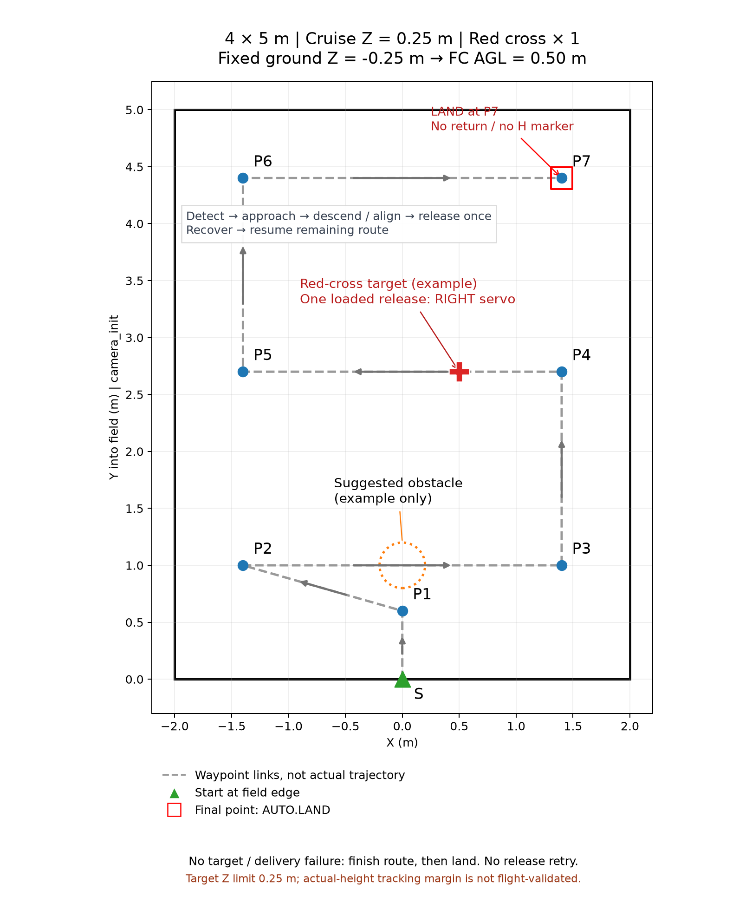

# 4×5 m 红十字单次带载投递测试方案（设计稿）

最新实现：用户已授权新增独立适配节点。可执行配置、启动脚本和适配节点位于 [runtime/README.md](runtime/README.md)，原工程源码不变。以下保留路线设计与需求说明；实际接口适配及验证状态以 runtime 说明为准，尚未实飞。

## 已确认需求

- 以现有 4×4 实机避障测试为基础，场地 X∈[-2,2] m、Y∈[0,5] m。
- 沿用 camera_init 坐标系，+Y 朝场内，原点为近侧边中点。
- 采用向前推进的 S 型航点路线；最后一个航点直接降落，不返回原点，不使用 H 标志视觉降落。
- 启用定位、建图、规划、控制、视觉检测与实际舵机投递链；仅处理红十字 red_cross。
- 右侧舵机带载投递一次，包含目标接近、下降、对准、释放与投后恢复；随后完成剩余路线。
- 未发现红十字或投递失败：结束本轮投递机会，继续剩余路线，到末点降落，不反复搜索或重复释放。
- 恢复原 4×4 的飞控中心巡航离地高度 0.50 m。地面实测值固定为 ground_z=-0.25 m，巡航目标及目标 Z 上限为 camera_init 中的 0.25 m。
- 不修改现有源码或文件；后续仅允许新增独立 launch、YAML、启动脚本和说明文档。

方案与路线图现已配套新增 runtime 配置包；没有启动节点、调用舵机或飞行，未做实机验收。

## 路线图与航点

参考原图：/home/orangepi/navigation_frame_fix_20260912/obstacle_4x4/route.png。
保留原图的等比例 XY 坐标、场地黑框、蓝色航点、灰色虚线、绿色起点及红色方框末点表达方式。
原 4×4 图包含折返接近起点的后段；本方案按“不返回原点”改为三条横向扫描段逐步向 +Y 推进。

| 点 | X / m | Y / m | 动作 |
|---|---:|---:|---|
| S | 0.00 | 0.00 | 起飞接入点，稳定后进入路线 |
| P1 | 0.00 | 0.60 | 进入场内 |
| P2 | -1.40 | 1.00 | 第一条横向段起点 |
| P3 | 1.40 | 1.00 | 第一条横向段终点 |
| P4 | 1.40 | 2.70 | 第二条横向段起点 |
| P5 | -1.40 | 2.70 | 第二条横向段终点 |
| P6 | -1.40 | 4.40 | 第三条横向段起点 |
| P7 | 1.40 | 4.40 | 第三条横向段终点及最终降落点 |

巡航段统一使用固定目标 z=0.25 m。下降投递与末点降落不保持巡航高度。
本测试固定使用同一任务坐标系中的地面实测值 ground_z=-0.25 m；巡航离地高度为 0.25-(-0.25)=0.50 m，与原 4×4 巡航离地高度一致。
图中虚线与箭头仅表示航点顺序，实际路径由在线建图和规划器决定，不是提前规定的避障轨迹。
虚线名义总长度约 13.86 m，包含起飞点至 P1 的水平接入段，不包含避障和投递偏移。

橙色圆为建议障碍位置 (0,1.0)，示意半径 0.20 m；红十字为建议布靶中心 (0.5,2.7)。
二者都是本次方案的布场示例，不代表现场测量，也不能将这些坐标作为视觉目标或预置障碍真值送入控制链。
红十字放在名义路线附近，便于本轮验证低空识别；具体标志尺寸、可见性和障碍净空需现场核对。
三条横向段相隔 1.70 m，未依据实际相机视场证明覆盖整个 4×5 场地，不能称全覆盖搜索。

航点中心左右及远端留边 0.60 m。起飞点沿用原图的场地边缘位置，机体在起点会跨过 Y=0。
当前将 4×5 解释为布场与名义航线范围；这不是新增电子围栏，也不保证全部避障轨迹和机身包络不越界。

## 任务流程

1. 预览及准备：定位和地图稳定、坐标转换正确；确认相机、模型、红十字检测和右舱连接。
2. 起飞至巡航高度，按既有现场流程人工授权开始任务，顺序执行 P1～P7。
3. 路线执行期间持续视觉检测。仅红十字可触发一次投递事务，其他类别不进入投递队列。
4. 锁定合格目标，暂停当前路线航段；执行接近、下降及视觉对准，在释放条件满足时只请求右舱释放一次。
5. 成功后关闭后续投递机会，恢复至巡航高度，继续未完成的当前航段及后续航点，不重走已完成航点。
6. 未检测到目标则不离开路线；投递失败或丢标超时则放弃本轮投递，恢复至允许的飞行状态后继续路线。服务响应不确定时不自动重发释放指令。
7. 到达 P7 后，结束投递机会；满足末点稳定条件后请求 PX4 AUTO.LAND，不等待 H 标志。
8. 通过飞控模式、落地状态及解除武装状态确认结束；模式请求被接受不等于已经落地。

“投递失败后继续”针对可恢复的视觉/投递事务失败，不表示在定位失效、无法规划或飞手接管时仍强制飞行。

## 高度约束

0.25 m 指 camera_init 中的巡航目标 Z；固定 ground_z=-0.25 m 后，飞控中心巡航 AGL 为 0.50 m。本次修订恢复原 4×4 的巡航离地高度。
按目前相机在 FC 下方 0.16 m 的安装记录，巡航时镜头离地约 0.34 m；实际安装和可识别距离须核对。
接近、对准、下降、投后恢复、绕障以及降落交接中的所有目标高度都必须检查，不能只改巡航航点。
旧竞赛配置的 1.40/1.60 m 等高度不可直接继承；释放高度也不能直接把旧 local Z 数值当作 AGL 使用。
释放高度尚未定值，应以当前起落架、载荷、镜头及红十字对准条件确定，设计稿不擅自填写可执行值。

“目标 Z≤0.25 m”与“实测 Z 始终≤0.25 m”是不同验收条件；在固定地面 -0.25 m 下，两者对应的离地上限为 0.50 m。巡航目标恰为上限时，控制误差没有向上余量；仅新增配置不能承诺物理高度绝不超调。
后续须确认现有控制链能否覆盖全阶段高度约束，并确定实测误差容限或降低名义巡航目标的余量方案，未经确认不宣称硬上限已实现。
地面不平或地面零点漂移也会使固定 local Z 与实际 AGL 不一致。

## 无源码修改的接入核对项

新增入口不能只在原 post_delivery 模式上加视觉节点：原模式明确跳过搜索和目标投递事务。
需只读核实已有完整任务模式是否能通过配置同时表达：本图固定路线、仅 red_cross、一次尝试、一次右舱释放、成功/失败均续航、末点非视觉降落。
若现有接口无法表达其中任一行为，应明确报告限制，不把未核实配置标为可运行。

- 保留 Mission Manager 为唯一任务策略，Planner Bridge 为唯一规划目标发布者。
- 保留释放证据和 guarded_servo_proxy 链，不绕过释放许可直接从视觉调用舵机。
- 当前 actuator_pwm 文档映射为 req=1 后舱、req=2 右舱、req=3 左舱；“一次投递”不能简单等价为“使用第一个槽位”。需核对逻辑槽位与右舱 req=2 的对应方式。
- 当前物理舵机节点提供 /Servo，而受保护链期望调用 /legacy/Servo_raw；后续入口须核实并通过 remap 避免服务同名冲突。
- 现有舵机节点启动会复位三只舵机，不是只有右舵机动作。能否仅初始化右舵机尚未核实，本方案未启动该节点。
- 原 obstacle_test_auto_land 节点要求 start_mode=post_delivery 及路线完成状态；完整投递任务模式不能直接假定与它兼容。
- preview 应隔离控制和真实舵机启动；flight 入口也不代表自动获得解锁、带载释放或飞行授权。

后续拟新增独立 4×5 launch、runtime/control/planner/vision/servo YAML、启动脚本及使用说明；文件数量依现有参数能力确定。

## 验收记录

- 空场路线：按序到达全部七个航点，末点 P7 降落，无返原点或 H 视觉依赖。
- 成功投递：仅识别红十字触发；右舱释放恰好一次，随后完成剩余路线。软件服务成功与实物成功分别记录。
- 无目标：零释放，完成路线并末点降落。
- 投递失败：结束投递机会，零重复释放，恢复后完成剩余路线并末点降落。
- 记录 FC 实测 AGL 峰值、各阶段高度设定点、定位/地图新鲜度、规划结果与舵机请求。
- 记录碰撞/越界、飞手接管及异常退出；不能仅以任务状态或 AUTO.LAND 请求返回值判定全链条通过。

本设计稿只核对了路线几何和参考文件。未完成配置兼容性验收、板端实时验证或带载试飞。
