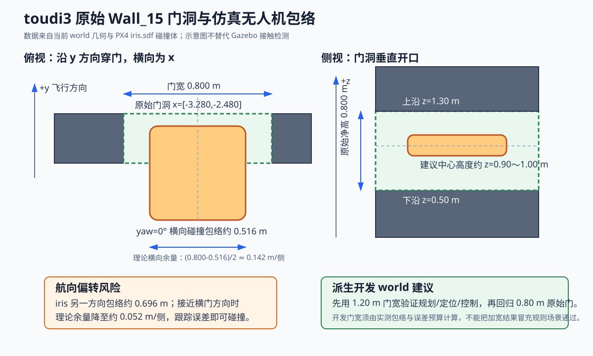

# 2025 原始链完整仿真阻塞与 world 改造方案

更新时间：2026-08-02

本文记录原 2025 工程在当前 `toudi3.world` 中执行“自动起飞、三次投递、走廊/门区避障、
返航和降落”的最新事实、阻塞分层和可落地解决顺序。视觉任务优先级仍以
[VISION_2026_ROADMAP.md](/home/xhj/liftrace/VISION_2026_ROADMAP.md) 为唯一来源；本文不把
旧链完整回放误写成 2026 新视觉闭环完成。

本轮只做检查和文档规划，不修改用户当前未提交的
`patrol_control/config/patrol_toudi3_real.yaml`，也不改动原始
`toudi3.world`。

## 1. 当前结论

原 2025 状态机已经具备以下可复现能力：

- PX4 SITL 自动解锁、OFFBOARD 和起飞；
- 固定检测点进入 `Aligning`；
- `sim_helpers` 提供类别、圆环位置和 Servo 软件 mock；
- Servo 1、2、3 顺序投递成功；
- `detect_skip_enable=false` 时，三投后可以继续执行后续普通航点。

尚未完成的是：

- 原始 0.8 m Wall_15 门洞的可靠穿越；
- Fast-Planner 真正拥有 setpoint 时的在线避障穿门；
- 门后北区巡航、回穿、返航和最终降落；
- 新视觉 `TargetCandidate.map_point` 驱动旧控制接近和三投。

因此当前不能写成“2025 完整比赛链已跑通”，也不能把直达航点通过写成“在线避障通过”。

## 2. 最新一次运行证据

运行时 ROS 参数确认加载了当前 `patrol_toudi3_real.yaml`：

```text
waypoints: 20 个
Detect_point: 4 个
detect_skip_enable: false
switch/flag_planner_px4: true
goal_list: bridge/panzer/pillbox/tent/tank
```

关键时间线：

| 仿真时间 | 事件 | 结论 |
| ---: | --- | --- |
| 778 s 左右 | 起飞点完成，进入第 1 检测点 | 自动起飞正常 |
| 826.420 s | `Drop action 1 completed successfully` | Servo 1 mock 成功 |
| 848.555 s | `Drop action 2 completed successfully` | Servo 2 mock 成功 |
| 894.991 s | `Drop action 3 completed successfully` | Servo 3 mock 成功 |
| 931.012 s | `Invalid servo ID: 4` | 第 4 个检测点与三舵机状态机冲突 |
| 967 s 左右 | 第 4 检测点靠超时结束 | 期间飞机下降到约 0.07 m |
| 979.476 s | 到达第 4 检测点后的普通过渡点 | 航点顺序推进有效 |
| 1023.644 s | 到达门洞南侧，开始前往门洞北侧 | 失败发生在原始门洞穿越阶段 |
| 993 s 后 | FAST-LIO 大量 `No Effective Points!` | 建图质量异常，但尚不能单独证明它导致直达控制失效 |
| 1321.449 s | MAVROS `HEARTBEAT timed out` | PX4/Gazebo 链最终终止 |

需要纠正此前台账中的因果表述：

- `No Effective Points!` 能确认 FAST-LIO 当前观测退化；
- 但本次 `flag_planner_px4=true`，飞行 setpoint 由旧控制直接发布，Fast-Planner 不拥有控制权；
- 因此“点云退化导致 planner 失效，从而直接导致飞机乱飞”目前只是待验证假设，不是已证根因；
- `fastlio_to_px4_vision` 是否缺失以及 PX4 实际融合了哪一路定位，也必须结合 PX4 EKF 参数、
  `/mavros/estimator_status` 和输入话题实测，不能只凭源码目录下结论。

## 3. 阻塞点分层

| ID | 阻塞 | 证据等级 | 影响 | 解决方向 |
| --- | --- | --- | --- | --- |
| B1 | 4 个 Detect 点对应 3 个舵机 | 已确认 | 第 4 点下降、报 Servo 4 错误并等待超时 | 基线只保留 3 个 Detect；其他靶标改为普通观察点 |
| B2 | 绕树点写在第 4 Detect 之后 | 已确认 | 注释称“3→4 绕树”，实际没有在该线段前生效 | 调整顺序，先绕树再前往后续目标/门区 |
| B3 | 原始门宽仅 0.8 m | 已确认 | 对 0.516 m 横向包络，每侧理论余量仅约 0.142 m | 先开发门、后规则门；控制航向和门区速度 |
| B4 | 当前运行是直达模式 | 已确认 | 即使通过也不能证明 Fast-Planner 避障 | 将功能基线与 planner 避障验收拆开 |
| B5 | 门后第一个点靠近 Wall_16 | 已确认 | `x=-3.2` 距墙约 0.394 m，机体和规划余量不足 | 先沿门中心线完全退出，再横移 |
| B6 | 后段存在 `z=0.15 m` 贴地机动 | 已确认 | 易触地、碰撞或触发估计器/物理异常 | 完整链基线先禁用，另做低空专项 |
| B7 | FAST-LIO 有效点退化 | 已确认现象 | 地图与视觉地图投影可信度下降 | 单独检查点云、时间、外参与视场，不先换 LIO |
| B8 | PX4/Gazebo 最终停止 | 已确认现象 | `/clock` 停止、心跳断开，任务无法继续 | 独立做仿真进程/实时率/资源稳定性 Gate |
| B9 | 部分启动脚本不传 `waypoint_config` | 已确认 | 直接运行时可能静默回退 `patrol_toudi3.yaml` | 启动前后打印并核对实际配置路径/ROS 参数 |
| B10 | LIO→PX4 位姿源可能不统一 | 待验证 | 可能造成 map、PX4 local 和 planner frame 漂移 | 先测 EKF 输入和 TF，再决定是否恢复适配节点 |

## 4. real.yaml 调整原则

这里给出修改规则，不直接覆盖用户当前文件。

### 4.1 第一阶段：只恢复旧链完整功能

目标是证明状态机能走完，不验避障：

1. 只保留 3 个 `Detect_point`，分别映射 Servo 1～3；
2. 第 4 个及更多靶标若需观察，使用 `Nothing_point`，不得触发下降/投递；
3. 绕树点必须放在与树相交的航段之前；
4. 暂时删除或抬高 `z=0.15 m` 贴地段；
5. 使用 `waypoint_mode=true`，文档明确标记为“直达功能基线”；
6. 完成标准：起飞→3 次 mock ACK→普通巡航→返航→降落，全程无 Servo 4、无超时投递。

### 4.2 第二阶段：隔离门区

不要每次都先跑三投。建立只包含以下航点的门区专项配置：

```text
起飞/悬停
  -> 门南远端预对正
  -> 门南近端
  -> 门中心
  -> 门北近端
  -> 沿门中心线继续退出
  -> 悬停/返航
```

原始门中心为：

```text
x = (-3.280 + -2.480) / 2 = -2.880 m
y ≈ 4.300 m
建议中心高度初值 z = 0.90～1.00 m
yaw = 0（使约 0.516 m 的较窄碰撞方向横对门宽）
```

门区不应从 `(-2.88, 4.45)` 立即横移到 `(-3.2, 5.0)`。先沿 `x=-2.88` 退出到门北
安全距离，再在开阔区域横移。具体 y 距离由 GUI 碰撞显示和三维点云确认，不能只看质心。

### 4.3 第三阶段：在线避障

在线避障专项必须：

- `waypoint_mode=false`；
- 只有 Mission/Patrol 一方发布 `/fastplanner/goal`；
- 只有轨迹执行一方发布最终 MAVROS setpoint；
- `/freedom/static_pointcloud`、planner odom 和 goal 使用同一 mission frame；
- 记录 planner 是否有有效轨迹，而不是只看节点存在；
- 先在 1.2 m 开发门通过，再回归 0.8 m 规则门。

如果 1.2 m 门仍失败，应优先查坐标、点云、轨迹所有权和仿真实时率；此时没有依据更换
Fast-Planner。如果 1.2 m 稳定而 0.8 m 总是被当前安全膨胀拒绝，才进入机体包络和规划参数
联合评审。

## 5. 原始 world 与派生 world 的管理

### 5.1 原始 world 永久保留

当前原始文件：

```text
patrol_uav_ws-patrol_planner/toudi3.world
MD5: 302d1e2118dbdc7641421c863be9c4bc
```

禁止继续直接修改它验证临时方案。推荐建立：

```text
toudi3.world                         # 原始/规则对照，不改
toudi3_corridor_dev_120.world        # 1.20 m 开发门，排查链路
toudi3_corridor_rule_080.world       # 0.80 m 规则门，最终回归
```

每个派生 world 在文件头写明来源 commit、门宽、门高、适用 Gate 和“不得作为规则场景”的
限制。launch 必须通过 `world:=...` 显式选择，报告 manifest 记录 world 绝对路径和 SHA256。

### 5.2 为什么开发门建议先用 1.20 m



当前 PX4 `iris.sdf` 中：

- 机身 box 为 `0.47 × 0.47 × 0.11 m`；
- 旋翼中心和半径形成的轴对齐包络约为 `0.516 × 0.696 m`；
- 航向完全对正时，0.8 m 门每侧理论余量约 `(0.8-0.516)/2 = 0.142 m`；
- 若航向偏转使 0.696 m 方向接近横向，每侧仅约 `0.052 m`。

开发门宽应由下式计算：

```text
W_dev >= B_uav + 2 × (E_track + E_map + M_engineering)
```

其中 `B_uav` 是含桨叶保护/旋翼碰撞体的实测横向包络，`E_track` 是门区跟踪误差，
`E_map` 是地图/定位横向误差，`M_engineering` 是额外工程余量。使用 1.20 m 不是最终答案，
而是用于先证明规划、定位和控制链能工作。

### 5.3 world 搭建规则

派生 world 调整门区时必须：

1. 门中心保持 `x=-2.880 m`，优先对称加宽，避免航线和 frame 同时变化；
2. `collision` 与 `visual` 使用相同尺寸和 pose，禁止只改“看起来”的墙；
3. 若 world 同时有 model pose 和 `<state>` pose，两处都要一致；
4. 墙体为 `static=true`，门框不要存在重叠 collision；
5. 门区前后各保留至少一个机身长度的直线对正段；
6. 在门中心添加仅视觉可见、无 collision 的地面中心线/高度标记，便于 GUI 核查；
7. 不要在门出口紧邻位置放树、箱体或立即横移的航点；
8. MID360 射线必须能打到门柱、横梁和门后墙，不能只保留视觉 mesh；
9. 修改后运行 `compute_free_waypoints.py`，并用 Gazebo “Show Collisions”二次确认；
10. 报告同时记录门宽、门高、飞机碰撞包络、planner inflation 和实际最大跟踪误差。

### 5.4 规划参数不能脱离机体尺寸

当前仿真参数大致为：

```text
map resolution: 0.10 m
obstacles_inflation: 0.15 m
manager clearance_threshold: 0.20 m
optimization/dist0: 0.40 m
```

这些值与 0.8 m 窄门是否可行必须联合评估。禁止为了“让它过”同时把膨胀和安全距离调到
接近零；也禁止只加宽 world 后宣称算法满足原始门。正确顺序是：

1. 用开发门验证系统接线；
2. 用实测机体包络设置安全膨胀；
3. 用规则门验证是否存在可行轨迹；
4. 若不可行，明确是机体/规则几何冲突还是算法失败。

## 6. 分阶段验收矩阵

| Gate | world | 控制方式 | 视觉/投递 | 通过条件 |
| --- | --- | --- | --- | --- |
| R0 进程稳定 | 空场/原始场 | 定点悬停 | 关闭 | `/clock`、PX4 heartbeat、odom 连续 10 min |
| R1 旧任务功能 | 原始主厅 | 直达 | 3 次 mock | 起飞→3 ACK→返航→降落，无 Servo 4 |
| R2 开发门直达 | 1.20 m 开发门 | 直达 | 关闭 | 连续 3 次双向通过、无接触 |
| R3 开发门规划 | 1.20 m 开发门 | Fast-Planner | 关闭 | planner 拥有控制权，连续 3 次双向通过 |
| R4 原始门规划 | 0.80 m 原始门 | Fast-Planner | 关闭 | 有安全余量的可行轨迹、零碰撞 |
| R5 旧完整链 | 0.80 m 原始场 | Fast-Planner | 3 次 mock | 起飞→三投→走廊→返航→降落 |
| R6 新视觉长闭环 | 规则场 | Mission Manager + planner | 新视觉 + guarded mock | 检测→记忆→候选→三投，零重复、零越权 |

任何 Gate 失败都只修该层。R0/R2 未过时，不应通过训练模型、降低视觉阈值或更换 LIO
掩盖问题。

## 7. GUI 与截图要求

GUI 只用于定位几何和碰撞，不作为算法最终证据。门区专项至少保存：

1. 俯视图：门中心线、南北接近航点和实际轨迹；
2. 门正视图：飞机横向包络与左右门柱间隙；
3. 侧视图：机体/传感器与门槛、横梁间隙；
4. Gazebo “Show Collisions”截图：确认 visual 与 collision 一致；
5. RViz：`/freedom/static_pointcloud`、膨胀地图、目标点和规划轨迹；
6. 同时保存 manifest、ROS 日志和航点到达时间线。

只有截图没有数值日志，或只有数值日志没有 world/SDF 版本，都不能作为可复现验收。

## 8. 与视觉组业务的关系

旧链穿门是视觉长时闭环的载体，不是视觉准确率本身。导航链稳定后，视觉组按以下顺序接入：

1. shadow 记录飞行中的图像、CameraInfo、TF 和 pose；
2. 量化门前、门内、门后的漏检、模糊、地图点跳变和 stable ID；
3. 由 `TargetCandidate.map_point` 提供候选，不再把像素 Pose 当地图点；
4. Mission Manager 决定接近/恢复搜索，视觉只发布证据；
5. 三个目标完成 `发现→记忆→候选排序→重捕获→release_evidence→guarded mock ACK`。

视觉准确性优先改进顺序仍是：真实标定与同步、圆环—类别关联、地图误差、stable ID、
红十字真实域，再处理 RKNN 数值一致性。当前没有理由因旧链窄门失败更换视觉模型。
