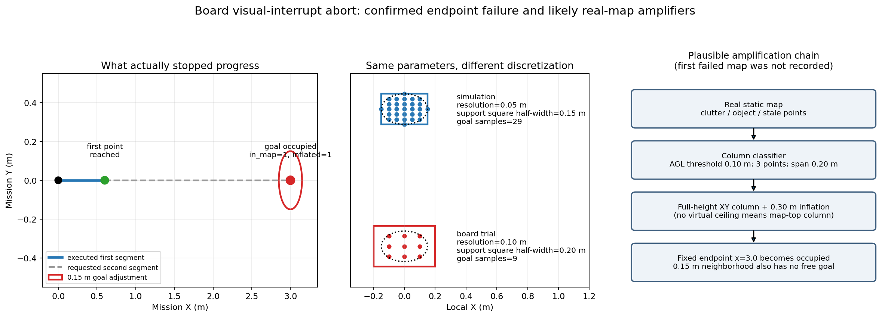

# 实机地图占据导致ABORT：与仿真差异复盘

## 结论

本轮不是“飞机在途中看到障碍后不会绕行”。第二段请求终点 (3.0019, -0.0064, 1.1144) 在规划地图中直接返回 in_map=1、inflated=1，且半径0.15m内没有合法替代终点。Fast-Planner没有为该段发布可执行轨迹，约12秒首次轨迹保护到期后，专项状态机以 board_line_finished_without_delivery 中止。

第一点约X=0.6m已到达；第二段没有轨迹，所以实际X持续停在约0.6m。日志中的多次 kinodynamic search fail 不是已有轨迹跟踪停滞，而是同一个非法终点反复求解。完整时间轴见[本轮轨迹](retry_123511/trajectory.png)及[指标](retry_123511/metrics.json)。

## 已经证实的事实

1. 任务服务已成功启动，mission ID为 board-visual_interrupt-1789879094-102927684-1；已排除上一轮“任务始终IDLE”的问题。
2. 第一段完成后，第二段终点在地图体积内但属于膨胀占据；错误不是search_region边界，因为该点距X上界约0.40m。
3. 第二段没有生成新Bspline。规划器只有合法终点后才生成整段局部轨迹，不会先沿0.6→3.0之间的安全部分向前飞。
4. 任务开始至中止期间，YOLO只有少量circle/red_cross粗线索，映射检测为0；相机画面没有看到目标。飞机只前进到约0.6m，若靶标在约2m处，以1.4m高度的下视相机视场，本来就尚未接近到可稳定识别的位置。
5. 最终模拟投递0次，用户接管降落；该轮保持INCOMPLETE。

任务阶段画面：[开始](retry_123511/start.jpg) · [第一点](retry_123511/first_point.jpg) · [中止前](retry_123511/abort.jpg)。三张图都只见地面和材质分界，没有合格靶标。

## 为什么仿真长期没有复现

仿真和本次板端入口使用同一类规划器，但输入与参数并不等价：

| 项目 | 已通过的仿真profile | 当前4×4板端专项 | 影响 |
|---|---:|---:|---|
| SDF分辨率 | 0.05m | 0.10m | 板端体素更粗；同一15cm邻域被离散得更保守 |
| 水平柱支持半径 | 0.15m | 0.15m | 代码按 ceil(radius/resolution) 取方形邻域；仿真实际半宽0.15m，板端变为0.20m |
| 支持方形最远角点 | 约0.212m | 约0.283m | 都大于名义圆半径，板端扩大更明显 |
| 0.15m终点换点候选 | 29个 | 9个 | 板端可选终点明显更少 |
| 障碍柱最低候选高度 | 约0.40m AGL | 0.10m AGL | 板端更容易把低矮杂点、家具边缘纳入整列障碍 |
| 点云 | 理想仿真雷达/受控几何 | MID360＋FAST-LIO＋FreeDOM真实静态图 | 实机有反射、漂移、室内杂物与历史静态点 |
| 航点 | 已知随机场景内验证 | 固定长段终点X=3m，未先查实时地图 | 一个被占据的远端点会阻止整段前进 |

仿真树位置、路线和边界在生成时可知，失败endpoint通常不会落进树的膨胀区；本次专项把一个固定3m点直接交给真实地图。两者不能仅凭“算法相同”视为同条件回归。

## 水平障碍柱实现存在的实机放大项

该机制最初用于满足“不从障碍树正上方越过”：只要某个XY邻域累计至少3个点且最大/最小Z跨度达到0.20m，该邻域内的源点就可触发从 floor_z 到柱顶的整列占据，再做每侧0.30m膨胀。

当前实现有三个实机敏感点：

- 支持邻域是方形，且半径以 ceil 换算为体素；10cm栅格时名义15cm变成±20cm方形，角点距中心约28.3cm。
- 高低点只需落在同一方形邻域，不要求属于同一根竖直结构。真实家具、墙边和多径静态点更容易共同满足20cm高度跨度。
- 本次关闭虚拟顶棚后，障碍柱上端采用地图顶部；这符合禁止越障意图，但一旦XY分类误判，就会在1.4m巡航层同样封死。关闭顶棚并不会关闭障碍柱。

此外，本轮使用单位静态 map→camera_init。任务原点来自MAVROS，而静态障碍图位于LIO的camera_init；若两系实际存在平移或航向差，固定3m目标会在障碍图中落到另一物理位置。现有日志没有同步保存两路原始位姿，暂时不能排除此项，也没有证据将其列为已确认根因。

## 尚不能确认什么

本轮没有同步保存 /freedom/static_pointcloud 和 /sdf_map/occupancy_inflate，因此无法从事后日志区分：

- 3m位置确有墙、家具或其他真实障碍；
- 真实点云经0.30m膨胀后覆盖目标；
- 水平柱分类将附近杂点/反射扩成整列；
- FreeDOM残留静态点或单位TF偏差把占据移到了终点。

目前只能确认“终点膨胀占据”，不能把它命名为某个具体物体，也不能据此缩小安全膨胀。

## 最合适的修复顺序

1. **先补诊断，不先改安全边界。** 首次出现 goal occupied 时保存5–10秒轻量快照：请求/有效目标、原始静态点、膨胀占据、障碍柱支持XY和两路原始位姿。只保存失败窗口，避免再次产生数GB日志。
2. **把视觉直飞拆成渐进航点。** 例如沿+X设置多个短段；远端3m点被占据时，不应阻止飞机先接近约2m处的靶标。短段仍由同一避障规划器验证，不是盲飞。
3. **在任务层处理“搜索航点被占据”。** 搜索/过渡航点可以在边界内寻找保持前进方向的合法侧向点，或跳过被占据的末端；投递靶心和H不能用同样方式随意搬移。不要直接全局增大0.15m planner换点半径。
4. **恢复仿真已经验证的柱判定高度口径。** 优先评估把柱候选最低高度从0.10m AGL恢复到约0.40m AGL；普通3D占据仍保留，低矮实体不会从地图消失，只是不再轻易被拉成贯穿全高度的柱。
5. **修正支持半径的度量实现。** 使用真实米制欧氏距离筛选，而不是 ceil 后的方形邻域；随后用实录点云回放比较漏检/误检。板端可继续使用10cm SDF，避免直接承担5cm全图约8倍体素更新成本。
6. **验证静态TF。** 每次起飞前只读比较LIO与MAVROS同机体位姿；超出位置/航向阈值时拒绝任务。单位静态TF可以保留为模式，但不能没有一致性检查。

在取得失败地图前，不建议直接关闭水平柱、把膨胀从30cm降到10cm，或把12秒保护改回90秒。这些做法会让失败更晚或安全边界更薄，并不解释占据来源。

本报告只做日志/源码/参数分析，没有修改导航、建图、视觉或飞行配置，也没有启动仿真或实机。
