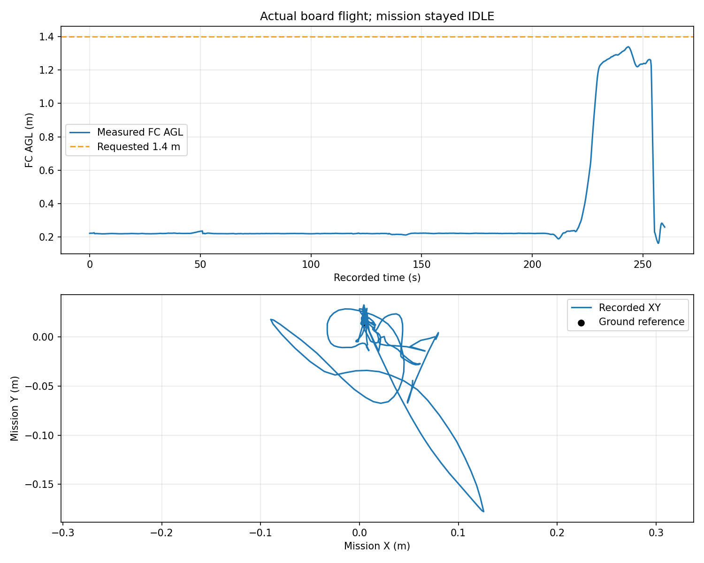

# 2026-09-20视觉中断首轮实飞复盘

已从板端取回`115825`与`120748`两轮完整应用日志、参数、位姿CSV、视觉事件及相机原图/标注录像。原文件保存在本工作树`logs/visual_flight_review_20260920/`，约20MB解压数据，不纳入Git。115825为控制器启动校验失败的准备轮；下述实测来自120748，不能合并成一次成功试飞。

## 实测结论

- 记录时长约259.90秒，绝大部分为地面等待；这不是259.90秒的空中航时。
- 按导航位姿和自动地面基准计算，FC高度0.4→1.2m约6.13秒，平均约0.13m/s；最高记录1.339m。采样约5Hz，此为高度区间均速，不是最大爬升能力或外部测量真值。
- XY最大偏离初始参考约0.227m，属于起飞/接管段活动；没有执行预定向前搜索航线。
- 任务状态全程`IDLE / waiting_for_manual_start`，mission_id为空，模拟投递调用0次。**本轮agent没有调用/navigation/start_mission**，起飞后未执行航线启动步骤，不能将不前进归因于避障失败。
- 用户确认手动关停；记录最后为POSCTL、未解锁、已落地，任务仍未完成。保留INCOMPLETE，不改判专项PASS。

数值摘要见[metrics.json](metrics.json)。[原始相机录像](../../../logs/visual_flight_review_20260920/board_visual_interrupt_20260920_120748/camera_raw_h264.mp4) · [视觉标注录像](../../../logs/visual_flight_review_20260920/board_visual_interrupt_20260920_120748/camera_annotated_h264.mp4)。视频在本机，不随Git分支上传。

## 爬升为什么慢

控制配置`px4_max_distance=0.15`，旧控制器在起飞阶段同样把位置目标裁到当前飞机位置前方15cm；因此0.5m/s的规划器速度上限不会直接变成起飞爬升速度。实测约0.13m/s与短前导的表现一致。

本轮记录没有完整的逐时设定点、飞控内部速度控制输出和PX4参数/ULog，不能唯一分解前导、飞控增益、起飞缓升及估计误差的贡献。后续应单独评估起飞垂直前导/爬升配置，不为加快起飞而同时放宽视觉末端对准参数；本次分支同步没有新增提速。

## 已修复和仍待完成

四套共享的启动修复：关闭虚拟顶棚、float/double高度表示一致、READY检查持续控制设定点、地面解锁/上锁不冒充完成飞行。按本次同步指令，四套默认均为legacy_static单位TF；已知安装外参与数值适配保持。

本轮并未验收直飞视觉中断、对准、模拟投递或投后原地降落。下一轮要明确现场起飞与任务开始的衔接：应用READY后由飞手起飞，检查控制就绪/悬停，再明确调用任务服务；本分支仍不自动解锁、切模式或自动开始任务。

## 第二次试飞：任务已启动，但固定终点被地图占据

第二次试飞已明确调用任务启动服务，排除了IDLE问题。第一点约X=0.6m正常到达；第二点约X=3.0m被判为地图内的膨胀占据，15cm内没有合法替代点，12秒后专项ABORT。飞机没有收到第二段Bspline，因此停在第一点附近；0次模拟投递，用户接管降落。

本次异常的日志、实机/仿真参数差异和分层修复建议见[地图占据ABORT专项分析](MAP_ABORT_ANALYSIS.md)。当前只能确认终点占据，因失败时未保存静态点云/膨胀地图，尚不能区分实体障碍、水平柱误分类、静态点残留或单位TF偏差。
