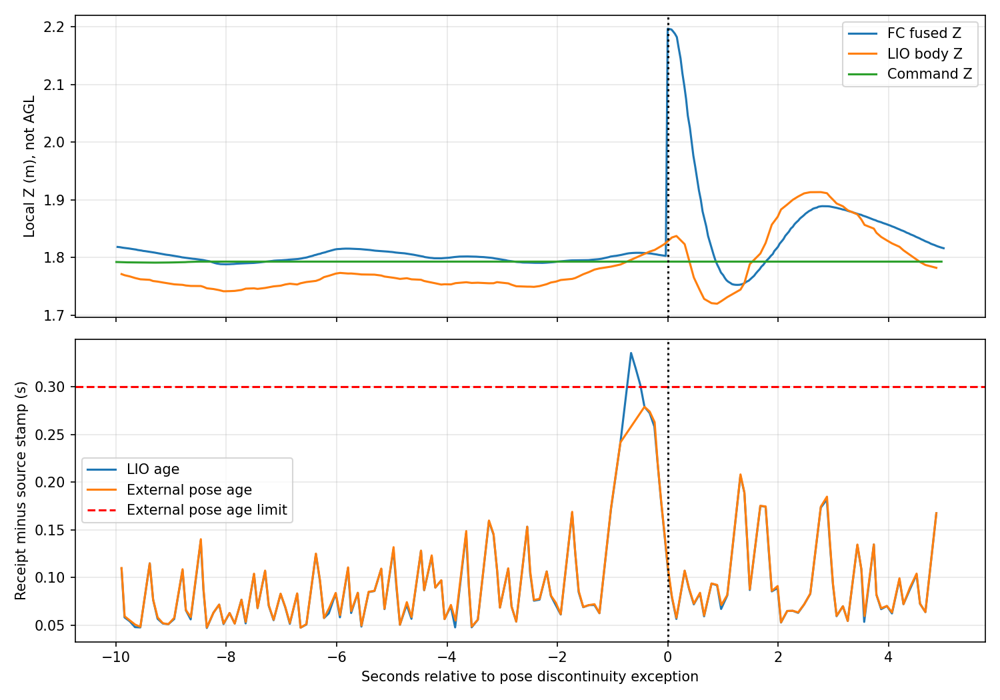

# 2026-10-01 第五组高位集齐中断投递试飞

板端192.168.43.99；run：`logs/board_high_priority_20261001_191955`。现场确认飞机/机构就绪后初始化PWM并启动真实舵机服务；等待航向收敛和READY，再由飞手解锁。高位2m、0.5m/s，原现场配置未改。

结果：INCOMPLETE，投递0次。航线推进至route_index=3，随后ABORT，飞手切POSCTL并落地解除武装。supervisor记录ON_GROUND，end_reason=landed_after_flight。两个bag均正常收尾，BAG_CLOSED=PASS；此PASS只表示录包完整，不是任务通过。

首个明确异常：1790853774.865006 `VCL06 board_pose callback failed: probe pose discontinuity`；1790853774.898977 发ABORT，reason=`board_pose_exception:ValueError`。后续probe.failure显示decision_pending，是终止后的状态传播，不是已证实的初始触发原因。需进一步用位姿时间序列区分定位跳变、陈旧/间隔采样或门槛问题，未在本轮改门槛。

识别曾形成bridge/panzer近同位置的竞争线索，不能据此宣称两个真实目标均被发现。没有证据将本次ABORT归因于分类冲突或舵机。起飞期间电压曾读到19.67V，随后约21V，已实时提醒飞手；是否负载压降/电源测量问题仍需单独核查。

本机已取回application.log、配置和结果JSON：`logs/flight5_20261001_191955`，未下载两个大bag。板端设备通信和舵机服务保留；没有再次启动试飞或发送释放命令。

## 两个bag回传后的定位结论

两个bag已通过rsync完整取回，约630.1MB；连同navigation_pose.csv共630,196,659字节，传输返回0，两个ROS bag均能打开并提取消息。本机目录`logs/flight5_20261001_191955/`；原包仍保留板端。

### 已确定的直接原因

`/mavros/local_position/pose`的相邻源时间戳为1790853774.8210952、1790853774.8610952，相差0.040秒：

- XYZ从(3.174006,-1.106399,1.803057)变成(3.223668,-1.040650,2.196893)。
- 三维位移0.402363m，其中Z跳0.393836m。
- `HighViewProbe.update_pose`门槛为`3*dt+0.25`，本次是0.3699999m。实际超过约3.24cm，因此准确命中现有不连续检查，并非没有数据变化却误报。
- 同一跳变原样存在于导航位姿及MAVROS odom，排除由导航TF单独产生此跳变；异常前后源时间戳递增，未见本次40ms段的时钟回退或长间隔。

同期LIO与发送给飞控的body外部位姿平滑：邻近同源时刻1790853774.86048，LIO body Z约1.835m，FC Z却约2.197m。飞行指令Z一直约1.793m（local Z，地面基准约−0.207m，对应2m AGL），没有突然要求升高。不能把飞控估计跃迁解释成40ms内真实爬高39cm。

因此本轮首先是**飞控融合位姿输出突变触发任务保护**，不是目前有证据支持的障碍阻塞、舵机故障或分类冲突导致ABORT。

### 上游嫌疑与证据边界

跳变前0.656秒，rosout出现`LIO external pose has an invalid frame or timestamp`。前10秒至后5秒窗口内，LIO接收数据年龄最高0.3355秒，超过外部位姿节点默认0.3秒；外部位姿输出最大接收间隔0.4361秒。该节点会拒绝过期数据，所以存在定位链延迟/丢帧的明确线索。

但不能据此直接断言“这0.436秒必然导致EKF重置”。bag窗口中没有MAVROS statustext重置说明，也没有PX4 estimator reset计数、融合创新量或内部高度源状态；需要对应飞控ULog判断是否外部定位失效、融合源切换或其他高度估计重置。仅ROS接收时间差也不能准确代替飞控内部接收时刻。

### 处置建议

1. 优先检查LIO输出延迟、CPU调度和相机/录包负载，核对传感器时间基准及飞控外部视觉融合配置；不通过伪造当前时间戳掩盖陈旧数据。
2. 提取对应PX4 ULog的local position reset、估计器状态、EV融合/超时与高度创新量，确认0.394m跳变来源。
3. 当前保护判定符合实现，但单次超限直接终止整任务的恢复方式可改进：先停止任务推进并保持受控状态，确认定位重新稳定、坐标连续且目标/地图一致后再决定恢复。需要单独设计验证，不能直接吞掉异常继续走。
4. 不建议本次单纯把0.25m余量扩大或关闭连续性保护；阈值只超3.24cm并不消除约39cm估计高度跃迁的事实。

本轮只分析并归档，没有更改代码/阈值，没有再次起飞。抽取结果见本机pose_jump_analysis.json和pose_window.json。
