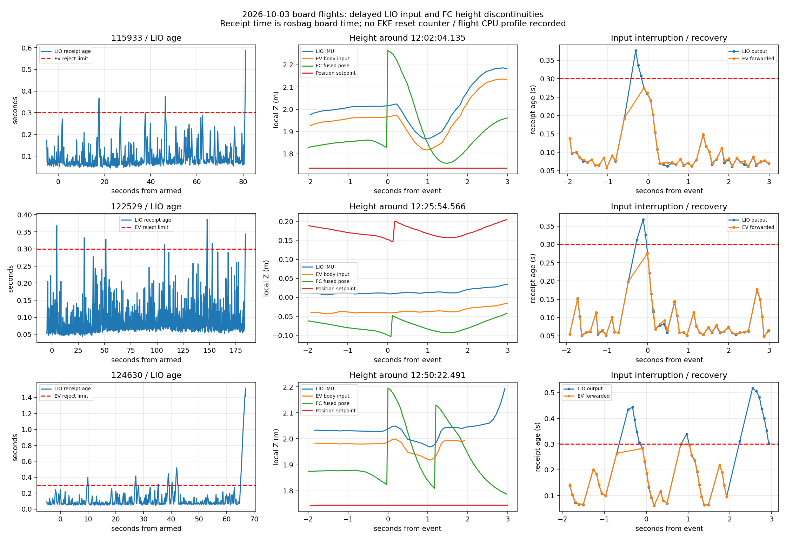
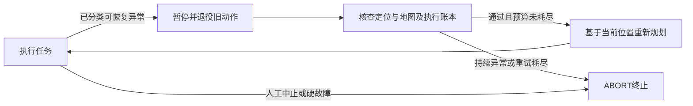

# 10月3日实飞位姿跳变与 LIO 实时性分析

本轮经 `orangepi@192.168.3.126` 只读取回今天三轮 high_priority 日志、完整 bag、实际板端源码和配置。分析结论：**三次飞行中异常差分首先出现在飞控融合输出，LIO 同期连续；三次跳变均紧随外部定位输入中断后的恢复。板端仍有积压风险，并发现地图盒参数会造成往返移动。** 输入恢复导致 EKF 高度重置是目前最符合数据的解释，但缺飞控 ULog，不能把相关顺序当成已经证实的 EKF 重置原因。

没有修改板端源码、配置、飞控参数，也没有启动 ROS、雷达、仿真或飞行。新增的是离线分析工具与报告。

## 数据、分段和结果

| run 后缀 | bag 时间段（北京时间） | 解锁段 | 任务情况 |
|---|---|---|---|
| 115933 | 11:59:34–12:02:38 | 12:01:17–12:02:34 | 12:02:04 位姿回调异常，ABORT；0 槽提交 |
| 122529 | 12:25:30–12:28:54 | 12:25:49–12:28:49 | 飞行中未命中位姿跳变门槛；1 槽 COMMITTED，另一槽 RESERVED；不是整场完成 |
| 124630 | 12:46:31–12:50:52 | 12:49:43–12:50:45 | 12:50:22 首次位姿异常，12:50:25 再跳；0 槽提交 |

bag 字节数分别为 95,024,482、148,985,489、111,994,407，均可正常打开、读取索引。前两轮 `bag_recording.json=PASS` 只说明录制正常关闭；第三轮缺该摘要。三轮均未发现完整 supervisor/result 摘要，不能用录制 PASS 宣称任务通过。

下表 age = bag 收到 `/Odometry` 的时间减去消息内扫描结束时间戳，包含上游处理和 ROS 传输/录制调度时间，**不是 ICP 单次执行耗时**。解锁区间由 `/mavros/state` 接收时间分段，状态约 1 Hz，边界精度约 1 秒。

| run | LIO 帧数 → EV 帧数 | 未转发：全程 / 解锁段 | 解锁段 LIO age P50 / P95 / 最大 | 全程最大 age | 解锁段 EV 最大接收间隔 |
|---|---:|---:|---:|---:|---:|
| 115933 | 1821 → 1799 | 22 / 6 | 75 / 218 / 376 ms | 658 ms | 505 ms |
| 122529 | 2023 → 1985 | 38 / 11 | 77 / 198 / 387 ms | 987 ms | 476 ms |
| 124630 | 2568 → 2483 | 85 / 24 | 74 / 276 / 518 ms | 1519 ms | 1182 ms |

按原始 header 的纳秒时间戳配对，145 帧 LIO 未出现在 EV 话题，解锁段占 41 帧；这些未转发消息的 bag age 全部超过 300 ms，与桥接源码的拒收规则一致。三轮所有转发 EV 消息 age 都在 300 ms 内，LIO/EV/飞控 header 均无回退。警告有 2 秒节流，不能拿警告行数作为实际拒收帧数。全程 1.519 秒峰值在第三轮解除解锁之后，不能写成飞行中的峰值。



图中每行左侧为解锁前后 age；中间与右侧为事件附近高度和 age。第二轮以最大输入间隔的恢复时刻为中心，作为“同样有拒收但没有大幅跳变”的对照。高度使用各话题原有局部 Z，并非独立真值 AGL。

## 跳变发生在哪一层

| 飞控消息接收时刻 | dt | 飞控 XYZ 差分 | 同期 LIO | 跳变前 EV 间隔 | 恢复至跳变的间隔 |
|---|---:|---|---|---:|---:|
| 12:02:04.135 | 39.0 ms | +0.0078、+0.0436、**+0.4351 m** | 连续，附近相邻差分最大 2.2 cm | 481 ms，3 帧未转发 | 108 ms |
| 12:50:22.491 | 30.0 ms | +0.0120、+0.0395、**+0.3715 m** | 连续，附近相邻差分最大 3.2 cm | 618 ms，5 帧未转发 | 89 ms |
| 12:50:25.664 | 29.0 ms | +0.0713、+0.1280、**+0.4572 m** | 连续，附近相邻差分最大 4.0 cm | 1182 ms，9 帧未转发 | 66 ms |

“附近”按事件前 1 秒到后 0.3 秒的 LIO 接收样本统计，LIO 每帧约 100 ms。三维差分分别为 0.4374、0.3738、0.4801 m；全部超过现场 `3*dt+0.25 m` 规则。LIO 和 EV 全部样本均未命中同一门槛。

第一轮具体顺序如下：

1. 12:02:03.546，最后一条正常 EV，age 193 ms。
2. 随后 LIO 连续输出 age 376、337、307 ms 的三条旧数据，桥接没有转发。
3. 12:02:04.027 恢复 EV，age 275 ms；随后旧帧以短于扫描周期的间隔被追赶处理。
4. 12:02:04.135 飞控 Z 从 1.8286 跳到 2.2637 m；桥接 EV 本身没有对应的高度跃变。
5. `/navigation/local_pose` 原样传递同一差分；约 12:02:04.171 发出 ABORT，原因 `board_pose_exception:ValueError`。

三次跳变时，飞控反馈垂直速度仍分别约 -0.113、-0.095、-0.054 m/s，没有与 11–16 m/s 的位置差分速度相符。跳变前位置设定点 Z 也保持不变：第一轮 1.7363 m、第三轮 1.7446 m。因此不能把这些差分解释为真实飞机瞬间上窜，也没有证据表明是规划器突然发出升高指令。

跳变之后，飞控反馈垂直速度开始下降，LIO 高度也出现后续连续波动。位置重置会改变控制器看到的高度误差，可能引起真实的控制响应；所以不能只删除任务保护就把定位问题视为解决。

**确定的直接链路是：飞控融合位置不连续 → 导航位姿传递 → 板端旧跳变门槛触发 → 任务 ABORT。** 更深的“EV 中断/恢复 → EKF 高度融合重启/重置”仍为推断。第二轮存在 476 ms 中断而没有飞行中大差分，说明中断不是充分条件，还受当时估计误差、融合状态和门槛影响。

第二轮 12:28:53 的 `timer_exception:ROSException` 是 `publish() to a closed topic`，堆栈指向关闭中的状态发布；已在 12:28:49 解除解锁、话题开始注销后发生。它属于收尾异常，不是本轮飞行中定位失败。第二、三轮启动时另有较大地面位置归零，与飞行中事件分开统计。

## 雷达朝向复核与版本差异

按测量时间戳对齐 LIO 和飞控四元数，先去除各自基准姿态，再拟合 XY 倾角的相对机体轴旋转；搜索 ±150 ms 时差。三轮分别得到 **2.24°、1.12°、1.84°**，694、1719、526 对样本，拟合残差 RMS 为 0.216°、0.249°、0.185°。平均倾角激励仅约 1.2–1.6°，这些数值用于排除约 90° 串轴，不能作为精确安装标定结果。今天的数据支持用户已经把雷达方向调正，不应继续沿用昨天的 90° 原因。

`mapping/extrinsic_R` 是雷达点云到其 IMU 的内部外参；雷达整机安装方向和机体轴对应关系是另一层。不能把物理转动整颗 MID360 与内部雷达–IMU 外参混为一谈，也不应据此直接把内部 R 改成 90°。

现场 `high_view_probe.py` 仍包含位姿跳变即异常的旧规则；Git 开发版本曾删除该判定，但未同步现场。这正解释了为什么已有本地修复文档，今天仍出现同类 ABORT。现场最后的 `last_reason` 还会被 `decision_pending/probe_finished` 覆盖，应保留原始异常时刻分析，不能仅看最后一条状态。

实际加载的是 `uav_mission/config/mid360_hardware.yaml` 加 `uav_board_trials/config/board_load.yaml`，PCD 在硬件配置里已关闭。此前仅修改通用 `FAST_LIO/config/mid360.yaml` 不影响这个入口；关闭 PCD 是合理默认值，但不能用它解释今天的延迟或宣称根因已消除。

## 可复现的地图盒参数问题

板端实际参数为 `cube_side_length=20`、`mapping/det_range=6`，源码 `MOV_THRESHOLD=1.5`。源码只要求 `20>3*6`，这个条件可以使初始中心不移动，但没有保证移动后的另一侧仍留有余量。

由 `lasermap_fov_segment()` 可得：

```text
边界触发距离 = 1.5 * 6 = 9 m
不触发移动的内部宽度 = 20 - 2*9 = 2 m
平移距离 = max((20-18)*0.5*0.9, 6*(1.5-1)) = 3 m
```

固定位置 x=1.2 m、初始盒 [-10,10]：距右边 8.8 m，触发右移为 [-7,13]；下一帧距左边仅 8.2 m，触发左移回 [-10,10]。即使飞机不再移动，仍会往返。高度从起点升到约 2 m 也会在 Z 轴满足同类条件。每次触发还调用移除点收集和 `Delete_Point_Boxes()`。

用 bag 的 LIO 后验位置、姿态与板端内部雷达–IMU 平移外参，近似重放同一盒移动算法：

| run | 20 m 盒移动次数 | 候选 24 m 盒 | 候选 30 m 盒 |
|---|---:|---:|---:|
| 115933，1821 帧 | 648 | 1 | 0 |
| 122529，2023 帧 | 1596 | 1 | 0 |
| 124630，2568 帧 | 450 | 1 | 0 |

**这是参数算法重放，不是实际 KD-tree 计时。** 实际源码在 ICP 更新前使用 IMU 预测位置，bag 保存更新后位置，启动帧亦有差异，故移动次数是估计。静止点来回移动的数学反例则不依赖 bag。删除的盒片有时处于无点区域，调用多不等于实际删除大量点；目前不能证明它就是 age 尖峰的主要耗时来源。第二轮移动次数最多却没有大跳，也不能将次数和飞控重置直接等同。

建议优先把盒长与平移余量作为一个独立修复项验证。24 m 是保持 det_range=6 时的候选，不是已验收现场值；更大地图也可能增加存储/搜索成本。此处 `det_range` 在本源码中只用于盒移动，**不负责逐点剔除 6 m 以外的雷达点**，不能把它理解为已对所有输入完成半径裁剪。

## 仍存在的性能和算法隐患

| 优先事项 | 板端源码/数据发现 | 含义与验证方向 |
|---|---|---|
| 输入积压 | 雷达/IMU ROS 接收队列各 200000，内部三条 deque 无长度/年龄上限；最旧扫描优先，一次循环处理一帧 | 平均 10 Hz 不能保证实时；短暂停顿后仍耗算力处理已过期扫描。需记录队列长度、最旧 age、IMU 覆盖、每阶段耗时，并设计保留 IMU 时间连续性的有界策略 |
| 回调和处理串行 | 主循环 `spinOnce()` 后处理扫描；雷达预处理在回调内、持锁执行 | 回调批量积压可抢占滤波处理时间。多线程/异步改造要保护 buffer 与同步状态，不能直接更换 spinner 后认为问题解决 |
| ARM 并行未启用 | 实际 flags 有 `-O3 -fopenmp -g`、`MP_PROC_NUM=1`，没有 `MP_EN`；并行最近邻搜索宏仅在 x86 分支开启 | 当前最近邻循环串行；可单独比较 1/2/3 个计算线程、大小核亲和性和整机竞争。ikd-tree 自身另有后台线程，不能说整个 LIO 只有一个线程 |
| 点云发布开销 | dense/world/body 都开启；world/body 即使无订阅者仍变换并序列化点云，输出队列达 100000 | 可优先检查 body 消费者，保留规划所需 world cloud；对无消费者输出跳过计算，对输出队列作有界处理 |
| 地图导出 | `/Laser_map` 已有订阅者检查和 1 Hz 限速，但每次仍 flatten 整棵树 | 可能有周期性尖峰；需单独计时，不能误写成“每扫描 10 Hz 全树导出” |
| 特征与分辨率 | feature=true、point_filter_num=3、surf/map 体素 0.15 m、迭代 3 | 特征分支先处理各扫描线，再在平面输出中按 3 点采样；不是预处理入口就减到三分之一。累计特征耗时均值约 2.9–3.4 ms，且不包括全部预处理，不能据此判定主要瓶颈。关闭特征后可能增加参与匹配点数，需独立比较，不能保证必然更快 |
| 观测缺口 | runtime_pos_log=false，现有计时输出为累计特征均值，没有 ICP、地图删除/插入、发布、队列长度的逐帧数据 | 现有记录只能证明“旧数据输出及恢复追赶”，不能区分计算、IMU 等待、雷达输入传输、调度或地图处理各占多少 |
| 雷达时间回退恢复 | 回退分支只清 lidar_buffer，没有同时清 time_buffer/lidar_pushed 等对应状态 | 可造成点云与时间队列错配；本日未见 loop-back 或 not-Synced 日志，不能列为已发生原因。后续修复应成组处理同步状态 |
| 匹配质量与退化 | 只有有效匹配点为 0 才明确拒绝本次更新，未导出平面方向分布、残差和弱约束方向的诊断 | 输出连续不等于地图定位一定准确；需记录有效点比例、残差及质量指标。今天未见 No Effective Points 报警，bag 没有原始 lidar/IMU，不能据连续曲线证明不存在退化或振动/IMU 缺帧 |
| 不确定度传递 | `publish_odometry()` 先 publish 后写 covariance，输出可能携带上一帧值；EV 使用 PoseStamped，未传 LIO 协方差/速度 | 影响质量自适应，新增诊断或桥接要先确认飞控版本与接口契约；不等于本次大差分的证明 |

原源码即使关闭 runtime 日志仍有 `fout_pre << ... << endl`，但三轮均打印 Log 路径打不开，检查时板端也无对应文件。因此本日不能将持续磁盘 flush 列为已发生的重负载原因。

视觉 RKNN 在解锁段的总处理 P50 约 91–93 ms、P95 151–156 ms；NPU 调用 P95 130–133 ms，总处理峰值 204–269 ms。这证明整机有一定延迟波动，但没有飞行 CPU/频率/温度/调度采样，不能认定是视觉抢 CPU 导致 LIO 尖峰。视觉输入仅保留最新帧的原则仍应保持，不应以增加图像队列解决掉帧。

## 外部定位接口与后续验证

三轮 LIO 和 EV 正常扫描频率约 10 Hz，而 [PX4 官方外部定位文档](https://docs.px4.io/main/en/ros/external_position_estimation) 推荐消息流为 30–50 Hz。这里是应复核的接口余量问题；今天确实观察到飞控跟随外部定位，不能按文档一句话断言当前版本完全没有融合。提升频率必须产生带实际测量/传播时间的新估计，不能循环重发旧消息或把旧 header 改成 now。

同一官方文档明确 `EKF2_EV_DELAY` 表示测量时间相对 IMU 时基的偏差，正确采样时间戳和同步下可以为 0。**不能把本表 75 ms 到达 age 直接填成 EV_DELAY**，否则可能重复补偿已有时间戳表达的延迟。10月2日读取的 EV_CTRL=15/HGT_REF=3/EV_DELAY=0 是历史值；本次检查时 ROS/MAVROS 已停止，未取得今天飞行参数快照，不能当成本日实参。

后续按单因素顺序推进：

1. **补定位链观测**：取这三轮飞控 ULog，检查 `vehicle_local_position` 的 z/xy reset counter 和 delta、`vehicle_visual_odometry` 的 timestamp_sample/到达时间、EV 高度融合状态、创新/拒绝，以及气压高度。结合 MAVROS 时间同步确认，是重置、观测恢复还是估计器切换。字段以现场 PX4 版本为准。
2. **修复地图盒往返，做独立比较**：先验证 24 m 候选与旧值的地图删除计时、有效地图点数、LIO age 和内存，不同时修改体素、线程或飞控融合设置。
3. **降低无用输出，增加有界诊断**：首先核查未使用 body cloud；计时应低频汇总、限容量，不再开启大量逐帧落盘。输入缓冲上限需同步保留 IMU 区间、末帧和滤波时间状态，不能简单将全部订阅 queue 设成 1 后丢失去畸变数据。
4. **再比较 ARM 并行与直接点模式**：[FAST-LIO 官方](https://github.com/hku-mars/FAST_LIO) 支持关闭特征提取的直接点模式和 ARM 平台；是否更快取决于本站点数、体素与线程竞争，需匹配质量/延迟一起验收。不要为提速先把 0.15 m 改回大体素而损害门/障碍几何。
5. **单列任务跳变策略**：保留现场首因和保护，评估已有开发版本的容错更改。解除一帧即 ABORT 可以改变任务行为，却不能修复定位/控制响应；不得用“无 ABORT”替代定位稳定性验收。

目前网络地址在 wlan0 为 192.168.3.126；14:42 的只读检查 eth0 DOWN、carrier=0，且无 ROS 实例。它描述的是检查时的停机/接线状态，**不证明午间飞行雷达断线**；起飞前仍需恢复雷达有线链路和原雷达子网。SSH 拷贝途中几次断开，经限速断点续传获得完整 bag；这属于当前取日志的 Wi-Fi 连接现象，也不能据此推断过去传感器网络丢包。

## 离线复查

原始 bag 和板端源码保存在本 worktree 的 `logs/board_high_priority_20261003_*`、`logs/lio_diagnosis_20261003/deployed_source/`，未加入 Git。统计明细见 [metrics](lio_metrics_20261003.json)。运行以下命令只读取 bag，不连接 ROS master、不会发布控制消息：

```bash
cd /home/xhj/liftrace-worktrees/r2026-board-vision-tests
source /opt/ros/noetic/setup.bash
/usr/bin/python3 tools/bag_replay/analyze_lio_flight.py \
  logs/board_high_priority_20261003_*/flight_debug_0.bag \
  --output logs/lio_diagnosis_20261003/reproducible_summary.json
```

该工具可复查主表的 age、未转发、header 回退、飞控/导航跳变和状态分段；姿态轴拟合、地图盒后验重放及图表的分析脚本另存于 `logs/lio_diagnosis_20261003/analysis_scripts/`。现有数据不足以直接验收下一轮实飞。

## ABORT 原因与恢复机制评估（10月3日追加）

用户问“发生 ABORT 的原因都是什么、工程上能否退出 ABORT 恢复任务、是否适合加入”。本节复核现有状态机与现场日志，不实现或部署新的恢复状态。

### 今日触发与工程中的其他入口

第一轮和第三轮首次 ABORT 的错误均为 `board_pose_exception:ValueError`，日志中的具体异常是 `probe pose discontinuity`：两帧三维差分超过 `3*dt+0.25 m`。第三轮后续重复的位姿异常发生在同一 ABORTED 任务中，不代表又创建了新的 ABORT 任务。第二轮收尾的 `timer_exception:ROSException` 来自已关闭话题发布，不应启动“恢复飞行”。LIO age 超限本身是在桥接处拒收观测，不是今日直接调用 ABORT 的入口。

工程内终止入口按含义归类如下，详细旧清单见 [ABORT_ENTRY_INVENTORY](ABORT_ENTRY_INVENTORY.md)。清单的 91 个调用点包含转发、执行器失败和研究段结束，不等于 91 种故障，也不能把每个执行失败都看成立即终止整个任务。

| 类型 | 典型条件/原因 | 当前处理与恢复边界 |
|---|---|---|
| 位姿合法性/连续性 | 单帧大差分、非有限值、错误 frame、时间回退；就绪检查的高度超界 | 异常转 ABORT；今日大差分属于这里 |
| 地图/标定合同错误 | 地图 frame、布局、数据长度异常，高位 cost map 超过点数限制；CameraInfo 标定变化 | 停止任务；不能仅等几秒后原样继续 |
| 任务/执行事务不一致 | 任务时钟失效/倒退、路由绑定与阶段不匹配、执行器身份改变 | fail-closed；不能通过清空对象或反复重试消除不一致 |
| 阶段兜底耗尽 | 起升未确认、没有局部下降路径、没有剩余补搜路径、专项记忆/整圈未完成 | 明确失败，部分路径进入 ABORT；先区分已有替代点/补搜逻辑是否已用尽 |
| 返航/降落失败 | `return_home_failed`、`landing_failed`、`safety_motion_timed_out` | ABORT；定位/规划未可靠时，不应自动重试返航或降落 |
| 未分类回调异常 | `candidates/result/timer/cost_map/board_pose` 的未处理异常 | 统一报来源与异常类型、终止任务；需要先确定具体异常是否可恢复 |
| 人工请求 | `manual_abort_requested` | 保持终止；不自动违背人工中止意图 |
| 研究段结束 | `research_segment_end:*` | 专项借 ABORT/保持合同结束实验，不能将正常研究段完成自动续成完整任务 |

普通低置信度、旧视觉候选、短暂 pose/map 过期通常是拒绝输入或等待；普通 SEARCH/RESUME 规划失败也可重试，不能全部升级为 ABORT。

### 已有的恢复能力与缺口

| 现有功能 | 代码依据 | 是否为退出 ABORT 恢复原任务 |
|---|---|---|
| 临时等待就绪 | `navigation_mission_manager.py` 的 `TRANSIENT_READINESS_FAILURES`、`_on_timer()`：pose/map 缺失、过期或未来时间戳时暂停调度，数据恢复后继续；deadline 不被重置 | 否，任务尚未进入 ABORT。这里只停止调度，不保证取消正在执行的轨迹或已经悬停 |
| 搜索重试/续点 | `mission_runtime.py` 的 `_finish_route()`、`_schedule_from_search()` 与 CoverageRoute 失败预算；高位 SURVEY 可选附近替代点或跳过不可达区域 | 否，是活动任务内部局部容错 |
| 投递中断后恢复搜索 | `RESUME`、投后 `RECOVERY` 完成后回到 SEARCH | 否，RESUME 表示恢复被正常投递中断的航点，不是从 ABORTED 恢复 |
| 投递失败的降级 | 未开始释放的部分失败可释放预约并重试；已提交后的恢复失败/超时走返航；状态不确定的槽位隔离、接收迟到 ACK | 否，保护实际投递账本，不是复位任务 |
| ABORT 后再次 start | `_on_start()` 在旧任务没有 active_action 且已 COMPLETE/ABORTED 时可以创建全新的 runtime/mission_id；旧 core/runtime 自身不允许二次 start | **否，这是从头创建新任务**，搜索游标、任务预算和槽位账本不会由旧任务自动继承 |

`MissionCore._abort_action()` 把 phase 设为 ABORTED、标记 mission_failed，再下发 ABORT 决策。`MissionRuntime.abort()` 退役活动搜索绑定；`tick()` 在动作结束/到期后仍停留 ABORTED。没有 resume-aborted 服务、故障消失自动退出逻辑或断点载入接口。

ABORT 是任务层命令，并不等于节点进程退出、遥控接管、自动降落或电机停止。在当前 Planner Bridge 中，它以最新里程计生成保持意图，仍通过规划/控制链执行，也受限高等控制约束；若没有可信里程计，会报 `abort_hold_odom_unavailable`，不能保证定位失效时安全悬停。今日第一/三轮任务 ABORT 后，飞控仍处于 OFFBOARD，之后由飞手切 POSCTL/MANUAL。

现场 supervisor 的自动启动有 `start_attempted` 一次性闩锁；工作台手动入口也限制单轮一次启动、拒绝向自动时序入口重复发 start。当前界面没有“从 ABORT 继续”按钮。即使绕过界面直接调 start 服务，也不是续任务；尤其不能在已投/不确定槽位情况下把新账本当作真实空载状态。

截至本次追加，另一会话已提交 `437c757`，将高位连续性保护恢复为现场冻结口径。早期取消该保护的文档是历史方案，不能将其当作当前自动恢复能力。

### 建议加入什么

适合加入**有界暂停与条件恢复**，保留终止性 ABORT。沿用现有 Mission Manager 的任务权威，扩展其等待/执行合同，不另建第二套任务调度器；涉及导航—执行接口的修改先形成双方约定。



恢复合同至少包括：

1. 只对明确分类的短时通信/数据延迟、未涉及释放的可重试规划失败开放。未知程序异常、时钟倒退、frame/原点切换、任务事务冲突和人工 ABORT 不自动恢复。
2. 有明确的旧轨迹取消/保持确认，撤销释放许可；位姿失效时不能以继续发布旧设定点作为安全保持证明。
3. 连续稳定窗口内验证新鲜数据、LIO/飞控在同一测量时刻的合理一致性及地图/TF 坐标一致性。发生坐标重置时，旧航点和目标记忆不能无条件沿用。稳定窗口和误差阈值需根据地面/回放验证配置，不只看“若干秒没报错”。
4. 保留同一 mission_id、已投类别、COMMITTED/QUARANTINED 槽位、搜索游标与原始总任务时间。恢复后发布新的 decision_seq、重新规划，不重放已退役命令，不延长总预算或无限刷新动作 deadline。
5. 限制暂停时长和恢复次数，恢复失败进入原有降级/终止路径。定位不可信时不能自动选择依赖该定位的返航；飞手接管后保持人工控制权，不自动重新切 OFFBOARD 或继续任务。

对今天的 37–46 cm 高度差分，原因与 EKF 重置语义尚未确认，**当前应保留人工接管，不增加“ABORT 后几秒自动续飞”**。先修复上游实时性、补 ULog 与定位一致性观测，才能决定哪些位姿事件可以转换为暂停恢复。局部恢复能力有价值，但不能作为掩盖 LIO/融合问题的补丁。

本节复核了核心、runtime、manager、Planner Bridge、现场 supervisor 与工作台启动闩锁。现有 9 项离线回归通过：终止幂等/搜索退役、正常投递中断续点、搜索有界重试、时钟倒退终止、槽位隔离与迟到 ACK、ABORT 保留 COMMITTED、候选重试、返航失败终止、隔离槽负反馈保留。它们验证当前逻辑，不代表新增暂停/恢复方案已实现或实飞通过。
