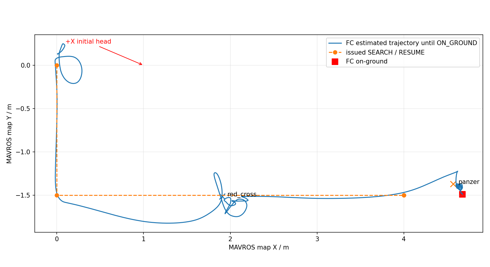
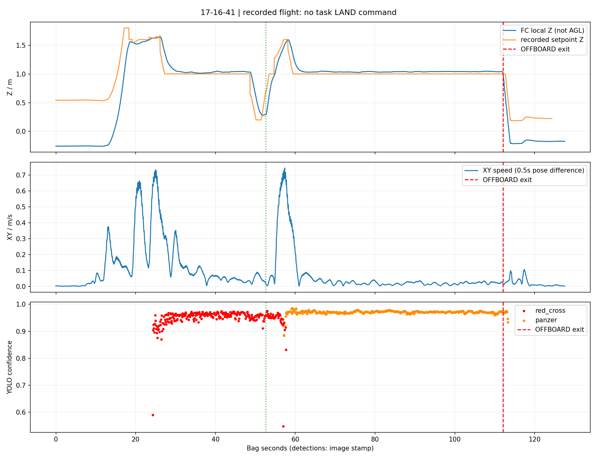
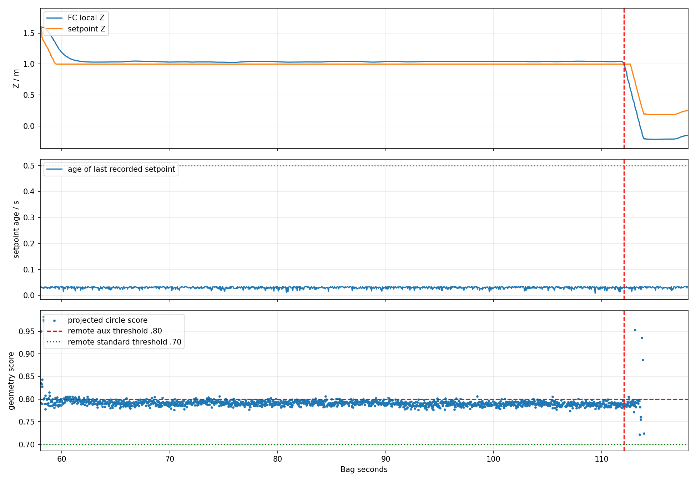
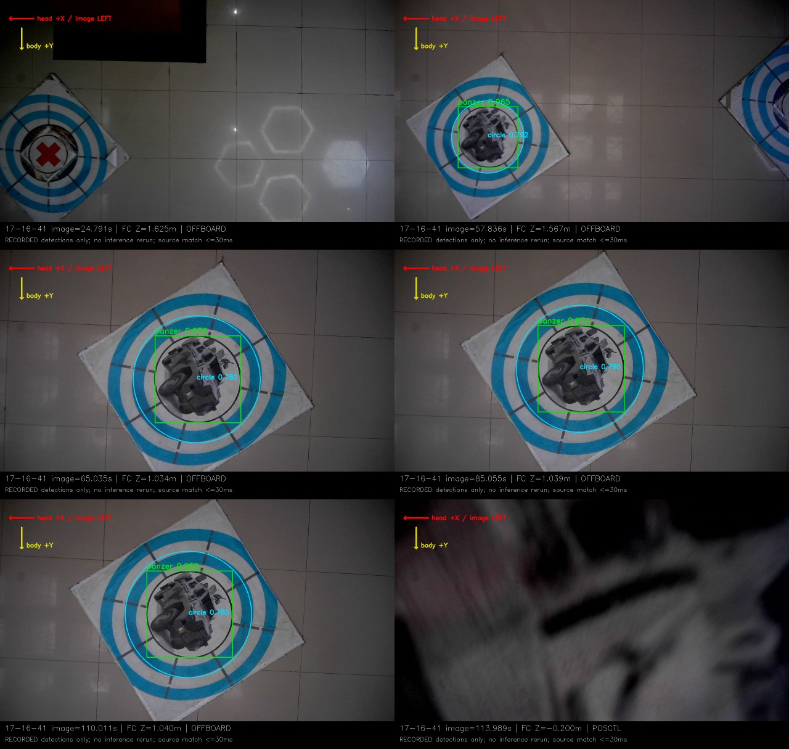
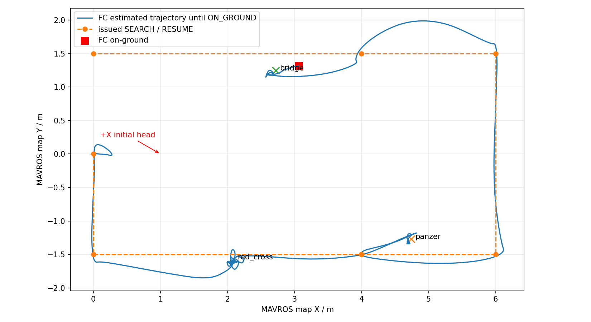
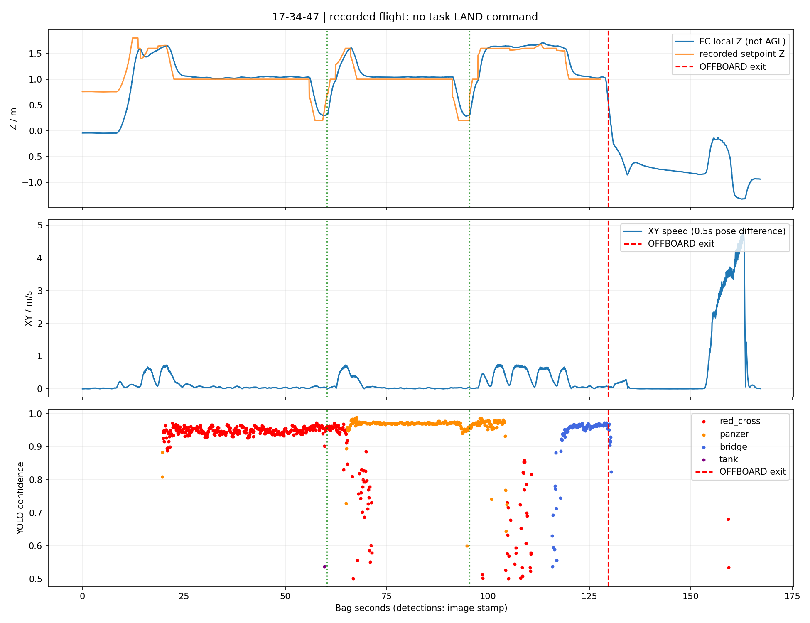
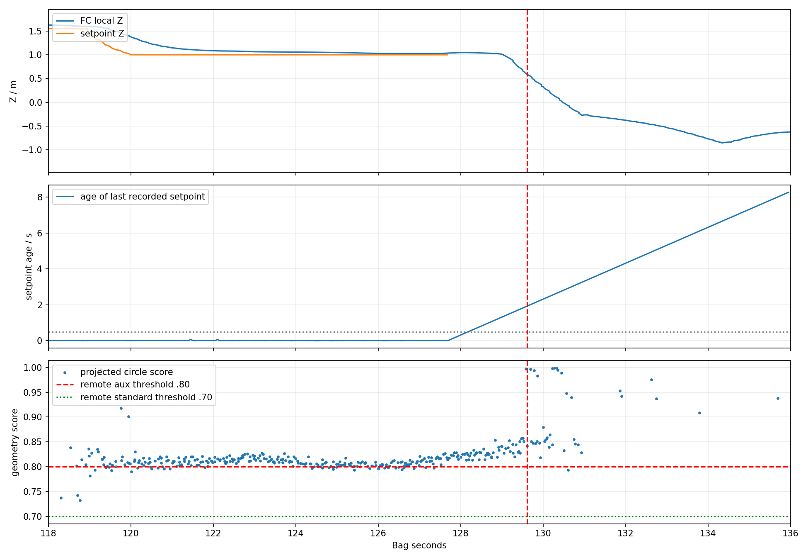
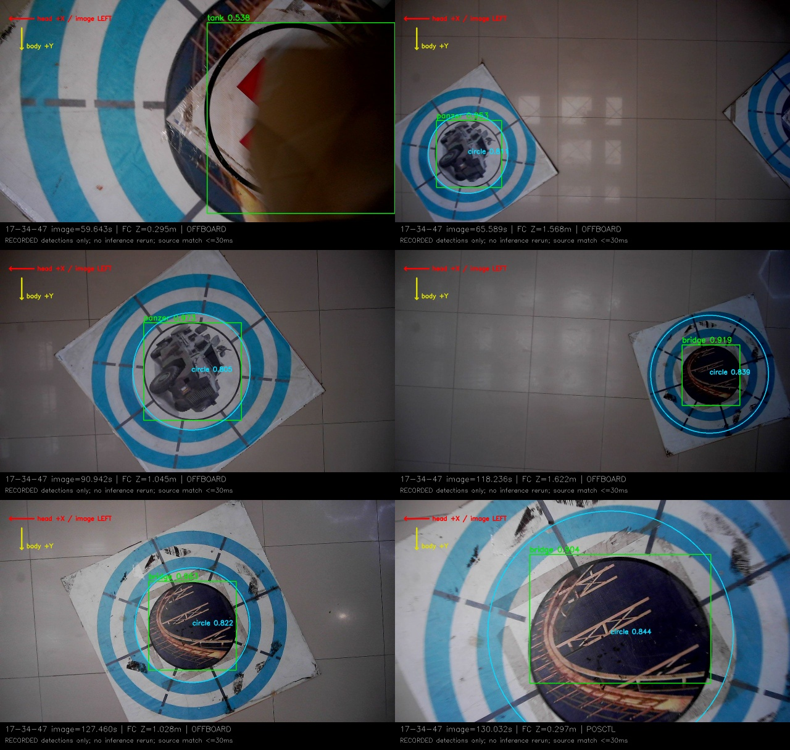
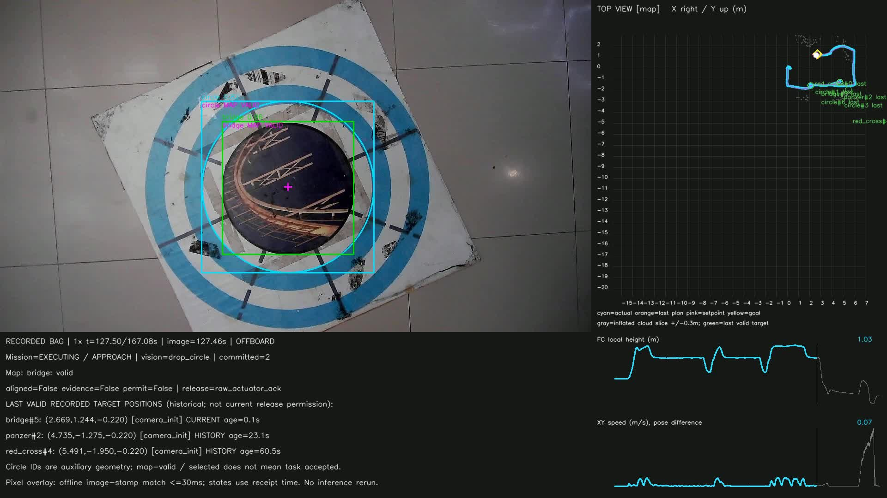

# 09/28两轮实飞复盘：装甲车对准停滞与桥梁处控制流中断

2026-09-28。复用bag_replay工具，离线读取原始记录并生成回放；未重新推理、训练、启动仿真或操作实机。现场反馈“未接管”，模型版本随后表示不确定。本报告以记录为准，不把退出OFFBOARD直接写成人工接管。

[视频与图表入口](index.html) · [结构化指标](metrics.json)

## 结论

两轮不是同一种失败，也不是任务层主动决定“飞到桥梁就降落”。

| 项目 | 17:16:41 | 17:34:47 |
|---|---|---|
| 记录时长 |127.552s|167.080s|
| 飞控IN_AIR→ON_GROUND间隔 |103.979s|124.994s|
| 有正向执行回执的投递 |红十字，第1槽|红十字第1槽、装甲车第2槽|
| 最后任务 |装甲车APPROACH/对准，第2槽保留|桥梁APPROACH/对准，第3槽保留|
| 桥梁是否进入任务 |未进入，本包YOLO没有bridge输出|已确认并接近，且形成严格对准条件|
| 首个明确阻塞 |装甲车已有精修和地图点，但独立circle候选不能持续确认，对准上下文一直缺几何|127.683s后没有控制设定点；同期LIO TF与膨胀图停止更新|
| 任务RETURN_HOME / LAND指令 |均无|均无|
| 飞控尾段 |112.073s OFFBOARD→POSCTL|129.613s OFFBOARD→POSCTL，132.614s ALTCTL|
| 最终任务状态 |EXECUTING，1槽COMMITTED，第2槽RESERVED|EXECUTING，2槽COMMITTED，第3槽RESERVED|

正向回执是软件层raw_actuator_ack，不能代替快递盒真实落点或槽内释放传感器。所有时间以**bag记录起点**计；首条SEARCH可能是更早发布的latched消息，bag起点不等于精确任务启动时刻。

## 1. 远端板端代码与模型版本

本次已重新fetch导航组仓库，读取试飞组维护的 **板载代码** 分支：

- 仓库：https://github.com/sakelier/liftrace-controlwork.git
- HEAD：d1fe025a8fb48d33e6db89b287053daa9c036bfb，提交时间2026-09-27 20:47 +0800，内容为调整投递高度。
- 不是我们的“板端参考分支”，也不是视觉研究分支的最新高位先搜runtime。
- high_view_priority_search.launch仍复用minimal_delivery_test.launch：较高航点搜索→发现目标立即中断→低位对准投递→恢复被中断航点。没有使用最新“先形成粗线索队列，再规划低位重访顺序”的完整策略。

| 项目 | 远端默认值 |
|---|---|
| 模型 |runtime_models/merged_standard_fp32.rknn|
| 下层元数据 |merged_standard_6cls_metadata.yaml|
| 类别 |含tank的旧六分类|
| YOLO入口置信度 |0.50|
| 高位入口显式透传metadata_path |没有，只透传model_path|

17:34包在 **59.643s图像**中记录了YOLO tank=0.5376（位于投递后的包裹/靶面图像），这不是工具重新推理添加的。它证明本次检测输出仍允许tank，**不是正确五分类契约下的输出**。结合远端默认接线，更像仍在使用旧链，但bag没有实际模型路径、权重文件标识、节点参数快照；也不能排除现场替换了权重却没同步元数据。不能仅凭这个框唯一判定二进制权重版本。

因此，两份新bag可用于诊断控制与候选链，**暂不计入新五分类板端效果验证**。后续应同时确认模型和配套元数据，不只替换.rknn文件。

现场参数与远端也不完全一致：远端提交写投递下降目标0.10m、许可上界0.15m；包内成功投递实际记录的下降设定点是0.20m，回执时FC local Z约0.28～0.31m。这说明运行配置/版本有差别，不代表高度守卫在使用远端0.15m时被绕过。

远端定位：[高位入口](https://github.com/sakelier/liftrace-controlwork/blob/d1fe025a8fb48d33e6db89b287053daa9c036bfb/patrol_uav_ws-patrol_planner/src/uav_mission/launch/high_view_priority_search.launch) · [高位参数](https://github.com/sakelier/liftrace-controlwork/blob/d1fe025a8fb48d33e6db89b287053daa9c036bfb/patrol_uav_ws-patrol_planner/src/uav_mission/config/high_view_priority_search.yaml) · [视觉板端入口](https://github.com/sakelier/liftrace-controlwork/blob/d1fe025a8fb48d33e6db89b287053daa9c036bfb/vision_ws/src/uav_vision/launch/phase_d_board.launch)

## 2. 17:16轮：装甲车已经识别，卡在独立圆环候选

| bag秒 | 记录 |
|---:|---|
|25.303|红十字触发APPROACH，第1槽|
|36.279|红十字严格对准条件成立|
|52.569|红十字执行回执成功|
|54.673|恢复搜索|
|58.103|装甲车触发APPROACH，第2槽|
|60.874|接近完成、控制器接受对准|
|60.874～112.073|高度设定点持续约1.0m；没有装甲车严格对准条件、释放许可或释放回执|
|112.073|OFFBOARD→POSCTL；此前设定点仍连续发布|
|115.267|飞控报告ON_GROUND|
|117.067|飞控报告未解锁|

这段51.2秒的装甲车对准窗口内：

- YOLO panzer输出 **437条**，其中 **434条**完成圆环精修和有效地图投影。
- 有效投影circle **1487条**，几何评分中位 **0.79085**，范围0.77427～0.80619；只有49条达到0.80。数量是消息内检测条数，不是独立人工标注目标数。
- panzer候选保持CONFIRMED和有效地图点，但对应新的独立circle候选没有稳定达到CONFIRMED；旧红十字处的circle历史记录仍可保留，它不代表装甲车处已有有效圆环。
- 435次对准上下文输出全部是alignment_context_geometry_missing；没有装甲车drop_offset。
- 截图可见靶和圆环清楚，panzer类别置信度约0.96～0.98，不能概括为“装甲车模型没认出来”。

远端配置/逻辑正好存在两道不同的门槛：

1. 标准靶候选：类别≥0.60，几何≥0.70，且已精修、可投影。
2. 独立circle候选：几何≥0.80，再满足连续确认。
3. drop_circle对准入口只消费独立circle候选，不直接使用标准靶候选已有的精修中心。

所以同一个靶会出现“装甲车候选合格，但用于对准的几何候选不合格”。0.79不是没有圆环，而是被另一门槛挡住。bag未记录参数快照，不能宣称逐项读取了现场参数，但观测结果与上述远端门槛高度一致。

**退出OFFBOARD的来源尚未确定。** 112.073s前后设定点仍连续，持续到124.319s；任务没有发LAND，不能套用第二轮的断流原因。按现场“未接管”的说明，需要从PX4 ULog、RC输入/模式请求及failsafe记录核查是谁触发POSCTL。bag没有这些信息，不猜成电池、遥控或舵机故障。

## 3. 17:34轮：桥梁已确认，控制输出先中断

| bag秒 | 记录 |
|---:|---|
|20.676|红十字APPROACH|
|60.301|红十字第1槽正向回执|
|66.115|装甲车APPROACH|
|91.200|装甲车严格对准条件成立|
|95.386|装甲车第2槽正向回执|
|97.475|恢复搜索|
|118.807|桥梁候选CONFIRMED|
|118.853|桥梁APPROACH，第3槽|
|121.446|控制器接受桥梁对准|
|127.683|最后一个/mavros/setpoint_position/local，**Z仍为1.0m**|
|127.700|最后一个camera_init→body TF|
|127.832|最后一帧膨胀图；桥梁严格对准条件也在此时被报告|
|127.839|记录第三次释放承诺证据；这是对准证据锁存，不是舵机释放成功|
|129.613|飞控OFFBOARD→POSCTL，距最后设定点约1.931秒|
|129.746|任务最后状态：仍EXECUTING/APPROACH，runtime_waiting_for_map_stale|
|132.614|飞控ALTCTL|
|132.667|飞控ON_GROUND|
|134.614|飞控未解锁|

桥梁在对准窗口内YOLO输出73条，73条均有有效精修投影；circle 243条，其中220条几何≥0.80。这轮桥梁不是没有识别、不是没有confirmed，也不是被“同类已投过”的去重规则忽略。

**第三槽从未得到permitted=true。** 短暂锁存对准证据后，守卫先报release_altitude_invalid，随后stale_control_state。机体当时约1.04m、最后设定点1.0m，尚未进入成功前两投的0.20m下降设定值。没有第三槽ReleaseResult。

因此目前不支持以下说法：

- “已经三投，正常在最后一靶降落”：只有2个正向回执，任务未完成。
- “桥梁难识别，所以兜底降落”：桥梁候选、接近、严格对准均已有记录。
- “第三槽舵机堵塞导致本次断流”：没有第三槽许可；不能仅因处于第三次对准便认定已经调用舵机。
- “正常AUTO.LAND”：包中没有AUTO.LAND模式，也没有任务层LAND指令。

控制设定点、LIO TF、膨胀地图在约0.15秒内先后停止，视觉原始检测、相机与MAVROS位姿仍持续到167秒。优先调查**控制/定位相关进程退出、共同启动链被关闭、阻塞或连接中断**。地图随后过期是结果之一，不是已有证据下最早原因。仅bag不能区分具体进程崩溃、required节点导致联动退出、主动停程序或其他运行异常。

OFFBOARD需要持续控制心跳/设定点；断流后退出OFFBOARD与PX4机制一致，但具体选择POSCTL/ALTCTL及随后的下降取决于实际飞控状态和参数，必须用该机ULog确认。不能仅依据模式名倒推出人工接管，也不能把ROS话题停发等同于已读取PX4内部故障原因。[PX4官方Offboard说明](https://docs.px4.io/main/en/flight_modes/offboard)

## 4. 同时发现的控制链缺口

成功投递时，控制设定点也会暂停约1秒：

| 轮次/投递 | 设定点缺口 | 对应回执秒 |
|---|---|---:|
|17:16 红十字|51.482→52.578，1.096s|52.569|
|17:34 红十字|59.236→60.314，1.078s|60.301|
|17:34 装甲车|94.320→95.390，1.070s|95.386|

远端patrol_control的executeDropAction同步调用/Servo；代理同步调用raw舵机服务；PWM回调明确等待1秒。这与三次缺口在回执后立即恢复吻合。它没有在这三次已成功投递中触发模式退出，但说明执行机构等待与控制设定点发布尚未可靠隔离，是应修复的独立问题。

代理的0.25秒wait_for_service只限制“服务是否可找到”的等待，**不等于raw调用本身具有0.25秒响应超时**。后续修复应让舵机异步事务独立于持续控制输出，保留一次调用、ACK、失败/超时状态，不应靠盲目重试和重复释放处理。

这项缺口**不能替代第二轮末段根因**：本次桥梁处没有第三槽许可且多路消息一起结束，尚无证据证明同步舵机调用已发生。

## 5. 高度、速度与耗时

- 两轮实际搜索航点Z为 **1.60m**；不是研究策略的2.6m/3.0m名义AGL验证。“高位优先”的命名不能代替实测高度。
- 搜索横移段XY速度中位约0.43～0.63m/s，典型P95约0.63～0.73m/s。
- 第一轮装甲车对准/停滞阶段XY速度中位0.022m/s，APPROACH事务约54秒；第二轮装甲车事务约31.36秒、其中约22秒用于到位后的对准证据形成。单纯提高巡航上限解决不了这些等待。
- 红十字APPROACH→恢复，第一轮约29.37秒、第二轮约41.68秒；第二轮桥梁APPROACH→退出OFFBOARD约10.76秒，不能当作完整投递用时。
- FC local Z并非统一离地高度：两轮起飞前静置中位分别−0.2545m、−0.0397m，相差约21.5cm。旧静态TF、固定地面平面−0.22m不自动消除该差异；更不能把“local Z=0.10”直接当“飞控离地10cm”。
- 如仅按历史FC支撑高度0.22m粗换算，搜索AGL约为第一轮2.07m、第二轮1.86m；换算依赖机体落地高度和位姿无漂移假设，不作为实测标定。图表始终保留FC local Z。

静态航迹图截到飞控ON_GROUND；完整视频和CSV仍保留落地后的位姿变化，不能把这段估计变化直接算作空中飞行距离。

每轮四份视频均为10fps、按时间戳1倍速输出，长度约127.6s和167.1s；包含地面准备/收尾。实际IN_AIR窗口约104s和125s；**两轮均未完成整场比赛，不能据此说整场只需两分钟**。

## 6. 建议处理顺序

1. **先定位桥梁处运行链中断。** 读取17:34约127～130秒对应roslaunch控制台/ROS节点日志、进程退出码/系统OOM记录，以及PX4 ULog/failsafe事件。下次录包补/navigation/setpoint_mission、/navigation/local_pose、/Odometry、/mavros/vision_pose/pose、/patrol/status、/mavros/statustext/recv、RC输入，区分上游控制不发、TF适配器拒绝、LIO停止和飞控自主切模式。当前bag没有关键来源，不能再用同一包推断具体崩溃行。
2. **打通语义靶与圆环精修的对准入口。** 优先让已确认语义目标关联的精修中心作为同一位置的几何输入，统一该事务的质量/新鲜度门槛，避免重复要求另一个circle ID跨0.80后再次确认。保留地图关联、独立时间样本、误差收敛、低速稳定和释放许可；不是把0.79一律当可投。可以先用本次0.77～0.81边界序列离线验证，再做无执行器验证。
3. **把舵机事务从控制发布周期解耦。** 检查正常1秒ACK、迟到ACK、无响应和异常返回，要求等待期间设定点持续且不重复执行。它是已发现的控制连续性问题，不以“这两投没掉模式”判通过。
4. **落实模型/元数据成对部署和参数快照。** 先确认旧六类还是新五类，再讨论新模型泛化和高位阈值；不建议用抬高高位类别门槛解决这两次故障。类别已能通过，故障主要在候选门槛衔接与控制连续性。
5. **确认地面基准与实际投递高度。** 明确FC静置零点、镜头外参、投递设定值和许可区间属于同一坐标系；不要按远端注释猜运行高度。

本轮只做离线分析、回放与文档归档，没有修改飞行配置/任务逻辑。回放工具只调整显示：三个目标坐标栏优先显示最近可见的语义目标，不再让历史circle辅助ID挤掉桥梁位置。

## 7. 复现与产物

源bag原样保留于试飞产物。大文件在logs/bridge_landing_20260928，不进Git。

- 每轮replay含原相机、视觉叠加、轨迹动画、多画面视频、目标坐标CSV及原记录JSON。
- 本目录含每轮事件CSV、阶段高度/速度CSV、消息缺口CSV、六张关键帧拼图、航迹/高度速度/异常窗口图，以及analyze.py。
- source目录为本次远端板载分支相关源码只读快照，不代表完整板端已部署工作区。
- export_supplement.py读取标准回放工具未提取的控制命令、许可、飞控落地状态与上下文。每次新数据应新建输出目录。
- 视频通过ffmpeg全片解码和ffprobe时长检查。离线叠加按源图像时间±30ms匹配；任务状态按bag接收时间，不能把离线叠加提前显示的框当成机载实时已响应。

复现（普通离线执行，无需ROS master/Gazebo/实机节点）：

    bash tools/bag_replay/run.sh INPUT.bag OUTPUT/replay --fps 10 --keep-frames
    source /opt/ros/noetic/setup.bash
    /usr/bin/python3 docs/deployment/bridge_landing_20260928/export_supplement.py --bag INPUT.bag --out OUTPUT
    source /home/xhj/miniconda3/etc/profile.d/conda.sh
    conda activate rl_drone
    python docs/deployment/bridge_landing_20260928/analyze.py --base logs/bridge_landing_20260928 --out docs/deployment/bridge_landing_20260928

本次精确文件名为flight_debug_2026-09-28-17-16-41_0.bag和flight_debug_2026-09-28-17-34-47_0.bag。原始包无ULog、模型参数快照或节点退出日志，诊断边界如上。
