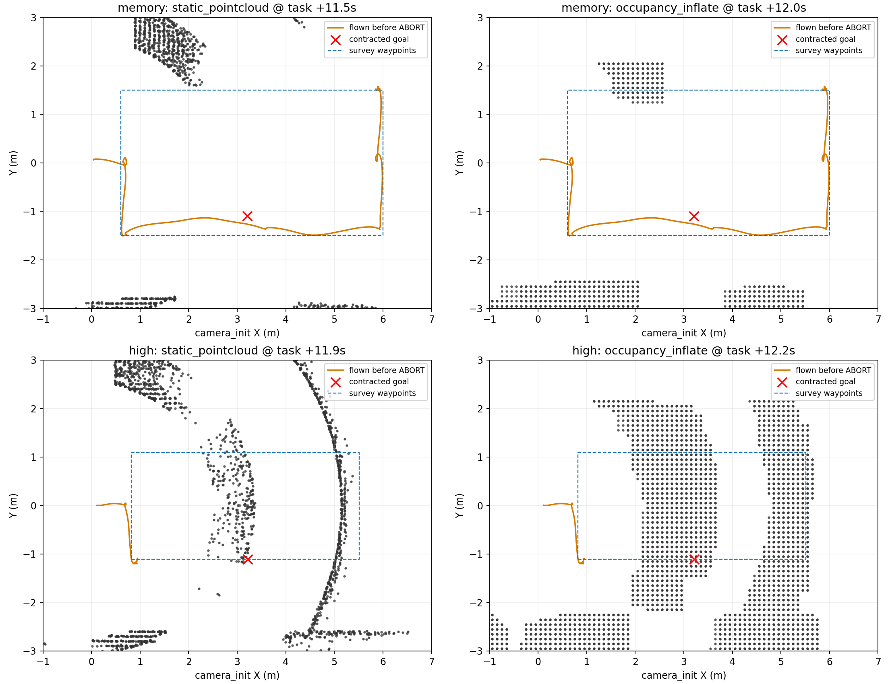
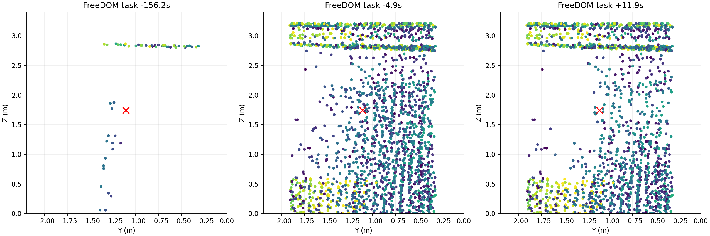
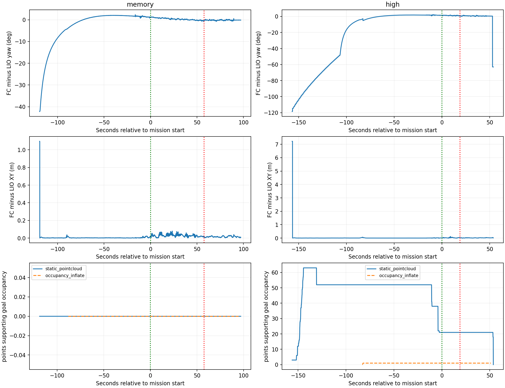

# 9月28日memory与high_view地图占据对比

结论：两轮不是同一份地图上单纯把航线内收。memory主要暴露巡航点压搜索边界；high_view则在启动早期已经产生会封住内收航点的FreeDOM历史结构。下游膨胀忠实保留了上游结构，并非再次开启障碍柱。

最有力的工作假设是：飞控与LIO启动坐标尚未收敛，FreeDOM已经使用飞控派生的mapping_imu写入地图，错位观测在收敛后没有被清干净。当前bag没有原始雷达或cloud_registered_body，不能彻底排除人员进入等真实瞬时物体，也不能逐个点恢复原始扫描来源。以下区分直接记录事实与推断。

## 数据与口径

- memory：board_memory_only_20260928_224603，完整原始分卷。
- high_view：board_high_view_20260928_230146，完整原始分卷。
- 仅离线读取，没有启动ROS回放发布、仿真或实机。
- 图中camera_init为任务坐标；Z为该坐标局部高度，2m飞控离地对应约1.74m局部Z。
- 两轮分别重启定位，不能假设环境地图逐点相同；小的起飞平移已按各轮ground_reference独立计算。
- 使用完整点云分析，图形仅按高度切片；不是之前视频内稀疏的2000点显示。

## 1. 两轮真正变化了什么

|项|memory|high_view|
|---|---|---|
|障碍柱|false|false|
|虚拟顶棚|-0.1，关闭|-0.1，关闭|
|地图尺寸/分辨率|16×6×3.8m / 0.1m|相同|
|水平/上/下膨胀|0.25/0.20/0.10m|相同|
|巡航速度/FC高位上限|0.5m/s / 2m|相同|
|横向巡航航点|±1.5m|±1.1m|
|远端航点|6.0m|5.5m|
|粗记忆高度许可|等效[2.0,2.0]m|[1.8,2.2]m|
|任务开始到ABORT|57.60秒|18.93秒|
|失败巡航指令|seq8，返回侧航点|seq4，第二个高位巡航点|

0.25m参数在0.1m体素中使用ceil(0.25/0.1)=3层，水平扩展索引实际为±3格，约0.3m，并按方盒填充；不是连续几何中的精确25cm球。两轮一致，不能解释为何只有后轮新增大片结构。

## 2. 地图对比

上图点云取任务约+12秒，橙线表示该轮完整ABORT前航迹，蓝虚线是任务引导点。红叉为各轮对应的内收航点(起飞参考前3.2m、右1.1m)。memory该处无对应点云，high_view出现横跨场地中部的条带和右侧弧形结构。

high_view的目标约(3.21473,-1.10994,1.74060)：

1. 上游FreeDOM首次记录可膨胀覆盖此目标的点，早在任务前156.21秒。
2. 任务期间支持该目标占据的21个点，在任务前136.12秒快照已全部存在。按坐标保留5位小数比较，这21个点一直留到停滞时；不是飞到近旁才临时生成。
3. 失败附近最近上游点距目标约10.6cm；因此即使不额外加大膨胀，也不是“下游凭空封住目标”。
4. 膨胀占据图首次输出时（任务前82.26秒）已含该目标体素。
5. 任务+10.85秒发seq4，随后报告in_map=1、inflated=1、0.15m邻域没有无碰撞替代点。约8秒无进展后结束整圈专项；未进入低位重访与投递。

注意：本分支SDFMap::publishMap()与publishMapInflate()都读取occupancy_buffer_inflate_。/sdf_map/occupancy不是独立的膨胀前证据，两者相似不能当两次独立验证。上游对照必须看/freedom/static_pointcloud，它仍是建图结果，而非雷达原始扫描。

## 3. 为什么怀疑初始化污染

localization.launch同步启动FAST-LIO、FreeDOM、位姿桥。FreeDOM使用sensor_tf_frame=mapping_imu；该frame由MAVROS位姿→vision_body→固定0.05m外参产生，而不是FAST-LIO发布的body。

启动期间map与camera_init为单位静态TF，但“静态TF相等”并不保证两个估计器的数值立即一致。high_view首段记录飞控与LIO航向最大差约118.5°，初始平移差达到数米；任务前130秒仍差约74.7°。memory初始航向差约42.2°，也有同类初始化隐患，只是该轮没有在本次内收目标处留下同样结构。

high_view中全部21个遗留点已出现时，航向仍显著不一致。任务前约82秒之后，按5°/0.2m诊断阈值看位姿已基本收敛；但地图中的21个点仍在。任务内航向差约0.47–1.73°，所以不能把这次停滞描述成“飞行过程中仍差118°”。

run_trial.py是在启动localization（含FreeDOM）以后才等待静止/航向/图像就绪；通过READY只说明当前输入稳定，并没有清理之前已写入的地图。由此形成：错误/过渡期变换→写入静态图→当前位姿收敛→旧点仍保留→任务启动后拒绝目标。

这条链有代码与时间记录共同支持，优先级高于单纯继续内收航点或缩小膨胀。不过无原始扫描，不能将所有点的实体来源确定为错位墙体，也不能排除初始化时人员停留。

## 4. 人走过去，离开后会不会仍被当障碍

会有这种可能；FreeDOM不是只看当前一帧。已写入静态图的点，不会因为“本帧没再看到”就自动删除。

当前配置counts_to_free=6、conservative_connectivity=26。代码需要射线穿过相应区域，累计足够的自由空间观测，并检查配置邻域的free_counter达到门槛，才将有关扫描部分标为动态、从静态输出中排除。它不是固定6秒，也不是任意6帧就清除。counts_to_revert=20用于反向恢复占据状态，不是旧点20秒过期。

如果人离开后那里没有被有效扫穿、受遮挡、视角或测距范围限制，残影就可能保留。本轮enable_local_map=false，静态输出也没有统一的时间到期删除；点云header每次发布时间更新，只能证明地图在发布，不能证明每一个点刚刚被看见。

定位错位造成的旧点更难处理：其坐标可能落在后续射线没有有效穿过的位置。因而“再等一下”不能保证恢复。下游SDF虽然每次重建局部膨胀缓存，但只要FreeDOM又发出这些旧点，缓存就会再次被填满。

## 5. memory为什么还能走多段，最后又失败

其若干高位航点恰好等于search_region的min/max边界。getInflateOccupancy先判断searchRegionDistance<=0，直接返回占据；这个人工边界不会作为点云发布。

因此memory日志中的goal_occ=1不一定对应实际点云。例如(3.50429,-1.49611)和(3.50429,1.50389)落在横向边界；飞到(6.00429,1.50389)附近，又可能令起点本身越边。日志确有自动把目标内移0.1m后搜索成功，也有初始拟合轨迹净空失败。它能飞过多个点，不代表旧航线所有点都合法或地图没有隐患。

high_view将航点收至±1.1m，此失败点距横向边界0.4m，已不是这一边界拒绝。然而它恰好落在该轮历史点云条带里。两种故障应分别处理。

## 6. 建议下一步（本轮仅分析，未改飞行代码）

1. 优先修建图初始化顺序：定位稳定之前不积分FreeDOM；或在未解锁、确认定位收敛后重建FreeDOM空地图并重新观测，再给任务READY。只重启规划器无法去除上游旧点。
2. 长期统一建图坐标来源：body点云优先用FAST-LIO同时间body变换建图；规划/视觉使用飞控位姿时保留明确的两估计器转换，不能只把一个frame名改掉就认为完成。先核对实机传感器点云frame及外参。
3. 航点与搜索允许区域共用边界，并为体素、跟踪误差、净空留出内侧余量，避免边界上直接发点。保留已做的内收思路，先解决污染后再判断航线。
4. 处理人员动态残影应验证射线清除与观测覆盖，不直接删除所有旧障碍或持续减小膨胀；否则静态树/墙也会失去保护。
5. 分清失败原因：点云占据、搜索边界、顶棚、地图外应分别记录。当前goal_occ日志不足以区分；另有8秒高位停滞窗口比12秒初次规划超时更早，以及ABORT后旧目标继续重试的交接问题，后续单独核查。
6. 下次地面验收：人员退出→定位收敛→干净地图；观察净空区域是否持续无假点；再做人员进入/离开后的清除验证。需要溯源时短时录cloud_registered_body或原始雷达，与TF同步；不要为此每轮都无限扩大录包。

证据产物：本机logs/site_download_20260928/cloud_diagnosis_20260929内保存完整逐时刻指标、选定点云快照、TF/位姿/规划事件及分析脚本。现有bag保留。图表为实录重建，未对飞行结果作成功替换。
