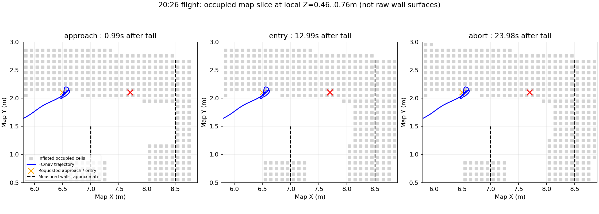

# 2026-10-07 20:23/20:26 实飞：对准耗时与入口停滞

## 结论及日志位置

20:26轮三槽执行事务均成功；前两槽主要慢在稳定视觉证据建立前。之后飞机停在走廊入口前点附近，入口内目标持续被规划地图判为占用，首条轨迹等待约12秒后触发ABORT。没有飞到配置的X=7.7m，也不是继续沿用此前X=8.0m配置。

两套板端完整运行目录已用rsync取回本地 `试飞产物/`，原始bag保留且能离线解析：

| 运行目录 | bag字节数 | 任务结果 |
|---|---:|---|
| board_full_mission_20261007_202344 | 187,983,299 | 搜索目标占用，0投递；没有进入对准阶段 |
| board_full_mission_20261007_202629 | 308,159,886 | 3槽COMMITTED；入口规划失败后接管，H未完成 |

绝对本地根目录：`/home/xhj/liftrace-worktrees/r2026-board-vision-tests/试飞产物/`。每轮含`flight_debug_0.bag`、application.log、生成配置、地面参考、视觉事件及结果。分析分别在20:26轮`analysis_alignment/`、`analysis_corridor/`。本轮只读现场状态、下载及离线分析，没有修改飞行参数、重启节点或驱动执行机构。软件成功回执不代表载荷落点已被测量。

## 对准为何慢

依据完整bag的消息源时间戳拆分；表中下降是稳定承诺建立到首次许可的等待，舵机是实际调用开始到成功回执。

| 槽位/任务目标 | ALIGN至稳定证据 | 稳定证据至许可 | 许可至调用 | 舵机调用至ACK | APPROACH至ACK |
|---|---:|---:|---:|---:|---:|
| 1 / bridge | 22.605s | 4.797s | 0.108s | 1.030s | 29.507s |
| 2 / red_cross | 10.957s | 5.204s | 0.057s | 1.005s | 18.171s |
| 3 / panzer | 2.242s | 5.359s | 0.086s | 1.032s | 9.810s |

前两槽没有在等一个20秒冷却，也没有发现舵机调用拖了十几秒。首次视觉承诺建立前许可原因是`no_release_commitment`；建立后变成`release_altitude_invalid`，下降到实际释放高度窗口后由`permission_granted_from_commitment`放行。ACK后另有约1.5～1.9s投后恢复，不能混入舵机执行耗时。

实际运行的视觉要求为偏差不超过30px、5次稳定计数、观测最大年龄0.5s。ALIGN至首次稳定证据期间：

| 观测 | bridge | red_cross | panzer |
|---|---:|---:|---:|
| 偏差超限拒绝消息 | 141 | 54 | 8 |
| 几何过期拒绝消息 | 30 | 19 | 0 |
| 非零稳定计数因偏差超限清零 | 6次 | 2次 | 0次 |
| 非零稳定计数因几何过期清零 | 3次 | 8次 | 0次 |
| 曝光至有效offset接收年龄，中位/P95 | 0.348/0.433s | 0.344/0.432s | 0.328/0.383s |
| 导航位置X/Y峰峰值 | 19.8/16.7cm | 16.1/16.0cm | 10.2/6.2cm |
| 有效类别靶心地图X/Y峰峰值 | 4.1/5.6cm | 2.9/3.3cm | 1.5/1.9cm |

这些拒绝次数是消息数，不等于独立图像数或各原因独占耗时。数据支持：机体反复修正、越过目标后返回，偏差不能连续留在门限内；较长图像链路延迟和间歇过期进一步打断计数。bridge在20:28:06、09、15附近的实际XY分别约(2.661,-1.232)、(2.572,-1.085)、(2.756,-1.189)，对应设定点始终在(2.63～2.65,-1.10～-1.12)附近。

red_cross最近几何观测年龄曾达到约0.547s，生产watchdog按0.5s清零；bridge也出现约0.508s。前两槽RKNN处理P95约161/156ms，比完整offset年龄P95约433/432ms短，不能只归因NPU推理。当前本地兼容像素投影仍把曝光时刻高度与当前yaw/位置组合使用，这是与延迟有关的优先验证点；尚不能独占归因于某个增益、PX4参数或外参，也没有把本地源码阅读当作板端二进制逐行一致性证明。

19:32轮同三类的ALIGN至稳定证据分别约3.79、4.32、5.47s，前两类本轮多约18.8、6.6s，第三类反而更快。两轮初始姿态/位置不同，且旧轮端点取自JSONL回调时间，只作阶段参考，不是严格A/B。

下降等待约5s在旧轮也存在。本轮地面局部Z=-0.289064m，下降目标Z=0.160936m，即FC AGL0.45m；许可Z窗口[0.080936,0.280936]，首次许可时实际Z约0.275～0.277，即AGL约0.564～0.566m。不能把“设定0.45m”写成每次恰在真实0.45m释放。

## 入口异常的实际过程

本轮运行设置明确是：入口前(6.5,2.1,AGL0.9)，入口内(7.7,2.1,AGL0.9)，H=(7.7,-3.45)，运动优化开启；搜索2.0m、上限2.3m，走廊上限1.0m。起飞局部XY=(0.001953,0.002453)，故实际发布目标有这毫米级平移。

| ROS时间 | 事件 |
|---|---|
| 1791376157.801 | 三投恢复后开始尾程，前往入口前点 |
| 1791376157.823 | 入口前目标被规划器从Y=2.102调整到2.002，生成轨迹 |
| 1791376169.858 | 第一段完成，发布入口内目标(7.701953,2.102453,0.610936) |
| 1791376169.886 | 首次搜索拒绝：start_occ=1、goal_occ=1、candidates=0 |
| 之后约12s | 目标持续goal_occ=1，起点占用在0/1间变化，未生成入内轨迹 |
| 1791376181.872 | Bridge终态：initial_plan_timeout，retryable=true |
| 1791376181.899 | Manager发ABORT，reason=return_home_failed |
| 1791376192.056 | 飞手切POSCTL，随后解除解锁、MANUAL |

自动阶段FC最大局部X=6.62684m（相对起飞6.62488m），LIO最大X约6.63099m；控制命令最大X约6.52446m。轨迹停留在入口前点附近，不能把本轮描述成“又前飞到8m撞外墙”。19:32那轮确实到约8.05m，其历史复盘另见[CORRIDOR_REVIEW.md](CORRIDOR_REVIEW.md)。

图为局部Z=0.46～0.76m的膨胀占用切片，灰点不是原始墙面，黑虚线仅为用户实测墙位近似。三次地图快照中Y约2.05以上有持续占用带，入口目标Y=2.102落在其中。规划`goal_occ=1`直接确认目标被占用；切片图用于展示周围分布，不能用切片点距替代连续净空检验。

本轮地图分辨率0.1m、水平膨胀配置0.25m，源码按ceil(0.25/0.1)量化为3格，即各轴填充约0.3m，不能按连续半径0.25m圆形理解。另启用了障碍向上延长柱。搜索允许范围Y上界2.702，不是2.0；地图尺寸18×12×4m，虚拟天花板关闭。因此入口Y=2.1并没有超出配置边界，但在实际发布的占用数组中受阻。

本bag只有膨胀占用图，没有对应原始点云或实体/虚拟来源分层。尚不能区分这条带的具体实体、地图偏移、普通膨胀与虚拟柱贡献；更不能据此证明真实撞墙。地图给出的可用入口位置与现场填写的入口线不一致，是当前必须核对的事项。

入口失败窗口LIO共150条，曝光/源时间至bag接收年龄中位22.3ms、P95 35.5ms、最大45.4ms，最大接收间隔128ms。规划日志是起终点占用前置拒绝，候选数0、搜索预算未超时；本轮没有证据支持通过延长搜索预算或放宽LIO过期门槛解决。

## 建议的处理顺序

1. 对准：先用已取回bag比对曝光时刻完整姿态投影、兼容像素换算、实际设定点和机体响应；定位0.35～0.43s图像链路延迟及几何更新断点，再决定调整控制或处理链。保留下降后锁定目标及现有许可边界，不先压缩约1s的真实舵机动作。
2. 入口：在地面把实测开口及点云投到同一任务坐标系，核对Y=2.1是否处于有效净空中。必要时短时记录入口ROI原始点云与膨胀图；确认来源后再改引导点或地图策略。不要仅把目标换到地图空格而忽略真实墙，也不直接清障碍或减小保护膨胀。
3. 当前失败已有明确地图拒绝原因；即使增加12s等待，持续占用也不会自动消失。该轮三投执行成功不等于走廊/H整场闭环通过。

本次没有运行仿真、修改飞行控制或重新部署。
