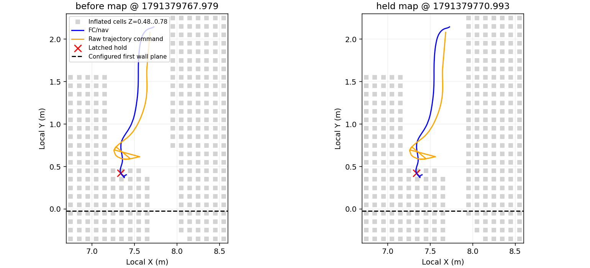

# 2026-10-07 21:24整场：第一扇门前保持与重规划失败

## 结论

本轮不是任务ABORT：bag没有ABORT指令或动作截止终态，收尾仍是`POST_DELIVERY_ROUTE / RETURN_HOME / decision_pending`，`mission_failed=false`。三槽COMMITTED。第一门前轨迹跟踪误差触发保持，随后实际起点位于占用区，规划一直无法恢复；飞手在期限到达之前接管落地。

最新完整目录`试飞产物/board_full_mission_20261007_212458/`已拉回42个文件，bag为346,948,778字节，可离线解析。原始诊断、进度消息、地图切片和跟踪数据在该目录`analysis_first_door/`。本次未改参数或代码、未重启节点、未驱动设备。

## 新参数是否生效

运行配置确认：搜索FC AGL2.0m、投递目标0.35m、H观察1.2m、运动单段60秒。第3段决策源时间1791379765.196，deadline=1791379825.196，确实给了60秒。飞手切POSCTL在1791379789.674，距期限尚约35.52秒。不能归因于之前的30秒预算漏更新。

## 触发过程

| ROS时间 | 事件 |
|---|---|
| 1791379765.196 | 入口内航点完成，开始向H的合并走廊段 |
| 1791379769.274 | 切DOOR慢档，前视0.5→0.15m |
| 1791379770.520 | 轨迹服务器找不到前视点，`no_lookahead`；三维误差约0.193m |
| 1791379770.591 | 误差0.20213m，触发`tracking_hold`，锁定当前点 |
| 1791379770.921 | 规划器收到持续保持，`server_tracking_hold_replan` |
| 1791379770.922 | 首次重规划失败：start_occ=1、goal_occ=0，accepted=0 |
| 之后 | 反复尝试规划仍失败，保持点未被新轨迹接管 |
| 1791379789.674 | 飞手切POSCTL |
| 1791379794.677 | POSCTL、未解锁；任务随落地收尾 |

保持位置局部XYZ=(7.34019,0.42447,0.64595)，本轮起飞参考=(-0.016997,-0.020305,-0.034035)，地面Z=-0.254035。因此相对起飞XY约(7.357,0.445)，FC AGL约0.900m，仍在配置第一门墙Y=0前约45cm。

触发保持时，轨迹原指令=(7.37980,0.58728,0.53289)。它相对实际位置的水平误差约16.75cm、竖向差约11.31cm，合成三维误差20.21cm。轨迹服务器生产条件是`tracking_error > target_dist + 0.05`；门区target_dist=0.15，故当时阈值为0.20m。这里是轨迹跟踪保持，不是走廊高度超过1.0m的保护。

原轨迹在门前存在横向/高度变化；机体沿-Y继续移动时，轨迹投影进度停留在约11.5s处，原目标Y仍约0.587，实际Y已到0.424。两者偏离触发保持。不能只把这写成“路径一直笔直，而飞机突然自己停止”。

随后重规划从实际位置出发，起点被膨胀占用图判为占用。首轮普通搜索40候选、0接受；放宽初始搜索尝试2187候选、0接受，主要为碰撞检查与closed集合排除；`timed_out=0`。目标H当时`goal_occ=0`。这是与上一轮“H低位目标占用”不同的失败位置。

图示Z=0.48～0.78m切片投影到XY，灰点是膨胀占用，不是原始实体墙；橙线为逐时原始指令，不是完整B样条。保持点附近的占用在保持前约2.6秒和保持后都存在，不能认为仅因最后一帧点云突然长出障碍。图中黑线为配置门墙平面，并非测量出的门洞开口。

由于只录了膨胀图，尚不能区分实体、膨胀和虚拟延长柱的具体贡献，也不能据此断言物理碰撞。规划器起点占用的日志比切片点距更直接；切片不能代替整条三维轨迹净空检查。

## 定位/时限边界

门前窗口LIO源时间至bag接收年龄中位21.8ms、P95 32.4ms、最大40.8ms；首次tracking_hold时里程计年龄约31ms。没有本次由LIO过期触发停飞的证据。规划器在接管之后继续打印失败，不应把这些后续位置变化当作自动飞行的轨迹。

## 下一步建议

优先核对第一门实际净空与当前轨迹：为何门前出现横向/高度弯折，机体偏离后能否在更早阶段重规划到可行路径。当前链条的直接缺口是“保持后从占用起点不能恢复”，并非再增大单段预算即可解决。

不建议仅取消20cm跟踪保持或清空身边障碍。本次证据支持检查门区前视切换、轨迹投影/跟踪及起点恢复的衔接；恢复若要放宽虚拟区域，须先区分实体占用并验证整段退出轨迹。此轮只诊断，未实施恢复补丁。
