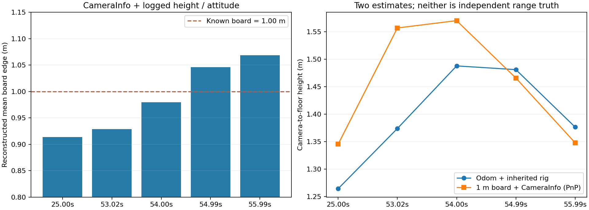
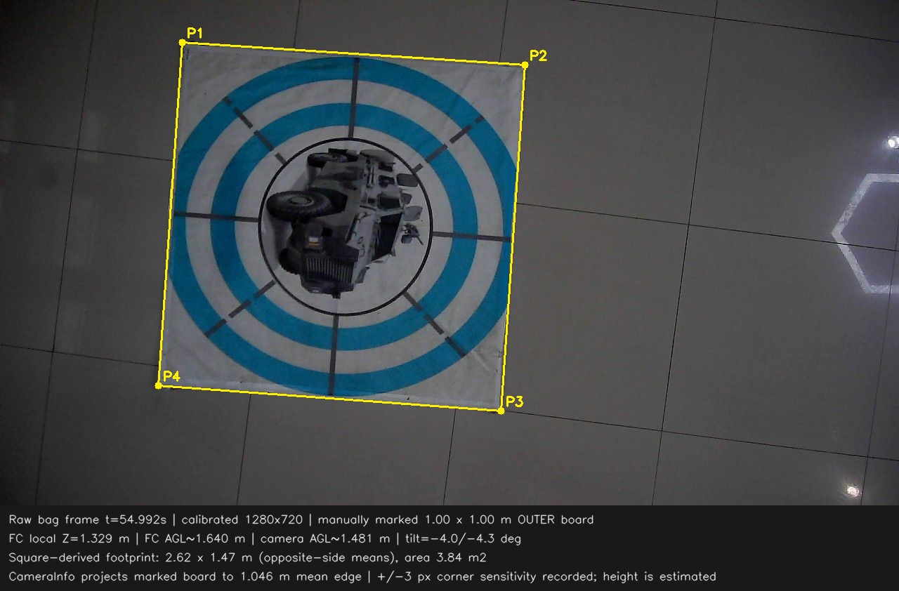

# 1×1m实物靶板与bag视场核对（2026-09-26）

**bag内参与此前计算使用的内参一致；实物尺度核对大体同量级，但5帧不足以确认精确一致。** 部分时刻符合，部分相差明显，不能挑符合的一帧宣布验证通过，也不能据此直接改焦距。

## 数据与方法

- 使用9月25日18:20:20那份最简投递测试bag。1280×720原始压缩图，不测视频播放器缩放后的截图，不用YOLO包围框。
- 用户给定外层标准靶板1×1m。24.996s为红十字下面的标准板；53–56s为装甲车标准板。人工标四个外角，贴在中间的红十字小纸张不是1m标尺。每帧四角坐标保存在result.json，假设靶板平放且实际边长1m。
- CameraInfo为fx=725.351、fy=723.340，主点(631.672,397.566)，畸变plumb_bob；3113条中未发现内参/分辨率变化。以记录畸变做去畸变，再用四角到1m方板的平面单应性反推整幅图地面四边形。
- 图像时间戳匹配MAVROS odom，位置插值、姿态Slerp。邻近位姿样本差约13–17ms。相机相对FC下方16cm，使用当前机体姿态旋转该偏移。
- 前5秒FC静置local Z中位-0.091m。按既有FC静置离地22cm，地面Z估计-0.311m；相机离地高度=FC local Z−地面Z−安装偏移的垂直分量。**这是估计，不是测距仪真值。**
- 同时用记录内参、姿态、估计高度将靶板四角投到地面，检查是否还原成1m边长。

## 五帧结果

“宽×高”是透视地面四边形两组对边的平均长度，不假定倾斜后的视场仍是正矩形。“面积”由四角多边形计算。

| 图像相对时间s | FC local Z m | 相机离地估计m | 1m标尺反推视场m | 面积m² | K+高度重建靶板平均边长m |
|---|---:|---:|---|---:|---:|
| 24.996 | 1.113 | 1.265 | 2.409×1.351 | 3.253 | 0.914 |
| 53.019 | 1.222 | 1.374 | 2.728×1.545 | 4.214 | 0.929 |
| 53.997 | 1.336 | 1.488 | 2.786×1.568 | 4.367 | 0.980 |
| 54.992 | 1.329 | 1.481 | 2.616×1.466 | 3.835 | 1.046 |
| 55.985 | 1.225 | 1.377 | 2.367×1.343 | 3.178 | 1.068 |

按1m已知尺度，最后一列应接近1.000。本次约0.914–1.068，存在−8.6%到+6.8%的边长差；不能称精准吻合。标点±3px的重算只产生约1%–2%面积波动，不能单独解释全部差异。

其他原图标点：[25秒](measure_25.jpg)、[53秒](measure_53.jpg)、[54秒](measure_54.jpg)、[56秒](measure_56.jpg)。[完整数值](result.json)。

## 与原先2.6m计算的关系

原先FC AGL2.6m减去16cm得到相机2.44m，理想水平视场约4.31×2.42m，面积约10.43m²。按本次bag精确K重算为 **4.306×2.429m，10.458m²**，差别不足0.5%，并没有发现换成另一种焦距或另一档分辨率。

以每帧估计高度，将标尺反推视场等比例换算到相机2.44m、保留该帧倾斜时，面积范围约9.98–13.29m²；55秒约10.41m²很接近原算值，53秒却约13.29m²。**这只是低空数据外推，bag没有2.6m高位搜索实测，不能当成高空覆盖验证。**

因此，暂时保留此前已标定内参和理想覆盖计算作为名义设计值，但不能把96.7%等理想覆盖率升级为实飞保证；本次也没有修改FOV/飞行高度配置。

## 不一致可能来自哪里

1. 降落识别段反复升降，不是稳定悬停标定片段。以已记录K和1m板做平面PnP，53秒推算相机距板约1.557m，odom与结构值估计1.374m；56秒则约1.348m对1.377m。差异随时间变化，单个固定焦距或固定Z偏移都不能解释所有帧。
2. bag中图像与odom“发布到记录”的延迟分别约17ms和22ms中位，未看到几秒的ROS时间轴偏移；但camera_sdk是在cap.read后打当前ROS时间，**不是相机曝光硬件时间**。设备缓存/采集延迟、飞控融合测高响应仍可能导致动态尺度错配，当前数据不能认定哪一个为主因。
3. 22cm静置离地、16cm相机下移、板是否严格1m/平整、机体姿态与实际相机倾角都不是本次独立标定值。外框毛边和几像素标点误差有影响，但不足以解释全部波动。
4. 不能直接拿FC local Z当相机AGL。该bag起始零点偏−9.1cm；照搬ground_z=−0.22而不重新测地面，会与静置参考法差9.1cm，影响投影尺度。四套新配置的自动地面基准正是避免此类固定零点差；不反向声称当前bag当时已这样运行。

本轮只做离线核对。下一次尺度确认最省事的做法是飞机静置/稳定悬停、1m靶完整入镜，尺量镜头到靶平面的高度，多取几秒平稳帧；先区分高度/时间同步和内参问题，再决定是否重标定。不用这5帧重新拟合一个焦距补偿其他误差。

## 复现

extract_measurements.py用ROS Python只读bag，输出5张原图/CameraInfo/时间戳位姿到logs；measure_fov.py用rl_drone计算与标图。手工外角只对应这一份bag，不宜直接套到其他bag。

    source /opt/ros/noetic/setup.bash
    /usr/bin/python3 docs/deployment/flight_fov_20260926/extract_measurements.py <bag路径> --out logs/flight_fov_20260926
    source /home/xhj/miniconda3/etc/profile.d/conda.sh
    conda activate rl_drone
    python docs/deployment/flight_fov_20260926/measure_fov.py

图表以记录数据为输入，不启动ROS节点、Gazebo或推理重跑。
