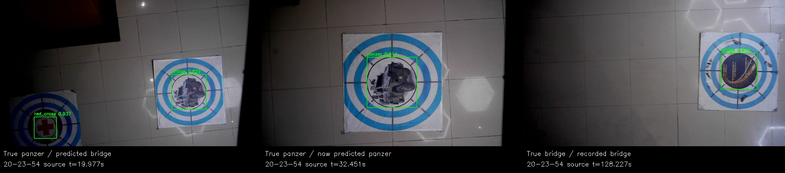
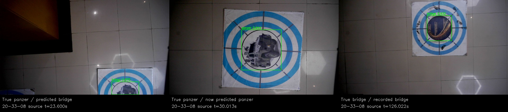
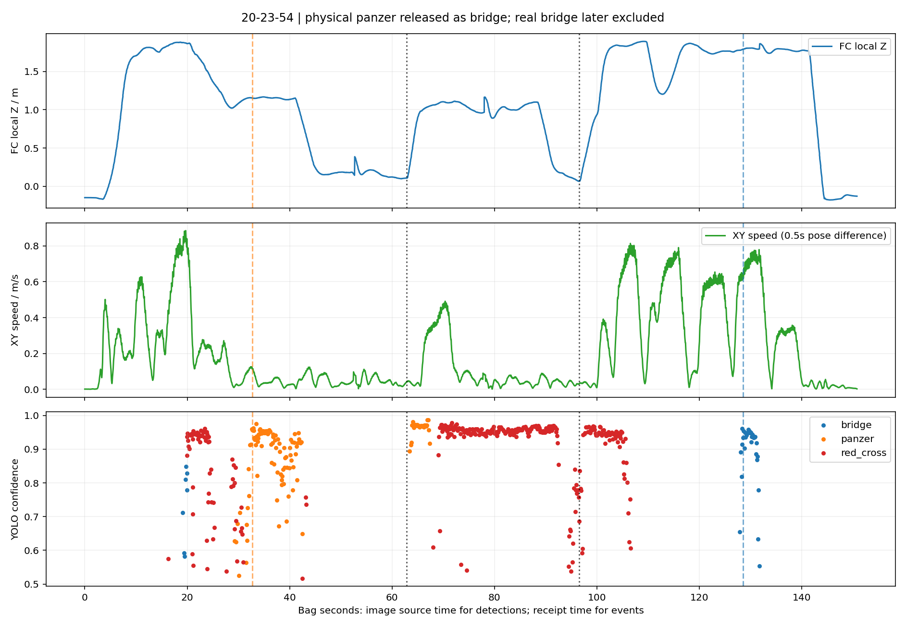
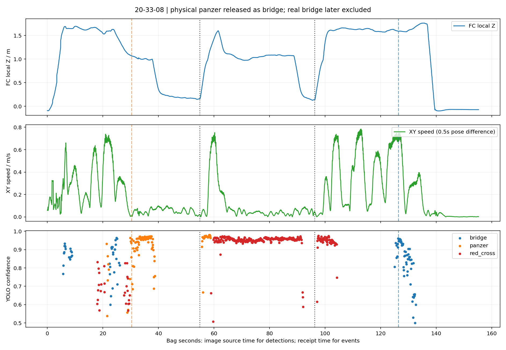
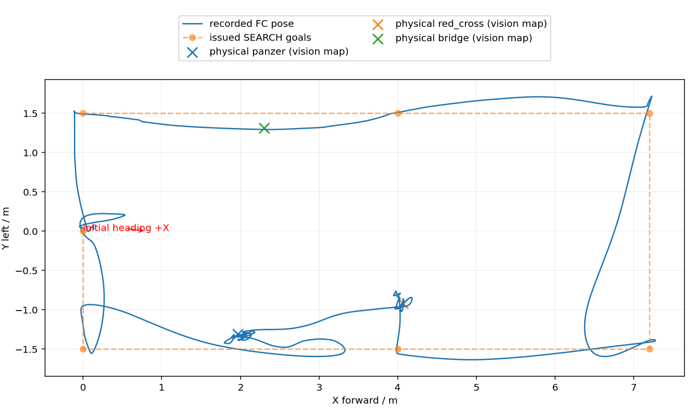
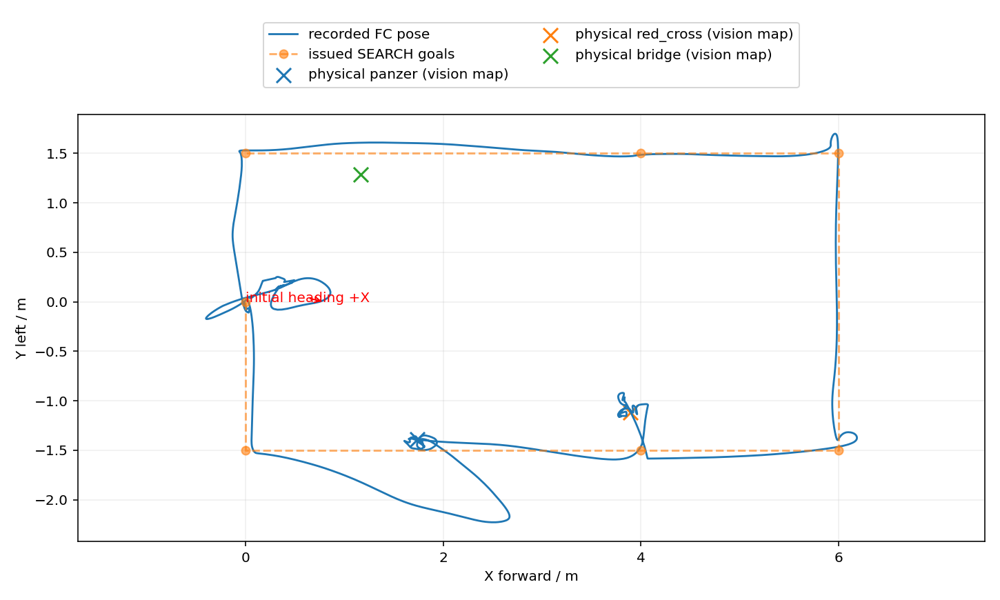

# 两轮高位巡航中断实飞：真实桥梁为何未投

2026-09-28复盘；输入为9月27日20:23:54与20:33:08两份bag。 [双轮回放](index.html) · [最新高位策略评估](LATEST_STRATEGY.md) · [逐项指标](metrics.json) · [组件复核](component_probes.json)

## 结论

**两轮不是桥梁没有检出，而是第一处真实装甲车先被识别为bridge，按bridge启动并完成了第一投；下降后视觉已纠正成panzer，任务事务却仍冻结为bridge。之后真桥梁已CONFIRMED且被视觉selected，但任务层认为bridge已投过，跳过了它。**

物理装甲车/红十字投成依据现场反馈与相机所见；bag的ACK仅证明执行服务响应，不额外证明包裹脱离或落点精度。

这解释了现场看到“装甲车＋红十字投成，桥梁不投”与bag却写“bridge＋red_cross成功”的差异。物理图案和事务类别必须分别统计，不能仅凭release_result.class宣称本轮投过真实桥梁。

完整因果链：

```text
真实装甲车 → 高位误报bridge → 候选ID1确认 → APPROACH冻结bridge
    ↓ 下降并看清图案
同一ID1变为panzer → 对准仍可借circle几何 → 释放ACK仍标bridge
    ↓
任务记账delivered_classes包含bridge
    ↓
后段真桥梁ID5已确认、selected → 排序过滤“bridge已投” → 两投后返航
```

本轮为只读bag分析、原输出回放和当前纯Python组件复核；未修改飞行/视觉算法、权重、阈值，未启动ROS仿真或实机。没有以离线组件结果宣称新策略已完成三投。

## 1. 数据、当前远端与历史运行身份

| 项目 | 20:23:54 | 20:33:08 |
|---|---:|---:|
| bag时长 | 150.791s | 155.254s |
| 相机原图 | 4318张 | 4534张 |
| 记录的搜索local Z | 1.8m | 1.6m |
| 搜索航点最大X | 7.2m | 6.0m |
| 原YOLO消息 | 1206 | 1216 |
| panzer / bridge类别框 | 129 / 38 | 104 / 97 |
| red_cross类别框（只计YOLO） | 337 | 326 |
| 检测源年龄P50 / P95 | 0.311 / 0.429s | 0.321 / 0.438s |
| 任务两次ACK标签 | bridge、red_cross | bridge、red_cross |
| 实际图案对应 | panzer、red_cross | panzer、red_cross |
| 最终槽位 | COMMITTED / COMMITTED / FREE | 同左 |

两包均为35个话题；第二包有1个原始tank框（研究版已过滤tank，此处说明现场并非全量最新版）。原bag合计约1.05GB，没有重复拷贝。

本次fetch发现导航仓`板载代码`已从上轮检查的48541a7更新至 **d1fe025a8fb48d33e6db89b287053daa9c036bfb**，提交时间20:47，晚于这两轮。中间含982f579圆环半径优选、08e0a98红十字像素比例按高度换算；最新还包括释放高度、槽位偏移、local1.6路线和关闭障碍柱等参数变化。**最新远端源码用于解释当前设计，不能当作两轮实际部署HEAD；bag没有完整参数/权重/部署版本快照。** 20:33记录的7点、local1.6路线与最新配置相符，也不足以证明二进制相同。

现场仍是`high_view_priority_search.launch → minimal_delivery_test.launch`的沿途普通中断链，没有研究版先搜后访阶段日志。不要把“高位航点”与`uav_high_view`粗线索记忆策略混称。最新远端入口见[固定提交源码](https://github.com/sakelier/liftrace-controlwork/blob/d1fe025a8fb48d33e6db89b287053daa9c036bfb/patrol_uav_ws-patrol_planner/src/uav_mission/launch/high_view_priority_search.launch)。

## 2. 两轮关键时序

时间为相对bag起点的接收时间；图上的检测为图像源时间。首SEARCH均为录包前已发布的latched指令，第二包一开始就为OFFBOARD且IN_AIR，不能把bag时长当完整起飞后完赛时间。

| 事件 | 20:23:54 / s | 20:33:08 / s |
|---|---:|---:|
| ID1以bridge正式确认 | 20.116 | 23.447 |
| APPROACH bridge冻结事务 | 20.233 | 23.628 |
| 第一处接近到达 | 28.601 | 29.268 |
| 开始drop_circle对准 | 30.540 | 30.093 |
| 同一ID1首次成为合格panzer | 32.682 | 30.262 |
| 对准承诺成立（circle几何） | 40.910 | 37.543 |
| 第一槽ACK，仍记bridge | 62.819 | 54.858 |
| 红十字APPROACH | 65.448 | 61.270 |
| 第二槽red_cross ACK | 96.517 | 96.182 |
| 真桥梁ID5正式确认并selected | 128.552 | 126.383 |
| 因候选不足返航 | 133.882 | 129.069 |
| LAND指令 | 140.125 | 135.445 |
| POSCTL | 141.370 | 136.980 |
| ON_GROUND | 147.332 | 141.076 |

第一包从IN_AIR到ON_GROUND约145.19s。第二包录制开始已IN_AIR，录到在空约141.08s，完整在空时长未知；两包都不能当作三投/走廊/H全流程成绩。没有AUTO.LAND；POSCTL后的现场接管细节未知，不在此推定是谁触发模式切换。

两次第一投在释放前分别有**30.14s和24.60s**已经能读到“ID1=panzer”，但最终事务标签不变。不是“纠正得太晚、已经来不及反馈”；类别变化没有接入当前事务的语义复核。

## 3. 原图显示的身份变化

### 20:23:54



最左为真实装甲车，错误bridge框0.829；中图已正确panzer0.914；右图是真桥梁bridge0.819。第一处已有效投影的错误bridge最高0.849。ID1的最后有效地图位置约(1.97,-1.31)，后段真桥梁约(2.30,1.31)，显然是两处不同靶标。

### 20:33:08



第二轮同样发生；有效投影的错误bridge置信度最高**0.915**，不是只有低分模糊框。真panzer位置约(1.74,-1.39)，真bridge约(1.17,1.28)。这些位置来自机载投影的中位，非外部测量真值。

与上一轮19:41“panzer仅两框、一合格观察”不同，此次下降后panzer大量稳定检出。泛化弱点仍存在，但主故障已从“观察稀疏”变成**高位误分类触发事务后，低位类别纠正未反馈到任务记账**。降低或提高一个固定置信度门槛都不能独自修复：错误bridge已经达到0.915。

原图有阴影/反光/目标旋转及尺度变化。下降后分类改善支持“视角、尺度和清晰度有关”，不能据此单独证明光照是唯一原因；本轮没有再次训练或用Gamma覆盖原记录。圆环验证证明圆心几何可用，不能证明环内图案一定是bridge。

## 4. 真桥梁不是在视觉链中失败

| 检查 | 第一轮 | 第二轮 |
|---|---:|---:|
| 真bridge ID5最高连续观察数 | 21 | 42 |
| 返航前按当前研究准入检查合格的候选消息 | 19 | 22 |
| 返航前合格窗口 | 128.552–131.649s | 126.383–129.039s |
| 真bridge的selected消息（全包） | 19 | 40 |
| 真bridge APPROACH | 0 | 0 |

上述合格检查调用当前`validate_candidate`，使用实际源时间、接收时间、frame、map_valid、association_valid、state及min_streak=3；未把历史缓存补成新帧。说明它当时已有足够候选支持，不能再诊断成“圆环没有同时检出”“坐标不准”或“还需要放宽确认间隔”。

在同一ID1从bridge变成panzer时，视觉记忆完成了空间关联与类别切换；并非全程生成两个无关物理ID。任务侧另有冻结的`reserved_snapshot`，它仍是bridge，后续候选更新只改活动snapshot。按bridge收到ACK后把bridge加入`delivered_classes`，最后从排序入口排除所有bridge。

对应代码：[CandidateQueue ingest/reserve/commit/ranked](../../../patrol_uav_ws-patrol_planner/src/uav_mission/src/uav_mission/mission_core.py)。这套冻结设计保证槽位与执行事务不被异步目标切换偷换，设计本身有必要；缺的是**分类确有变化时，释放前暂停并重新核实的明确分支**，不是简单删掉冻结或关闭已投去重。

circle辅助ID0在承诺中出现是既有标准靶几何对准设计。两个投递类共用圆环精修，因此稳定圆心能让事务通过，并不自动重验冻结的bridge语义。不要把“目标ID1变panzer”与“circle辅助ID0参与对准”混为同一个问题。

## 5. 高度、速度和耗时




高度图标的是FC local Z，速度由0.5s位置差分得到。第一包起点静置未解锁Z约−0.147m，第二包开头已解锁且IN_AIR，**不能沿用“bag前1s必是地面”估算第二包AGL**。记录视觉投影平面Z=−0.22不是独立离地测距；本报告主对比只采用确定的local高度，第一包按已知站立FC高0.22m得到的AGL估计也单列在JSON，不把它当标定值。

第二轮不只是换靶位置，还把搜索local Z由1.8改1.6、X端点由7.2缩6.0。不得将时长变化全部归因某一种视觉改进。两轮第一处对准/下降持续期间稳定panzer已经存在，首投耗时很长不是桥梁缺少观察造成。

第一投APPROACH→恢复约45.18/33.80s；红十字约34.51/37.76s。承诺→ACK约21.91/17.31s（第一投）、20.62/18.30s（红十字），混合了下降、许可等待和执行服务响应，不能直接称为舵机机械运动时间。ACK时local Z分别约0.108/0.067m、0.160/0.135m；最新20:47释放高度改动晚于两轮，不能用其代码倒推这两轮都已采用新配置。




## 6. 最新研究版能否应对

**能提供正确的处理位置，但目前不能保证自动解决；尤其不能宣称“已有低位对准，所以高位类别怎么错都没事”。**

- 高位粗线索不立即消耗槽位；同一类两个位置、同位置两个类的冲突可保留到低空判别。
- `REACQUIRE`使用新的正式候选，已实现把访问点的错误bridge标签换成真实panzer，同时保留另一处bridge。
- 用本包两处记录坐标与低位panzer正式候选调用当前`NavigationMemory`，两轮均可得到独立panzer和bridge；仅输入两处bridge粗假设时会标记冲突，而不是静默任选一个。
- 但一旦进入投递事务，当前研究版`CandidateQueue`仍有同样的冻结类别路径。实录快照复核两轮都得到`current=panzer、reserved=bridge`；提交bridge ACK后，真bridge通过候选校验仍不进入排序。清空队列作对照，它立即具备排序资格。**这是现存组件缺口的可复现证据，不是已修复声明。**

详细门槛、反事实限制、最小修复建议和验收用例见[LATEST_STRATEGY.md](LATEST_STRATEGY.md)。本次包不是2.6m研究策略采集：实际影像尺度、路线、中途下降均不同，无法离线宣称切换后必然三投或节时多少。

## 7. 回放、复现和存储

每轮四份完整视频：相机原片、记录视觉叠加、航迹动画、多画面汇报。第一轮150.8s/1508帧，第二轮155.3s/1553帧，均10fps、1×，FFmpeg完整解码及长度检查通过。章节播放器把“物理panzer / 事务bridge”分开标注，检测叠加保持原消息，没有把错误标签在视频里悄悄改成正确标签。

- [第一轮视频校验](20-23-54/video_validation.json) · [阶段CSV](20-23-54/phases.csv) · [身份快照](20-23-54/identity_snapshots.json)
- [第二轮视频校验](20-33-08/video_validation.json) · [阶段CSV](20-33-08/phases.csv) · [身份快照](20-33-08/identity_snapshots.json)
- [来源清单](sources.json) · [指标](metrics.json) · [当前组件复核结果](component_probes.json) · [最终检查](validation.json)

```bash
# 在WSL内；ROOT、RESEARCH使用自己的实际checkout。
ROOT=/home/xhj/liftrace-worktrees/r2026-board-vision-tests
RESEARCH=/home/xhj/liftrace-worktrees/r2026-high-view-search
for TAG in 20-23-54 20-33-08; do
  BAG="$ROOT/试飞产物/flight_debug_2026-09-27-${TAG}_0.bag"
  OUT="$ROOT/logs/flight_pair_20260928/$TAG"
  bash "$ROOT/tools/bag_replay/run.sh" "$BAG" "$OUT/replay" --fps 10 --frame map --keep-frames
  source /opt/ros/noetic/setup.bash
  /usr/bin/python3 "$ROOT/docs/deployment/flight_review_20260926/extract_supplement.py" "$BAG" "$OUT/supplement.json"
done
source /home/xhj/miniconda3/etc/profile.d/conda.sh
conda activate rl_drone
python "$ROOT/docs/deployment/flight_pair_20260928/analyze_pair.py"   --base "$ROOT/logs/flight_pair_20260928"   --report "$ROOT/docs/deployment/flight_pair_20260928" --research "$RESEARCH"
```

原bag、完整JSON、逐帧相机与视频留本地logs/原目录，不入Git；本轮暂保留导出图像便于panzer/bridge难例标注。已检查空间，未删除原bag或历史资产。共享toolkit和在线代码均未修改。
