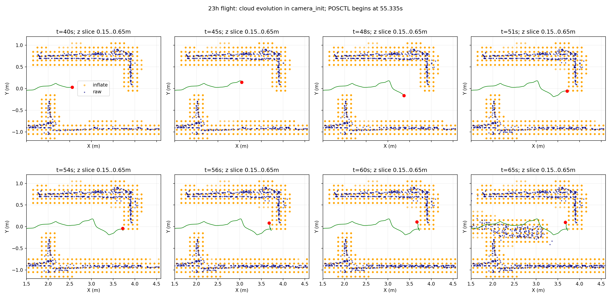

# 2026-09-21 前四轮改动复查与实飞走廊停滞分析

## 结论

现场追加确认：本轮没有碰撞。下面的门区点云距离仅用于几何检查，不作为接触或物理卡住的解释。

23点一楼实飞不是“第二门目标占据导致无首轨迹”：最后一段4.2m目标在约30ms内已有轨迹，接管前规划命令仍向前且速度非零；当前资料不能确认是轨迹服务器保持锁，也不能断言FreeDOM幽灵障碍。现场源码仍使用旧的1秒时间投影窗，缺少新弧长投影、MotionWatchdog及SERVER保持反馈。其Bspline消息也不含新goal_stamp/goal_frame字段。因此不能把晚于补丁提交的试飞时间当成已部署补丁的证据。

审查当前补丁另外发现并修复四项：首条目标序号0被保持监控误拒；保持恢复通知在新鲜度短暂失效时可能被永久消费；同一任务重复发布绕过首轨迹超时检查；A*静态搜索读取未初始化的节点时间。修改同步到现有导航、研究和板端分支，未开启仿真或实机，未新建分支。

## 1. 本轮审查范围

本地没有发现比前次交接更新的额外四轮提交。按可核实文件检查了导航151eeba、整机f68f1c0、板端b1e67dc、回归入口06b4d27及停止前四个未提交文件；不根据提交作者推测由谁执行。停止前的CPU/软件渲染诊断准备仍保留为未验证变更，第三轮从未启动。

| 改动 | 发现 | 本次处置 |
|---|---|---|
| SERVER保持监控 | expected_goal_seq==0直接拒绝，ROS传输序号可能从0起 | 允许0，要求非零有效traj_start，并继续匹配目标/轨迹代际 |
| FSM通知交接 | monitor已经fired，下一拍motion失效时pending却被清除 | 待条件恢复再消费；新目标或新有效轨迹清除旧通知 |
| 首轨迹期限 | submit_decision幂等重放分支只检查接受/动作期限 | 同步检查通用首轨迹期限，终端取消仍只输出一次 |
| A*静态搜索 | PathNode.time/time_idx和time_origin未初始化，却参与时间索引计算 | 初始化为0，消除未定义值；不把它认定为历史起飞唯一根因 |
| 起飞方案与报告 | staging和方向原语只是候选修复；seed32/34没有动态通过 | 保留待验收，不使用“已根治”结论 |
| 测试统计 | Catkin65含容器重复；两项FrozenR54缺外部点云时直接return | 不能称65个独立场景，更不能称历史R54实录已验证 |
| 启动失败解释 | 日志证明spawn延迟及model_states缺失，不能证明一定冷缓存/GPU根因 | 启动时长、GPU告警列事实，因果仍待定位；软件渲染未运行 |

全阶段12s首轨迹监督仅能减少无效等待；走廊必经点失败仍ABORT，未实现通用门区换点恢复。新保持反馈不等于覆盖所有“有命令但机体受阻”的情况：若服务器仍输出tracking，只有物理进展看门狗可能介入，厘米级晃动仍可能刷新其窗口。

## 2. 输入资产和隔离

用户目录`试飞产物/`包含板载源码zip、22:16及23:11两份诊断zip和两份地图bag。原始文件保持不变。诊断包解压到本分支`logs/flight_delivery_20260921/`，源码只提取分析需要的文本文件，不导入活动编译目录，也不执行归档脚本。未执行rosbag play，不向任何飞行话题发布数据。

- 22点导航bag：76.275s，四楼无障碍物测试（用户现场说明）。
- 23点导航bag：80.145s，一楼第二门前停止（用户现场说明）。
- 两份外部bag分别约82.6/86.3s，包含静态点云和SDF膨胀点云；23点还含目标、样条与可视化轨迹。
- 两轮map→camera_init均为单位静态TF；同一事实不保证物理标定正确，但没有两轮TF配置变更的证据。

## 3. 实际运行链及参数差异

两轮均为corridor-waypoint-test-r1，但航点不同：22点为(0,0)、(2,.37)、(4,-.37)、(5,0)，23点为(0,0)、(1.05,0)、(2.1,0)、(3.15,0)、(4.2,0)。均为local Z=.3m，不能写成已标定AGL .3m。

23点运行参数：SDF10cm、每侧膨胀10cm、虚拟顶棚关闭、水平障碍柱关闭、目标换点半径15cm、FSM跟踪阈值45cm、旧控制前导15cm。记录中规划命令约领先机体37–40cm，说明不能用旧控制前导15cm推断traj_server也是15cm。点云膨胀10cm也不同于当前四套专项的30cm。

归档源码traj_server仍有tracking_hold和interrupted分支，但没有进展消息和新目标身份契约；FSM没有物理停滞看门狗。此前9月19弧长投影修复未出现在归档的trajectory_progress.h。源码包名405bda42不是运行二进制revision证明，未提供ELF构建清单；以上按归档源码、bag消息格式和运行参数交叉说明。

## 4. 两轮事实时间线

以下时间相对各自导航bag开始；录包前任务已开始，不能当总航时。

| 事件 | 22点无障碍轮 | 23点一楼轮 |
|---|---:|---:|
| 最后一段目标 | (5,0,.3) | (4.2,0,.3) |
| 最后一条Bspline | 51.492s | 45.636s |
| 最后目标READY | 51.495s | 45.638s |
| 最后运动到达确认 | 58.843s | 无 |
| 切POSCTL | 62.380s | 55.335s |
| 落地事务确认 | 67.566s | 无 |
| 解除武装记录 | 68.381s | 62.338s |

23点45.605s请求4.2m点，45.638s READY，最后目标只有一次规划尝试，没有后续FAILED_ATTEMPT或重规划事件。51–55.33s机体X约3.692–3.729m，距终点约0.47m，横向/高度仍有活动。51s规划命令约(4.074,-.147,.316)，速度约(.281,.231,-.035)m/s；经过15cm前导限幅，实际MAVROS设定点约(3.858,-.095,.370)，仍向前。

55.954s之后规划命令固定在(3.729,-.093,.338)，但它发生在55.335s切POSCTL之后，而且同一pos_cmd保留非零速度。不能把接管后的固定命令误认为接管前tracking_hold的直接证据；归档源码tracking_hold应清零速度。可能是局部投影/前视无法继续，也可能是实际受阻、控制能力或估计问题；当前没有PX4 ULog、电机/推力、接触力和同步视频，不能唯一确定。

## 5. 地图里确有障碍，不能称空图

图使用各轮导航bag约52s之前最近快照，与当时航迹同camera_init坐标。23点静态点12534个、膨胀点11244个；22点静态点18296个、膨胀点5584个。点数不代表障碍危险程度。

23点在X约2和3.9m处有从两侧伸入的结构，与错列通口外形相符；仅凭点云不能证明具体实物身份。52s快照中，4.2m目标到最近已发布膨胀点中心约16.6cm，末段曲线到最近膨胀点中心约8.7cm。点中心距离不是SDF距离，也不能等同整机净空或证明每时刻曲线均安全。

51–55.33s停留位置，到local Z .2–.6m静态点的最近水平距离约24.0–26.1cm；对应最近点约(3.913,.096,.567)。这提示门柱附近真实机体净空值得检查：55cm鲁棒包络半宽27.5cm，10cm点云膨胀没有表达同一机体尺度。由于高度/姿态/实体模型未知，不能由这个二维距离宣称实际接触。也不应为“让它过门”继续减小膨胀。

[数值结果](metrics.json)。右图全局最近样条距离只是离线几何参考，不冒充FSM内部局部投影误差。图中末段高度下降包含人工接管阶段。

## 6. 下一步最合适的处置

1. 下次上板前确认部署的是当前试飞分支源码并重新编译，校验进展消息和goal_stamp/goal_frame实际存在；不能只看文件夹名字。
2. 先离线回放本次最后一条Bspline及同步位姿，比较旧时间窗和新弧长窗；再专项故障注入验证SERVER保持、通知暂停恢复和目标序号0。
3. 实飞日志增加/planning/progress、实际traj_server前视参数、/planning/replan、PX4 ULog和同步视频；保留失败前后小窗口点云即可，无需全场高频大bag。
4. 实测第二门开口、机体最大外形与实际飞行高度，对齐膨胀、包络、门前后航点。当前数据更支持“已有路径但执行/净空仍有问题”，而非简单增大目标换点半径。
5. 起飞seed32/34仍待真正进入任务的SITL验证。前两次基础设施失败不计导航回归通过或失败。

## 7. 本次验证

39项PlannerMotionExecutor定向回归通过；新增序号0/无效轨迹起始时间的SERVER监控测试，5项全部通过；整机fast_planner_node、traj_server及监控测试目标实际编译成功。三个工作树的修复文件精确同步。bag离线读取、时间线和地图切片已完成，图像已人工查看；本轮没有仿真或实机运行。

复现脚本依次为inspect_flight_delivery.py（conda解压清单）、analyze_delivery_bags.py与extract_delivery_map.py（ROS Python只读bag）、plot_delivery.py（rl_drone绘图）。大日志和点云数组留logs，图表与结果入Git。

## 8. 为什么贴障，以及为何不能宣布停滞根治

现场源码的最终净空门槛是manager/clearance_threshold=.025m；优化距离目标optimization/dist0=.10m是软惩罚，未要求所有点走通道中央。实跑记录确认膨胀仅.10m、栅格.10m。规划器验证的是参考点在膨胀地图外且满足额外距离门槛，没有另拿55cm整机盒逐姿态检查。因此它能够接受很贴障的参考曲线；不能将这些离散参数机械相加当成精确实物安全距离。

原始/rosout_agg新增证据：23点导航bag相对45.633秒，fast_planner_node明确报告`keeping validated initial curve after unsafe optimization`。实际发布的是通过最终检查的初始拟合曲线，而非失败的优化结果。因此单调高优化避障权重也不保证这个回退分支增加净空。

约51秒，/mavros/setpoint_raw/target_local回报位置(3.861,-.096,.368)，期望速度(.135,-.027,-.033)m/s。它与MAVROS下发前方设定点吻合；此时OFFBOARD、Run_point，尚未切POSCTL。至少链路已把向前意图交到飞控回报层，不能只归因“没有路径”或“到点阈值让程序停止发送”。实际无进展是约51–55.335秒接管前的窗口，不能把接管后25秒固定命令混入自主停滞持续时长。

现有证据不能唯一解释飞控响应不足：15cm位置前导会限制驱动误差，弯道前视/投影会改变目标方向，但不存在日志证实的到点死区或碰撞。还需ULog中的位置/速度控制目标、实际速度、推力、估计器重置及控制限制。不能仅凭本bag断言提高速度或减小膨胀即可解决。

昨晚补丁有效性分类：SERVER保持反馈修补真实软件缺口，但本实飞没有证明tracking_hold；首轨迹12s期限修复90s等待遗漏，但不能创造可行路径；弧长投影已有历史离线反例，但归档旧板端尚未包含它；staging和目标方向原语是未动态验收的起飞候选措施，不是seed32/34根因已确定。GPU告警和模型加载慢只有相关性，CPU/软件渲染是未运行的可选诊断入口，不应成为飞行默认。

因此保留这些不同职责的恢复措施有理由，但本轮不再增加重复看门狗或扩大补丁范围。实际确认的问题已经按第1节修复；起飞候选和实飞执行停滞分别验收，不把编译/测试通过包装为实飞根治。

## 9. 机后突然出现的占据：逐帧核对

用户确认本轮没有碰撞，并指出回放后段机后出现障碍。离线顺序读取23点地图bag的864帧FreeDOM静态输出和173帧膨胀输出，按导航bag绝对时间对齐。下图蓝色为FreeDOM输出（并非雷达原始扫描），橙色为膨胀点，绿色为实际航迹，红点为当时位置。显示camera_init Z=0.15–0.65m切片；两话题选取各时刻之前最近帧，并非硬件同步采样。

在X=2.5–3.7m、|Y|<0.5m、Z=0.15–0.65m区域，35/40/45/48/51/54/56/60秒的FreeDOM快照均没有点；51–60秒膨胀图仅3个点。63.02599秒膨胀图该区域首次超过10点（22点），63.08691秒FreeDOM输出首次超过10点（14点）。两者发布时间和采样频率不同，不能据此声称膨胀先于输入产生异常。65秒快照已分别达108/184点，并形成机后明显横向结构。

这确认用户指出的后段新增占据确实存在，但在这个高度切片内，它晚于51–55.335秒自主停滞、55.335秒切POSCTL和62.338秒解除武装。因此不能以此作为先前自主抖动的原因，也不能把两个现象合并成一个已证明的根因。该结论限定于上述区域和高度切片，不等于证明此前全三维地图完全无异常。

归档FreeDOM的visualize_static_pointcloud遍历已存储的静态体素，只发布STATIC分类点，发布时间设置为当前时间；因此消息时间不是每个点的首次观测时间。后段结构在FreeDOM输出已经存在，不能只归咎SDF膨胀。可能包含接管后人员进入、降落后低视角新观测或建图残留/错配，目前bag没有原始雷达与完整LIO输入，不能给它确定实物身份或直接认定FreeDOM故障。

贴障问题独立处理：这是膨胀图，规划参考点应在其外；膨胀承担机体尺度，额外距离承担余量。现场仅10cm膨胀，并未表达55cm包络半宽。曲线到已发布膨胀点中心约8.7cm不能直接当机体净空，也不是准确SDF边界距离。另有初始曲线回退的实跑日志，因此修复应统一最终曲线（包括回退）的净空检查和机体尺度，并考虑窄门可行性，而非只修改优化权重或无限增加膨胀。

复现：ROS环境运行cloud_sequence_review.py，只读bag、数组放logs；rl_drone运行plot_cloud_sequence.py。未启动仿真或硬件。下一步优先对51–55秒的实际位姿、前视点与下游限幅做离线逐周期复盘；机后结构另需现场视频确认63秒附近是否有人进入。

## 10. 最后航点离门过近的可能影响

用户补充机后结构可能是人员进入，这与后段新增占据的时序相容，但尚未做同步视频确认。

第二门结构在地图X约3.9m，末点为(4.2,0,.3)，沿X仅约0.3m门后距离。全部中间航点Y=0，而点云显示该方向接近第二门一侧端部，不能把Y=0自然当成开口中线。这个设置确有几何风险：有限的门后空间、靠边目标和终点减速可能共同导致贴角轨迹、穿门前就开始减速。应将门前/穿门/门后航点沿实测开口中心线设置，门后距离须覆盖整机包络及跟踪余量，并保证退出段仍有自由空间，不能盲目把目标向前挪。

但23点末段已经READY且有实际样条；没有后续规划失败事件。末点贴门可以解释路径选择不佳，尚不能单独证明51–55秒机体不推进的控制原因。后续应在同一冻结地图离线比较原目标和门中心线上门后目标的可行性/最小净空，再将轨迹前视、实际飞控目标及速度响应一起核对。不通过缩膨胀让路径勉强成立。

2026-09-21本机代码审查及seed32回归另见[研究工作树验收报告](/home/xhj/liftrace-worktrees/r2026-high-view-search/docs/verification/review_after_1300_20260921/REPORT.md)。本机仿真暴露的人工搜索区域冲突不是23点板端停滞已证实根因，两轮数据不可混用。
