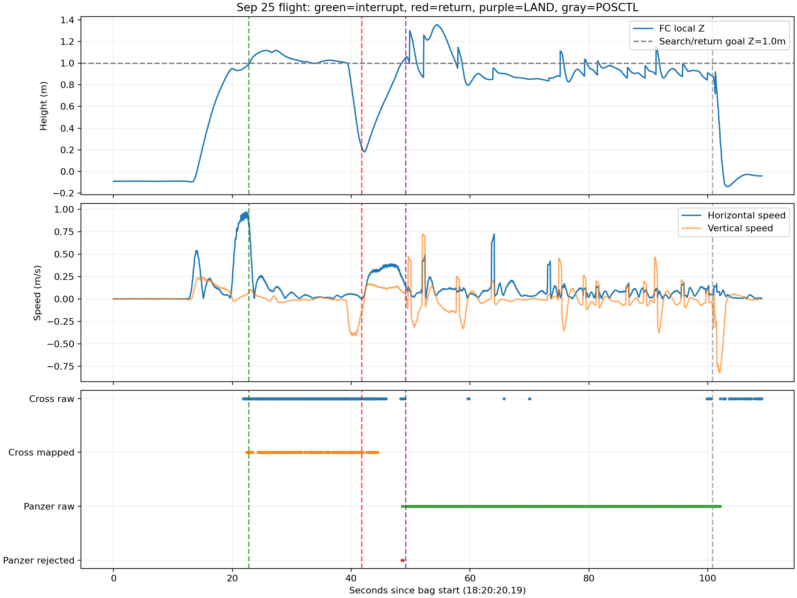

# 9月25日视觉中断实飞复盘

本轮只读取新增的 `flight_debug_2026-09-25-18-20-20_0.bag`，未运行飞行或仿真，未修改飞行代码。bag覆盖18:20:20.193—18:22:09.29，共109.10秒；任务命令初始时间早于录包约6.64秒。下文相对时间均以录包开始为零点，时钟为北京时间。

## 结论

**仅红十字形成了具备类别和有效地图位置的投递候选，并触发接近、对准和投递调用。装甲车被识别到，但没有形成panzer候选，更没有进入投递队列。**红十字调用执行端失败，任务锁定槽位后停止后续搜索/投递，转入返回与降落流程。并非两个投递候选已就绪、仅被舵机兜底一起取消。

本轮搜索目标为local Z=1.0m，不是2.6m高位搜索；前飞实速中位约0.85m/s，峰值约0.98m/s。没有成功投递ACK。`RETURN_HOME`指令目标是 `(4,0,1)`，不是最初的 `(0,0,1)`；名称不能当成回到起飞点的证据。

## 视觉与任务时间线

| bag相对秒 | 北京时间 | 事件 |
|---:|---|---|
| 8.797 | 18:20:28.990 | MAVROS记录解锁，ALTCTL |
| 11.798 | 18:20:31.991 | 进入OFFBOARD |
| 19.624 | 18:20:39.817 | 首点完成，SEARCH目标转为(4,0,1) |
| 21.854 | 18:20:42.047 | 原始检测话题首次出现red_cross |
| 22.378 | 18:20:42.571 | 红十字首次有效地图投影 |
| 22.381 | 18:20:42.574 | 红十字候选ID=0进入DETECTED |
| 22.669 | 18:20:42.862 | 红十字连续3次观测，CONFIRMED并被selected_target发布；置信度0.939、地图质量0.912 |
| 22.725 | 18:20:42.918 | high_weight_search_interrupt，转APPROACH，预留槽1；目标约(2.108,-0.092,-0.22) |
| 26.618 | 18:20:46.811 | 接近完成，旧控制接受视觉对准 |
| 39.199 | 18:20:59.392 | strict_alignment_context_valid，进入RELEASE阶段 |
| 41.736 | 18:21:01.929 | 槽1投递失败：raw_actuator_unavailable |
| 41.758 | 18:21:01.951 | candidate_release_state_uncertain，转RETURN_HOME |
| 42.054 | 18:21:02.247 | 同一红十字/槽1第二次raw_actuator_unavailable，仍无成功ACK |
| 48.56—48.73 | 18:21:08.75—08.92 | 两条panzer进入精修/投影链，均circle_association_missing、map_valid=false |
| 49.149 | 18:21:09.342 | 返回目标完成，发LAND |
| 49.207 | 18:21:09.400 | 视觉align_mode切landing，仅H允许进入融合输出 |
| 100.799 | 18:22:00.992 | 飞控由OFFBOARD转POSCTL |
| 105.692 | 18:22:05.885 | 记录landed_state_and_settle_confirmed |
| 106.800 | 18:22:06.993 | MAVROS记录未解锁 |

红十字从首次有效投影到确认约0.291秒，到中断约0.347秒；从原始检测首次出现到中断约0.871秒。这是录包接收时序，不是同一帧的端到端延迟。中断时飞机约x=2.232m、local Z=0.990m，已接近/略越过首个融合靶心的x坐标，随后减速回到目标附近。

## 装甲车为什么没有形成候选

全包原始panzer检测349条；首次对应图像时间是bag+48.331秒，第一条原始话题接收在+48.578秒。两条经过融合/精修的记录为+48.561、+48.727秒，跨话题接收顺序有十几毫秒差异，不能倒推处理因果；其图像时间与原始检测一致。

这两条都因 `circle_association_missing` 不能获得有效地图位置。`targets`里始终只有red_cross ID=0与circle ID=1；泛化圆环虽然曾进入CONFIRMED，但不能当作装甲车类别已确认。`selected_target`全包只有红十字，任务指令中也只有红十字APPROACH。

上图与首次panzer图像时间戳精确一致，未经标注或旋转。目标及圆环在左边明显出画；第一条检测框x_offset=0，类别置信度0.659。这支持圆环不完整导致关联失败的解释，但bag未记录每个圆环筛选候选及评分，不能把裁切认定为唯一原因。

装甲车首次检测已经晚于返航约6.8秒。随后+49.207秒切换landing模式，融合器只允许landing_pad；原始YOLO仍继续报panzer，到+102.075秒。因此349条原始检测不等于349次有效投影机会，也不等于装甲车被记忆后放弃。可从[融合器模式过滤](../../../vision_ws/src/uav_vision/src/uav_vision/detection_fusion.py)和[圆环关联精修](../../../vision_ws/src/uav_vision/scripts/target_refiner.py)核对该机制。

## 舵机失败为什么结束后续任务

两条 `release_result` 都是success=false、slot=1、target=red_cross，原因 `raw_actuator_unavailable`。本地[guarded_servo_proxy](../../../patrol_uav_ws-patrol_planner/src/uav_mission/scripts/guarded_servo_proxy.py)在等待底层服务或RPC调用发生异常时产生该原因；不是“视觉没对准”的拒绝。它与现场忘记启动舵机程序的描述一致，但bag本身不能区分服务未启动、名称接线错误与其他服务异常，也不能证明只缺舵机供电。

[任务核心](../../../patrol_uav_ws-patrol_planner/src/uav_mission/src/uav_mission/mission_core.py)在已进入RELEASE而失败时将槽位标为QUARANTINED，并以candidate_release_state_uncertain结束后续投递；本包状态正好由[RESERVED,FREE,FREE]变成[QUARANTINED,FREE,FREE]，committed_slots始终为0。它保守地避免在释放状态不确定时复用槽位，没有把失败算作成功。两条失败回执是同槽两次调用，不能算两投。

因此“舵机失败导致结束当前任务”成立；“装甲车也已形成候选，只因舵机没投”不成立。若执行器正常，本包也不足以证明装甲车之后一定能完成几何确认和投递。

## 飞行高度和速度

原始FC local Z在地面约-0.091m，而非精确0。下表离地高度仅按已知机架落地FC离地0.22m估算：AGL≈local Z+0.311m；不是独立测距真值。bag无启动参数快照，视觉投影地面记录-0.22m与这次地面零点之间约9cm差异应在下轮核对，不能据此直接宣布外参错误。

速度由odom位置按0.5秒中央差分计算，并与旋转到世界系的twist交叉检查；twist属于base_link，不能直接把原始vz当世界竖直速度。差分峰值会受定位修正影响，采用中位/P95描述稳定航段。

| 阶段 | local Z范围m | 估算FC离地范围m | 水平速度中位 / P95 m/s |
|---|---:|---:|---:|
| 前飞搜索 | 0.933—0.990 | 1.24—1.30 | 0.855 / 0.958 |
| 红十字接近 | 0.993—1.119 | 1.30—1.43 | 0.202 / 0.731（含开始制动） |
| 对准至释放失败 | 0.226—1.119 | 0.54—1.43 | 0.033 / 0.116 |
| 返回测试终点 | 0.179—1.048 | 0.49—1.36 | 0.320 / 0.383 |
| LAND指令后、POSCTL前 | 0.796—1.357 | 1.11—1.67 | 0.079 / 0.192 |

首次红十字确认时local Z≈0.987m、水平速度约0.91m/s；服务失败时local Z≈0.232m。搜索前爬升峰值约0.25m/s；红十字对准末段下降峰值约0.41m/s。装甲车首次精修拒绝时local Z≈1.007m、水平速度约0.25m/s，不能把圆环失败简单归因于高速掠过。

LAND后约51.65秒飞控仍在OFFBOARD，随后POSCTL才快速下降落地。故末尾COMPLETE只能证明程序观察到了落地与稳定，不能证明全自主降落成功；是否人为接管需结合飞手现场说明。本轮没有landing_pad检测进入已记录的视觉检测流。

## 后续建议与数据边界

1. 下次起飞前确认底层舵机服务实际存在、名称与代理一致；“真实投递”和“mock专项”必须明确选定，不能用未启动执行器代替模拟。
2. 标准靶需要一次独立的圆环关联验证：先保证靶心和足够完整圆环位于画面内，再看panzer的map_valid、CONFIRMED和selected_target，不能只看YOLO框。
3. 核对现场巡航高度/速度、返回点、地面基准与降落专项配置。当前bag的SEARCH z=1.0、终点x=4.0和接近1m/s实速说明不能直接套用本机4×4旧默认参数。
4. 缺底层服务与“已调用但结果不明”可考虑后续区分，但本次只诊断，未放宽释放失败保护。

本地源码参考为板端分支18e433b；新bag未附9月25日板端源码revision及参数快照，因此源码解释以日志实际原因码和状态转移交叉核对，不能保证所有本地默认值就是现场配置。原始bag与全量提取JSON留本机；仓库只收报告、脚本、摘要和图像。[指标摘要](summary.json)、[ROS离线提取](analyze_bag.py)、[统计及绘图](summarize.py)。
