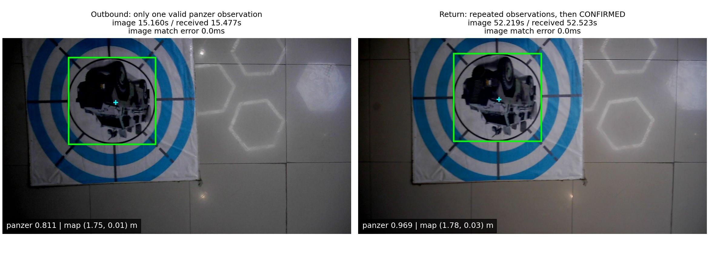
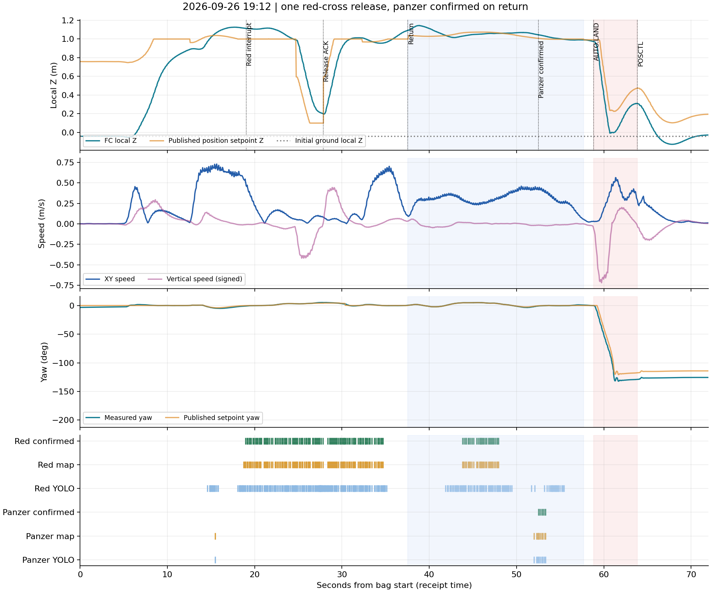
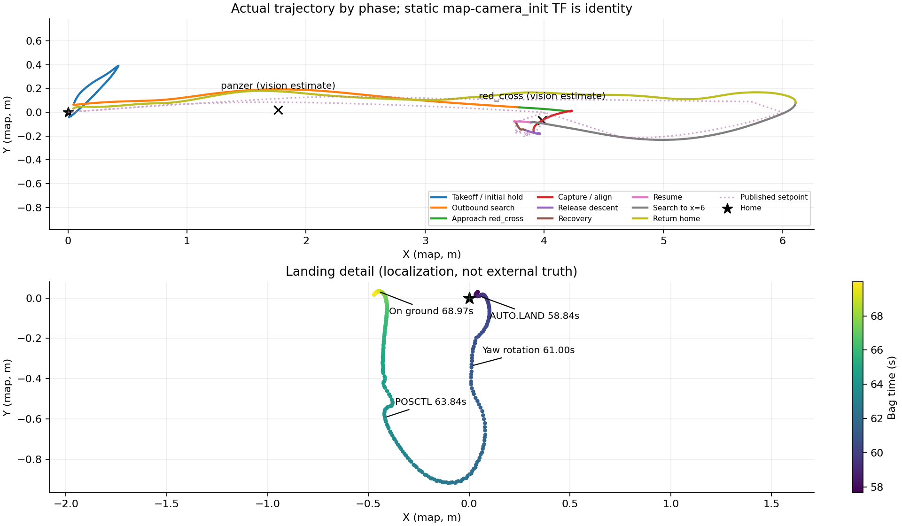

# 2026-09-26 19:12 最简投递实飞复盘

[多画面章节播放器](index.html) · [汇报视频](../../../logs/flight_review_20260926_191221/replay/dashboard.mp4) · [轨迹动画](../../../logs/flight_review_20260926_191221/replay/trajectory.mp4) · [视觉叠加](../../../logs/flight_review_20260926_191221/replay/camera_annotated.mp4) · [相机原片](../../../logs/flight_review_20260926_191221/replay/camera_raw.mp4)

## 结论

本包验证了**低空搜索→红十字中断→对准下降→槽1释放服务成功→恢复高度→续飞→返航**，没有测试高空记忆队列逐点重访，也没有完成三投全场。

- 红十字约18.948秒确认，19.027秒触发中断；27.872秒收到`raw_actuator_ack`，30.312秒恢复完成。最终槽状态为`[COMMITTED, FREE, FREE]`。ACK是执行服务成功，不等于已测量包裹脱离和真实落点。
- 装甲车去程只有一次有效观测；返程52.528秒才形成CONFIRMED，52.531—53.317秒还发布了7次`selected_target`。当时任务已返航，故未产生装甲车APPROACH或释放事务。**此次不是“舵机失败迫使返航”，也不是“装甲车没有圆环关联”。**
- 切返航是现有策略主动决定：直线航线完成且无合格待处理候选，原因为`coverage_complete_insufficient_candidates`，不是设计成只投一次。返航开始后不再接受新视觉中断。
- 降落旋转、随后人工接管由现场确认；此前装甲车投递截图属于另一轮。按用户最新要求，旋转只记录现象，不继续追究。本包不能证明旋转由剩余快递盒造成。
- 最新远端20:52提交已把最简测试的交接模式改为POSCTL，但其默认降落高度参数存在启动检查冲突，详见下文。该提交晚于19:12这次飞行，不能用于解释本轮表现。

本轮只读取源码、离线导出和分析；未修改飞行控制/视觉算法/配置，未运行仿真、未连接或操作飞机。唯一工具修改是把回放的通用提示改为“circle为辅助几何；map-valid/selected不等于任务已接纳”，避免误导。

## 数据及版本口径

输入：`试飞产物/flight_debug_2026-09-26-19-12-21_0.bag`，101.4598秒，35个话题，2965张压缩相机图像。回放按10fps重采样成1015帧，四个MP4均为101.5秒、1倍速；不是视频加速。所有视频经过FFmpeg完整解码及时间长度检查。

| 来源 | revision / 状态 | 用途 |
|---|---|---|
| 导航仓`板载代码`最新远端 | `e94d0a7a7fb3c52d172cb29c958698a9de93b584`，9月26日20:52 | 当前代码检查 |
| 同分支飞前提交 | `4e831ce`，9月26日18:50 | 与本轮AUTO.LAND行为对照 |
| 本机板端分析分支起点 | `bf30a23`，`feat/board-deployment-flight-20260920` | 复用bag_replay工具、保存报告 |

已显式fetch远端中文分支，未只依赖只取main的默认refspec。网页访问受限时以Git取回对象读取。bag没有部署HEAD、完整参数快照或启动终端日志，故只能说行为与4e831ce一致，不能断言现场二进制就是该commit。20:52以后源码发现的问题与本包历史事实分开记录。

`map→camera_init`在包内是单位静态变换，可在本包中叠加轨迹/目标；这不等于任意试飞都可假定两坐标系相同。图中实际轨迹来自机载定位，不是外部真值；灰色地图是膨胀点云高度切片，不能用视频直接量测碰撞净空。

## 时间线

以下均为相对bag起点的消息接收时间；相机框回贴原图则按图像header时间。首条任务指令是录包前约5.298秒的latched消息，不把它当成录包时刚下发。

| 秒 | 记录 | 含义 |
|---:|---|---|
| 3.841 / 4.773 | OFFBOARD已解锁 / IN_AIR | 起飞 |
| 12.371 | SEARCH到(4,0,1) | 初始升高航点完成 |
| 15.472 / 15.477 | panzer检测 / 地图投影成功 | 只有一次，尚未确认 |
| 18.948 | red_cross CONFIRMED，连续3次 | 合格红十字坐标形成 |
| 19.027 | APPROACH red_cross，slot1 | 高权重中断 |
| 20.760 | 对准执行接受，drop_cross | 进入红十字对准 |
| 24.699 | strict_alignment_context_valid | 稳定3次，释放承诺证据成立 |
| 27.872 | slot1 raw_actuator_ack | 服务回执成功 |
| 30.312 / 30.353 | 恢复确认 / RESUME | 回到搜索 |
| 32.179 | SEARCH到(6,0,1) | 继续直线剩余航段 |
| 37.530 | RETURN_HOME | coverage_complete_insufficient_candidates |
| 52.528 / 52.531 | panzer确认 / selected_target | 已在返航，不转APPROACH |
| 57.670 / 58.840 | LAND / AUTO.LAND | 返回home后交接飞控降落 |
| 63.844 / 65.840 | POSCTL / MANUAL | 现场确认人工接管 |
| 68.844 / 68.974 | 未解锁 / ON_GROUND | 落地 |
| 69.046以后 | landing_radius_not_met，仍LAND | 未形成任务COMPLETE |

机载状态记录的IN_AIR到ON_GROUND约64.20秒；从解锁到落地约65.13秒；bag末尾另有约32.49秒地面记录。不能把这次6米直线、一投试飞时长当成正式比赛全场用时。

## 为什么返航；为什么返程确认装甲车仍不投

配置航线为`[0,0,1]→[4,0,1]→[6,0,1]`。红十字投递成功并没有立即结束搜索，飞机执行了RESUME和最后一个SEARCH。37.530秒航线耗尽时，装甲车仅有去程一次有效观测，未到确认门槛，任务选择返航。两槽仍FREE，不存在执行失败隔离。

[mission_runtime.py飞前版本](https://github.com/sakelier/liftrace-controlwork/blob/4e831ce/patrol_uav_ws-patrol_planner/src/uav_mission/src/uav_mission/mission_runtime.py#L394)在有活动指令时，只对SEARCH/RESUME调用`_consider_search_replacement`；RETURN_HOME维持当前指令。视觉记忆可以继续更新，甚至继续发布selected_target，但它没有单独改变飞行任务的权限。

这是**当前最简测试策略的主动结束条件**，不是新高位策略的重访队列，也不是一次投递硬上限。若未来希望返程再投，需要明确“无故障、仍有空槽、剩余时间够、尚未进入降落”的有界返程复访政策；不能把所有RETURN_HOME都开放中断，否则会干扰执行器故障等必须退出的路径。本轮只提出设计方向，不改行为。

## 装甲车识别、圆环匹配和两个ID

装甲车原始检测共11次，11次均成功形成带圆环关联的有效地图投影：

- 去程约15.47秒仅一次，置信度0.811，`association_valid=true`，`center_source=circle_geometry`，坐标约(1.747,0.015,-0.220)。
- 返程约52.00—53.31秒10次；52.528秒连续计数达到3后确认，最终有效融合位置约(1.767,0.022,-0.220)。
- manager的`min_streak=2`不覆盖视觉记忆的`confirm_frames=3`；源码默认和本包状态变化均支持三次才确认。
- 去程为什么仅一次类别检测仍未确定。去程约0.63—0.70m/s、返程约0.31—0.44m/s的速度差可能影响观测机会，但图像朝向、曝光、检测置信度等也可能影响，不能单凭一次来回归因。
- 不能再沿用9月25日的`circle_association_missing`解释这次：本轮11次panzer投影全有效，且已经有返程selected_target。



**匹配并不等于合并记忆ID。** [target_refiner](https://github.com/sakelier/liftrace-controlwork/blob/4e831ce/vision_ws/src/uav_vision/scripts/target_refiner.py#L105)做同帧一对一关联：将圆环中心赋给panzer检测，同时仍转发原始circle检测。[target_memory](https://github.com/sakelier/liftrace-controlwork/blob/4e831ce/vision_ws/src/uav_vision/scripts/target_memory.py#L491)只在标准类别组内部合并空间重复，circle不在该组；它属于辅助几何身份。因此会保留下表，而不是两次装甲车：

| ID | 类别 | 最近有效XY / m | 含义 |
|---:|---|---|---|
| 0 | circle | (1.816,0.003) | 装甲车附近的圆环辅助记录 |
| 1 | panzer | (1.767,0.022) | 正式类别目标 |
| 2 | red_cross | (3.982,-0.065) | 正式红十字目标 |
| 3 | circle | (3.992,-0.045) | 红十字底板附近的圆环辅助记录 |

circle优先级为0且不属于正式可选投递类别。本包selected_target有red_cross 132条、panzer 7条、circle 0条；任务只有red_cross一条APPROACH，没有向圆环重复投递。两种记录的融合历史不同，位置不必逐帧完全一致。

保留几何辅助记录有调试用途，但展示层应明确“目标/辅助几何”，不要拿全部ID数量当发现靶数。未来如要统一物理对象ID，应保留类别证据与几何证据的层级关系，不能把circle直接改名为panzer或把圆环多次观测算成类别多次确认。本轮仅澄清显示文案。

## 飞行高度、速度与投递精度边界

初始静置FC local Z中位数为-0.0410m。下表使用坐标系Z；若采用已知落地FC离地0.22m，则估算AGL=local Z+0.2610m。没有独立测距，且投影地面Z=-0.22与上述估算地面Z=-0.261差约4.1cm，AGL只作参考。

速度由位置0.5秒中央差分得到，采用阶段中位/P95；未把base_link机体系twist的Z直接当世界竖直速度。阶段包含加减速，不等于稳定巡航速度上限。

| 阶段 | 秒 | local Z范围m | 水平速度中位/P95 m/s |
|---|---:|---:|---:|
| 起飞/初始保持 | 8.53 | -0.052—0.881 | 0.112 / 0.403 |
| 去程搜索 | 6.66 | 0.882—1.127 | 0.631 / 0.700 |
| 红十字接近 | 1.73 | 1.106—1.114 | 0.253 / 0.457 |
| 捕获/对准 | 3.94 | 0.991—1.117 | 0.111 / 0.168 |
| 释放下降 | 3.17 | 0.201—0.990 | 0.051 / 0.099 |
| 投后恢复 | 2.44 | 0.197—0.951 | 0.053 / 0.073 |
| 恢复航线 | 1.83 | 0.963—1.014 | 0.093 / 0.119 |
| 续搜到6米 | 5.35 | 0.955—1.092 | 0.495 / 0.672 |
| 返航 | 20.14 | 0.989—1.144 | 0.307 / 0.436 |
| 降落交接保持 | 1.17 | 0.974—0.991 | 0.029 / 0.054 |
| AUTO.LAND | 5.00 | -0.008—0.973 | 0.329 / 0.525 |
| 人工接管 | 5.13 | -0.127—0.308 | 0.110 / 0.289 |

本包任务状态直接记录CRUISE前视0.8m、PRECISION前视0.4m、TERMINAL前视0.25m。飞前/最新配置规划max_vel均为0.60m/s；位置前视和PX4响应使实际速度与规划参数不完全相等，不应把0.8m前视误读成0.8m/s。返航约20.14秒，明显慢于去程，是后续可独立评估的时长项；本轮没有新增提速。



红十字释放回执时FC local Z约0.200m，估算FC离地约0.461m；水平速度约0.080m/s。这次已经是较低释放，不支持仅凭视频继续盲目降低。约24.699秒释放承诺成立时，local Z约0.99m，之后才下降至释放高度。

最后一次承诺前像素偏差约dx=22.31px、dy=-0.50px，对应源图24.386秒、证据观测年龄约0.309秒，稳定计数3。它是特定图像/事务的对准证据，不能当成最终物理落点厘米误差。本包缺靶心外部真值、包裹着地点和三槽实测标定；不能据FC位置减视觉靶位就宣布投递偏差，也不能验证2/3槽补偿。

[对准截图](red_alignment.jpg) · [释放时截图](red_release.jpg) · [返程装甲车截图](panzer_return.jpg)

## 降落现象：记录，不继续展开

58.840秒进入AUTO.LAND后，定位yaw从约0°变化至约-132°；63.844秒POSCTL、65.840秒MANUAL，现场确认因为旋转而接管。69秒后任务仍LAND，桥报告`landing_radius_not_met`；最终静置位置距home约0.482m。

任务层LAND目标没有要求绕圈。已发布的MAVROS设定点也随实际姿态变化，但旧控制器有“从当前姿态朝目标限幅”的输出步骤，不能看到设定点yaw变化就认定它主动要求旋转。切离OFFBOARD后，外部话题仍发布也不证明飞控正在执行它。[PX4的模式说明](https://docs.px4.io/main/en/flight_modes/offboard)区分外部控制与其他模式；[Land说明](https://docs.px4.io/main/en/flight_modes_mc/land)提供通用行为背景，实际固件参数未随本包提供。

用户提出可能与仍有快递盒未投出有关，作为现场假设保留，**尚未验证**。本包没有ULog、RC输入、载荷/重心实测，不在本轮继续根因调查，也不把人工接管落地计作自主降落通过。



## 最新20:52板端更新：一个确定的默认参数冲突

[最新提交e94d0a7](https://github.com/sakelier/liftrace-controlwork/commit/e94d0a7a7fb3c52d172cb29c958698a9de93b584)将最简测试的独立交接节点设为`handoff_mode=POSCTL`，即回到home后交飞手手动下降；不应称作已经修复并验收了全自主降落。走廊入口的独立节点仍默认AUTO.LAND，不能笼统说全部测试都改了POSCTL。

**当前最简测试默认值会触发启动参数检查：**

| 参数 | 飞前4e831ce | 最新e94d0a7 |
|---|---:|---:|
| external_landing/capture_height | 0.50m | 0.10m |
| external_landing/auto_land_height | 0.15m | 0.15m |
| land_height | 0.05m | 0.05m |
| hold_for_external_auto_land | true | true |
| 独立节点handoff_mode | AUTO.LAND | POSCTL |

[patrol_control.cpp参数检查](https://github.com/sakelier/liftrace-controlwork/blob/e94d0a7/patrol_uav_ws-patrol_planner/src/patrol_control/src/patrol_control.cpp#L1554)无条件要求`capture_height > auto_land_height >= land_height`；即使启用hold交接也检查。最新0.10≤0.15会走ROS_FATAL和invalid_argument。默认launch最后再次加载test_config，因此这是**按最新默认入口冷启动的源码/参数冲突**；若现场使用自定义test_config覆盖，结果另论。本轮未启动硬件节点来“复现”。

最小处理建议：先把在hold模式下不用的capture恢复为0.50，保持既有检查通过；若以后决定hold模式无需检查H下降参数，再单独限定检查适用范围并做离线回归。**本次不直接修改试飞组分支**，避免把分析请求变成现场飞行行为变更。该问题不属于19:12飞行故障原因。

最新差异主要在低空最简/走廊测试入口及降落交接，三槽数组仍为`[-0.12,0] / [0,-0.12] / [0,+0.12]`，两套标准/红十字数组未变；不能从此次commit推断槽位补偿已重新标定。本机高位研究配置与该低空入口不是同一个测试模式，不覆盖整机分支或部署配置。

## 与9月25日一轮的区别

| 项目 | 9月25日18:20 | 本次9月26日19:12 |
|---|---|---|
| 红十字释放 | raw_actuator_unavailable，槽1隔离 | raw_actuator_ack，槽1COMMITTED |
| 装甲车几何 | 有类别但精修关联失败 | 11次地图有效，返程确认并selected |
| 返航原因 | 释放状态不确定的退出 | 航线完成、当时没有其他合格候选 |
| 返回后视觉模式 | 后期landing过滤非H | disabled（搜索感知开放），未进入landing视觉模式 |
| 高空策略 | 未测 | 未测 |
| 降落 | 人工模式后落地 | AUTO.LAND后旋转，人工接管；任务未COMPLETE |

## 下一步和复现

优先把最新默认参数冲突反馈试飞组，再分开验证两件事：标准靶首次经过的连续确认机会；正常搜索耗尽返航时是否允许有界复访。不要将“圆环辅助ID重复显示”当成遗漏装甲车的根因，也不要为了这一个来回直接取消所有候选确认或返航退出条件。

现成[bag回放工具](../../../tools/bag_replay/README.md)仍可接任意兼容bag。保留原包和四份最终视频，临时导出JPEG在完成图表与验证后清理。大视频/bag不进入Git；仓库保存报告、图表、指标及脚本。

离线复现（WSL，按实际路径替换；无roscore/仿真）：

```bash
ROOT=/home/xhj/liftrace-worktrees/r2026-board-vision-tests
BAG="$ROOT/试飞产物/flight_debug_2026-09-26-19-12-21_0.bag"
OUT="$ROOT/logs/flight_review_20260926_191221"
bash "$ROOT/tools/bag_replay/run.sh" "$BAG" "$OUT/replay" --fps 10 --frame map --keep-frames
source /opt/ros/noetic/setup.bash
/usr/bin/python3 "$ROOT/docs/deployment/flight_review_20260926/extract_supplement.py" "$BAG" "$OUT/supplement.json"
source /home/xhj/miniconda3/etc/profile.d/conda.sh
conda activate rl_drone
python "$ROOT/docs/deployment/flight_review_20260926/analyze.py" --run "$OUT"
python "$ROOT/tools/bag_replay/bag_replay.py" verify --out "$OUT/replay"
```

`metrics.json`保存精确数值，`analyze.py`中的阶段边界来自本包记录，不能直接冒用为其他bag的自动阶段识别。Windows调用这些WSL命令仍须遵守工程的`wsl -e bash -c '...'`约定。
