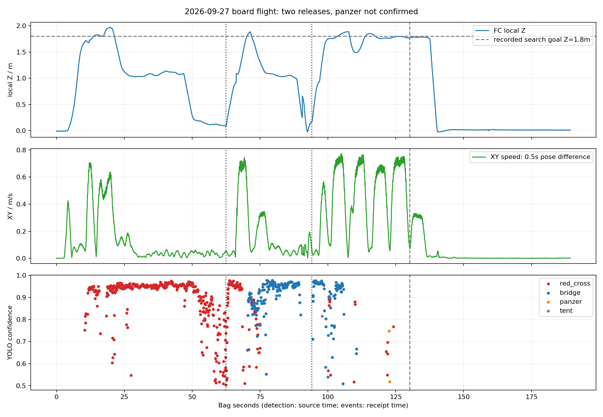
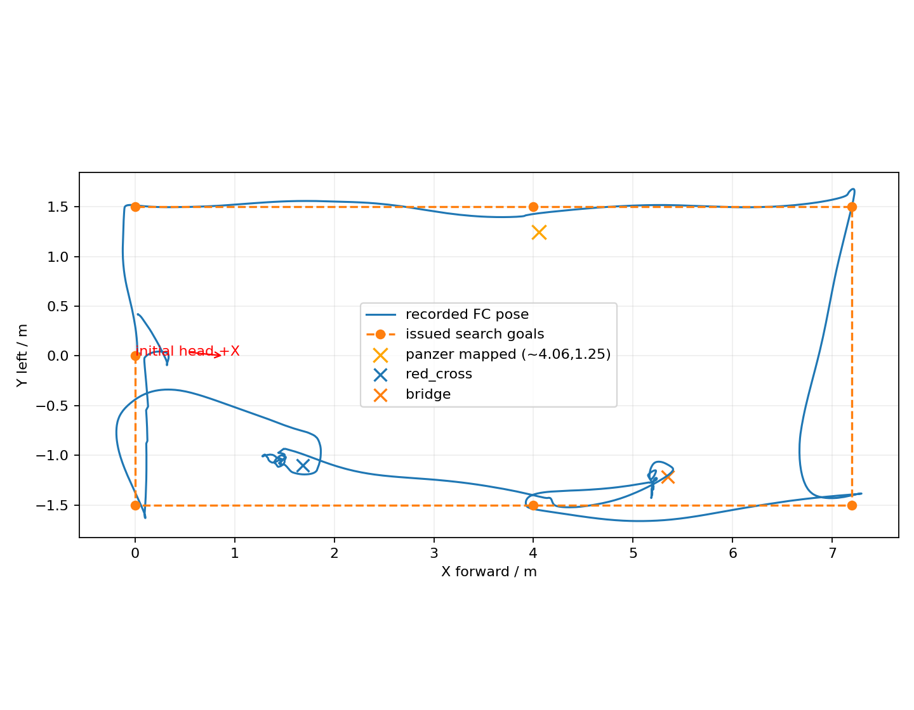
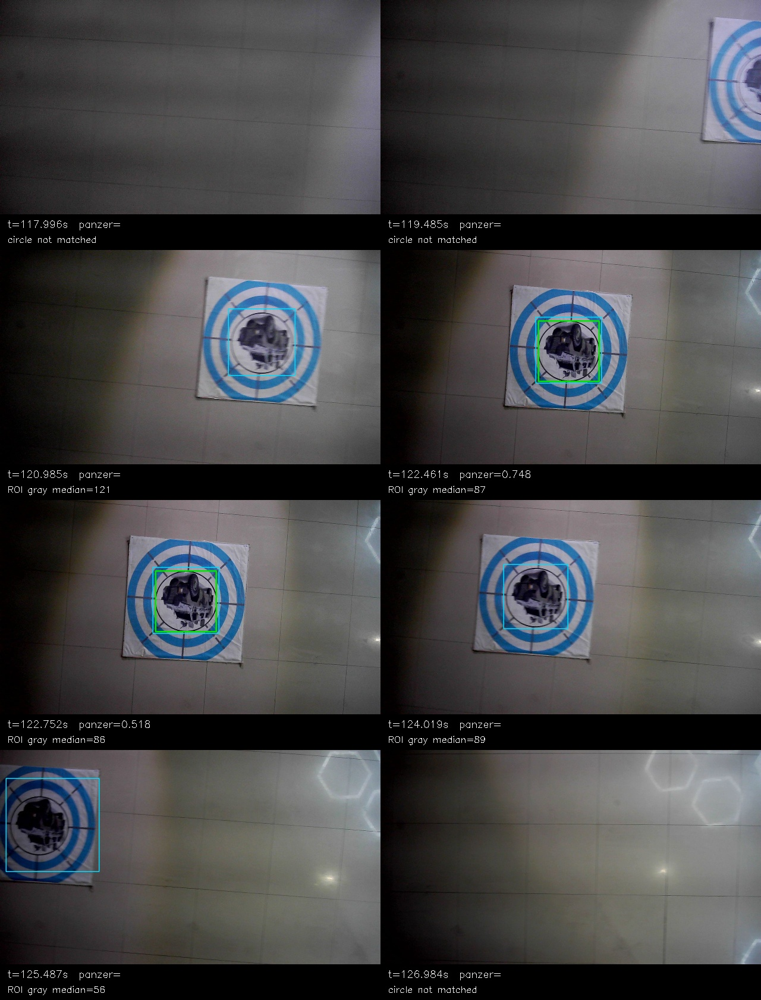
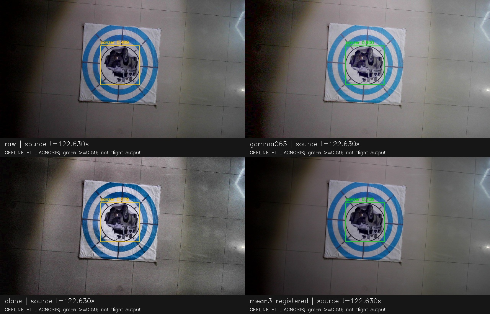
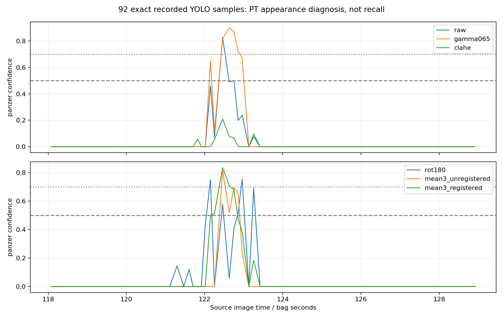

# 2026-09-27 19:41 高位搜索实飞复盘

2026-09-28后续：[调整靶位的两轮复盘](../flight_pair_20260928/REPORT.md)发现不同故障：真实panzer先以bridge启动投递，低位类别纠正未进入事务，真bridge后来被已投去重。不能沿用本轮“仅一次合格观察”的结论解释新包。

[多画面播放器](index.html) · [汇报视频](../../../logs/flight_review_20260927_194157/replay/dashboard.mp4) · [相机视觉叠加](../../../logs/flight_review_20260927_194157/replay/camera_annotated.mp4) · [航迹动画](../../../logs/flight_review_20260927_194157/replay/trajectory.mp4) · [panzer优化计划](PANZER_PLAN.md)

## 结论

**本轮完成红十字、桥梁两次释放服务回执并继续巡航；panzer经过检测—圆环关联—地图投影，但只形成一次合格观察，未CONFIRMED、未selected、未APPROACH。** 不是舵机兜底导致未投，也不是类别与圆环不同帧导致投影失败。

1. 录到两次panzer类别框：源图122.461s/122.752s，置信度0.7476/0.5176。两次都有圆环关联和有效坐标，约`(4.06,1.25,-0.22)`，但第二次低于正式类别0.60/几何0.70门槛。记忆ID6只有1次合格计数，selected中没有panzer。
2. 实际运行的是试飞组“高位巡航中断投递”链：红十字→立即下降投递→恢复高位路线→桥梁→立即投递。**没有运行研究分支的高位粗线索队列、TOP3提前结束与低位逐点重访。** 当前八组02/06/08不能与这个同名“高位”入口混称同一任务策略。
3. 本包实际搜索/返航目标高度是**local Z=1.8m**，估算FC离地约2.03m；不是远端默认配置的local Z=2.4m，也不是2.6m高位策略实飞验收。
4. 原图存在局部阴影、明显灯光反射和运动清晰度变化。92帧离线PT对照：原图2帧、Gamma提亮6帧、三帧配准均值4帧达到0.50；CLAHE反而0帧。支持外观敏感性，但不能简单定性为“只是天黑”。
5. 用户确认H→panzer误报来自**仿真**，本轮现场未摆H。两次panzer框均为真实装甲车，不能把本包漏检与H假阳性混在一起。H负样本/结构复核作为独立优化轴，详见计划。

本轮只做离线bag读取、既有回放导出、PT外观诊断与文档分析，没有修改在线导航/视觉/模型/阈值，没有启动ROS节点、Gazebo或实机。

## 数据与版本

- 输入：`试飞产物/flight_debug_2026-09-27-19-41-57_0.bag`，609,229,353字节，189.289s，35个话题，5343张1280×720压缩相机图。
- 拉取核对的导航仓`板载代码`HEAD仍为`48541a7a8d91a2993711a10b556f7028504c3e1c`（9月27日14:13）。[入口源码](https://github.com/sakelier/liftrace-controlwork/blob/48541a7a8d91a2993711a10b556f7028504c3e1c/patrol_uav_ws-patrol_planner/src/uav_mission/launch/high_view_priority_search.launch)包含`minimal_delivery_test.launch`，默认只替换集中参数。
- 远端默认yaml的航点高度为2.4m，点列含2m/6m等中间点；实际bag是1.8m、8个搜索航点。**现场用了不同参数或未提交配置；bag没有完整参数快照、部署HEAD和权重身份，不能断言现场二进制与远端提交完全一致。** 分析飞行事实优先采用bag中的指令和状态。
- 回放使用[现有toolkit](../../../tools/bag_replay/README.md)，只叠加记录的输出，不重新检测。独立外观诊断使用此前同一`merged_standard best.pt`；不冒充现场RKNN复跑。
- bag内`map→camera_init`为单位静态TF，回放在map中显示；图中位置来自机载估计，无外部靶心/落点真值。视频投影坐标不是厘米级精度证明。
- 缺少`navigation_hints`和`uav_high_view/probe_status`话题本身不独立证明节点未运行；结合远端入口和实际逐目标中断时序，本轮没有形成研究策略的先搜后访流程。

## 实际任务时间线

时间为相对bag起点的接收时间；检测源图时间另标。首条SEARCH是录包前约1.112s已发布的latched消息，不能把录包开始等同任务启动。

| 时间/s | 实际记录 | 说明 |
|---:|---|---|
| 0.939 / 1.939 / 2.276 | 解锁 / OFFBOARD / IN_AIR | 起飞 |
| 10.694 / 14.484 | SEARCH `(0,-1.5,1.8)` / `(4,-1.5,1.8)` | 从起点升高后走第一侧航带 |
| 19.894 | APPROACH red_cross，slot1 | 高权重中断，不等高位全圈结束 |
| 25.134 / 29.417 | 接受对准 / strict_alignment_context_valid | 进入对准并形成承诺证据 |
| 62.339 / 65.983 | red_cross raw_actuator_ack / 恢复完成 | 第一槽COMMITTED |
| 66.021 | RESUME原航点 | 继续高位路线 |
| 71.139 / 78.044 | APPROACH bridge，slot2 / 接受对准 | 第二次中断 |
| 88.302 / 94.013 / 96.549 | 对准承诺 / bridge ACK / 恢复完成 | 第二槽COMMITTED |
| 100.988 / 107.408 / 116.116 | SEARCH `(7.2,-1.5)`→`(7.2,1.5)`→`(4,1.5)` | 高度均1.8m |
| 122.788 / 123.081 | 接收到两次panzer类别检测 | 对应源图122.461/122.752s |
| 122.801 | panzer ID6首次候选 | 一次合格观察，state=0；不是确认 |
| 122.825 | SEARCH `(0,1.5,1.8)` | 绕过当前panzer位置继续航线 |
| 130.135 | RETURN_HOME | `coverage_complete_insufficient_candidates`，第三槽仍FREE |
| 136.100 / 137.946 | LAND / POSCTL | 交接到POSCTL，不能称为自主AUTO.LAND完成 |
| 141.679 / 142.720 / 143.945 | ON_GROUND / 任务COMPLETE / 未解锁 | 任务检测落地，不证明全过程自动降落 |

最终两槽COMMITTED、一槽FREE。服务ACK代表执行服务成功，没有包裹脱离传感器或落点真值；不将其等同实际两件已命中靶心。桥梁承诺证据采用circle辅助几何ID2，任务事务为bridge ID3，这符合原链的辅助几何用法，并非额外投了一个圆环。

IN_AIR→ON_GROUND约**139.40s**；解锁→解除武装约143.01s；bag及四份1×视频为**189.3s**，尾部约47.6s已在地面。约2分19秒是此次两投实飞段，不是三投比赛全场成绩。

## 高度、速度与耗时



地面未解锁前FC local Z中位约−0.00985m；按已知起落架FC离地0.22m估计地面Z=−0.22985m，AGL≈localZ+0.22985。没有独立测距，此值用于解释高度，不替代实测。最高local Z=1.9678m，估算最高FC AGL=2.1976m。

| 阶段 | 时长/s | 水平速度中位/P95 m/s | 高度说明 |
|---|---:|---|---|
| 起飞到首点 | 10.69（含录包前已开始的指令） | 0.068 / 0.365 | 起飞目标local1.8 |
| 第一侧搜索至红十字中断 | 9.20 | 分段0.465–0.502 / 0.605–0.700 | local约1.7–1.97 |
| 红十字事务（含接近/对准/下降/恢复） | 46.13 | 0.038 / 0.170 | 承诺时local1.028，ACK时0.092 |
| 桥梁事务 | 25.46 | 0.071 / 0.319 | 承诺时local0.992，ACK时0.164 |
| 最后高位搜索 `(7.2,-1.5)` 到 `(0,1.5)` | 29.15 | 分段0.434–0.681 / 0.682–0.752 | 主体local约1.8 |
| 返航 | 5.96 | 0.299 / 0.326 | 实际返回目标仍local1.8 |
| LAND到地面 | 5.58 | 0.014 / 0.051 | 其中137.946s后POSCTL |

速度由0.5s中央位置差分计算，非机体系twist，亦非规划速度上限。完整分段见[CSV](phase_stats.csv)。红十字从29.417s承诺到62.339s ACK间隔32.92s，明显长于桥梁的5.71s；该间隔混合下降/对准维持/服务反馈，**不能直接归因舵机动作耗时**。后续需要执行器触发时刻及下降设定点日志再拆分，不在此次panzer任务中贸然提速。



## panzer在哪一层丢掉

| 层 | 本包事实 |
|---|---|
| 原始YOLO输出 | 全包1540个检测器消息；panzer仅2框（red_cross501、bridge239） |
| 融合/精修 | 两次panzer均保留并借用circle_geometry中心 |
| 地图投影 | 两次均map_valid，坐标差约4.3mm；这是同一目标的内部一致性，不是定位绝对误差 |
| 正式记忆 | 第二框class=geometry=0.5176；未通过std class≥0.60且geometry≥0.70，合格计数最多1 |
| 连续确认 | 飞行分支没有研究版1s搜索间隔宽容；缺测帧立即中断计数。此处即使只增加间隔，仍只有1个合格类别观察 |
| manager | 只收到未确认panzer，没有panzer selected/APPROACH；航线耗尽后正常返航 |
| 投递链 | 没有收到panzer事务，因此不是舵机拒投panzer |

正式记忆默认3次，任务侧`min_streak=2`不能替代视觉3次。标准靶精修用类别侧分数与圆环质量的min，故std geometry≥0.70同时施加了隐含类别≥约0.70；第二帧不是单纯“再等一次”就可合格。参考[板载memory源码](https://github.com/sakelier/liftrace-controlwork/blob/48541a7a8d91a2993711a10b556f7028504c3e1c/vision_ws/src/uav_vision/scripts/target_memory.py)。现场无参数dump，因此数值以分支默认和记录到的候选行为交叉核对，不宣称bag包含每个参数。

检测器源图到bag接收的延迟P50/P95约**0.309/0.421s**，源图采样间隔中位约0.115s（约8.7Hz）。这是观测到的整段处理/传输年龄，不是纯NPU推理时间。当前时延已占用较多新鲜度预算，新增处理必须看端到端年龄，不能只统计滤镜耗时。

在panzer位置附近有**154条有效圆环投影**，源时间120.036–125.387s；类别仅两次。154是辅助几何观测，不能作为154次panzer确认。这次主要短板为**类别观察稀疏及正式确认入口过窄**，不是圆环不存在或地图坐标质量差。

两个panzer源时间水平速度约0.127/0.062m/s；之前120.985s约0.604、之后124.019s约0.576m/s。类别检出集中在`(4,1.5)`航点减速到达附近，与清晰度/姿态/目标居中相关；本包不足以单独分离速度、光照和视角影响。



## 与昨晚光照问题是否类似

确有相似的强反射、局部暗区和图案朝向变化，但**不是所有漏检图都比检出图暗**。本次几何ROI灰度中位在120.985/122.461/124.019/125.487s约121/87/89/56；120.985s更亮仍没检出。归一到200×200后的Laplacian方差约391/1337/459/145，检出附近更清晰。这是局部图像描述量，受视角、缩放及纹理影响，不是照度或曝光实测。

昨晚首次panzer有效帧的ROI灰度中位约57，返程约59–89；本次检出约86–87，不支持“本次必然比昨晚更暗”。旧帧从已导出MP4取回，有重编码与取帧误差，不能据这些数值做相机曝光标定。以两晚图像中处理方法的效果变化作为更实用的对照。

### 同一92张源图的离线PT试验

118–129s按**现场原YOLO取样时间戳**精确取图，输入640，conf统计下限0.05，IoU=0.45；各方法不增加采样次数，不使用未来图像。此窗口含进/出画边界，不当作人工标注召回数据集。

| 方法 | panzer≥0.50 / 92 | ≥0.60 | ≥0.70 |
|---|---:|---:|---:|
| 原图 | 2 | 1 | 1 |
| Gamma 0.65提亮 | 6 | 6 | 4 |
| CLAHE（LAB-L，clip2，8×8） | 0 | 0 | 0 |
| 旋转180°（诊断朝向敏感性） | 5 | 3 | 2 |
| 当前+过去两帧直接均值 | 4 | 3 | 1 |
| 当前+过去两帧配准均值 | 4 | 3 | 2 |

这些是**检测输出帧数，不是召回率、确认成功率或新增投递次数**。抽查新增≥0.50框均位于真实panzer图案。PT与现场RKNN的置信度数值不同；本包缺精确部署权重身份，不能据此宣布板端收益。

Gamma在当前片段有益；但昨晚返程曾破坏有效框，不能全程固定开启。CLAHE昨晚局部有益、本次彻底丢掉≥0.50输出，表明“人眼看起来更清楚”不等于模型更熟悉。三帧均值收益有限，不能恢复每帧都已模糊掉的图案。

配准采用320×180灰度平移ECC，对原1280×720图做反向warp，最多当前及过去两张（约67ms跨度）。ECC≥0.85、位移≤20缩小图像像素才采用，失败回退当前帧；89/92用了三帧，3/92用了两帧。当前笔记本这段处理P50/P95约51/138ms（与其他离线处理同机运行），**既非板端延迟，也不是完整推理延迟**，已不适合直接复制成全帧常开路径。短时窗口重叠，不能把融合帧当作互相独立的多份释放证据。



[11秒外观对照视频](../../../logs/flight_review_20260927_194157/appearance_comparison.mp4)是独立离线诊断，视频内明确标记PT；不混进原始飞行回放冒充在线输出。



## H误识别：与本包分开处理

用户说明H问题发生于仿真，现场尚未测试H。历史研究报告曾记录H附近panzer假设，但当时缺完整同时间戳源图，不能仅凭地图位置替代像素级误分类核验。本次不伪造H负样本成绩。

当前六类模型没有H类别；H辅助检测又默认只在landing模式工作，搜索时无法提供H结构反证；通用circle成立也不意味着中心图案就是panzer。应同时做H负样本补充与panzer候选ROI的轻量H结构复核，避免用“所有带环的图都是标准投递靶”作为前提。范围、避免误抑制真靶的条件及验收见[PANZER_PLAN.md](PANZER_PLAN.md)。

## 回放与复现

四份主视频均为10fps、1893帧、189.3s、1×速，已FFmpeg完整解码和时长检查通过。另有11s外观对照视频；[视频检查](video_validation.json)、[指标](metrics.json)、[外观统计](appearance_metrics.json)。录像中的灰点为抽稀膨胀云切片，不能单独用来判断实际碰撞或净空。

```bash
ROOT=/实际路径/liftrace-board-reference
BAG="$ROOT/试飞产物/flight_debug_2026-09-27-19-41-57_0.bag"
RUN="$ROOT/logs/flight_review_20260927_194157"
DOC="$ROOT/docs/deployment/flight_review_20260927"
bash "$ROOT/tools/bag_replay/run.sh" "$BAG" "$RUN/replay" --fps 10 --frame map --keep-frames
source /opt/ros/noetic/setup.bash
/usr/bin/python3 "$ROOT/docs/deployment/flight_review_20260926/extract_supplement.py" "$BAG" "$RUN/supplement.json"
source /home/xhj/miniconda3/etc/profile.d/conda.sh
conda activate rl_drone
python "$DOC/analyze.py" --run "$RUN" --report "$DOC"
python "$DOC/appearance_probe.py" --run "$RUN" --report "$DOC" --model /实际路径/best.pt
python "$DOC/render_probe.py" --run "$RUN" --report "$DOC"
```

原bag保留；大视频、逐帧JSON及图像不入Git。图像临时目录保留在本run，供随后标注panzer训练难例；未复制数据集或训练模型。toolkit本体未修改，专项分析与离线诊断脚本存于本报告目录。Windows调用仍使用`wsl -e bash -c '...'`，中文路径通过UTF-8脚本或WSL终端传入。
