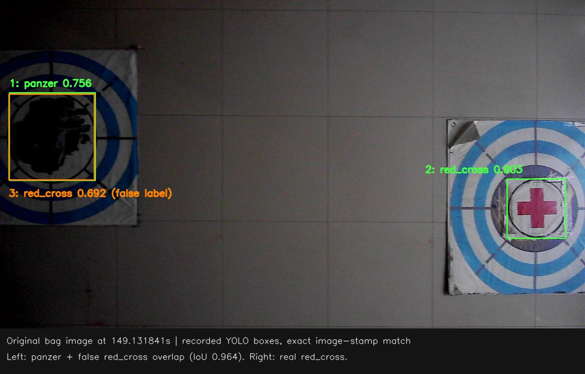

# memory轮三类冲突：原始图像复核（2026-09-29）

复核对象为22:46最后一次memory，时间均为219.10秒回放中的图像时间，不是任务启动后时间。四张原图直接从原bag按检测header.stamp提取，图像和检测时间戳完全一致；叠加的是已录YOLO输出，没有重新推理。以下“挂起”指放宽高度窗口后的离线粗线索回放，不是实飞已经形成三类confirmed。

## 结论

场地内确实有相邻真实靶标，应避免用固定0.60m距离武断地将不同靶标合并。但本次定位到的两处冲突，主要表现为残缺靶面的类别摇摆，以及同一个装甲车图案被同时输出两个类别；不能笼统归咎于靶标放得近，也不能说三类都识别失败。

后续清晰画面中装甲车、红十字、桥梁均有正确输出。当前记忆处理把少量早期竞争假设保留下来，并挂起受影响的整个类别，使正确线索也失去普通导航/提前中断资格。冲突复核队列仍保留这些位置，不是原始观测全部丢失。

## 两处具体来源

|回放图像时间|已录结果|坐标与表现|
|---|---|---|
|128.282s|bridge 0.636，框宽仅38px，贴左边缘|投影(2.464,0.552)。只看到部分靶面，不能凭该裁切图认定它的真实类别。|
|130.342s|panzer 0.775，框贴左、下边缘|投影(2.511,0.559)，与上条相距4.8cm。连续画面显示为同一边缘靶面区域的类别变化，未见两个独立相邻中心。|
|149.132s|左侧装甲车：panzer 0.756，另有red_cross 0.692；右侧真红十字：red_cross 0.903|左侧两个框IoU=0.964，中心仅差1.8px，投影仅差约5mm；这条red_cross是装甲车上的错误标签。右侧真红十字框与它分离。|
|178.141s|清晰桥梁：bridge 0.930|投影(4.740,1.268)，与早期bridge位置相距约2.39m。正确桥梁仍受旧bridge假设牵连。|

149.132s两个真实图案对应投影分别约(5.766,-1.773)、(3.083,-1.252)，间距约2.73m，明显大于0.60m。这里只用于说明当前程序没有把这两个框作为同地；它不是实测靶心距离，不能用来证明当前相机外参和投影绝对精度。旧报告末端panzer与错误red_cross相距约19cm，是不同时刻最后位置的比较；同一帧两框其实几乎完全重合。

[四张对照图](partial_and_clear_targets.jpg)；[检测框、置信度与时间戳](conflict_frame_evidence.json)。

## 为什么三个类别都挂起

- panzer：早期边缘位置A和后续清晰装甲车位置B共存，还分别遇到bridge/red_cross的同位标签。
- bridge：边缘位置A与清晰桥梁位置C共存。
- red_cross：真实红十字位置D与装甲车位置B的一次错误red_cross共存。

这不是三对相邻真实靶标都被误合并，而是A处不稳定标签、B处同图双标签，产生了连带影响。当前`NavigationMemory._refresh`先按证据来源等级筛选；这些记录都是bbox、等级相同。即便一个地点多次清晰输出、另一个只有一次弱输出，同类两个位置仍挂起；多帧/置信度排序只影响“保留哪条为最佳”，不会解除该类歧义。

抽样记录中，126–131s边缘片段有8次panzer、2次bridge；148–159s清晰装甲车有43次panzer；169–178.48s清晰桥梁有36次bridge，置信度约0.912–0.958。它们是本次已保存抽样，不代表全视频检测总帧数。实际memory正式精修链启动失败，缺少更高等级证据来压过这些bbox假设；所以不能把本次离线纯粗链的结果直接推广为完整视觉链必然全冲突。

## 对狭小场地的处理建议

1. 同图、几乎重合框应先形成一个物理目标的类别假设，结合后续独立帧选择主标签；不要让一次弱异类标签成为另一个独立目标。两个空间分离、同时可见的靶标则保留独立身份，不能只按地图距离消掉。
2. 截断到只剩边角的检测可以暂存，但应标记中心不完整，避免与清晰完整的多帧证据同权。完整画面下仍不稳定的类别才需要重点复核；不能仅提高全局置信度解决。
3. 拆开“允许导航到该位置复核”与“足够提前终止高位搜索”。有冲突不应把整类正确位置也从普通重访候选中撤掉；可先重访有持续支持的地点，再处理小范围竞争位置。这里是下一步建议，本轮未修改策略/阈值。

没有证据证明最早边缘靶与后来哪个完整靶一定是同一物理靶，因中间出画且没有人工地面坐标；不能仅凭投影差异认定相机漂移或另有靶标。后续若验证极近靶（中心距≤0.60m），应单独检查同帧独立实例能否保留，以及低位resolve_low是否会清掉旁边的合法靶。

## 后续实现

本页第三项“拆开普通重访与提前结束资格”已落实并完成离线验证，见[2026-09-29修复报告](../../verification/supported_revisit_20260929/REPORT.md)。同帧多类别归并、边缘截断质量策略和阈值调整仍为后续项目，未在此次补丁内实现。
