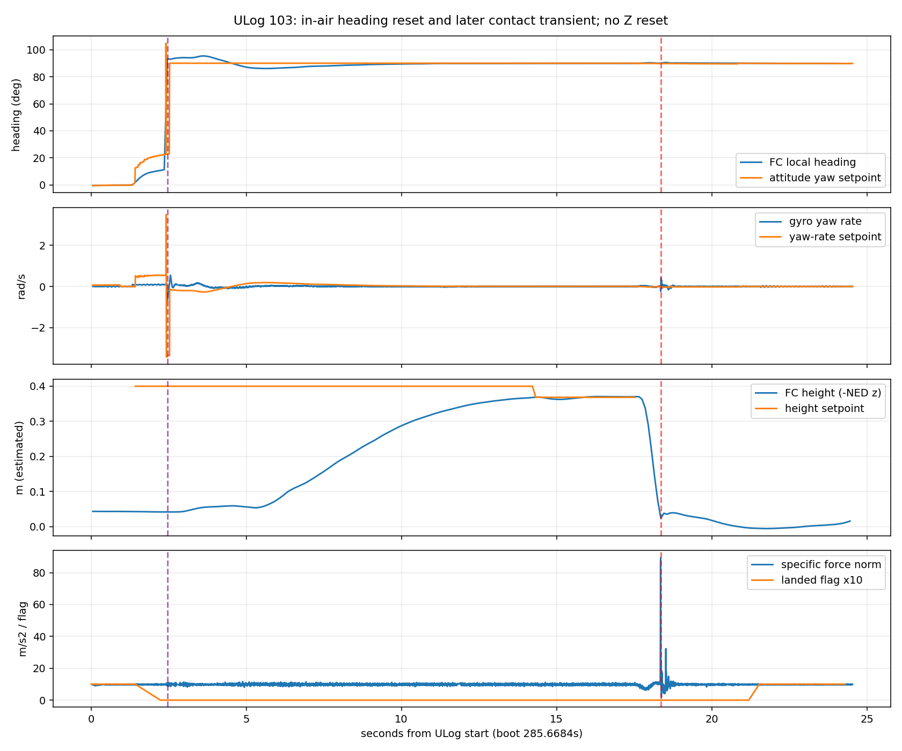
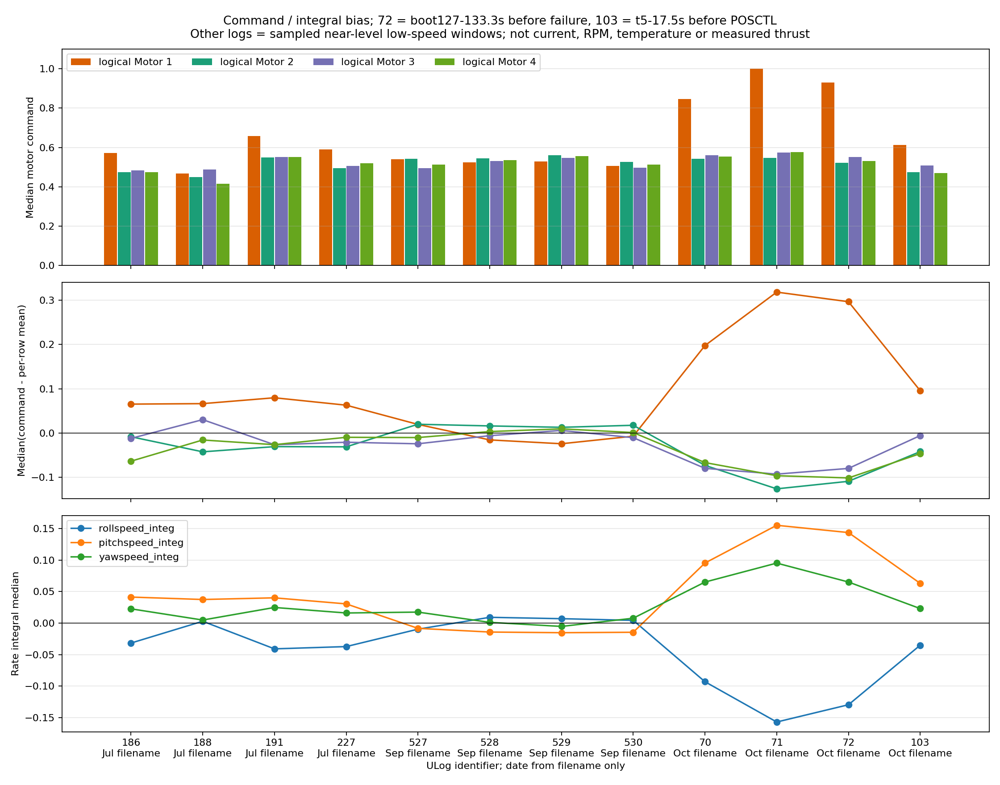

# 历史高度重置与一号电机发热诊断（2026-10-06）

**当前最值得优先检查的是前右一号动力支路的效率和一致性。** 10月4日70、71、72号日志在失事之前就有持续的一号高推力命令和姿态积分补偿；71号连续饱和约20.2秒。最新103号偏置减轻，但尚未消失。用户确认一号更热、位置为前右AUX1，并补充四个电机换过三个、无法确认具体更换位置。现有日志没有逐ESC电流、RPM或温度，尚不能在电机本体、电调、接线、桨和机体载荷之间确定唯一故障件。

**高度重置、航向重置和动力失衡须分别诊断。** 10月3日781号有明确的EV停融恢复高度重置；10月4日72号是失控冲击后才切换EKF和改变高度reset计数；103号没有Z/XY重置，却在起飞后发生约82°航向重置。因此不能用“所有问题都是飞控高度跳变”或“与LIO无关”概括这些飞行。

本次只读取本地日志、核对精确固件源码、保存报告；没有连接飞机、修改飞控参数、部署代码、启动ROS/仿真或输出执行机构命令。已有FAST-LIO性能补丁仍按[候选部署说明](https://github.com/Qinling-Melon-Farmers/liftrace-visionwork/blob/feat/r2026-competition-integrated/docs/deployment/lio_candidate_20261004/README.md)的实际部署状态判断，不把本地合入当成这些历史飞行已使用该补丁。

## 1. 素材与统计口径

原始素材位于视觉板端工作树的`试飞产物/`；原始ULog及解包文件不进入Git。

| 素材 | 内容 | 本次处理 |
| --- | --- | --- |
| `部分旧日志.zip` | 56份ULog：7月历史、9月527–530、UnknownDate7–9及UUID文件 | 全部解码；UUID文件与log46逐字节相同 |
| `motor.zip` | 186、188、191、227、527、528、529、530，共8份ULog | 全部与旧包重复；不是电机调试程序，也没有电机专用电流记录 |
| 直接ULog | 70、71、72、103，共4份 | 72为此前确认的失事日志；103为本地最新具名日志 |
| 已有参照 | 10月3日`px4_log781.ulg` | 与此前同步ROS诊断对照 |

新增输入68份去重后59份，另加781，共**60份独立日志**。高度/航向扫描覆盖60份；动力详细比较覆盖motor包8份加70/71/72/103，共12份。完整摘要见[逐日志统计](per_log_summary.csv)、[reset事件表](reset_events.csv)、[动力窗口与指标](motor_comparison.csv)。去重使用完整字节比较，没有新建文件哈希。

文件名、目录标签与飞机时钟存在不一致，本报告用PX4 boot秒排序，不把文件名时间当可靠UTC。初始非零reset计数代表日志开始前历史；仅统计窗口内计数变化。低频状态首次记录时间不等于内部精确执行时间。`landed=false`可滞后接地，不能据此把事故后的记录当正常悬停。

57份（含781）记录PX4 1.15.0 release标记、精确revision `30e763b6780061d70a14894e3e8b06e6a656f9b8`；UnknownDate三份为1.13.3，单独统计。详细动力比较的12份属于同revision、同FMUv6C设备；所查CA、输出映射、DShot及MC姿态/角速度PID没有跨日志变化，不代表所有参数或实物状态未变。

## 2. 高度reset在哪里出现，是否在事故之前

| 日志组 | 独立份数 | Z reset | 解释 |
| --- | ---: | --- | --- |
| 7月具名历史 | 48 | 0 | 39份实际EV未融合；9份开启EV，其中186/188/191/227有实际空中样本且无Z/XY/yaw/VZ重置 |
| 9月527–530 | 4 | 0 | EV高度/位置/yaw实际开启；530另有空中yaw reset |
| UnknownDate，1.13.3 | 3 | 1次，地面约0.154cm | 与启动实例切换重合，EV未融合；不能套1.15事件字段或算成9月飞行高度故障 |
| 10月4/5日70/71/72/103 | 4 | 仅72有1次selected变化，ENU +4.43cm | 发生在失控冲击之后的实例切换；70/71/103无Z变化 |
| 10月3日781参照 | 1 | 6次空中重置 | EV停融→恢复参考高度，ENU +7.11/+13.04/+37.64/+52.42/+27.70/+2.94cm |

781每次先记录`vision_data_stopped`及EV停融，再恢复EV高度/水平位置，yaw晚约375–592ms恢复。此前匹配ROS数据已重建两次大高度跳变：恢复时yaw尚未融合，位置的三维姿态差旋转使水平分量泄漏到Z；约4.4°俯仰差可解释37.64/52.42cm量级。该数值重建仅对已匹配的781成立，不能套到缺同步ROS的旧日志。相关[原诊断](https://github.com/Qinling-Melon-Farmers/liftrace-visionwork/blob/feat/board-deployment-flight-20260920/docs/deployment/board_redeploy_20261001/PX4_JUMP_ULOG_171424_20261003.md)和精确固件的[EV控制](https://github.com/PX4/PX4-Autopilot/blob/30e763b6780061d70a14894e3e8b06e6a656f9b8/src/modules/ekf2/EKF/ev_control.cpp)、[高度融合](https://github.com/PX4/PX4-Autopilot/blob/30e763b6780061d70a14894e3e8b06e6a656f9b8/src/modules/ekf2/EKF/ev_height_control.cpp)一致。

72号的因果顺序如下，不能反向解释：

| PX4 boot秒 | 观测 |
| ---: | --- |
| 127–133.3 | 一号命令已长期偏高，中位0.931；其余三路约0.52–0.55 |
| 133.356944 | 高度目标从1.8降至0.8m |
| 133.363076 | 总推力指令先下降，NED z推力约−0.635→−0.372 |
| 133.684941 | 一号命令首次达到1.0 |
| 133.782359 | 扭矩/推力分配未完成、一号上限饱和、二号下限饱和 |
| 133.933860附近 | 实际roll rate约+1.60，纠正目标约−2.13rad/s，实际运动与纠正方向相反 |
| 134.252796 | 比力峰145.61m/s²，强冲击 |
| 135.260515 | 主EKF由0切到1，晚于冲击约1.01秒 |
| 135.276877 | selected Z reset计数变化，ENU仅+4.43cm |
| 136.217946 | 已非主实例0的新信息事件批次同时含EV与baro高度reset；其后非主实例位置记录大变化 |
| 139.575813以后 | RC Kill/锁定，晚于冲击约5.33秒 |

补充修正原事故说明：136.217946的新事件批次并非仅baro，`reset_hgt_to_ev`与`reset_hgt_to_baro`同为1。这个更正不改变“已非主实例、发生于冲击之后”的因果判断。事件布尔为真可能是重发旧快照，也可能在计数增长后代表同类型新事件；必须看`information_event_changes/warning_event_changes`，不能只数true或仅数上升沿。依据为精确版本的[事件发布实现](https://github.com/PX4/PX4-Autopilot/blob/30e763b6780061d70a14894e3e8b06e6a656f9b8/src/modules/ekf2/EKF2.cpp)。

7月`EKF2_HGT_REF=1`是GNSS参考偏好，GNSS高度实际未融合，baro高度开启，参考代码可fallback至baro；9月及10月为`HGT_REF=3`、EV参考。该配置差异与场景、负载、链路都可能有关，不能凭“7月没跳”就直接宣布改回baro会解决现有问题。所有现代日志EV速度融合均为0，即使`EV_CTRL=15`请求速度融合。参数允许不等于实际存在有效观测。[官方参考选择](https://github.com/PX4/PX4-Autopilot/blob/30e763b6780061d70a14894e3e8b06e6a656f9b8/src/modules/ekf2/EKF/height_control.cpp)

## 3. 独立发现：起飞后大航向reset仍存在

| 日志 | 起飞/landed变false附近boot秒 | heading counter首次变化 | Δyaw | Z/XY变化 |
| --- | ---: | ---: | ---: | --- |
| 530 | 205.151178 | 205.420889 | −96.39° | 无 |
| 70 | 403.332224 | 403.907673 | −112.78° | 无 |
| 71 | 545.414126 | 545.798921 | +74.28° | 无 |
| 103 | 287.901995 | 288.126558 | +82.26° | 无 |

这四轮EV yaw状态始终为1，reset后yaw创新拒绝很快清零。精确固件允许yaw处于active状态但长期拒绝观测，在融合超时后执行yaw reset；因此`cs_ev_yaw=1`不能证明每帧yaw观测融合成功。当前数据支持这一机制候选，但缺原始EV姿态、reset_counter和yaw aid-source，尚不能区分初始磁航向与EV坐标原点不一致、源reset、观测异常等具体触发。[官方EV yaw实现](https://github.com/PX4/PX4-Autopilot/blob/30e763b6780061d70a14894e3e8b06e6a656f9b8/src/modules/ekf2/EKF/ev_yaw_control.cpp)

103高频`vehicle_attitude`在288.086秒已经记录quat reset，较低频local-position在288.126558秒记录heading reset。这是估计参考变化，不能理解成机身真的瞬间转动82°。期间yaw-rate目标出现短时约±3.4rad/s脉冲，随后yaw目标回到90°；实际gyro没有相应的82°瞬间物理转动。应进一步核对地面yaw对齐和外部任务目标在reset时的处理。

103末段303.212587秒先由OFFBOARD转POSCTL；304.021613秒、估计高度接近地面时出现89.37m/s²比力峰，307.201080秒landed才变真，309.207秒按落地上锁，之后才Kill。其模式/下降/冲击顺序更像接管后的落地接触，现场尚未确认具体接触对象；不能仅凭加速度峰直接定性为电机停转或另一场失控事故。动力统计截在303.1684秒之前，排除了这个阶段。

7月52/53/60/62也存在大yaw reset，但当时EV各分量均未融合，不能归因于LIO。因而航向reset必须结合具体融合源逐轮判断。

## 4. 一号动力异常早于72号失控，103仍有偏置

表中为`actuator_motors.control[]`的无量纲命令中位数，**不是电流、RPM、实际推力或功率**。7月/9月及70/71选择已解锁、未检测接地、姿态接近水平且估计低速的至少1秒连续段；72使用事故前boot127–133.3秒；103使用boot290.6684–303.1684秒。窗口和样本量均在CSV内。不同飞行的载荷/地效/电池/维护状态不同，这些窗口用于发现明显偏置，不构成严格同工况动力台架试验。

| 日志 | M1前右 | M2后左 | M3前左 | M4后右 |
| --- | ---: | ---: | ---: | ---: |
| 186 | 0.572 | 0.474 | 0.482 | 0.474 |
| 188 | 0.468 | 0.450 | 0.487 | 0.416 |
| 191 | 0.658 | 0.549 | 0.552 | 0.552 |
| 227 | 0.589 | 0.494 | 0.506 | 0.519 |
| 527 | 0.540 | 0.543 | 0.496 | 0.513 |
| 528 | 0.524 | 0.544 | 0.530 | 0.535 |
| 529 | 0.529 | 0.561 | 0.548 | 0.555 |
| 530 | 0.506 | 0.527 | 0.497 | 0.512 |
| 70 | **0.847** | 0.542 | 0.560 | 0.555 |
| 71 | **1.000** | 0.547 | 0.575 | 0.576 |
| 72，事故前 | **0.931** | 0.522 | 0.551 | 0.530 |
| 103，末段前 | **0.613** | 0.473 | 0.510 | 0.469 |

71在boot549.499–569.702秒记录一号上限饱和，连续约20.2秒；72失控前虽然未持续饱和，已经只有很小的进一步增推力余量。103没有一号饱和，不能据此宣称动力完全正常。

71的roll/pitch/yaw rate积分中位约−0.157/+0.155/+0.095；72事故前为−0.129/+0.144/+0.065；103为−0.035/+0.063/+0.023。roll负、pitch正的补偿与前右一号增推力的配置方向吻合，说明控制器正在补偿持续偏差，而非下游某一路凭空收到随机高输出。积分本身不能证明PID错误，也不能区分弱电机、ESC、桨、重心或推力轴问题。

103的一号偏置在yaw reset之后数秒逐渐建立，并非reset瞬间立即升高；9月530即使有约96°yaw reset，后续四路仍相对均衡。现有证据不足以把长期一号偏置解释为航向reset的直接后果。

历史变化不是单调恶化：7月有一定偏置，9月减轻，10月4日很严重，103又减轻。用户补充三台电机更换身份未知后，尤其不能把跨月记录当成同一台电机的连续寿命曲线，或把某次改善直接归功于换件。

## 5. 输出编号和故障检测为什么不能直接诊断电流

| 逻辑电机 | control索引 | AUX接口 | 活动actuator_outputs组中的索引 | 配置期望旋向 |
| --- | ---: | --- | ---: | --- |
| M1前右，用户已确认 | 0 | AUX1 / function101 | 0 | CCW |
| M2后左 | 1 | AUX4 / function102 | 3 | CCW |
| M3前左 | 2 | AUX2 / function103 | 1 | CW |
| M4后右 | 3 | AUX3 / function104 | 2 | CW |

输出数组顺序为M1/M3/M4/M2，不能把output[1]当二号电机。CA位置参数±1是配置几何值，不是测得一米机臂。[官方功能映射](https://github.com/PX4/PX4-Autopilot/blob/30e763b6780061d70a14894e3e8b06e6a656f9b8/src/lib/mixer_module/functions/FunctionMotors.hpp)

`PWM_AUX_TIM0=-3`对应DShot600；驱动值0为解除武装，活动上限1999。1999不能写成1999微秒PWM，也不是实际转速。103和72主要变化在actuator_outputs instance1，其他实例可能只有初始化快照。[官方DShot实现](https://github.com/PX4/PX4-Autopilot/blob/30e763b6780061d70a14894e3e8b06e6a656f9b8/src/drivers/dshot/DShot.cpp)、[输出常量](https://github.com/PX4/PX4-Autopilot/blob/30e763b6780061d70a14894e3e8b06e6a656f9b8/src/drivers/dshot/DShot.h)

12份动力日志均无ESC遥测，`DSHOT_TEL_CFG=0`。`fd_motor/motor_failure_mask=0`不能排除电机故障：该版本检测依赖ESC状态更新和有效电流反馈，重点检测遥测超时/欠电流，不是通用过热或高电流检测；`fd_imbalanced_prop`也不是四路命令差值检测。分配器的`torque_setpoint_achieved=true`仅说明配置模型能分配目标，不代表真实电机产生了目标扭矩。[官方故障检测](https://github.com/PX4/PX4-Autopilot/blob/30e763b6780061d70a14894e3e8b06e6a656f9b8/src/modules/commander/failure_detector/FailureDetector.cpp)

## 6. 故障来源的当前排序及最有区分力的检查

| 候选来源 | 当前支持与限制 | 区分方法 |
| --- | --- | --- |
| 电机/替换件效率或规格不同 | 用户观察一号更热；三台换件身份未知；一号长期需要较高命令。优先级高，但没有逐路电流、RPM或推力测量 | 逐臂记录型号、KV、尺寸及更换信息；断电对比轴承、轴偏、螺丝碰绕组、擦碰/变色；后续同条件台架比较 |
| ESC、相线及供电支路 | 同样可使一号实际增推力不足或损耗增加；缺遥测无法排除 | 断电检查焊点/插头/相线及发热位置；对比ESC型号/固件/设置；后续单独交换ESC或支路，观察异常是否跟随 |
| 桨、推力轴、重心 | 可形成固定机臂补偿；用户说载荷等基本未改，降低近期大载荷变化的解释力，仍未实际测量 | 核对正反桨、型号、安装面、变形/松动、臂扭曲；按真实装机载荷检查重心 |
| 飞控控制/校准/输出链 | 相同PID/映射、平滑补偿和真实rate跟踪失败更支持对持续偏差的纠正；尚未证明飞控输出硬件无故障 | 已知良好电机+ESC对照后，若问题仍固定于机臂/输出，分离机体因素与FC通道；同步观测物理DShot信号及反馈 |
| EV/LIO及航向reset | 对781高度异常有明确关联；70/71/103大yaw reset需独立查。不能解释为72失控前Z reset，因为当时无此记录 | 补齐原始EV和aid-source，再验证输入年龄、yaw对齐、reset传播及任务坐标处理 |

建议先做**断电、拆桨的四臂检查与部件登记**，尤其查一号电机铭牌/KV、轴承/擦碰、绕组与安装螺丝，随后查一号ESC和相线。区分“电机定子更热”“轴承更热”“ESC更热”“插头更热”；它们对应不同候选。普通万用表不能精确测量毫欧级绕组差异，磁阻感也不能直接当轴承故障。

真正区分电机本体与ESC，需要之后另行授权的受控台架对照，每次只改变一个部件，保持正确旋向/桨与相同输入，记录RPM、电流、实际推力和温升：异常跟随电机则优先电机；跟随ESC/供电支路则优先该支路；跟随桨则查桨；只固定在原机臂则查机体与重心；在移除机体因素后仍跟随FC输出通道才重点查飞控输出。拆桨空载正常不能证明带载推力、失步和热裕量正常。本轮没有执行这些动作，也没有通过限制一号输出或减小积分掩盖补偿需求。

## 7. 观测缺口和下一轮采集内容

全部60份缺`vehicle_visual_odometry`、`estimator_aid_src_ev_hgt`和`estimator_aid_src_ev_yaw`。103即使`SDLOG_PROFILE=273`仍没有这些流，不能仅调整profile数字就宣称原始EV已记录。后续停机配置时应显式配置并验证实际话题入日志，保留reset counter、观测时间戳、融合时间、创新、拒绝原因，同时录ROS `/Odometry`、实际EV发送入口、MAVROS local pose和任务目标。实际话题名与当前部署接口核对，不能凭示例替换现场配置。

103有10条logger dropout、总时长538ms、最长320ms，其中包括0ms项；同时没有Z/XY重置或EV停融。logger缺口不自动等于LIO队列积压、EV输入断流或控制停止。反之，781未见logger dropout但有明确EV停融，二者应各自统计。现有ULog无法直接量化FAST-LIO主线程/队列/丢弃性能，须用板端realtime诊断及同步ROS日志补齐。

电池6S配置与多轮电压尖峰不自洽（70最大35.98V，103最大28.51V）；电压比例跨月也变过。总电流字段不可分摊成一号电流；电源模块读数异常不能证明真实供电正常，也不能把所有读数一概作废。后续应以独立测量核对母线、电源模块及比例。72的5V低频记录未见掉电/过流标志，但采样不足以排除短暂支路故障。

验证已完成：60份ULog重新解码并核对五类reset计数、实际融合覆盖及事件时序；12份动力日志核对输出映射和参数，人工查看关键图；103统计剔除接管及接触尾段；精确固件源码交叉核对事件重发、DShot单位和故障检测边界。结果摘要和小型图表进入仓库，原始ULog、完整JSON和解包产物保留ignored目录。

本地复算产物在视觉板端工作树`logs/reset_motor_diagnosis_20261006/`：`input_manifest.json`保存来源，`reset_agent/`保存全量reset分析，`motor_agent/`保存12份动力分析，`latest103/`保存主代理独立时序和图。按仓库约定激活`rl_drone`后可运行这些目录中的离线脚本；没有硬件或ROS启动命令。
