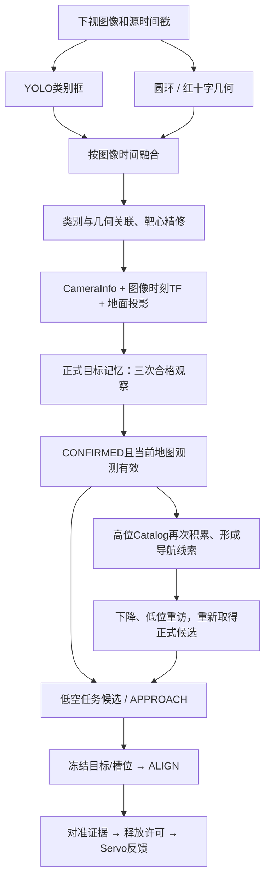
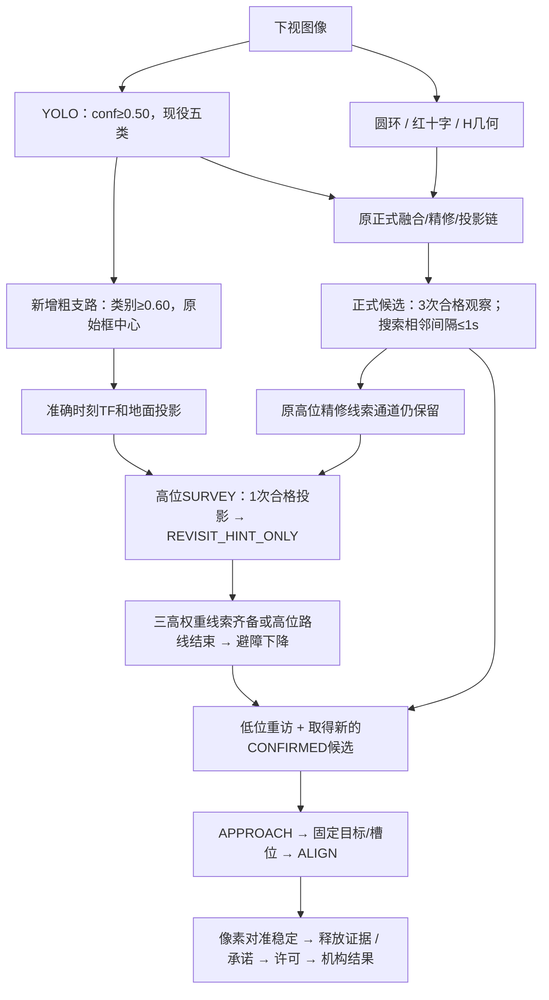

# 视觉链修改前后：工作流、最终阈值与适用范围

2026-09-26。对比本研究分支 `8fa30c5`（本轮放宽前）与 `a401175`（当前代码，含 `f2949f0` 粗线索/确认间隔改动及后续 tank 过滤）。这里的“之前”不是2025旧视觉，也不是把某一份板端bag当作当前研究整机。

**本轮改变的是搜索准入：高位新增一次类别框即可形成导航线索的支路；低位搜索把三次合格观察的相邻间隔放宽到1秒；现役检测输出过滤tank。YOLO基础置信度、正式几何确认、对准稳定次数和释放互锁没有一起降低。**

本次依据：git前后差异、检测/融合/任务/释放源码，以及对当前 `fov_inner_repair.launch` + seed2672快走廊场景的**离线XML参数展开**。未启动ROS节点、仿真、训练或实机。完整生效参数子集见 [effective_parameters.json](effective_parameters.json)；代码中未写进参数服务器的默认值在下文另标。

## 1. 哪个版本、哪个入口

| 范围 | 本文如何解释 |
|---|---|
| 当前研究完整入口 | `fov_inner_repair → fast_comparison → full_strategy → navigation_horizontal_search_vcl06 → navigation_search_delivery_vcl06 → guarded/Phase D` |
| 场景覆盖 | `docs/verification/fov_landing_inner_20260919/seed_2672`；2.6m、快走廊；场景最后加载的frame/repair覆盖同样生效 |
| 底层独立Phase D | 默认对准3次、高位粗支路关闭、搜索间隔放宽关闭；不能把其默认值当完整整机生效值 |
| 试飞组“板载代码” | 此前核对到 `e94d0a7`；本轮研究改动没有覆盖该分支或实机。19:12包是低空最简投递测试，不是高位记忆闭环实飞 |
| 相机和高度 | 当前场景使用已有CameraInfo/安装TF，任务系camera_init、ground_z=-0.22。AGL=local Z-ground_z；板端必须用其已建立的地面参考，不照搬-0.22 |

## 2. 修改前：高位和低位都受正式候选链约束

标准靶（bridge、panzer、pillbox、tent）必须同时有合适类别框和圆环关联；红十字必须有YOLO类别与红色十字几何的双路重叠结果。类别框单独出现，可能显示在原始检测视频里，但不能一路变成正式地图候选。

旧高位 `candidate_min_streak=1` 只降低导航入口读取候选时的计数门槛，**没有取消state=CONFIRMED、有效地图和关联检查**；而上游target_memory仍需三次合格观察。后面的高位Catalog还有三次采样/时间跨度要求。因此不能根据这个“1”判断以前已能用一次YOLO结果记住目标。

旧低空搜索按处理后的合格观测连续计数；一帧完整融合结果没有该合格目标，就打断命中串。不是相机原始30FPS的每一帧都参与计数，也不是缺席分支的未完成融合帧必然算漏检。

## 3. 当前：高位粗记忆与正式投递链分离

新增话题 `/uav_vision/navigation_hints` 由现有target_map_projector发布，不另建一套飞行状态机。消息标记 `center_source=bbox_navigation_only`，geometry_verified/center_refined/association_valid均为false，map_quality=0；此处map_valid只表示射线投影成功。它不进入target_memory、drop_aligner或release_evidence。

这条支路同时适用于标准靶和red_cross；高位不需要等蓝环或红十字几何。但必须是合格的类别、投影和时空条件，不是保存任意低分框。低位仍重新观察，不拿高位框中心当投递靶心。

| 本轮变化 | 修改前 | 当前完整研究入口 |
|---|---|---|
| YOLO输出置信度 | 0.50 | **仍为0.50** |
| 单次YOLO+有效投影可否形成高位线索 | 不可；依赖正式CONFIRMED链 | 可；类别≥0.60，独立导航线索 |
| 高位是否必须圆环/十字几何同时成立 | 正式链需要 | 新粗支路不需要；原精修支路仍需要 |
| 低位确认次数 | 3次 | **仍3次** |
| 低位搜索有效命中间隔 | 处理后的漏检打断连续计数 | 相邻合格源图像≤1.0s可累计 |
| 当前观测/TF/地图准入 | 检查 | 保留；漏检当前帧map_valid仍为false |
| 对准稳定次数 | 完整入口5次 | **仍5次**，不是基础YAML的3次 |
| 投递许可/槽位/释放反馈 | 原互锁 | 本轮不变 |
| tank | 检测器仍可输出，2026候选层已排除 | 检测器也过滤；历史六类权重编号不改 |

## 4. 图像输入与粗检测

笔记本使用PT/GPU；板端使用RKNN/NPU。图像订阅queue_size=1，避免推理队列无限积压。当前核对场景的实际图像为 `/downward_camera/image_raw`，投影/对准CameraInfo为 `/downward_camera/camera_info`。

| 参数 | 当前值/行为 | 修改前后 |
|---|---|---|
| `conf_threshold` | 0.50；这是类别框输出门槛 | 不变 |
| `imgsz` | 640；保持既有letterbox/模型输入契约 | 不变 |
| NMS IoU | RKNN显式0.45；PT代码未传iou，本机Ultralytics默认0.70 | 不变；不能混称两者都是0.45 |
| 现役类别 | bridge、panzer、pillbox、tent、red_cross | 本轮上移至检测输出过滤 |
| 历史权重编号 | 0 bridge、1 panzer、2 pillbox、3 tent、4 tank、5 red_cross | 不改；未训练五类新权重 |
| 原始框几何字段 | 框中心；精修/几何验证/关联均false | 不变，不能直接释放 |
| 无检测帧 | 仍发送该检测源完成标记和空数组 | 不变，含仅tank被过滤的帧 |

旧统一六类网络仍在计算；过滤输出不等于减少统一模型推理量。r2026不再加载独立旧tank模型；显式 `class_profile=full` 保留历史回归。Gamma、CLAHE和旋转仅做过离线诊断，当前在线预处理和权重未因此更换。

源码：[PT检测器](../../../vision_ws/src/uav_vision/scripts/target_detector.py)、[RKNN检测器](../../../vision_ws/src/uav_vision/scripts/target_detector_rknn.py)。

## 5. 正式融合、几何精修与地图投影（前后不变）

### 5.1 融合不是要求所有检测器完全同一纳秒

| 机制 | 生效值/含义 |
|---|---|
| 源图像同步容差 | ≤0.05s；按图像时间，不是按回调到达时间随意拼接 |
| `flush_delay` | 0.80s；从首个检测分支到达算兜底等待，所需分支均完成就立即发出，不是每帧固定增加0.8s |
| 正式候选完整性 | require_complete_detection_sources=true；超时不完整帧可供诊断，不当正式确认输入 |
| 搜索模式 `disabled` | YOLO、circle、cross分支均声明完成；**不是要求三者每帧都检出目标** |
| `drop_circle` | YOLO+circle完成 |
| `drop_cross` | YOLO+cross完成 |
| `landing` | H几何分支完成 |
| 同类/红十字双路重叠 | IoU≥0.30 **或**中心距≤0.35×尺度；尺度取相关ROI边长/圆直径 |
| 红十字正式链 | require_red_cross_dual_confirmation=true；单独YOLO或单独红色几何不进入正式resolved红十字 |

模式名disabled表示“没有在执行对准”，正常搜索检测仍开着。

标准靶refiner选质量≥0.70的圆环，按中心距离/尺度与圆环质量排序，贪心一对一关联。配置roi_margin=40px，max_center_distance_ratio=1.25；尺度为类别框宽/高、圆直径等的最大值。关联后以圆环中心替代类别框中心，类别身份仍保留；无关联则仅留诊断框、拒绝正式精修投影。

**重要的组合门槛：**标准靶精修几何分数取 `min(类别侧geometry_confidence, 圆环质量)`，而粗检测器把类别置信度也填入前者。因此后续标准几何≥0.70，实际也会把标准YOLO类别压到约≥0.70；表面看到的std_class=0.60不是唯一有效下限。红十字的类别分数与十字几何分数独立，不套用这个min规则。

### 5.2 投影条件

`像素中心 → CameraInfo去畸变/射线 → 图像时刻光学系至camera_init的TF → 与ground_z平面求交`。

| 参数/条件 | 当前值 |
|---|---|
| `rectify_input_pixels` | true；CameraInfo含畸变时先纠正像素 |
| `tf_timeout` | 0.05s，TF查询等待上限 |
| `allow_latest_tf_fallback` | false；不能随便拿最新位姿替代拍照时刻 |
| `max_latest_tf_age_sec` | 0.10s；仅显式启用fallback时适用，不是当前默认在用fallback |
| `ray_z_epsilon` | 1e-5；拒绝近乎平行地面的射线 |
| 正式投影 | 必须center_refined、association_valid等满足；CameraInfo/TF缺失、交点在相机后方或非有限值均无效 |
| map_quality | 由几何质量形成；与有效投影、类别阈值一起使用 |
| 坐标原点/外参 | 当前camera_init、ground_z=-0.22；仅是所展开仿真场景，不代表板端通用值 |

地图坐标正确与否仍依赖实际安装方向、时间同步、飞控/相机高度基准和地面平面。粗支路放宽几何，不会自动校准外参。

源码：[融合](../../../vision_ws/src/uav_vision/src/uav_vision/detection_fusion.py)、[refiner](../../../vision_ws/src/uav_vision/scripts/target_refiner.py)、[投影](../../../vision_ws/src/uav_vision/scripts/target_map_projector.py)。

## 6. 正式候选记忆与低空接近

### 6.1 每次“合格观察”的质量要求

| 目标 | 类别置信度 | 几何置信度 | 其他要求 |
|---|---:|---:|---|
| bridge/panzer/pillbox/tent | ≥0.60；受上节min规则影响，实际通常还须≥0.70 | ≥0.70 | 类别+圆环关联、精修、有效当前地图 |
| red_cross | ≥0.80 | ≥0.70 | YOLO+红色十字双路确认、有效当前地图 |
| circle/H辅助候选 | 使用辅助几何门槛 | ≥0.80 | 几何验证、精修；权重为0，不主动触发投递 |
| 正式确认 | 三次合格观察 | — | DETECTED → OBSERVING → CONFIRMED |

三个状态不等于已经APPROACH；导航仍会检查任务阶段、候选年龄、几何可达性、类别是否已投/已排除以及剩余预算。

### 6.2 本次怎样允许间断观察

仅 `align_mode=disabled` 的搜索/低位重捕启用1秒间隔。例：0.00s、0.60s、1.40s各有一次合格观察，相邻0.60/0.80s，可累计三次；中间有空帧也不马上丢失计数。若只有0.00s一次，再没有新证据，不能凭等待或重复消息变成三次。

- 超过1秒后再命中重新计数；同一源图像重复/倒序不增计数。
- 空帧马上令当前map_valid=false。保留命中串或长期地图，不代表可用陈旧点接近。
- 进入drop_circle/drop_cross/landing时重置短期确认，仍保持原严格连续观察方式；保留物理ID/长期坐标。
- 当前候选/被选目标新鲜度仍≤0.50s。1秒是“允许漏检的相邻命中间隔”，不是1秒陈旧数据的行动/释放许可。

### 6.3 身份、生命周期及任务准入阈值

| 项目 | 值 |
|---|---|
| 地图跨帧匹配、收敛合并 | 各0.70m；匹配距离为3D距离，源码用严格小于 |
| 无有效地图时的兼容像素匹配 | 80px；两次都有地图但地图距离不匹配时，不再靠像素位置强行合并 |
| 类别切换 | 新类连续2次、置信度≥0.70，并满足累计置信度投票比≥1.0 |
| 非地图候选TTL | 3s；地图记忆TTL=0表示保留至reset，仍受行动新鲜度门槛约束 |
| 拒绝冷却 | 5s；并非保证五秒后一定再次接近 |
| 导航正式候选 | CONFIRMED、min_streak=3、年龄≤0.50s、TF年龄≤0.50s、地图有效、关联有效、frame一致、无reject_reason、时间/数值合法 |
| 任务目标Z上界 | local Z≤4.0m；是候选数据检查，不是巡航高度命令 |
| 权重 | red_cross10、panzer2.5、bridge2、pillbox1.5、tent1；circle/H0；tank不在r2026可选集合 |

circle与panzer同时有不同ID是既有设计：语义目标和几何辅助目标不属于同一地图身份组。refiner在当前观测中把圆心关联给类别；drop_circle再按冻结语义目标附近的圆环对准。**“两个ID”不等于关联一定失败，也不能只凭两个框认定正式候选成立。**

另有原有层间差异：fusion的bridge冲突抑制默认关闭，但target_memory的red_cross/H存在时抑制bridge开关为true。两处名字相同、层次不同，未被这次放宽统一或取消。

源码：[target_memory](../../../vision_ws/src/uav_vision/scripts/target_memory.py)、[导航候选验证](../../../patrol_uav_ws-patrol_planner/src/uav_mission/src/uav_mission/mission_core.py)。

## 7. 高位两种线索的完整门槛

| 条件 | 旧精修/Catalog通道（现在也保留） | 新粗框通道 |
|---|---|---|
| 输入 | 正式CONFIRMED候选 | 原target_detector类别框的独立粗投影 |
| 阶段 | SURVEY | SURVEY，显式开启coarse_enabled |
| 类别 | 正式候选门槛，再要求Catalog≥0.70；红十字上游仍≥0.80 | ≥0.60，五个现役类且未完成投递 |
| 几何/圆环 | 上游必须合格 | 不要求 |
| 地图质量 | ≥0.50，且上游正式投影合格 | 不冒充几何质量；只检查有效粗投影 |
| 源图像年龄、TF年龄 | ≤0.50s、≤0.10s | 相同 |
| 位姿年龄 | ≤0.50s | 相同 |
| 重复证据 | Catalog≥3次；相邻采样至少0.10s、总跨度≥0.20s，观测间隔过大2s重置相应积累 | 一次合格观测即可形成线索；旧/重复观测不重复加强 |
| 类别一致性 | 同类观测次数占比≥0.80 | 使用导航记忆的同类异位置/异类同位置冲突处理 |
| 位置不确定度 | 样本散布+原观测半径0.20m，最终≤0.45m | 固定预算0.45m，**不是测量得到的最大误差保证** |
| 高度窗口 | Catalog从2.0m AGL起；任务另要求已确认升高或达到high_agl-0.20m | AGL≥max(2.0, high_agl-0.20)，上界high_max_agl |
| 当前场景上界 | frame_overrides最终覆盖high_max_agl=3.3m | 同左；基础policy为3.0，**不是命令飞机飞3.3m** |
| 记忆容量/时效 | Catalog至多16个物理键，每键8个样本；本任务TTL600s | 复用至多五类NavigationMemory及同任务TTL |

对2.6m目标高度，新增粗通道实际观察窗口为2.4–3.3m；若该场景设3.0m目标则下界2.8m。单独不带frame_overrides的full_strategy基础上界仍3.0m。本文说的是检测准入窗口，实际飞行另受航线、控制上界和避障约束。

Catalog还会排除位置不确定度圆相互重叠的歧义线索。两路最后汇入同一NavigationMemory：合并半径0.60m；精修线索优先于附近粗线索。同类远处新位置或类别冲突会暂停对应类的可用线索，并保留至多两个位置供低空复核，不直接拿冲突点投递。

桥、装甲车、红十字三类都有可用无冲突线索，且升高阶段完成，可提前中断高位；否则继续既定高位路线。结束后从当前位置评估合法下降位置（搜索半径1.5m，最多25个提议），通过原避障规划下降，不必默认返回最初升降点。完整策略已没有早期probe独立45秒到时结束的限制，服从整场600秒及动作预算。

低位重访：目标巡航1.4m AGL；到重访点进入REACQUIRE，默认最多15s。必须取得重捕开始以后、与线索同类、距离≤0.60m且唯一匹配的正式候选，当前高度与低位目标差≤0.20m，再过APPROACH边界/可达性检查。每类最多两次重访；失败先延期、处理其他线索，再按局部复核/补搜规则降级。一次高位线索不保证一定低位CONFIRMED。

源码：[高位策略](../../../patrol_uav_ws-patrol_planner/src/uav_mission/src/uav_mission/high_view_full.py)、[重捕](../../../patrol_uav_ws-patrol_planner/src/uav_mission/src/uav_mission/high_view_probe.py)、[Catalog](../../../vision_ws/src/uav_high_view/src/uav_high_view/core.py)、[策略参数](../../../vision_ws/src/uav_high_view/src/uav_high_view/survey_policy.py)、[导航记忆](../../../vision_ws/src/uav_high_view/src/uav_high_view/navigation_memory.py)。

## 8. 接近、对准、下降与释放：本轮没有放宽

正式任务冻结mission、decision、目标ID/首次出现时间、类别、attempt和slot后才进入对准。标准靶使用附近合格circle作精修几何；红十字对准锁定的red_cross。不能以图中任意一个圆环代替当前任务的目标。

| 项目 | 完整入口生效值 |
|---|---|
| 对准参考中心 | 优先CameraInfo主点；640/480仅是缺CameraInfo时的兼容回退，不是本相机固定中心 |
| 像素中心误差 | 欧氏距离≤30px；不是30cm，物理误差近似随相机离地高/focal变化 |
| 稳定次数 | **5次有效对齐更新**；基础drop_aligner.yaml/Phase D为3，guarded上层覆盖5 |
| 最低置信度、目标年龄 | ≥0.60、≤0.50s；辅助circle还受正式记忆≥0.80几何门槛 |
| alignment context | 必须存在；新鲜度≤0.50s、watchdog20Hz；只接受ALIGN=2及有效租约/任务/目标/槽位 |
| 标准圆环至冻结靶点关联 | ≤0.80m；选对应语义目标附近几何，不合并两者ID |
| 红十字关联 | 要求冻结目标ID/first_seen一致 |
| 释放视觉证据年龄 | ≤0.50s |
| 位姿/控制状态年龄 | 各≤0.50s；控制状态需Aligning=2 |
| 释放许可 | 20Hz评估；每条validity=0.25s；旧控制读取许可还要求年龄≤0.20s |
| 释放高度窗口 | 飞控local Z∈[-0.05, 0.30]m；当前ground_z=-0.22时AGL为0.17–0.52m |
| 下降设定高度 | local Z=0.10m；该场景AGL约0.32m，不等于实物离地10cm或必在该精确高度释放 |
| 已建立释放承诺的漂移上限 | 相对锁定点水平≤0.20m；继续保持同一上下文、及时位姿/状态和未到期decision |
| 承诺时限 | 正式VCL06服从Manager decision deadline；YAML的45s只用于旧无上下文兼容入口 |
| 执行反馈 | 指定槽号、不可重放/重复成功；raw服务失败不能计为投递成功 |

**既有“释放承诺”需要单独说明：**先由当前目标的合格、稳定、对准证据锁定投递上下文及位置；随后下降时即使靶标放大出视野，也可在漂移/上下文/时效等约束仍满足时继续完成该次释放。它不允许只凭高位粗框、未确认目标或过期任务创建承诺。

旧控制里还看到drop_height_threshold=0.20、position_threshold=0.15和descent_stable_duration=2等参数。不能把这些机械地叠进当前外部任务模式：`dropReleaseReady` 的外部模式走强制mission许可分支，不用旧几何条件单独放行；真正有效的释放高度许可见上表。稳定样本的旧70/50次等待也不等于当前高位整机的YOLO确认次数。

当前对准参考仍先使用视觉主点，槽位偏移在控制侧联动；本轮没有实现新的“槽口误差进入视觉释放许可”的几何闭环。是否已补到真实一/二/三号物理槽口，应结合板端标定和 [槽位核查](../../deployment/drop_slots_20260926/REPORT.md)，不能仅看drop_ready宣称包裹精确落靶。

关于计数，“5次有效对齐更新”是drop_aligner的回调计数口径，不额外宣称它独立检查了5个不同原始图像时间戳；target_memory的搜索去重与H降落的时间戳去重是另外两处明确实现。

源码：[drop_aligner](../../../vision_ws/src/uav_vision/scripts/drop_aligner.py)、[释放参数](../../../patrol_uav_ws-patrol_planner/src/uav_mission/config/release_guard.yaml)、[guarded完整入口](../../../patrol_uav_ws-patrol_planner/src/uav_mission/launch/toudi3_visual_delivery_guarded.launch)。

## 9. H降落支路

投递完成并过走廊后，由任务层发LAND，视觉进入landing模式。H几何→正式投影→控制侧H对齐，当前外部降落直接读取detections_mapped，并非一定先走普通投递候选的selected_target。

| 项目 | 当前完整场景 |
|---|---|
| H处理门控 | 仅landing模式 |
| 识别方法 | 外圈+内部H结构；完整入口还开启H笔画兜底，基础YAML默认关闭 |
| H笔画最小尺度 | 24px；允许近距离外圈不完整时尝试H结构，不是任意黑斑兜底 |
| 捕获高度 | local Z=0.68m，即此场景AGL约0.90m；基础控制文件的0.28已被repair覆盖 |
| 水平误差 | ≤0.08m |
| H位置相对锚点范围 | ≤0.60m |
| 新鲜度 | ≤0.50s；要求LAND之后的新观测，重复/旧源时间戳不累计 |
| 稳定观测 | 10个新H观测 |
| AUTO.LAND切换高度 | local Z=0.18m，即此场景AGL约0.40m |
| AUTO.LAND重试间隔 / 降落watchdog | 1s / 120s |

有H候选不等于已落地；完成还须控制链/飞控落地反馈。H门槛没有因本轮高位粗检放宽而改变。

## 10. 底层CV阈值清单（本轮未改）

下面是启用配置的像素/形状阈值；不是YOLO概率。配置中的优选分数项也不能全部理解成独立硬拒绝条件。

### 圆环

| 项目 | 值 |
|---|---|
| 蓝色HSV | H90–130，S80–255，V80–255（OpenCV H量程约0–180） |
| 图像处理 | 保持宽高比letterbox至640×512，检测坐标映射回原图 |
| 高斯 / 开运算核 | 5 / 7 |
| 轮廓点数 / 椭圆短长轴比 | ≥15 / ≥0.85 |
| 半径范围 | 10–300px，指处理图尺度 |
| 几何质量 | ≥0.70 |
| 边界截断 | 拒绝 |
| 去重中心比例 / 数量上限 | 0.45 / 每帧12个 |

### 红十字

| 项目 | 值 |
|---|---|
| 红色HSV | H0–10或170–180；S、V均50–255 |
| 基础轮廓 | 面积≥200px²、轮廓点≥20；高斯核5 |
| 严格形状分支 | aspect_ratio_min=0.60；solidity=0.60–0.85 |
| 宽松评分分支 | 开启；最低3分；凹陷深度阈值10px |
| 宽松形状项 | solidity0.40–0.90；extent0.20–0.75；aspect最大2.0、优选≤1.4 |
| 十字覆盖项 | 最小0.30、优选0.50；凹点2–6、优选4 |
| 两分支共用进一步形状门槛 | 模板IoU≥0.70、旋转对称性≥0.72、凹点≥3 |
| 边界截断 | 拒绝，边缘余量3px |
| 黑色外圈检查 | false；正式红十字不依赖附加蓝白标准靶底板 |

### H

| 项目 | 值 |
|---|---|
| 预处理 | 高斯5、自适应阈值block31/C10、形态学7 |
| 外圈轮廓 | 点数≥15、短长轴比≥0.85、椭圆填充率≥0.70、半径15–300px |
| 内部区域 | 相对外圈缩至0.78；黑色S≤90、V≤110；开运算5 |
| H几何项 | 面积比0.10–0.70、aspect≥0.55、solidity0.25–0.80 |
| 凹陷 / 居中 | 凹点≥2、深度比0.04、中心距离比≤0.35 |
| 近距离H笔画兜底 | 完整入口true、最小尺度24px；基础YAML false |

来源：[圆环配置](../../../vision_ws/src/uav_vision/config/circle_detector.yaml)、[十字配置](../../../vision_ws/src/uav_vision/config/cross_detector.yaml)、[H配置](../../../vision_ws/src/uav_vision/config/landing_detector.yaml)、[H完整入口覆盖](../../../patrol_uav_ws-patrol_planner/src/uav_mission/launch/navigation_horizontal_search_vcl06.launch)。

## 11. 容易误读的五件事与本次发现

1. **框、候选、线索、许可是四种结果。** 检出panzer不代表CONFIRMED；一次高位粗线索足够导航重访，不足以释放；对准圆环不代表已核实任意类别。
2. **50ms、0.5s、1s、0.8s分别有不同对象。** 50ms是检测源图像同步；0.5s主要是行动证据年龄；1s是低位搜索相邻合格命中间隔；0.8s是缺分支融合等待兜底，不是把所有时间一起放宽。
3. **参数覆盖不能略过。** 实际完整入口对准5次、H笔画兜底开启、H捕获local0.68、高位观测上界3.3；基础YAML/类默认分别可能是3次、关闭、0.28、3.0。
4. **类别置信度和几何质量并未全面解耦。** 当前标准靶min规则会产生约0.70的有效类别下限；正式memory层bridge抑制仍存在。以后研究确认效率应明确改哪一层，不能只调YOLO0.50。
5. **refiner有一处既有ROI实现与变量名不一致。** `_association_score` 中circle_in_target调用的是“圆心是否在圆环自身ROI内”，不是类别框ROI；因此不能声称当前严格执行双向ROI包含。中心距≤1.25×尺度、质量与一对一配对仍在起作用。此段在8fa30c5已存在，与本轮粗支路无关；本次如实记录，不改变关联代码。多个邻近标准靶的错配应单独验证后再修，不凭本次文档核对归因已有bag。

## 12. 用19:12包解释本轮收益边界

去程首次经过只有一次panzer类别可靠检出，原RKNN约0.81、PT重推理约0.81；放宽相邻检测间隔仍凑不出三次低空正式确认。所以该包没有证明“目前已能去程触发panzer接近”。

**如果这样的单次结果发生在2.6m高位，并且投影、源年龄、TF、边界与类别冲突检查通过，当前就能保存一条粗重访线索。** 之后主动到其附近低位重新看，再用正式链确认/对准，这是本轮要改善的环节。该低空包本身不满足高位高度门槛，不能直接当高位策略验收。

返程出现更多panzer/圆环时，原任务已进入RETURN_HOME；“视觉能够确认”和“当前任务允许重新中断”是两个条件。报告不能把只出现检测框或返程confirmed改写为已经成功投第二靶。

目前已完成源码与离线/回放验证，未得到新粗支路整场仿真或2.6m实飞的成功率、节时量。模型光照泛化和五类重训仍是下一步工作，并未因为阈值文件更新而完成。

相关：[接口约定](CONTRACT.md)、[bag回放报告与视频](../../verification/panzer_replay_20260926/REPORT.md)、[阈值/泛化诊断](../../verification/panzer_replay_20260926/MODEL_GENERALIZATION.md)、[速度阶段判断](../finish_time_20260926/SPEED_DESIGN.md)。
