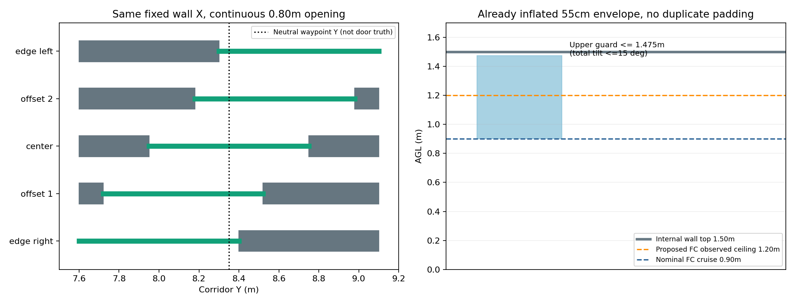
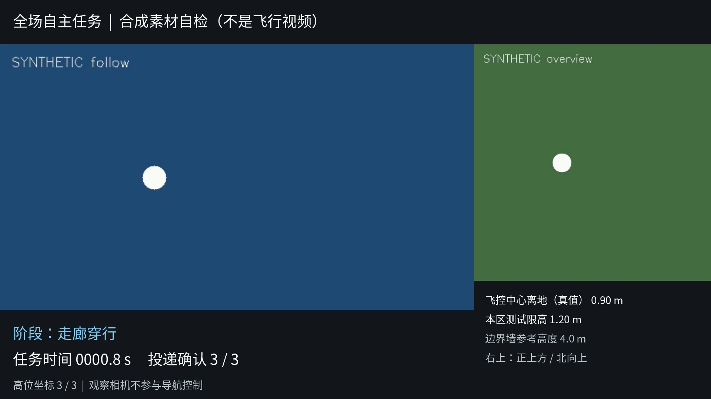
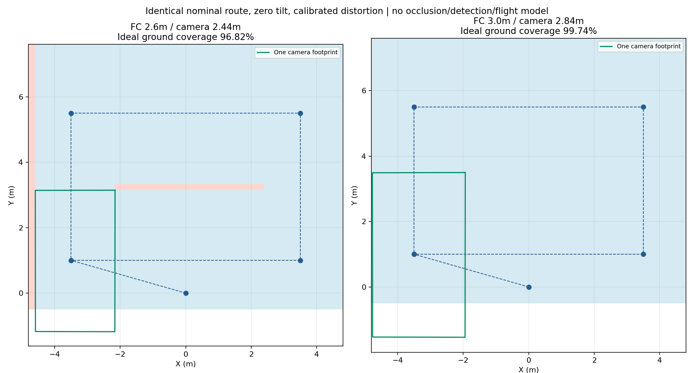

# 高位导航、机构预算、连续门位与汇报视角订正

2026-09-19。本轮按用户要求**不启动Gazebo、不飞行、不重放仿真**。完成几何工具、录制入口和离线分析；新高度与速度均不冒称通过飞行验证。

## 1. 当前导航仍是高位优先，没切回传统遍历

链条是：**高位巡航累计三类坐标线索 → 三类齐备中断或高位路线结束 → 就近可行下降 → 低空重捕、按路径成本选下一目标、投递 → 投后走廊与H降落**。高位不足/低位重捕失败才使用保留的低空遍历兜底。

本次订正是在先前高位研究版本上保留记忆、下降解耦、逐点排序，增加局部弧长投影、有限恢复及近墙复访；不是另换了一套旧导航。导航权威仓运行改动`dc18320`集成到整机`cc47bab`，seed2672在这个版本整场286.456s PASS。本轮导航仓只补预算/下一阶段设计，见[NEXT_STAGE.md](NEXT_STAGE.md)与[来源](navigation_source.json)。

## 2. 机构预算暂按每投10秒，和旧工程等待含义分开

| 代码来源 | 能核实的时间 | 实际含义 |
|---|---:|---|
| 旧拷回`actuator_pwm/src/pwm_node1.cpp` | 设置PWM后固定1.0s | 随后直接返回`res=true`，没有离盒传感器确认 |
| 2025桌面参考`executeDropAction` | 5次发令×0.1s，约0.5s | 重复发布命令，不证明机构完成 |
| 该桌面参考的下降稳定 | 默认2.0s | 释放前高度稳定条件，不是释放时间 |
| 当前新链`raw_service_wait_timeout` | 0.25s | 只等服务出现；实际同步服务调用没有此执行超时 |

这些是保存下来的旧代码等待值，不足以断言去年比赛实际机构最大耗时。按用户最新意见，**每槽机构执行+确认预留10s，三槽合计30s**。另保留恢复姿态/高度的时间，方案暂列每槽5s，后续由机构实测标定。

10s是预算，不是每次必须等满10s，也不能在飞控控制回调中加`sleep(10)`。成功反馈必须约定为机构完成/可靠释放确认，不能沿用“命令写入成功”等价“包裹已脱离”。预算快耗尽时应停止继续捕获/对准消耗，留出释放与恢复窗口；不确定释放不得重试同槽。

**本轮没有改真实机构调用。** 原120s目标事务上限保持。候选配置将原每槽粗预算60s加10s为70s，但原`early_return_enabled=false`意味着这个成本参数目前不强制执行；它不等于已经实现了“最后10s一定保留”。运行时异步机构完成接口、释放前剩余时间准入还需要联合实现。[预算设计输入](NEXT_STAGE.yaml)明确标为非ROS参数文件，避免误当已生效配置。

来源：[旧PWM驱动](/home/xhj/liftrace/patrol_uav_ws-patrol_planner/src/actuator_pwm/src/pwm_node1.cpp)、[旧桌面控制](/home/xhj/liftrace/Desktop_patrol_uav_ws-patrol_planner/src/patrol_control/src/patrol_control.cpp)、[当前代理](../../../patrol_uav_ws-patrol_planner/src/uav_mission/scripts/guarded_servo_proxy.py)。

## 3. 停滞不能宣称彻底修复

已确定修复：seed36原样条存在“0.15m前视已到曲线参数2.72s，但投影只查下一段1s”的死点。原实际样条离线旧版失败、新版通过；seed2672整场通过且没有触发有限恢复。

仍有的等待与未覆盖边界：

- seed2672最后H前航点**首次ready前24.783s、30次FAILED_ATTEMPT**；这是初始路径生成问题，并非已有轨迹的投影停推。第一门段也有4.496s初次规划等待。
- 近墙38/40、历史36仍缺修复后的对应难例实跑；新seed成功不能替代这项回归。
- 定位/地图陈旧、不同步、时钟回跳、未收到轨迹、姿态越预算、机构ACK迟到/不确定等，需要原截止时间和明确退出处理；有限恢复不是所有情况下都能找到路线。

对导师可准确表述：“解决了一种可确定复现的轨迹执行停滞，已通过一轮随机整场，正在治理初始规划等待及跨布局可靠性。”

## 4. 投后航段仍有较大的提速空间

上轮第三投后还用176.240s，占全程61.52%；真正低速走廊档143.414s，移动P50仅0.115m/s。最后一投到入口已是快速转场，P50约0.643m/s，不需要再提前把这段降成窄门速度。

| 阶段 | 下一阶段建议 | 保留条件 |
|---|---|---|
| 第三投→入口 staging | 继续当前快速转场 | 等机构完成与投后恢复确认，再离开目标 |
| 开阔直线衔接/门间中部 | 试0.30–0.40m前视，实际速度目标先0.25–0.35m/s | 提前按制动距离切慢档；前视m不是速度m/s |
| 门前/穿门/门后恢复 | 先保持0.15m，后续单独扫0.18/0.20m | 不缩80cm开口，不跳过实际穿门判断，不削弱横向余量 |
| H前导航 | 先解决24.8s初次规划等待 | 保留位置、航向和高度交接，不靠提高超时掩盖 |
| 捕获/对准/释放/恢复 | 查panzer事务35.320s中的具体等待 | 不能直接把它减成几秒，更不能扣掉机构10s预算 |

门前减速距离应至少包含`v²/(2a)+v×延迟+跟踪余量`。例如0.35m/s、有效制动0.5m/s²、延迟0.2s、另留0.1m时约0.29m；这是设计例值，需要实际测量，不是已验证阈值。大部分进门前后航点本来就在距墙约0.7m处，具备分段切档的空间。各阶段节时不能简单相加为整场提升。

## 5. 走廊建议：上限1.2m，巡航先0.9m

走廊宽1.5m，内墙仍高1.5m。55×55×40cm盒已经主动膨胀；只计一次。中心Z偏置-0.02m时，在**合成倾角≤15°**下，保守上缘相对FC为：

`0.18 cos(15°) + sqrt(2)×0.275 sin(15°) ≈ 0.275m`

FC上限1.2m对应上缘约1.475m，尚在内墙顶部以下。建议先用：

- 名义FC巡航0.9m；指令上限先1.0m；真值工程验收上限1.2m。
- 这里的15°是合成倾角。若roll、pitch分别都达到15°，上缘约0.308m，1.2m就不再满足同一保守界限；超出预算需暂停提速或降低上限，不能把计算条件略掉。
- 不建议直接把**巡航目标**设到1.2m或1.5m；上限和目标高度要分开。1.5m也不是仅凭墙高就能取的飞控中心目标。
- 这属于工程建议，原0.7m历史Gate不追改成PASS，也不宣称规则书新增了1.2m条款。

已生成独立候选：[0.9m巡航配置](example_scene/corridor_090_candidate.yaml)、[1.2m Gate配置](example_scene/gate_120_candidate.yaml)。正常高位、投递和最终低位H捕获高度保留，未启用新飞行。

## 6. 连续80cm门位与4m边界墙已具备导出能力

两道墙X仍固定在-1.6/+1.6；走廊Y范围[7.6,9.1]。开口中心连续随机取`c∈[8.0,8.7]`，开口为`[c−0.4,c+0.4]`。相应生成南北两块互补墙段；贴边时只省略零长度墙段，不制造81cm或更宽的开口。

外围`Wall_1/9/11/12`的碰撞与可视高度都改为可选4m，底面维持不变；内部隔墙、通口墙仍1.5m。场馆屋顶5.5m仍只是原仿真环境资产。4m边界是视觉参考，限高应同时用HUD数值检查，不能只从透视视频估高。

实现先在liftrace-sim fork提交`67c24fe`，再同步整机两份工具。新参数`--door-mode continuous --outer-wall-height 4.0`；也可用`--door-centers 8.12 8.58`固定重现。旧左右模式、冻结历史世界保留，导航仍用门前后中性航点，门真值只进布设和Gate。

连续随机不一定比极端左右开口更难，矩阵应保留：最左、最右、居中、非对称偏移、极薄边条、相反偏移组合。特别是5cm地图体素与极薄墙段的观测/膨胀效果，需要后续实跑。



[本轮新世界示例](example_scene/field.world) · [布局来源](example_scene/scene.json) · [几何实现来源](scene_source.json)

## 7. 给导师看的双视角方案

已新增可选`presentation_recording:=true`入口：

- 主画面：距飞机约1.8m、上方约1m的平稳跟随视角，只跟随航向，不复制滚转/俯仰；相机保持在场内候选区域并避开墙体视线遮挡，平滑换角。树冠等复杂遮挡效果还需Gazebo检查。
- 右上：正上方、北向上的固定全场图。观察相机放在9m，近裁剪3.7m跳过5.5m屋顶可视面；完整保留4m墙顶，不修改任何导航碰撞几何。
- HUD：任务阶段、任务时间、投递确认数、高位坐标累计数、FC离地真值、本区测试限高、边界墙参考高度。走廊限高按位置区域显示，避免把入口外快速转场误标成走廊超高。
- 两路复用原`camera_video_recorder.py`，输出`overview.mp4/follow.mp4`及各自时间戳CSV；离线按共同ROS时间轴合成H.264，丢帧处保持上一帧并记录图像年龄。
- 支持实跑观察和已录轨迹回放；界面明确区分仿真实录、轨迹回放、合成素材自检。观察节点只移动自己的摄像机，不发布无人机指令。

这个入口默认关闭，不进入机载链；跟随几何5项新增测试、组合视频13帧合成自检与完整解码通过，但**本轮没有用Gazebo验证新机位**。下图是有明显标识的合成素材版式自检，不是真实新视角录像。



配置：[presentation.yaml](../../../vision_ws/src/uav_high_view/config/presentation.yaml)。后续获准实跑时，在`fast_comparison.launch`上追加`presentation_recording:=true`；它会抑制重复的旧俯视录制。已录航迹回放也支持此参数，但本轮未启动回放。

离线合成（不启动仿真）：

```bash
source /home/xhj/miniconda3/etc/profile.d/conda.sh
conda activate rl_drone
python vision_ws/src/uav_high_view/scripts/presentation_compose.py <双路录制run目录> \
  --output <输出路径.mp4> --flight-limit 3.0 --corridor-limit 1.2 --wall-height 4.0
```

显示阈值必须与该run实际配置一致；旧0.7m/1.5m世界不能套新数字冒称新验证。视频合成默认最多900s，观察日志最多3MiB，图像queue=1。两路渲染有额外GPU开销，正式计时比较应统一录制条件并记录RTF；不会增加OrangePi正常运行节点。

## 8. 高位3m：有几何收益，但不能直接推断更快

下视相机低于FC16cm，地面平面假设下，相机有效高度2.44→2.84m：

| 指标 | FC 2.6m | FC 3.0m |
|---|---:|---:|
| 单帧地面视场包围尺寸 | 2.434×4.326m | 2.833×5.035m |
| 单帧投影面积 | 10.493m² | 14.215m² |
| 同一完整名义高位航线理想覆盖 | 96.82% | 99.74% |
| 中心附近35cm红十字近似像素跨度 | 104px | 89px |

单帧面积约增35.47%，线性视场增16.39%，目标线性像素约减14.08%。已有整条路线的理想覆盖只增**2.92个百分点**，新增面积很大一部分与原覆盖重叠。可能的收益主要是提前发现、减少边缘漏扫；不会自动缩短原航路长度或提高实际速度。

已有[9月13日静态图像实验](../../verification/high_view_render_20260913/REPORT.md)实际只测到2.8m：2.6→2.8m时，两个布局的三帧正确“目标×视角机会”21→23，完整靶板入画且正确仍为14，中心投影误差P95约0.149→0.159m。它支持视场增加与定位代价并存，但不是3m结果，也不是召回率或完赛时间。该批还保留成像/CameraInfo主点偏差线索，所以上述理想覆盖不能当作实际图像覆盖验收。

更高会降低像素细节、放大同样像素误差对应的米级误差，并增加0.4m上升/下降成本。高位只是复访线索，确实可以容忍一定定位误差，但**类别正确、三类坐标有效、低位重捕仍不能省**。

还存在三个直接工程边界：

1. 2.6m命令的上一轮真值峰值为2.816m。若3m是硬飞行上限，不能将目标设为3m却不给误差/超调留余量；若已确认规则允许更高，也应先明确其与当前3m研究限值的关系。
2. 高位线索库当前硬编码验收范围不超过3m；命令3m后，超调期间可能反而拒收线索。应统一策略高度、线索接受范围和限高口径，不能只改一个launch参数。
3. 当前SDF地图Z尺寸3.0m、原点约-0.2m，实际地图上缘约2.8m。3m FC对应任务Z约2.78m，几乎贴到地图顶。后续需要同时评估地图Z容量、虚拟顶高、命令和目标限制。若Z尺寸3.0→3.6m，按当前约355MB缓存粗估会增加约20%至426MB；端侧资源也要计入。

**建议将3m作为后续独立对照项，而不是现在直接替换2.6m默认。** 本轮只计算理想几何，不算检测召回、实际航迹、完赛收益；树遮挡、倾斜姿态、提前中断都未用于这张理想覆盖图。



[计算脚本](analyze_design.py) · [计算结果](analysis.json) · [既有整场事实](../../verification/reliability_trial_20260919/REPORT.md)

## 9. 本轮验证与后续顺序

轻量fork77项测试、高位库70项测试通过；三种launch组合只作参数展开；双视频合成自检验证时间戳对齐、丢帧保持、区域限高显示及解码；视觉包构建通过。连续门位/墙高、观察节点与原部署保持可辨识的实验边界。没有新增飞行、Gazebo渲染或硬件操作。

后续唯一任务优先级以[ROADMAP](../../../VISION_2026_ROADMAP.md)为准：机构10s预算/异步完成契约、初规划等待与历史失败布局回归；再按新连续门场景做分段速度/高度验证；3m单独比较，避免同时改高度、速度、门位而无法解释收益来源。
