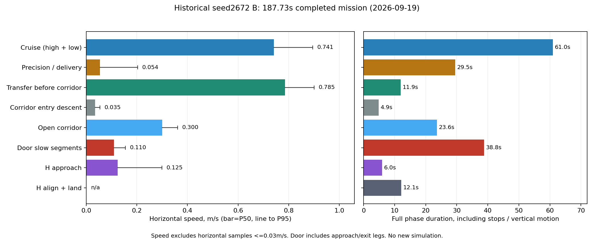

# 全场用时优化起点：释放高度、历史速度与实施顺序

2026-09-26。结论：暂不以继续降低投递高度作为第一项优化。先使选槽、槽口补偿及释放到位判据一致；时长优化优先近边目标重访、走廊慢档覆盖范围和视觉重复等待。下列速度来自已保留的仿真记录，不是今晚实机速度，也不是9月26日中部障碍柱修复后的新验收。本轮未改飞行代码或参数、未启动仿真。

## 1. 要不要进一步降低投递高度

必须区分飞控中心离地高度、释放口/包裹底部到靶面的净距，以及控制器本地Z。三者不能互换。

| 入口/记录 | 当前能确认的数值 | 含义 |
|---|---|---|
| 试飞组最简投递fa62126 | release_setpoint_height=0.10；许可本地Z范围−0.05～0.30m | 下降目标和允许释放窗口，均不是直接的离地高度 |
| 假设静置FC本地Z=0、FC离地0.22m | 上述下降目标约对应FC离地0.32m | 依赖静置零点与安装高度；不能反推实际释放就在0.32m |
| 本机四套专项fdab4c1/bf30a23 | drop_agl=0.60m，已由静置位置及0.22m安装值换算 | 飞控中心离地0.60m；投递专项可配置，其余专项保留该公用键 |
| 历史seed2672 B三次mock ACK | 真实FC离地0.542 / 0.521 / 0.455m | bridge/panzer/red_cross；从truth_pose按ACK时间插值得到 |
| 同三次ACK的MAVROS本地Z | 0.278 / 0.291 / 0.281m | 已进入≤0.30m许可窗口，尚未到0.10m下降目标 |

因此不能把“release_setpoint设为0.10”写成“只离地10cm才投”。当前外部链许可允许在到达下降目标之前放行；**仅继续调低下降目标，不能保证实际释放高度降低。** 目标高度、真正许可高度、反馈高度和机构实际开口时刻需要分开记录。今晚新试飞暂无bag，不能将历史mock ACK高度当成今晚实物脱离高度。

降低自由落体高度确实可以缩短空中飞行时间，并减小由水平残速引起的漂移；但不修正槽位/参考轴等系统性偏差。例如仅作无风、忽略阻力、初始竖直速度为零的示例：

- 释放口离靶面0.50m，落下约0.319s；0.30m约0.247s。
- 若水平残速0.10m/s，对应漂移约3.2cm与2.5cm，只差约0.7cm。
- 这不是包裹在旋翼气流中的精度预测。12cm级杆臂或符号误差不能靠降低高度消除。

从完赛时间看，下降更多并恢复更高会增加时间。按本批投递下降0.364m/s、恢复爬升0.389m/s的移动中位速度粗估，每投再低10cm，若下降/恢复高度两端都保持原值，串行运动粗估增加约0.53s；三投约1.6s，尚未计入贴地减速和稳定等待。该估算不含反馈重叠与动态变化，不能当精确工期或收益测量。

建议先保持既定高度，完成槽口几何闭环，再以实际释放口净距、水平残速、真实落点分布和三投总时间决定高度。对本机0.60m专项，之后可以比较0.60/0.50m的FC离地高度；目前不直接落实。对试飞最简入口，则先读实测释放高度及包裹底部净距，不能再凭0.10这个数字往下减。标准1m圆靶在近地视场里本来无法完整可见，应复用高处有效精修结果/受控近地保持，不把“降得更低”理解为一定更容易视觉对准。

槽位问题见[三槽闭环核查](../../deployment/drop_slots_20260926/REPORT.md)。

当前源码的全部速度档、空间阈值和切换条件见[速度设计与判断标准](SPEED_DESIGN.md)。

## 2. 历史各阶段实际速度

主要锚点为2026-09-19成功的seed2672 B（2.6m高位、快走廊、187.733s）；另读取同场A/C及2026-09-21成功的31/32/37。完整数据见[measurements.json](measurements.json)。

水平速度沿用原报告真值位姿差分统计。剔除dt≤0或dt>0.5s，移动样本阈值0.03m/s；P50是移动速度中位数，**不是含停顿的阶段平均速度**。竖直速度本轮从同一原始真值重算，分别统计向上/向下且绝对速度>0.03m/s的样本。阶段按归档事件时序标注，包含加减速和阶段内短暂调整。

| 阶段 | B实测速度 m/s | 方向/解释 |
|---|---:|---|
| 初始起飞至首任务指令 | 0.242 | 向上移动P50；窗口约7.12s |
| 转入高位ASCEND | 0.279 | 向上移动P50；B该阶段约3.47s |
| 高位快速搜索SURVEY | 0.795，P95 0.911 | 水平；六个成功样本P50范围0.790～0.812 |
| 高位回降DESCEND | 0.141 | 向下移动P50；包含横移/减速，不能视作全程恒速下降指令 |
| 正常低位重访REVISIT | 0.753，P95 0.881 | 水平；2672三版0.738～0.774，seed37为0.579 |
| 近边目标低位重访 | 31=0.154、32=0.158 | 水平阶段P50；并非所有重访都在0.75m/s |
| 近目标APPROACH / CAPTURE | 0.057 / 0.067 | 水平移动P50；短距离微调与视觉等待交织 |
| 投递ALIGN横向微调 | 0.042 | 水平移动P50 |
| 投递ALIGN下降 | 0.364 | 向下移动P50 |
| 投后RECOVERY爬升 | 0.389 | 向上移动P50；三次恢复阶段合计约7.65s |
| 最后一投后进廊前转场 | 0.785，P95 0.900 | 水平；约11.93s，已保持快速档 |
| 开阔走廊 | 0.300，P95 0.361 | 水平；合计约23.59s |
| 门区慢档 | 0.110，P95 0.155 | 水平；合计约38.76s，包含门前/后航段，不是仅穿越门平面的时间 |
| H附近接近 | 0.125，P95 0.299 | 水平；约5.97s |
| H识别/降落整段 | 向下P50 0.104 | 整个LAND含慢调整；总事务约12.11s |
| 最终AUTO.LAND近地段 | 参数0.25；B末0.7s最大实速约0.274 | 下降方向；不能拿LAND整段P50代替自动降落限速 |

旧低速遍历/高位低速版本虽规划上限写1m/s，实际搜索约0.32～0.34m/s。较早尚未分段提速的走廊约0.11～0.12m/s；现在开阔段已有0.30m/s，不能再把全走廊描述成同一低速。

2025参考的3m/s是规划上限，不是经日志验证的全阶段速度。当前快速研究入口planner_max_vel=1.2m/s；CRUISE/精调/门区前视为1.0/0.4/0.15m，边界慢档0.20m。这些前视量单位是米；Mission nominal_speed还只是预算参数，改它不会直接改变飞行速度。

## 3. 全程耗时与最大的优化空间

同场2672 A/B/C成功时间为251.667/187.733/216.548s。B相对A的总差63.934s含视觉等待波动；第三ACK后139.888→100.003s，差39.885s更贴近投后配置变化，但不是独立重复实验。3m C反而比B多28.815s，本批不支持仅靠升到3m提速。

B从第三投前到落地的统一分段：

| 区段 | 耗时 s |
|---|---:|
| 起始至第三ACK | 87.730 |
| 最后一投恢复 | 2.778 |
| 进廊前转场 | 11.933 |
| 入口定点下降 | 4.861 |
| 走廊至H降落接管 | 68.326 |
| H降落事务 | 12.105 |
| 合计 | 187.733 |

任务计时从首条mission决策开始，不含之前起飞/预热。该轮airborne到touchdown约193.80s，arm到touchdown约194.60s；不能把187.73s直接等同实机从解锁计时的全部时长。额外每投10秒机构预算合计30秒仍是保守预留，不是无条件sleep，也不是仿真实际消耗。真实机构反馈可能与已有恢复时间部分重叠，实际增量须实测。

优化按以下顺序推进，收益数字只作几何/时间预算，不承诺实跑收益：

| 顺序 | 方向 | 为什么优先 | 可验证改动范围 |
|---|---|---|---|
| 0 | 统一三槽对齐目标、补偿和释放判据 | 同时处理精度与末端二次平移/等待；否则提速掩盖错误 | 锁槽后即以该槽口为准，下降和许可使用一致误差；不另叠状态机 |
| 1 | 近边重访远段保持正常巡航 | 31/32正常完成但重访P50仅0.15～0.16；32单次靠边重访34.63s | 依实际当前位置、到目标距离、路径净空和制动距离提前减速；不因终点近墙整段慢飞 |
| 2 | 优化走廊慢档覆盖范围、开阔段速度 | B开阔23.59s＋门区慢档38.76s，仍占全程约1/3 | 先缩减不必要的门前/门后慢段，真窄口保留低速；开阔段候选实速0.40m/s逐步验证 |
| 3 | 减少CAPTURE反复等待 | 同场panzer证据锁定等待A/B/C约30.46/4.86/17.23s | 分清像素误差、关联、质量、稳定帧；改善目标连续性，不能直接取消证据 |
| 4 | 最后一投恢复→进廊的衔接 | 恢复本身仅2.78s，入口下降4.86s；转场已0.79m/s | 在有效通道内重叠部分横移/降高；进门前仍满足高度和到位条件 |
| 5 | 高位/普通低位巡航再提速 | 高位目前约0.8m/s，进一步收益小于长时间慢档/等待 | 候选目标先验证实速约1.0m/s及识别质量，先不照搬去年3m/s上限 |
| 6 | 起飞/高低切换与H末段 | 样本阶段较短，末段已解决过反弹问题 | 后续单独看加减速及垂直交接；先保留0.25m/s近地AUTO.LAND |

当前源码已复查：navigation_mission_manager.py的_apply_following_speed仍按REVISIT/DELIVERY目标点boundary.near选择BOUNDARY_REVISIT；execution_speed.py仍默认0.20m前视。因此第1项尚有具体代码空间，不是重复建议已完成的修复。9月26日新的中部柱/固定膨胀会改变路径，尚无同版本动态数据，历史收益不可原样照搬。

预算例子：
- 5m重访整段0.15m/s需33.3s；若前4m按0.6、末1m仍0.15，纯移动约13.3s，理想节省20s。加减速、避障和视觉会减小收益。
- 开阔走廊0.30→0.40m/s，在“全部时间都用于同路段匀速移动”的理想假设下，23.59s最多缩短约5.90s；实际停顿/转弯不能同比缩短。
- 高位0.80→1.00m/s，对31.66s高位阶段的同类理想估算上限约6.33s；识别早停时刻和避障路径可能改变。
- 入口降高与11.93s转场若有足够净空重叠，理论上最多取两段较短的4.86s；本轮未证明可全部重叠。
- 上述是相互影响的局部上界，不能相加宣布全程必省若干秒或必达两分钟。

## 4. 下一轮实施与验收口径

先保持同一场地、FOV、2.6m高度、统一障碍模型及机构预算，建立当前代码参考轮；随后一次只改一个瓶颈。首组建议以成功的2672/37观察普通路线，再以31/32观察近边重访。失败样本只比较双方实际完成的同阶段。

必须同时记录：起飞/首次决策/每投反馈/恢复/进廊/两门/H落地时刻；真实槽口误差和水平残速；投递成功与故障；局部净空、轨迹跟踪偏差；视觉漏检/冲突及等待原因。已有重规划和恢复不得靠重置任务deadline来伪造提速。

本轮交付分析脚本、数据、图表与本文件；所有候选数值仍为方案。未运行新SITL、未覆盖试飞组维护分支，也未修改真实机构输出。既有参考：[9月21日完赛优化方案](../finish_time_20260921/PLAN.md)、[2025速度调查](../reliability_speed_review_20260919/SPEED_REVIEW.md)、[2672完整报告](../../verification/fov_landing_inner_20260919/REPORT.md)。

复算（只读历史日志，不启动仿真）：

    source /home/xhj/miniconda3/etc/profile.d/conda.sh
    conda activate rl_drone
    python docs/planning/finish_time_20260926/analyze.py
