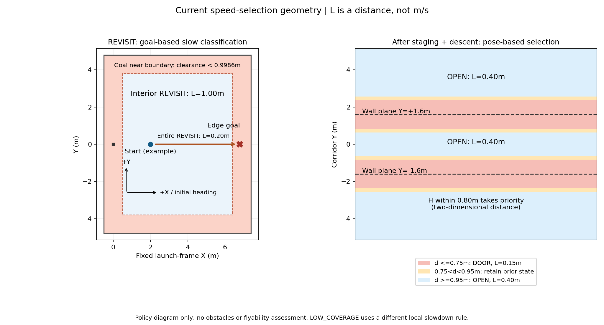

# 当前高位研究分支：分阶段速度与切换条件

2026-09-26，核查分支 feat/high-view-search-research，源码参考 c04cc48。本文说明当前完整高位快速入口的实际配置和代码条件；只读取代码与历史记录，没有修改飞行实现/参数，没有启动新仿真。

入口基准为 uav_high_view/launch/fov_inner_repair.launch → fast_comparison.launch → full_strategy.launch；场景取保留的 seed2672 fast_runtime.yaml、frame_overrides.yaml、repair_overrides.yaml。其他入口必须检查最终覆盖值：单独启动早期 dynamic_probe 或 full_strategy，不能直接套用这里的快速档。

## 1. 先分清三种“速度”

| 层次 | 当前基准 | 真正作用 |
|---|---|---|
| 规划轨迹的速度/加速度约束 | max_vel=1.2m/s；max_acc=1.0m/s² | 约束 Fast-Planner 搜索、优化和轨迹生成；不是所有直控动作的统一实速保证 |
| 任务阶段的前视/跟随距离 L | 巡航1.00m、精调0.40m、边界0.20m、门区/终止0.15m | 改变轨迹前视点，以及送给PX4的位置设定点距当前机体的最大距离；单位是米 |
| 任务时间预算参数 | mission.nominal_speed=0.5m/s | 估算剩余行程/投递/返航时间；不会下发0.5m/s速度命令 |

因此“高位档1.0”不是每秒飞1米，“门区0.15”也不是硬编码0.15m/s。历史高位移动中位速度约0.8m/s，门区约0.11m/s；真实速度还取决于轨迹曲率、当前位置误差、避障重规划、到点刹停和PX4位置控制。

任务管理器按10Hz更新选择，同时写入并读回：

- /traj_server/traj_server/target_dist：沿当前轨迹投影进度并选取前视点。
- /px4_max_distance：旧控制最后一层三维位置距离裁剪。

两项统一，避免上游给大前视而下游再次截成小步。轨迹服务器100Hz、旧控制外部任务时钟20Hz；**不是每个周期强制移动L米**。视觉精调和恢复爬升可直接走旧位置控制，不都经过Fast-Planner。

依据：[速度选择器](../../../patrol_uav_ws-patrol_planner/src/uav_mission/src/uav_mission/execution_speed.py)、[任务管理器](../../../patrol_uav_ws-patrol_planner/src/uav_mission/scripts/navigation_mission_manager.py)、[快速入口](../../../vision_ws/src/uav_high_view/launch/fast_comparison.launch)、[轨迹服务器](../../../patrol_uav_ws-patrol_planner/src/Fast-Planner/fast_planner/plan_manage/src/traj_server.cpp)。

## 2. 代码真正选择的速度档

下面列的是任务动作/空间条件，不是仅凭视频或日志名称分类。边界判断优先于普通SEARCH/RESUME/APPROACH；投后走廊细分调度覆盖普通CORRIDOR档。

| 速度档 | 进入/选择条件 | L，m | 退出/切换条件 |
|---|---|---:|---|
| CRUISE | 动作为SEARCH或RESUME，且未命中边界慢档 | 1.00 | 动作变化，或命中边界条件 |
| BOUNDARY_REVISIT | 动作为SEARCH/RESUME/APPROACH；且REVISIT/DELIVERY阶段目标靠边，或LOW_COVERAGE满足补搜边界条件 | 0.20 | 相应边界条件不成立，或更换动作/阶段 |
| PRECISION | 未命中其他档的动作；主要是普通目标APPROACH事务 | 0.40 | 完成恢复、更换目标/动作；不是一到ALIGN就再降一档 |
| TRANSIT_TO_CORRIDOR | RETURN_HOME且reason以post_delivery_route:开头，已完成投后航点数为0 | 1.00 | 第一个投后暂驻点被执行层确认到达 |
| CORRIDOR_DESCENT | 上述投后RETURN_HOME，已完成数为1，有快走廊调度且XY有效 | 0.15 | 第二点（同XY降高点）完成，计数达到2 |
| CORRIDOR_OPEN | 已完成数≥2；距H大于0.8m；满足开阔档/迟滞条件 | 0.40 | 进入门墙慢区，或距H≤0.8m |
| DOOR | 同上，距最近门墙平面≤0.75m；或处在迟滞区且此前是慢档 | 0.15 | 距最近门墙平面≥0.95m，或进入H接近档 |
| H_APPROACH | 已完成数≥2，当前XY到landing_xy距离≤0.8m | 0.15 | 接到LAND，或离开该半径后重新按门墙距离判档 |
| CORRIDOR_UNCERTAIN | 投后细分调度时XY缺失/非有限值 | 0.15 | XY有效后重算；这里只检查可用性，不单独计算位姿年龄 |
| CORRIDOR | 首点完成后，但未提供corridor_speed_schedule | 0.15 | 离开投后RETURN_HOME；这是无分段配置时的整段慢档 |
| TERMINAL | LAND、HOLD或ABORT | 0.15 | 动作改变；LAND后续可能交给PX4 AUTO.LAND |

没有活动动作时不重设参数，而是保留最后设置值。这尤其适用于低位REACQUIRE等视觉等待：速度档字段可能仍显示上一重访档，但没有新的航点移动任务，不能据此判断“正在高速飞行”。

不带post_delivery_route:原因的普通RETURN_HOME不会自动被当作高速转场，它按默认PRECISION处理。

## 3. 高位搜索→低位重访→投递分别如何使用这些档

| 任务场景 | 进入与交接依据 | 速度设计 |
|---|---|---|
| 初始起飞 | 旧控制固定起飞XY，目标localZ=1.18；距起飞点三维距离<0.30m时置control_ready，任务还需满足位姿、地图等启动条件 | 任务接管前/px4_max_distance由基础入口置0.40m；没有独立的“起飞0.XXm/s”参数 |
| 低空入场→高空升高 | 完整策略先到staging_xy默认(0.60,0.05)，低位AGL1.4m；再原XY升到默认AGL2.6m；航点完成后标记ascent_verified | 两段都是SEARCH，使用CRUISE 1.00m；并非按高度另选速度档 |
| 高位巡圈 | 按survey_xy依次走点；完成高位路线或已验证升高且累计三高权重线索齐备后结束 | SEARCH→CRUISE；不会单凭树近或飞得高自动选择边界0.20m档，仍受避障规划约束 |
| 高位转低位 | 完整策略优先在当前位置寻找可行下降柱；必要时先到附近可下降点，再降到AGL1.4m | LOCAL_DESCENT_TRANSIT、DESCEND仍是SEARCH→CRUISE；无单独“快速下降/慢速下降”档 |
| 普通低位重访 | 选未投且仍可利用的记忆目标，生成可接近视点和顺序；使用低位新观测确认身份 | REVISIT＋SEARCH；内场用CRUISE，近边终点用BOUNDARY_REVISIT |
| 低位重新捕获 | 到达重访点后REACQUIRE；默认最多15s等待新鲜、关联正确的低位候选，失败先延期问题目标 | 无新动作时保持已有参数，主要是等待；新鲜候选被接受后下发APPROACH |
| 接近→捕获→对准→释放→恢复 | 对导航manager而言为同一条APPROACH投递事务；执行层分别上报PLANNER、CAPTURE、ALIGNMENT、RELEASE、RECOVERY | 普通目标沿用PRECISION 0.40m；REVISIT/DELIVERY边界条件成立则0.20m可贯穿该事务；没有每个子阶段独立的速度表 |
| 低位补搜 | 已知线索/局部复核等仍不足时进入LOW_COVERAGE；优先安排此前被跳过高位点所属航带 | SEARCH/RESUME用1.00m，靠边或最后近边1m用0.20m；新鲜目标可中断进入APPROACH |
| 最后一投之后 | 不是第三次ACK立刻转场；需该次RECOVERY事务结束，再发第一个post_delivery_route航点 | 转场1.00m，首点到达后下降0.15m，然后才启用门区/开阔/H三类空间档 |

高位配置的survey_budget=45s属于早期单段probe默认值；完整HighViewFull已覆盖该截止逻辑，不能将它描述成“现行高空最多45s”。当前完整任务仍受全局期限、动作期限及8s无足够距离进展的高位航点换点策略约束。

上述换点策略是可达性/进展机制，不是主动降低飞行速度。高位收齐线索后的目标访问顺序也不会直接改变speed profile。

依据：[高位整场策略](../../../patrol_uav_ws-patrol_planner/src/uav_mission/src/uav_mission/high_view_full.py)、[入场/重捕基础流程](../../../patrol_uav_ws-patrol_planner/src/uav_mission/src/uav_mission/high_view_probe.py)、[完整入口](../../../vision_ws/src/uav_high_view/launch/full_strategy.launch)、[投递事务](../../../patrol_uav_ws-patrol_planner/src/uav_mission/src/uav_mission/mission_core.py)。

## 4. 近边慢档的精确判据

当前旋转场景的边界参数为X∈[−0.5,7.4]、Y∈[−4.8,4.8]。它们是固定任务坐标系的区域边界；机头起始朝+X。这里只讨论速度判断，真正航迹仍要通过障碍地图/共享边界许可。

定义点到四边的最小内侧距离：

    clearance(x,y) = min(x−xmin, xmax−x, y−ymin, ymax−y)

当前BoundaryRevisit默认参数：

    guard_side_m = 0.55
    yaw_budget_deg = 10
    tracking_reserve_m = 0.03
    max_view_offset_m = 0.65
    margin = 0.55/2 × (cos10° + sin10°) + 0.03 ≈ 0.3486m
    near(point) = enabled 且 clearance(point) < margin + 0.65
                = 距某边 < 约0.9986m

这里0.55m已经是工程包络；0.65m是允许重访视点与目标分离的最大距离。**近1m是慢速分类范围，不是要求机体始终距墙1m，也不是点云膨胀半径。**

两种使用方法不同：

- REVISIT/DELIVERY：检查action.goal是否near，**不看飞机当前还离目标多远**。因此一个靠边终点会让长距离重访整段使用0.20m。靠边判的是实际动作目标/视点，不一定是原始靶心坐标。
- LOW_COVERAGE：当前位置clearance<0.85m；或者目标near且当前位置到目标距离<1.0m，才使用0.20m。内场航带的大部分区间仍可使用1.00m。
- 局部近墙复核LOCAL_WALL_VERIFY没有独立速度分支；其SEARCH仍走普通巡航规则，接受投递后改为DELIVERY才按目标判断。它是否需要另一个近墙减速条件，应结合局部路径再评估，本轮只记录现状。

这解释了为什么同是低位，历史seed31/32重访只有约0.15～0.16m/s，而普通目标重访约0.75m/s；并不是全低空统一降速。

依据：[boundary_revisit.py](../../../patrol_uav_ws-patrol_planner/src/uav_mission/src/uav_mission/boundary_revisit.py)及manager的_apply_following_speed。

## 5. 走廊的精确判据与防抖

在所核查旋转场景中，两扇门的墙平面沿固定Y=−1.6、+1.6布置，因此axis=1：

    d = min(|current_y − 1.6|, |current_y + 1.6|)
    d ≤ 0.75m：进入DOOR，L=0.15m
    d ≥ 0.95m：进入CORRIDOR_OPEN，L=0.40m
    0.75m < d < 0.95m：沿用此前慢/快状态

首次构建调度器时默认slow=True。采用迟滞是为了不在门区边缘反复切档。调度器按当前位置而不是航点编号决定门慢区；编号仅决定先做暂驻点、定点降高还是允许走廊空间调度。

**DOOR当前不按实时门口宽度、障碍点云净空、偏航误差或实际速度选档。** 它只参考配置好的门墙平面距离，因此慢区有一定保守性，H附近则额外用二维半径≤0.8m优先选H_APPROACH。避障和到点姿态检验由其他模块负责。

以此布局为例，Y≈±1.6各有至少1.5m长的进入慢区范围，另有每侧0.20m迟滞过渡带；不是只在0.8m门口厚度范围内慢速。随机左右移动门洞，若墙平面仍不变，速度区无需移动；若墙的位置或坐标轴变了，则必须同步axis/wall_coordinates。

快走廊投后航点规则：

| 已完成航点数 | 下一个目标 | 主要判断 |
|---:|---|---|
| 0 | (6.7,4.05,localZ1.18) | 高速进廊前转场；到点后才降档 |
| 1 | 同XY，localZ0.68 | 定点下降；严格到点位置容差0.05m |
| 2～7 | (8.35,4.05)后沿Y逐段通过门前/门后点 | localZ0.68；按上述墙平面距离切档 |
| 8 | H附近(8.5,−4.2,localZ0.68) | 距H≤0.8m后为H_APPROACH |
| 完成末点 | LAND | H识别、对准、下降、AUTO.LAND |

地面localZ=−0.22时，localZ0.68对应FC离地0.90m。速度分类只看上述平面量，高度上限和定点降高完成条件另外检查。

图仅表示速度条件，未画树、未表示可通行/禁飞范围。左图为“若目标在着色区域，整个REVISIT可能慢飞”；右图为沿走廊Y坐标的门墙距离分档，H的二维半径单独判断。

依据：[走廊选择器](../../../patrol_uav_ws-patrol_planner/src/uav_mission/src/uav_mission/corridor_speed.py)、[场景fast_runtime.yaml](../../verification/fov_landing_inner_20260919/seed_2672/fast_runtime.yaml)。

## 6. 为什么即使设了快档，到点附近仍会慢/停

正常航点切换不是掠过即算完成。当前桥接默认位置容差0.18m、三维速度≤0.20m/s、驻留0.50s；APPROACH允许位置容差0.35m后交给视觉。投后runtime则将驻留改为0.80s，位置容差通常0.12m，入口下降为0.05m；RETURN_HOME还要偏航误差≤0.10rad。

这些是“上一点完成、允许发下一点”的标准，不是持续巡航限速。因此短航段/密集航点的多次刹停、驻留、重新加速仍可能吃掉巡航提速收益。

另外：

- 轨迹服务器若发生tracking_hold，或原前视点距当前里程计超过L+0.05m，会保持位置并交由既有重规划恢复；这是跟踪异常，不是DOOR/PRECISION慢档。
- 外部规划指令还有1.20m距离准入、时间新鲜度及高度约束。1.20m不是1.20m/s。
- 对准阶段先等新鲜且正确关联的视觉证据/稳定帧，再下降和申请释放；CAPTURE等待不能单靠加大前视解决。
- H降落先在capture_height=localZ0.68进行识别/对准，水平误差≤0.08m且连续10个新鲜标记帧成立后锁定H，再下降；满足localZ≤0.18m且水平误差≤0.08m后申请AUTO.LAND。此入口最终MPC_LAND_SPEED=0.25m/s，接管后不是任务前视距离直接控制下降速度。
- AUTO.LAND成功还要真实接地状态等验收；不可用“已经进入LAND慢档”代替落地成功。

依据：[到点判定](../../../patrol_uav_ws-patrol_planner/src/uav_mission/src/uav_mission/planner_execution.py)、[桥接配置](../../../patrol_uav_ws-patrol_planner/src/uav_mission/config/vcl06_planner_bridge.yaml)、[控制器](../../../patrol_uav_ws-patrol_planner/src/patrol_control/src/patrol_control.cpp)、[场景修订](../../verification/fov_landing_inner_20260919/seed_2672/repair_overrides.yaml)。

## 7. 历史实际速度，用来判断量级

以下为历史成功2672 B的移动样本P50；不是给当前代码新跑的验收。水平移动阈值0.03m/s，停顿不纳入速度P50，但包含在耗时中。

| 场景 | 水平P50 m/s | 竖向或其他说明 |
|---|---:|---|
| 高位搜索 | 0.795 | 高位升高向上约0.279m/s |
| 普通低位重访 | 0.753 | 另31/32靠边重访阶段分别约0.154/0.158 |
| 接近/捕获 | 0.057 / 0.067 | 有大量短距离调整/等待 |
| 投递对准 | 0.042 | 下降移动P50约0.364m/s |
| 投后恢复 | 主要向上 | 上升P50约0.389m/s |
| 进廊前转场 | 0.785 | 已采用快档，不是最后一投后立即慢飞 |
| 走廊开阔段 | 0.300 | 合计23.59s |
| 门区慢档 | 0.110 | 合计38.76s，包含门前门后慢区 |
| H附近接近 | 0.125 | 随后为视觉降落事务 |

由此，下一步最值得讨论的不是把所有上限统一再调大，而是：

1. 近边重访远段保持快档、接近墙/终点再有依据地减速，减少目前“终点靠边→全程慢”的损失。
2. 在门前制动、过门净空和门后脱离均满足条件的前提下，缩减不必要的慢区；再评估走廊开阔段速度。
3. 分析捕获等待、到点驻留及投后恢复交接，区分移动时间与等待时间。
4. 高位与普通低位仍可尝试从实际约0.8m/s提高到约1.0m/s，但必须同时观察视觉质量和规划跟踪；当前未实施。

高度建议、逐阶段耗时、复算方法和数据见[总报告](REPORT.md)。[plot_speed_zones.py](plot_speed_zones.py)只读取当前代码和YAML生成条件图/示例，运行时不会启动ROS或仿真；[policy_examples.json](policy_examples.json)保存了当时计算的数值。

## 2026-09-26：搜索确认与时间间隔补充

已在高位研究链加入一次粗类别投影形成重访线索；低空确认仍需三次有效检测，搜索模式允许相邻命中间隔1秒。本次未改速度档位和投递对准阈值。
[接口与启用范围](../coarse_search_20260926/CONTRACT.md)；[19:12实飞bag复跑与视频](../../verification/panzer_replay_20260926/REPORT.md)。
该包去程只有一次panzer检出，时间间隔放宽未产生去程CONFIRMED/APPROACH；PT重推理返程确认约提前0.10秒，不能计入完赛收益。

后续[模型阈值与实拍适应诊断](../../verification/panzer_replay_20260926/MODEL_GENERALIZATION.md)：原图0.50门槛下的单次命中不能仅靠扩大确认间隔解决；本轮离线亮度/对比度探测增加类别观察机会，训练与有限重捕观察优先于盲目降门槛。已过滤退休tank检测输出，速度与线上图像预处理未改。

## 视觉等待的阈值口径（2026-09-26补充）

[修改前后视觉链与完整阈值](../coarse_search_20260926/WORKFLOW_AND_THRESHOLDS.md)已按当前研究完整入口核对。高位一次粗线索、低位三次确认、完整入口五次有效对齐更新和H十个新观测是不同阶段的条件；不能将确认帧数直接除以相机FPS估计等待时间。本轮只补充说明，不改本页速度参数。
