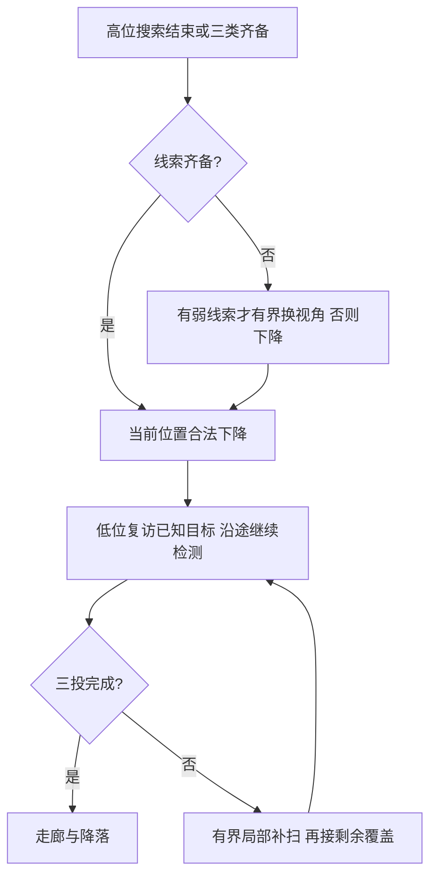

# 高位失败复盘与缺靶兜底设计

2026-09-15；依据冻结20b1a0f五组实跑及当前源码。本轮仅设计，未改飞行逻辑、未启动仿真。

## 之前的可达性修复边界

此前高位目标水平调整半径由0.15m扩大到0.30m，低位仍为0.15m，全高障碍柱保留。修复的是“附近有自由点但搜索邻域太小”，不是保证任意布局任意航点可达。固定树32/34通过与此次随机树34不是同一world。

本次34首个高位平面目标(-3.5,1,2.38)被膨胀地图占据，0.30m内仍无自由点；43条相关警告后约90s超时。下一步应在任务层选替代观测点或跳过，不能允许越树，也不能无限扩大局部目标吸附半径。

设计：在感知图中生成最多16个同高度横向候选，优先新增视场和短绕行；未知不视为自由，三维规划仍负责实际路径。最多一次替代，再失败则跳过。建议连续无进展8s触发改选（待验证可配置值），联合规划反馈和剩余距离判断，避免正常绕行被误判。必须退役旧动作后下发新序号，保留全高障碍禁穿、边界及机体包络约束。

## seed32为何丢失红十字

事实：first_hint_ready曾分别记录三类，退出top_hints仅bridge/panzer。前者只是统计字典；high_view_full.py的_all_top从catalog.hints实时重算，每类必须恰好一个当前合格实例。因而实际控制要求“同时合格”，没有持久保留“累计确认”的集合。

core.py存在以下退化机制：有效观测间隔超过2s后再收到一帧，会清空该实例短窗，重新累计至少3次；时间跨度、80%类别投票、位置不确定度仍须达标；实例误差区域重叠会同时过滤；同类多实例又会被_all_top拒绝。已确认线索可能在后续更新时退出集合。

不能直接认定此次就是2s清窗导致：日志缺少逐次hints过滤原因，无法区分清窗、投票、位置分散、身份歧义。也不能套用core默认60s TTL：SurveyPolicy实际把TTL设为任务timeout。

设计两层记忆：短时窗口继续验证新证据；独立持久表保存已确认导航线索的类别、物理身份、坐标、误差、epoch与时间。离开视场或新窗帧数不足不删除它；一致的新合格证据更新，明显类别/位置冲突进入待复核。epoch变化、坐标失效或误差超过可复访预算才取消资格。齐备判断与中断使用同一份不可变快照。持久坐标仅导航，低位重捕、精对准及释放仍必须使用新鲜证据。

新增状态变化事件confirmed/updated/suspended/invalidated，记录具体原因、样本数/跨度/投票比例、观测间隔、误差与冲突ID；不逐帧刷日志。

## seed31式缺靶兜底

31有bridge/red_cross、缺panzer。约6s几何入像面不等于无遮挡或实际检出，补搜不得使用评测真值坐标。

1. 三类持久线索齐备：立即从当前位置规划合法下降与三点访问，沿用低位重捕投递。
2. 高位路线结束仅1–2类：保存已有线索。缺失类若有带位置的弱观测，且换视角预计比低位补搜更便宜，允许一次局部换视角，最多2个点、15s；否则直接下降。不再绕完整高位环线。
3. 默认先复访已确认高权重目标，沿途持续检测缺失类。新确认目标加入剩余队列，按感知避障成本重排，并计入走廊入口成本；已投目标不再访问。
4. 已知目标处理后仍缺：优先弱线索邻域的一次低位局部补扫，建议最多30s；之后切回原低位覆盖管理器的剩余区域搜索。高位几何视场不能充当有效低位覆盖，树遮挡区继续保留。没有弱线索则直接进入剩余覆盖。
5. 高位零线索：不再追加高位绕圈，合法下降后从当前可达且转场短的覆盖航段接入原策略，不默认返回起飞点重走。

15s/30s均为待验证初值，共用原任务截止时间，不额外延长600s。补搜前扣除剩余投递服务与当前位置至走廊/降落的保守预算；历史成功尾段最大值不能作为保证。预算不足走既有经验证的任务结束/返航路径，明确标记未满三投。坐标/地图失效不能作为普通缺靶继续转场。

## 集成与验证

维持唯一任务管理器，交接继承槽位、已投类别、访问次数及截止时间；取消高位动作、恢复低位高度/调整参数后才能接入覆盖。持久表最多16实例，三目标顺序最多6种，候选最多16；复用现有感知图，目标确认/失效/投递/阻塞事件才触发重排，不增加全图推理频率。端侧资源仍需实测。

顺序：①持久线索及失效原因；②阻塞航点替代/跳过；③部分线索下降和补搜交接。离线测试覆盖2s间隔重现、分类冲突、重复ID、epoch重置、齐备快照、旧动作退役、已投状态继承、全候选阻塞与预算耗尽。随后另行授权同world的31/32/34针对性重跑，33/35检查收益退化；比较三投/完赛率、整场耗时、重复航程和碰撞，保留失败。

依据：[五组报告](../../verification/high_fast_five_20260915/REPORT.md)、[固定布局旧对照](../../verification/high_view_full_20260914/speed_comparison/REPORT.md)；源码core.py、survey_policy.py、high_view_full.py。仅研究分支，不替换机载部署。
