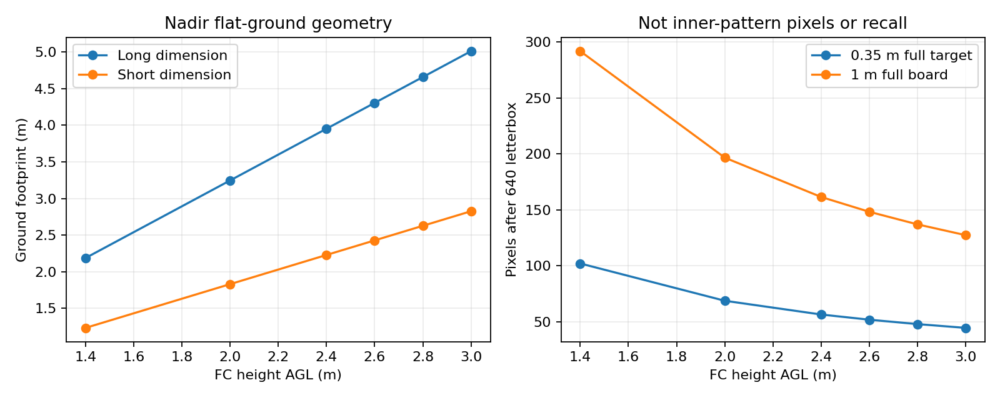
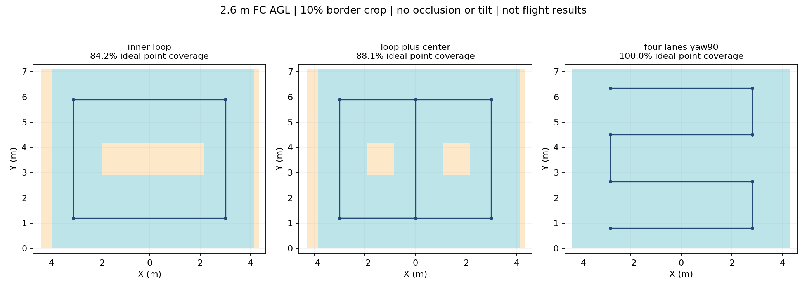
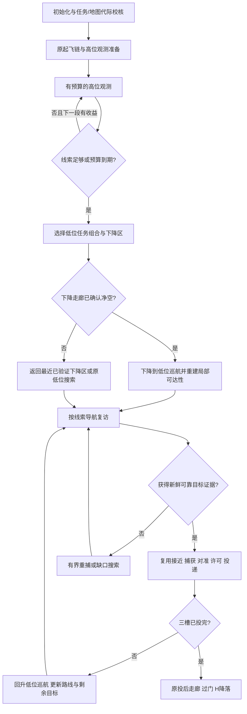

# 高位快速观测与低位定向投递：首轮设计评审稿

2026-09-13 · **用户已批准执行；首批P0工具/P1离线原型完成，P0数据门槛未通过**

实施状态见[首批报告](../../verification/high_view_p0_p1_20260913/REPORT.md)。以下方案正文保留设计时口径，审批已完成；尚未进行飞行接入或新仿真。

分支：`feat/high-view-search-research`；工作树：`r2026-high-view-search`；飞行源码基点：整机 driver2 集成 `86e382d`。本轮只有设计文档、计算图表和任务记录，没有修改运行源码、launch、配置、模型、部署包，没有连接板端或启动仿真。

## 1. 建议与本次需要批准的范围

建议继续研究，采用“**有时间上限的高位观测 → 质量与价值驱动的提前结束 → 已知净空处下降 → 低位复访确认 → 三目标投递**”。高位观测用于建立目标线索，低位重新确认用于投递。先保留内环作为候选，同时比较稀疏往返航带；不把画完整一圈、找全五靶、按直线最短路飞三点设成强制步骤。

研究的主要价值是：可能把低位漫长搜索变成短暂的高位定位，再把避障飞行集中到少数有价值的目标上。其成败首先取决于高处能否稳定识别、定位和重新找到目标，其次才是路线长度。**目前没有证据支持具体提速百分比。**

本次建议审批：按第11节分阶段完成观测能力量化、只读策略原型、有限执行集成和配对仿真准备；每阶段按明确退出条件决定是否继续。审批本设计不等于批准实机放飞、替换正赛代码或取消单轮仿真授权。若不批准，保持本分支为文档状态。

## 2. 输入依据与版本边界

| 来源 | 已知事实 | 对本方案的影响 |
|---|---|---|
| 本次用户提供的师生对话 | 老师建议初始飞高一些利用视场找点，3 m 是可考虑的高度，树随机；明确这只是可选策略 | 作为研究建议，不能当成已试验成功或正式规则修订 |
| 9月11日新版规则复盘 | 场地名义10×10×4 m；规则含高于障碍物全程飞行/上方翻越的避障计分限制 | 初期高位侦察是否影响避障分仍需明确，不能以“后来下降”自行保证得分 |
| 整机 `86e382d` | 搜索、优先目标中断、接近、捕获、对准、释放、恢复、投后过门和H降落链已经存在 | 复用任务执行和释放许可；新增搜索策略不重写旧控制状态机 |
| R64 / 全随机五seed | R64矩阵原始7/10完整PASS；全随机31–35原始2/5完整PASS；seed34等待上限候选有一次完整PASS | 不是所有场景都能5–7分钟完成；失败、截尾和不同配置必须分列 |
| 搜索效率研究 `4da9614` | 固定树32/34各一次开关对照：搜索时间分别增加3.566/12.430 s；整观察器约0.53–0.59核，未达到0.25核目标 | 不直接引入例行补扫执行；重新计算真实收益和停顿开销，避免端侧增加重观察器 |
| 板端坐标分支 `d55da83` | 已开发双向map/camera_init适配和4×4低空测试配置；有离线验证，实时转换与试飞未验收 | 不把其状态写成整机实飞完成，也不把0.5 m小场测试参数用于本方案 |

旧研究和新研究平行：本分支从整机源起步，不包含旧研究的飞行插点代码；可借鉴观测状态、资源计量和历史数据。任何后续摘取代码均单独记录来源和默认关闭状态。

当前整机默认硬件runtime仍不同于完整SITL配置；后续实验必须显式冻结完整runtime、控制、相机、世界和参数快照，不能只比较分支名。历史资料与源码入口见[来源索引](SOURCES.md)。

## 3. 规则与任务目标

1. **3 m 是本研究的候选高度上界，不是已确认的新规则上限。** 新版书面规则复盘记录全场4 m，老师本次建议不取代书面规则。FC高度、光心高度、整机最高点分开记录；如按现有包络FC上方0.18 m，FC=3.0 m时最高点约3.18 m，还需姿态和定位余量。
2. 高位观测限制在搜索区，不能跨越走廊隔墙、跳过门或以高处直线进入落地区。投后三投→走廊→H流程保持。
3. 首选严格候选：高位航段也绕开已知树冠/箱体的水平投影，不将“上方为空”视为获准翻越。若只有允许跨树冠才能取得收益，则单列为规则待确认的方案，不能推广到正赛。
4. 用户已确认纸箱只垫高障碍树，没有独立纸箱；树冠、垫箱尺寸和最高点仍取实测或场景配置。树随机不等于任何布设都可达。
5. 当前r2026执行profile为 tent=1、pillbox=1.5、bridge=2、panzer=2.5、red_cross=10，三槽；理想三类为红十字、装甲车、桥梁，权重和14.5。72.5是每靶满5基础分时的上限，不是检测到三类就能得到的分数。新版规则的tank名单/权重问题仍按已有复盘保留，不擅自启用tank=5。
6. 排名首先是得分，再比较时间。不能为了路线更短，默认放弃红十字或选择三个最近的低权重靶。
7. 起飞得分的高度/稳定时间、裁判起计到起飞的时间窗保持；高位建图和观测的时间全部计入任务，不放到“计时前免费侦察”。

## 4. 相机与高位识别的量级分析

使用仓库标定：1280×720，fx=725.351、fy=723.340；现有光心在FC下0.16 m。RKNN输入为640×640，对1280×720原图letterbox时有效缩放约0.5，填充不增加目标像素。

平地、零滚俯时，令光心AGL为 `h=H_FC−0.16`：长边视场 `1280h/fx`，短边 `720h/fy`；边长d目标在模型输入上的量级约 `0.5·min(fx,fy)·d/h`。

| FC AGL | 光心AGL | 理想地面视场（长×短） | 1 m整靶板输入像素 | 0.35 m红十字外框输入像素 |
|---:|---:|---:|---:|---:|
| 1.4 m | 1.24 m | 2.19×1.23 m | 292 | 102 |
| 2.0 m | 1.84 m | 3.25×1.83 m | 197 | 69 |
| 2.4 m | 2.24 m | 3.95×2.23 m | 161 | 57 |
| 2.6 m | 2.44 m | 4.31×2.43 m | 148 | 52 |
| 2.8 m | 2.64 m | 4.66×2.63 m | 137 | 48 |
| 3.0 m | 2.84 m | 5.01×2.83 m | 127 | 45 |

这些是**整块板/外框**的像素数，内部类别图案、十字笔画和靶心可能小得多。置信度0.9不是正确率、召回率或地图精度；高处出现高置信度误分类同样可能破坏选靶顺序。

真实投影使用CameraInfo、畸变和完整TF。当前光学X=-bodyY、光学Y=-bodyX，yaw=0时图像长边大致沿场地Y；不能将宽1280像素无条件看成场地X覆盖。转弯中yaw、滚俯会改变朝向和覆盖；固定yaw与沿切线转头需分别评估。光心2.84 m时10°倾斜可使视轴落点偏移约0.50 m，这还不是完整边缘投影误差。

高位降低单位地面运动对应像素速度，但也缩小目标细节。曝光、实际有效FPS、模糊、眩光、树叶遮挡、运动姿态和时间同步应共同评估，不能仅以帧率或像素量级指定“可以飞1.5 m/s”。

P0优先比较2.4、2.6、2.8 m，3.0 m仅作识别上界及规则允许时的候选；不先把3 m设为默认。低位巡航暂沿用FC AGL1.4 m基线，投递接近高度沿用已有配置。所有命令由已校核地面零点换算local Z，不能复制仿真的−0.22到实机。

## 5. 高位航线：内环是候选，不是全覆盖承诺

观测目标区域先取完整仿真的搜索ROI：X[-4.3,4.3]、Y[0,7.1]，面积61.06 m²；外围场地内净假设为9.6 m。走廊不计入搜索ROI，也不能把ROI覆盖称为整个10×10场地覆盖。现场ROI需要配置。

首批候选：

- **初始高位观测后立即决策**：在起飞净空区升高，若已获得充分高价值线索就提前结束，不为了画圈而画圈。
- **圆角内环**：先用矩形骨架评估，再由原规划器生成有曲率和速度约束的轨迹；顺/逆时针由首个有效视场和可达性选择。每段在线避障，树位不写入预设航线。
- **内环加条件补段**：仅在尚有重要观测缺口且预算允许时补中线或边缘段；不能固定执行一圈后再固定补一条。
- **高位稀疏往返航带**：在同样图像质量约束和预算下作为认真对照。若比内环覆盖更好、停顿更少，就选择航带。

文档几何示例采用内环X=±3、Y=1.2/5.9，长21.4 m；加中段示例长29.1 m。2.6 m高位、零遮挡、固定yaw下，原始图像点覆盖约95.35%；每边裁掉10%作为视场敏感性分析后仅84.15%。固定加中段提升至88.14%，仍有边缘缺口。**这个裁边比例并非标定出的有效视场。**

| 2.6 m高度示例，裁边敏感性相同 | 骨架长度 | 理想点覆盖 |
|---|---:|---:|
| 固定yaw内环 | 21.40 m | 84.15% |
| 同内环加中线 | 29.10 m | 88.14% |
| 固定yaw=90°的四条稀疏航带 | 27.95 m | 100.00% |

四航带示例X端点±2.8，Y=0.8、2.65、4.5、6.35；这是无障碍几何对照，不是推荐直接飞行航点。它说明多补一条中线不一定比重新利用相机长边合理；当前结果没有将形状、航向两个因素分离，后续需要同航向及同覆盖约束比较。100%只指上述采样点落入理想视场，不证明能检出全部目标。

图表只做0.05 m网格上的平面视场并集，不含爬升、起点接入、动力学、树、墙、完整靶边界、识别率和多帧要求。即使点覆盖100%，树下靶、边缘残靶和错误类别仍会漏。全部参数和原始计算在[geometry.json](geometry.json)。后续路径搜索不能使用此文档示例中的理想“已覆盖”当飞行事实。

环线是否值得执行，用“继续当前段能增加多少可信目标/有效视野”对比“多耗多少时间”判断。保持小批候选和低频重评估，避免每经过一个观测点都停稳和重启原搜索游标。任意形状均由实时地图否决不可达段；不能强行沿预画曲线飞过树或墙。

## 6. 完整任务流程与回退

下面是拟新增的逻辑子阶段名称，并非当前代码已经支持的状态或ROS命令。

### 6.1 高位开始与结束

- 在原有起飞/定位条件成立后，先验证起飞处上方净空，再执行升高。不得把未知空间、缺点云或“树应该比3 m矮”当净空。
- 从首个高位动作发出计时，建议初始高位阶段总预算45 s，探索上限60 s；均为待试验参数，包含升高和停顿，不是免费附加时间。初始测试速度0.8 m/s，再单独比较1.0 m/s；第一轮不同时放宽高度、航速、分辨率和置信度。
- 发现足够目标后先比较立刻下降与继续一小段的边际收益。如果红十字、装甲车、桥梁的独立物理线索都稳定、定位不确定度可支持复访且下降可行，可以提前结束；不要求五靶齐全。
- 未发现最高价值类别不能从几何覆盖率推定不存在。预算到期后下降并保留缺口；已发现三低价值目标也不等于应立即永久放弃高价值目标。
- 高位默认不触发反复“升高→一投→再升高”；高位发现由监督层暂存，沿原释放链的低位任务在下降后开始。紧急回收和既有故障优先级不被观测预算覆盖。

### 6.2 下降是独立可达性问题

对候选下降点验证整个从高位到低位的机体扫掠体积，包含保护装置、估计误差和上下膨胀；下方不能只凭RGB看到靶板或空地就判安全。高位看见树后目标不代表能穿过树冠下降。

已占据点云不等于自由空间观测。现有FreeDOM输出以占据点为主，如果缺少充分的自由射线/可见性信息，首版只允许回到本任务实际验证过的上升/下降通道下降；不能新写“无点即自由”。为收益而开发新的自由空间证据须另列实现与验证成本。

进入下降前冻结选点，执行期间只处理地图否决或故障；下降到底后等定位、局部地图和速度稳定，再开始低位接近。设置有界失败次数与超时，下降失败优先回到已验证点，不循环换点无限消耗预算。

### 6.3 复访、投递与恢复

高位线索只生成一个安全观察位置，不直接把过期候选送入释放链。靠近后用现有相机重新捕获、确认类别/物理身份、精修和投影，满足原新鲜度、关联和连续帧要求，再进入接近→对准→释放。

每次释放继续使用现有独立三槽、事务序号、期限、ACK和恢复协议。投后回到**低位**巡航：重评剩余目标与障碍路径；已有足够线索则前往下一处；有重捕失败或未知高价值目标则做有界缺口搜索。第三投完成后回到原投后路线，不能跳过过门/H降落以制造“任务更快”。

不把到达高位观测点、线索复访点或下降点当原覆盖航点完成。保存原低位覆盖游标及中断上下文；首版回退恢复原游标，不根据未校准的观测面积大范围删低位航线。未来要删除已观察航段，需独立证明检出完整性。

## 7. 地图、目标线索与新鲜证据的分工

现有 `TargetCandidate` 已有物理ID、类别、map_point、质量、关联、first_seen/last_seen、连续帧数；`target_memory` 的地图记忆可长期保留，但任务 `candidate_max_age=0.5 s` 等条件仍会拒绝陈旧观测。高位完成后十几秒才靠近属于正常过程，**不能通过增大释放新鲜度窗口或重写last_seen实现复用**。

拟用两类信息：

| 信息 | 内容及用途 | 不允许的用途 |
|---|---|---|
| SurveyCatalog 目标线索表 | 任务/定位代际、物理身份关联、类别投票、地图均值和不确定度、来源高度/时间/视角、复访状态；用来安排观察位置和候选顺序 | 不能声称仍被看见，不能进入释放许可 |
| 原新鲜候选与释放证据 | 低位当下检测、TF、几何/关联、连续确认及原事务字段 | 不能由线索表伪造，不因策略开启而放宽门槛 |

首版上限16条物理线索，每条最多8份压缩观测摘要；保存类别分布而不是只保留最高一帧置信度。一次任务/标定/定位epoch变化清空或失效相应空间缓存，不跨赛前重新布设使用旧目标。空间邻近不能单独证明同一目标，尤其高位点误差大、两个靶靠近时要允许暂时歧义。

建议P0测量后再定门槛；设计起点可用3个独立有效观测、跨度≥0.5 s，并检查姿态和类投票一致性。相邻帧高度相关，不能假设三个0.9置信度相乘就得到高可信。持续看不见时扩大复访不确定区域或失效，不用固定0.6 m合并半径掩盖高位定位偏差。

线索状态拟为：未确认→可复访→正在复访→低位确认→已投递/失效；最多2次有界重捕尝试，时间消耗计入同一个全任务预算。地图原点重置后不能继续追旧坐标；对本任务已释放槽位的记忆保留，防止reset造成重复投递。

## 8. 三目标选择与路径优化

“最短路径”应改为**在得分和完成概率约束下，当前地图可行路径的最小预计执行时间**。要区分选哪三个物理目标、按什么顺序访问、每两点之间怎么绕树；任意一项都不能用直线距离代替全部问题。

1. 以当前有效profile和剩余槽数确定目标组合。优先保留高权重，只有明确不可达、重捕失败或剩余时间不足时才降级，并记录原因。理论权重最高与期望实际投递得分分开报告。
2. 对可比较组合按预计成功得分排序，同等级再最小化时间。尚未校准的检测置信度不得当作成功概率；先使用保守的质量档位和失败成本，后续由实测标定。
3. 五个靶选三并排序最多5P3=60个顺序，直接枚举足够；小型线索去重后不需要强化学习、大规模TSP或新增GPU模型。槽位几何/释放可行性随第1/2/3槽变化，成本里保留，不交换原机械槽序。
4. 代价包括：当前位置到下降区、下降、目标间可行航程/速度、转弯减速、重新捕获、对准投递、恢复升高、失败重试、第三靶到走廊入口和最终落地储备。起点到第一靶不是免费，终点不是第三个靶。
5. 障碍代价来自同代际低位地图；非对称、不可达或未知边单独标记，不凭空给小成本。先以轻量障碍感知近似排序，只对前2个方案/首个待执行航段请求原规划器确认；不在每个视觉帧执行60次3D规划。
6. 每次投递后、可靠新增高价值线索出现时，或当前边被地图否决时再评估；最多1 Hz且保持当前事务，不因几个厘米成本变化来回换靶。设置切换收益阈值，首版不抢占已经承诺的释放事务。

建议代价表达：`T = T上升观测 + T下降 + Σ(T可行移动 + T重捕 + T对准释放 + T恢复) + T投后走廊降落 + T风险储备`。几何示例内环21.4 m以0.8 m/s匀速也需26.75 s，这只是移动下界；真正收益必须扣除升降、停顿和复访失败的全部成本。

600 s总时限维持。历史完整成功样本投后到收尾可超过180 s，不能沿用“留180秒必够”的假设。先只读估计剩余预算，不在首轮悄悄开启基线关闭的early_return开关；若新策略要改变故障返航，需单独评审并遵守未投完不得默认进廊的口径。

## 9. 拟改动位置与参数边界

| 部位 | 批准后的计划 | 保持的约束 |
|---|---|---|
| `uav_mission`任务策略 | 增加高位子阶段、观测路线候选、线索复访调度、预算/回退；保留原Mission Manager为任务权威 | 原任务ID、序号、deadline、三槽和到点语义不混用 |
| 线索表 | 旁路读取现有视觉输出，保存有限历史摘要；不必直接引入整套coverage_memory | 不修改原候选消息的新鲜性，不发布伪造视觉证据 |
| Planner Bridge/运动契约 | 研究如何以既有可验证运动事务表达观测、下降和复访；如需要新命令必须一起修改验证器和测试 | 新子阶段不能直接伪装成普通SEARCH后推进旧游标；唯一 `/fastplanner/goal` 发布者保持 |
| 原规划器与地图 | 复用点云、可达性和避障；阶段高度范围与障碍柱策略由单一参数事务切换 | 不全局关闭碰撞，不以高位点云缺失清空低位障碍 |
| 视觉 | 首先使用现有单RKNN模型与分辨率；高位粗发现、低位精修沿原链 | 不在OrangePi新增PyTorch或多套全图模型 |
| 旧patrol_control / Servo | 第一版不改源码，复用执行和机械接口 | 若实证表明必须补丁，另按legacy快照规则保护，不借研究重构 |
| launch与Gate | 新研究入口、独立参数快照；策略默认关闭；新增分阶段观察指标 | 默认正赛入口、已有37项Gate和原始失败记录不被改写 |

当前规划全局顶界约2.30 m AGL，虚拟障碍柱可能延伸到整个顶界；简单把搜索高度改为2.6/3 m会被原高度上限或柱状占据拒绝。开发必须联合核对：local/AGL转换、机体最高点、地图Z范围、命令上限、轨迹上限、阶段恢复值、桥接高度校验以及走廊低顶界。高位退出后确认参数恢复，再发低位指令；失败不得残留高顶界进入走廊。以显式阶段变更和参数版本记录，避免两节点异步各改一半。

拟定参数名仅供设计，不是现有可用配置：`high_view.enabled=false`、`survey_agl`、`survey_speed`、`survey_budget`、`route_family`、`catalog_capacity`、`revisit_budget`、`low_cruise_agl`、`map_epoch`。原始影像记录默认关闭，诊断保留阶段、拒绝理由、时间和候选摘要。

## 10. 有限端侧计算资源

首版优先“少量目标表+有限路线评分”，不以全场稠密语义地图为前置。现有RKNN搜索5–10 Hz目标和LIO/规划优先级保持；后续实测有效频率，而不是照配置值宣称吞吐。

初始资源验收目标（待测，不是已达到）：新增策略与线索节点合计平均≤0.10核、额外RSS≤64 MiB，决策循环P95≤20 ms、频率≤1 Hz，16线索/8摘要的固定上限。端到端TF/ROS转换、缓存和回调均计入，不能只测枚举60个顺序的函数。

地图成本查询复用已有数据：最多保留当前地图一个有界摘要和小型点间代价缓存，按epoch/地图版本失效。若需要额外栅格，优先0.1–0.2 m二维有界用于排序，飞行碰撞仍由原细栅格/3D规划器校验；下采样结果不承担最终净空许可。

超预算先降低路线评分/旁路观测频率、停止额外图像记录，保留导航和视觉证据链；不通过增加队列、放宽新鲜度或减少障碍膨胀隐藏超载。旧观察器0.53–0.59核的线上结果说明不能照搬“核心函数20ms所以很轻”的判断。

## 11. 批准后的阶段与停止条件

以下是本分支的研究阶段，不创建新的竞赛Gate编号；执行优先级只由根目录ROADMAP引用本计划维护。

| 阶段 | 工作与交付 | 进入下一阶段的判据 |
|---|---|---|
| P0 观测可行性 | 核对高位规则；用真实板端标定/模型采集或已有合适原始图像做高度×速度×类别评测；标注漏检、错误类、物理ID和投影误差 | 找到至少一个高度/速度组合满足下述观测门槛；否则停止高位环扫，保留低位方案 |
| P1 只读决策 | 线索表、预算、内环/航带几何、低位路径排序和回退的离线实现，不输出目标 | 无过期证据升格、无重复物理目标、无epoch错配；资源达标，离线可重放 |
| P2 有限执行 | 新研究入口接入观测→下降→复访→原三投；阶段高度事务与故障回退；不开旧局部插点 | 单元/契约/实际构建、静态展开、模拟输入回归通过；不自动运行SITL |
| P3 配对仿真 | 获当轮授权后，先固定树随机靶/门两seed配对筛查，再全随机31–35同图配对；记录所有失败 | 高价值选择/三投及完整任务不退化，净节时达到第12节；降落等旧故障单列 |
| P4 端侧静态/分级飞行 | 板端全链并发、坐标/实际高度、低位复访、单次升降，再扩大场地；各轮单独授权 | 真实召回、投递、净空、资源和人工接管验证；不能由SITL替代 |

P0建议门槛：清晰可见且不被遮挡的目标，经过一次合格观察窗口后物理实例发现率≥95%，错误类别确认率≤1%，高权重组合正确率≥95%，高位线索平面位置误差P95≤0.25 m。**均为待审批起点**，不是已知性能。对低频错误必须给样本数/置信区间；P0至少覆盖每类20个独立观察段及30个带真值布局，不能用视频相邻帧凑样本或以这个样本量证明1%上界。红十字和其他类别分别报告；遮挡目标计入全任务漏检，不从任务成功率中删除。

若2.4–3.0 m高位识别不足，依次考虑降到2.0–2.2 m、适度降速或改用短高位观察；不立即换大模型和加算力。若高位没有显著减少低位搜索，或下降/复访吃掉收益，则停止执行阶段，不继续靠增加环数追指标。

## 12. 实验矩阵、指标与图表

### 12.1 配对和消融

同一世界文件/靶位/树箱/门组合、相机、模型、动力学、运行起点和基线等待策略配对，不仅比较相同seed字符串。先冻结一份基线源码与配置；旧seed34 20s等待修复是否开启，必须两组一致。不得只给实验组改善等待，或在中途换模型。

基本组：B0=当前低位0.70 m搜索；H1=高位观测+原低位选靶/路径顺序；H2=高位观测+新组合排序；必要时L1=低位+同一排序。H1用于区分仅升高的收益，H2−H1用于检查路线排序贡献，L1帮助区分收益是否无需高位即可取得。P3先只跑B0与筛选出的H1，避免一开始全高度×全速度×全形状×多策略爆炸。

固定树seed32/34作机制筛查，不作为正式随机摆树能力结论。全随机31–35覆盖历史困难布局；不足的门组合另补，不只挑成功布局。后续至少3个重复/布局、交替或随机化运行顺序，报告配对差和离散度；这属于后续授权批次，当前不运行、不默认安排30轮。

### 12.2 主判据

- 三投类别/预计权重不低于配对基线；实际投递/落点分单列。完整三投、过门和落地成功率不能用第三投前的代理指标替代。
- 试验性节时门槛：到第三次有效释放的配对时间中位降低≥15%，到最终落地时间中位降低≥10%，且不以降低选靶价值或新增碰撞取得。小样本不据此宣称普适显著性。
- 所有失败保留；未三投/未完成的时刻记缺失或截尾。另做固定600 s预算下成功比例/完成曲线，不能只比较双方成功样本而藏掉失败。
- 固定起点分别记录裁判/任务触发、离地、开始高位、第一可靠线索、下降、每次重捕、每次释放、投后路线和落地/disarm；跨历史批次时间口径不一致时不得直接混算。

### 12.3 诊断指标与必须图表

1. XY场地、名义观测骨架、实际航迹、树箱/门、遮挡与漏检位置叠图；真值仅用于评测。
2. FC真实/估计/指令AGL、机体最高点、阶段顶界、升降区间的高度时序；进入走廊前参数恢复单列。
3. 高位视场并集、质量合格观测区域、树冠遮挡、未观察区三者分图；不把占据图空白称自由空间。
4. 每个物理目标的首次观测、投票、线索年龄/不确定度、低位重捕、精定位与释放时间轴；同时列出漏靶和误分类。
5. 搜索/高位移动/爬升下降/减速保持/重捕/投递/恢复/走廊降落时间分解，以及总路程和重复路段。
6. 高度与速度对应的真实召回、红十字表现、像素尺寸分布和误差箱线图；输出置信度不能代替这些指标。
7. CPU、RSS、RKNN有效FPS、图像/TF/候选年龄、LIO与规划P95/P99、队列积压及拒收时序。

记录默认保留小JSON/CSV/事件与配置；仅为检出分析按预算抽样原始图像及同期TF/CameraInfo/点云摘要，不默认全视频或全场bag。建议每轮新增采样≤100 MiB、每批先检查磁盘余量；报告完成后清理可再生中间图/冗余日志，保留困难样本和对应时间数据。不得为清理删除唯一原始验证资产。

## 13. 主要风险和预定处置

| 风险 | 触发事实 | 处置 |
|---|---|---|
| 高位环线规则争议 | 轨迹从树冠上方翻越或主要以高于障碍物方式通行 | 严格禁止翻越的候选先测；争议方案只做研究，不以晚些下降保证得分 |
| 红十字/内部图案变小 | 分类或物理实例召回下降 | 降高度/速度，保留低位缺口搜索；不降低确认要求造高召回 |
| 树下遮挡未解除 | 高位地图中缺靶，但下方不可见 | 转换视角或低位搜索；无观测不记“无目标” |
| 陈旧线索无法直接执行 | 任务层0.5s新鲜度拒绝 | 分离导航线索和新鲜投递证据，低位重捕 |
| 下降体积未知 | 高位有视野、下方无可验证自由通道 | 回到已验证通道；失败时有界回退，不盲降 |
| 等待/复访吃掉收益 | 高位快但总任务慢 | 依据全阶段净收益提前终止研究，不只看环线长度 |
| 坐标/高度重置 | map/camera_init或地面原点不一致 | epoch失效和高度事务校核；禁止旧线索继续导航 |
| 算力影响主链 | RKNN/LIO/规划积压增加 | 停额外策略/记录，回原流程；不放宽新鲜度 |
| 相同类别多个ID | 投后新视角把同靶认成新目标 | 物理空间身份和已投递记录联合去重，保留原槽事务 |
| 第三投快但终点远 | 优化没有计入走廊入口/降落 | 计入末端成本与历史储备，整场时间为共同主指标 |

## 14. 本轮交付与结论

已完成代码和历史记录阅读、相机量级计算、候选路线几何敏感性分析，以及本设计和来源索引。图表为文档计算，**没有新增仿真结果、识别结果、板端性能或规则批准**。

建议批准P0–P1优先推进：先证明高位能留下可靠可复访的目标线索，再让它改变飞行。当前不推荐直接把巡航调到3 m、绕一圈后按三个坐标投递。研究稳定前不合main、不替换正赛部署、不将4×4实机测试入口混入本方案。
