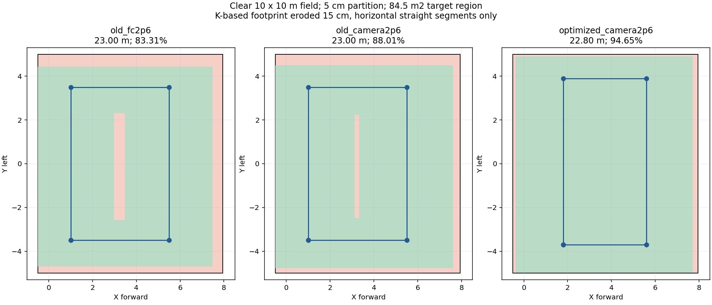

# 矩形/蛇形高位路线与飞行衔接候选（2026-10-04）

本轮按用户新授权从速度计划进入实现。代码已编译、离线检查通过；未启动仿真、未上板、未改变冻结配置，尚无完赛节时或无碰撞的实跑结论。

## 路线和高度

两份完整候选配置在 `deployment/competition/candidates/rectangle_motion.yaml` 与 `snake_motion.yaml`。它们均要求现场填入走廊航点/H位置并确认场地，当前 `site_confirmed: false`、空走廊与空H坐标不能进入飞行。不是用模板中的示例门平面代替随机门位置感知。

以净空内环10×10m、净宽1.5m走廊、5cm隔墙设计，目标区为8.45×10=84.5㎡；100㎡包括走廊及隔墙，不能全部算投递搜索区。坐标X向前、Y向左，目标区X=[−0.5,7.95]、Y=[−5,5]。这是鲁棒性设计假设，尚未改写Gazebo世界或认定真实墙厚为5cm。

| 候选 | 巡航点顺序（m） | 搜索段长度 |
| --- | --- | ---: |
| 矩形闭环 | (1.8,−3.7)→(5.6,−3.7)→(5.6,3.9)→(1.8,3.9)→(1.8,−3.7) | 22.8m |
| 两列蛇形 | (1.8,−3.7)→(1.8,3.9)→(5.6,3.9)→(5.6,−3.7) | 19.0m |

长度不含起飞到首点、避障绕行、重访和返航。矩形仍保持闭环，相对旧23m路线主要收益是视场分配更均匀，不能据此承诺显著缩时。蛇形少一个横边，但需按重访位置及走廊入口一起比较全任务代价。

`survey_camera_agl: 2.6` 指镜头至地面的高度，`high_agl: 2.76` 仍指FC中心离地。当前rig的镜头低于FC 0.16m，配置生成时检查两者关系，不改变既有 high_agl 语义。FC落地离地0.22m，若起始FC local Z=0，则ground Z=−0.22，巡航local Z=2.54；不能直接把local Z当作镜头离地。最大FC离地3m，仍需核验机体最高点和姿态余量。实机外参/地面参考变化时应重测再生成。

机头保持原固定航向，相机长边沿X。边界不是等距对称内收：考虑CameraInfo主点偏移后，Y端点−3.7/+3.9用于均衡两侧边缘损失。没有新增相机/机头随航线转弯的动作。

| 净空10m薄墙场景 | CameraInfo投影再内缩15cm：全目标区点覆盖 | 去掉边缘25cm带：内部点覆盖 |
| --- | ---: | ---: |
| 旧矩形，FC2.6m/镜头2.44m | 83.31% | 90.18% |
| 旧矩形，镜头2.6m/FC2.76m | 88.01% | 95.09% |
| 新矩形，镜头2.6m/FC2.76m | 94.65% | 100% |

新矩形按实测视场名义覆盖100%，按CameraInfo名义覆盖98.98%。15cm是图像地面边界的几何余量，不是已证明的姿态/遮挡误差上界。统计是理想平地、完整飞完直线、无遮挡的“点进入视场”，不是YOLO召回、完整1m靶可见率或保证全靶识别。标准1m靶完整摆在场内时中心通常离墙至少0.5m，但35cm红十字可更靠边，仍需保留漏检后的现有补搜。蛇形与完整靶可见口径另见[先前设计](../serpentine_20261004/PLAN.md)。

复算：激活 rl_drone 后在本目录执行 `python evaluate_rectangle.py`，输出JSON和PNG；脚本读取本仓候选与相机配置。

## 已接入的五项优化

| 项目 | 原行为与候选行为 | 保留条件及限制 |
| --- | --- | --- |
| 投后恢复 | 从等待升高并停稳，改为达到FC离地0.9m后可在上升中交接给下一次三维规划 | 成功释放ACK后至少0.6s；新鲜同坐标系里程计；控制RUN和对准关闭均在ACK之后；新样本跨度≥150ms、间隔≤200ms；水平速≤0.25m/s、垂直速−0.03～0.6m/s。投后先升至0.9m仍是垂直段；下一段前往低位1.4m可升高同时横移。服务ACK不等于新增了机械离机传感器。 |
| 走廊入口 | 原同XY先高点再低点，候选合为前往低位入口的三维航段 | 仅去掉同XY明确下降对的高点；低入口必须在门平面减速区之外且先停稳。后续走廊指令上限FC离地1.0m。整段仍由现有三维避障规划检查；失败沿用现有恢复/失败机制，没有虚构自动切回旧分段路线。 |
| 近墙重访 | 不再因目标靠墙而从场地中央全程慢行 | 用当前位置、目标距离、1.2m/s上限、0.6m/s²保守制动、0.3s反应和0.15m储备计算1.71m提前量，叠加既有边界margin；返回慢档另加0.2m迟滞。陈旧位姿直接慢档。只调整原跟踪前视档，不放宽边界许可。 |
| 走廊中继 | 同高度、同方向、严格共线的普通中继合为一段规划，不逐个刹停 | 保留拐角、反向点、低入口和附加H段；门平面附近0.75/0.95m减速迟滞及H附近0.8m慢档保留。原点与删除点写入runtime元数据。更长规划段是否适合当前局部地图/规划时域仍待SITL。 |
| 高位直线倾向 | 在运动学A*代价中增加偏离本次起终点线段的软代价 | 只在已确认升高后的SURVEY设置权重2，其他阶段清零；每个运动原语仍过原三维碰撞检查，最终B样条仍可因避障、速度/加速度或优化而弯曲。不是强制直线。 |

巡航速度/加速度上限沿用1.2m/s、1.0m/s²。跟踪前视距离不是实际速度：SEARCH/REVISIT远处为1.0m前视，APPROACH正常精细档0.4m，近边0.2m；走廊空旷0.4m，门附近0.15m。实际速度取决于规划轨迹、剩余距离与跟踪器，未宣称处处飞满上限。

本轮没有实现所有普通航点的非零末速度交接。高位矩形转角、低位确认点、低入口和H仍可能停顿。独立起飞爬升档、一般转弯连续通过、槽位预补偿、感知等待优化仍在原计划中，不能把这些写成已完成。

## 开关与接线

`motion_optimization.enabled` 默认false，现用 `field.example.yaml` 不变。两候选显式true，子项 `dynamic_boundary/moving_recovery/diagonal_entry/merge_collinear_relays` 可逐项关闭，`survey_line_weight: 0` 取消直线软代价。关闭总开关保留原恢复等待、入口航点和速度选择。

参数生成器把策略交给manager，把恢复条件交给planner_bridge；控制侧仅由生成的恢复高度参数配合既有patrol_control，不修改其源码。桥接与控制恢复高度使用同一float32值，原恢复爬升设定点FC1.5m仍在新规划接手前生效。门低限在低入口真正完成后才施加，避免从高位进场时把指令突然裁到低高度。H后段保留独立限高与捕获停稳。

没有改释放许可、舵机、YOLO/圆环门槛、位姿跳变处理、LIO或0.25/0.20/0.10m地图膨胀。

## 验证与下一轮

- 整机工作树：path_searching、plan_manage及轨迹服务器实际编译通过；C++直线软代价2项通过。
- uav_mission完整407项Python检查通过；随后新增manager阶段切换检查，motion专测15项通过。
- 导航源工作树：motion/execution_speed/corridor_speed共24项，20通过、4项整机前端专测按预期跳过；共享改动已对应同步。
- 候选launch离线展开：控制输出开/关均构建HighViewFull，核对planner限速、恢复高度、策略开关、三维膨胀和舵机许可接线；两种定位模式与地图入口也通过。只展开配置，不启动ROS节点。
- 复现接线检查：加载ROS与双工作区环境后，`python deployment/competition/check_wiring.py --profile deployment/competition/candidates/rectangle_motion.yaml`；snake同理，不传profile检查原默认模板。
- 保持候选身份，下一轮需在同场地、模型、膨胀和保护口径下逐项A/B，再测组合。记录全任务时间、恢复交接高度/速度、规划耗时及失败、各拐角停顿、门碰撞、三投及H终态、实际镜头覆盖。没有当前轮仿真授权，故未启动SITL或生成飞行视频。

导航共享实现来源分支 `sakelier/liftrace-controlwork:feat/high-view-liveness-20260919`；完整候选前端与几何图在 `Qinling-Melon-Farmers/liftrace-visionwork:feat/r2026-competition-integrated`。本轮不推main，不覆盖板端冻结工程。

导航共享实现提交：`8f2631be8c0e944be1961c0814f55971f477f277`。
