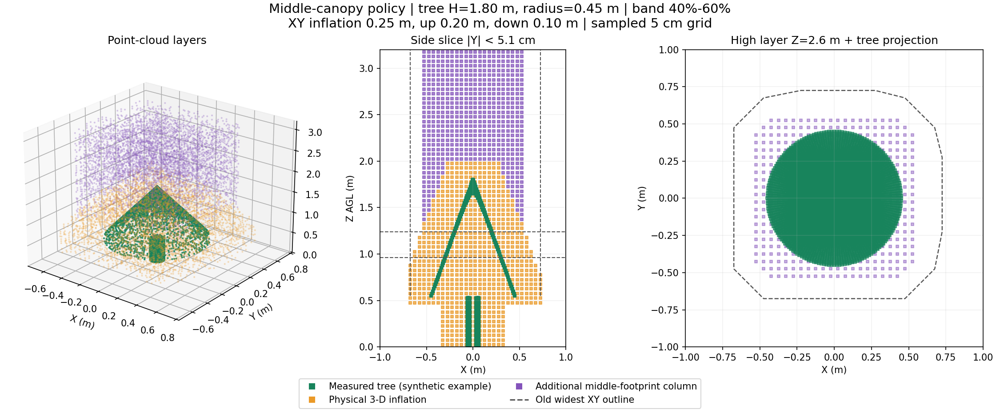

# 障碍柱改进、固定膨胀与板端入口对齐（2026-09-26）

本轮完成代码调整与离线验证，未启动SITL，未部署或启动实机。当前是候选实现，不能沿用旧矩阵的PASS标记新地图行为。

## 1. 本轮口径与示意

用户明确选择：**按树冠中部轮廓建柱，允许经过下部外缘上方，同时保留真实三维避撞。** 这与此前“整棵树最宽投影上方都禁止经过”不同；现在不再宣称满足后一种限制。中部柱仍阻断树冠核心上方路径。

原始点全部参加普通XYZ膨胀，不把树的实际形状替换成细圆柱。额外禁越柱来自中部轮廓，从其观测高度扣除向下膨胀后向上延伸；不再把悬空树冠下面没有实测结构的空间一直填到地板。

绿色为原始树点，橙色为普通三维膨胀，紫色为额外柱，灰虚线为旧最宽轮廓。使用生产C++辅助类，合成1.8m树、0.55m树冠底、0.45m最大半径。**这是几何示意，不是现场雷达采样，也不是新的仿真验收。** [参数](column_example.json)。

## 2. 生成过程与现场调整

1. 所有有限点保留原三维占据，按水平0.25m、向上0.20m、向下0.10m膨胀一次。
2. 额外柱只使用搜索区域内、高于过滤高度、附近至少3点且垂向跨度至少0.20m的点。0.15m邻域按圆盘网格距离计算，不再向上取整成20cm方块邻域。
3. 在XY网格划分独立的受支持点簇；按每簇实测最低/最高Z，取40%–60%高度带。不同高度、不同垫高的独立树分别计算，不需要树坐标或仿真真值。
4. 对高度带里的实测点求每簇二维凸包并填充内部，避免圆锥表面点形成可穿柱心的空心轮廓；不跨不同树求一个全局凸包。
5. 中部轮廓施加同一水平膨胀后向上建柱。某簇没有中部点时，保留该簇完整支持轮廓的凸包兜底。柱外仍保留真实三维占据。
6. 局部XY区域重建全高度，避免高度窗口移动后留下旧合成柱底部。

统一配置：patrol_uav_ws-patrol_planner/src/uav_mission/config/horizontal_planner.yaml。

| 参数（sdf_map/horizontal_avoidance下） | 默认 | 调整方法 |
|---|---:|---|
| column_middle_enabled | true | false恢复全部支持投影向上延伸；不会关闭真实3D避撞 |
| column_band_low_ratio / high_ratio | 0.40 / 0.60 | 必须0≤low<high≤1。0.30–0.50通常取更宽的下部；0.50–0.70通常更窄 |
| obstacle_min_z | 地面+0.40m | 地面/低矮回波分类门槛；只影响额外柱，不能据此删除真实箱体 |
| support_radius | 0.15m | 邻域及点簇连接尺度，仍有体素量化；不宜随意加大连接相邻树/墙 |
| support_min_points / support_min_vertical_span | 3 / 0.20m | 排除孤点/薄平面；太严会使细枝无法参加柱分类 |
| floor_z | 地面+0.10m | 柱最低允许Z，本版不会因此向下填到此高度 |

“实测最低/最高”是支持结构的高度范围，**不是语义分割后的真实树冠底/顶**。树干、树箱、遮挡、离群点和树贴墙导致点簇相连，仍会影响估计。可把过滤Z设到箱顶附近、调整比例；不能把不完整扫描当成树已经变矮。当前有无中部点兜底，尚无跨帧树高滤波/专用离群顶点过滤。

四套板端测试自动建立地面基准；中部比例继承公共YAML，相关Z由trial_config.py生成。改静态参数后重启规划应用生效，不在飞行中切膨胀。四套虚拟顶棚继续关闭，目标高度与控制限高保留。

离线工具可改树高、树冠底、半径、比例：

    source /home/xhj/miniconda3/etc/profile.d/conda.sh
    conda activate rl_drone
    python tools/obstacle_columns/illustrate.py --out logs/column_example --tree-height 2.0 --canopy-base 0.7 --radius 0.5 --band 0.4 0.6 --inflation 0.25 0.20 0.10

工具只运行几何计算，不启动ROS；树高只作用于示意，**不是写死规划器的现场树高**。

## 3. 撤销分阶段膨胀

恢复历史实机规划入口的水平0.25、上0.20、下0.10m，搜索/重访/走廊共用。删掉任务层“投后改膨胀→阻塞等地图回执最多10秒”、地图动态膨胀回执、tracking_margin第二次水平扩张。已有阶段速度/高度安排和搜索区限制保留。

研究fov_inner_repair.launch在历史场景覆盖之后应用固定膨胀，防止scene残留0.10重新覆盖。历史日志/报告中的旧参数保留；旧tracking_margin/column_top_z键不再参与C++地图生成。

0.25m是**点到占据边界的膨胀量**，规划器不会自动再加55cm碰撞盒半宽。5cm网格可表示25cm；板端10cm网格ceil为3格，轴向约30cm并带体素边界误差。该地图并非倾斜机体扫掠体的严格证明，不能据此承诺80cm门或任意姿态均能通过。

## 4. 试飞组入口与四套专项差异

参考导航仓sakelier/liftrace-controlwork的板载代码分支，最新读取revision为fa62126213995780015d58773511de1e4569cfb8。其6m终点是bag之后新增，不认为9月25日已飞到6m。参考minimal_delivery_test.launch及实际源码，不误称2025旧任务程序。

| 差异 | 试飞组最简投递 | 本地四套旧状态 | 本次处理 |
|---|---|---|---|
| 任务开始 | manager读manual_waypoints并进入搜索 | 9/20首轮整程IDLE，未调用开始服务 | 明确READY≠START，每5s显示阶段/模式；仍不自动解锁或启动 |
| 地图 | horizontal_avoidance=false，水平膨胀5cm | 所有专项开整高柱，10cm分辨率/30cm膨胀，柱门槛仅地面+10cm | 低空中断/H/走廊用真实3D图，高位加新中部柱；统一25/20/10，不照搬5cm |
| 导引 | 起点→4m→最新6m（场地较大） | 0.6m后直接要求3m目标 | 4×4直飞加入1.2/1.8/2.4m中间点；仍自主避障，不绕过可达性检查 |
| 前视和速度 | 巡航1.0m、精修0.4m前视，控制限速1.2m/s | 起飞/初始前视0.15m | 起飞/初始0.25m、巡航0.50m、精修/走廊0.25m；四套限速仍0.5m/s，前视不是实速 |
| 相机方向 | q=(0,1,0,0)，像素矩阵[-1,0,0,1] | known_rig仍是旧90°方向 | rig、定位launch、像素接口一起同步；平移和地面自动基准继承 |
| 相机启动 | SDK已去除二进制cv_bridge依赖 | 本地SDK仍依赖它 | 精确继承源文件与测试；不替换所有OpenCV库 |
| 槽位 | [-0.12,0]/[0,-0.12]/[0,0.12] | 未完整继承现场槽位参数 | 集中到known_rig并生成普通/动态槽位；测试仍mock |
| 投后恢复 | 标准/红十字恢复目标已参数化 | 红十字硬编码1.15m，handoff可能1.18m | 两类恢复目标设为低空local Z+0.10m；handoff为低空高度；增加合法范围检查 |
| 初始化采样 | 能建立启动条件 | 400样本可能混入13秒前运动 | 用最近2秒且至少1.5秒稳定样本，保留未解锁/新鲜度/方向检查 |

9/20第二次到x≈0.6后，3m目标占据/无轨迹，12秒abort。该轮没有完整输入点云，不能断言一定是树、人员或FreeDOM凭空生成。当前减少错误整高柱并提供近目标，但尚未实飞证明排除首因。

恢复高度矛盾是另一处确定缺陷，**不是此前尚未投递就停住的原因**。试飞组9/25因舵机不可用没有成功释放恢复，因此那份bag不能证明恢复已实飞通过。

map↔camera_init保留单位静态模式/可选实测模式和双向frame适配器，没有用换TF掩盖占据，没有删掉地图/轨迹的身份与进展约束。

## 5. 验证与版本范围

- 13项C++几何测试通过：孤点/薄平面过滤、圆盘邻域、中部收窄、两树高度、空中部兜底、空心填充、柱底不向下虚构、重建移除旧柱。
- 6项投后阶段测试通过，固定膨胀不再阻塞等回执，原阶段高度/速度切换保留。
- 17项板端专项、4项相机测试通过。
- 四套×preview/flight共8个应用展开，以及定位入口展开/实际运行时对象构造通过；展开断言含固定膨胀与中部比例，不启动ROS节点。
- 研究plan_env/patrol_control实际编译通过；板端视觉与导航两工作区完整构建通过，最终地图/控制再次增量构建通过。均为WSL构建，不是香橙派实飞。
- 合成11680点示例支持分类+中部选取约0.5ms（笔记本单次，不代表板端）；无新ROS节点或任务FSM。额外临时空间随XY网格/点簇数变化，不增加完整3D概率缓冲。

导航改动先在已有feat/high-view-liveness-20260919开发，再逐文件同步研究与板端。旧控制必要补丁前原包快照/清单保存在导航来源分支legacy_baseline/20260926_board_recovery/{high,board}。未覆盖试飞组长期维护的板载代码，未合main，未替换正赛部署。

下一步按既有渐进流程：静置确认方向/尺度，preview观察原始点云与膨胀图，再做单投恢复和高位记忆专项；获得实跑请求后进行动态验收。本轮不把静态通过当飞行通过。

另行完成[1m靶板与bag视场核对](../../deployment/flight_fov_20260926/REPORT.md)：内参一致，动态五帧尺度仍有波动，未据此改相机参数。

导航来源提交：[8df8397](https://github.com/Qinling-Melon-Farmers/liftrace-controlwork/commit/8df83974fd98323284a30418d6be3cb1a4e79694)，branch=feat/high-view-liveness-20260919；逐文件集成，旧控制快照同在此提交。

2026-09-26晚补充：[槽位闭环核查](../../deployment/drop_slots_20260926/REPORT.md)发现继承的12cm数组是固定camera_init目标增量，不是已验收的机体系槽位外参；视觉主点对齐和槽口到位尚未统一。本页“槽位继承”仅表示复制现场参数，不表示补偿方向或三槽精度已经验证。
