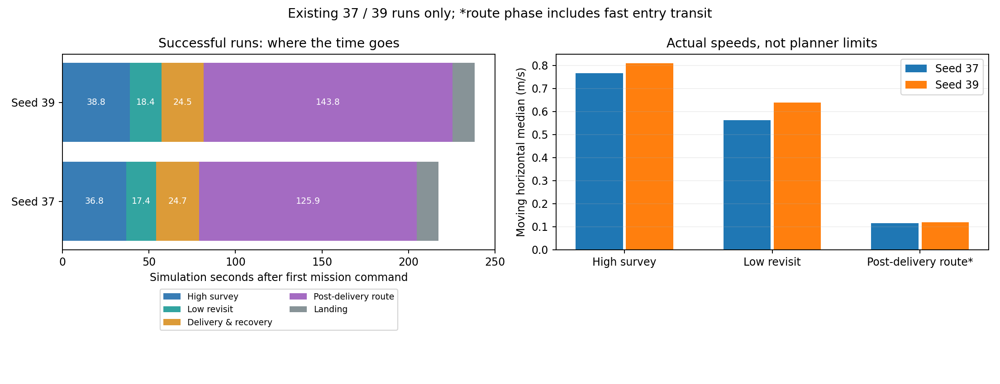

# 最新实验复盘、停滞治理与速度优化评审

日期：2026-09-19。整机侧范围：只读源码、既有运行和文档，重算统计；**不修改整机飞行代码、launch、参数或模型，不启动SITL，不上板**。按用户后续指示，轻量liftrace-sim本地fork已另行进入代码改造与离线预筛，见[LIFTRACE_SIM_ASSESSMENT.md](LIFTRACE_SIM_ASSESSMENT.md)。

结论：当前最适合做的下一步，是**补齐轨迹执行内部观测，修复“有轨迹却无推进”的活性缺口，同时隔离近墙复访问题**。保留高位记忆、下降解耦和低位兜底。在这些问题关闭前，不宜扩大速度上限或继续铺开随机矩阵。之后优先优化走廊与阶段切换，搜索速度不是目前最大的时间支出。

阅读顺序：[轻量fork评估与本轮改造](LIFTRACE_SIM_ASSESSMENT.md) → [停滞方案与边界情况](STALL_AND_EDGE_CASES.md) → [2025/2026分阶段速度调查](SPEED_REVIEW.md) → [来源与统计口径](SOURCES.md)。

## 1. 最新改动实际推进到哪里

研究分支 `feat/high-view-search-research` 当前分析基点为 **778121a**（提交时间2026-09-17，本地与远端同名分支一致）。其中报告目录仍沿用20260915，不能把目录日期当作最后提交时间。

| 提交 | 推进内容 | 状态 |
|---|---|---|
| d463613 | 持久导航线索、8s高位无进展换点/跳过、部分目标低位覆盖兜底 | 已实现；不能代替走廊无进展治理 |
| a12750b | 就近下降不再依赖完整三点排序；必要时逐点复访 | 保留，用户已明确不应因后段碰撞整块回退 |
| 59c6215 | 三轮修复、32补验及走廊复盘归档 | 旧失败保留 |
| 92bd3ee | 同场景33再现末段工程限高FAIL | 三投、两门、9点成功，H阶段峰值0.7114m越0.7m工程线 |
| 0c2961b | 新全随机36–40及第二门专项 | 2/5整场PASS，3/5三投提交完整 |
| 5e6e607 / 778121a | 降落确认、近墙预算修正、停滞观测与修复设计 | **仅分析/设计，尚未实现观测和停滞修复** |

`59c6215..778121a` 的 `patrol_uav_ws-patrol_planner/src` 与 `vision_ws/src` 无差异。因此新增36–40不是“又换了一套飞行算法”的验证，而是在保留解耦的同一飞行实现上补充了场景覆盖。主检出 `/home/xhj/liftrace` 仍在 `main@2f405be`，不能用主检出的旧README判断研究进展。

## 2. 新一组实验说明了什么

| seed | 门型 | 三类齐备后中断：任务相对时间 | 已提交投递 | 三投时间 | 完整完赛 | 主问题 |
|---|---|---:|---:|---:|---:|---|
| 36 | LL | 48.98s | 3/3 | 101.04s | FAIL | 第二门第8段90s超时 |
| 37 | LR | 32.55s | 3/3 | 76.28s | 217.40s PASS | 本轮完整通过 |
| 38 | RL | 33.27s | 2/3 | — | FAIL | 第三投相关阶段保护圈接触Wall_11 |
| 39 | RR | 34.66s | 3/3 | 79.10s | 238.21s PASS | 本轮完整通过；第二门经历失败重规划后通过 |
| 40 | LL | 39.60s | 2/3 | — | FAIL | 第三次近墙REVISIT接触Wall_11 |

时间从各轮首条任务指令起算；旧表的44.2–60.6s为ROS绝对时刻，不能直接当搜索持续时间。已重新与 `start_ros_s` 相减。复核原分析函数后，14指的是进入DELIVERY阶段次数，release记录与槽位提交均为**13**，不能把进入阶段写成已释放。完整三投是3/5。`door_crossings` 的3项包含走廊入口，实际比赛门是2扇。

这批证据支持：

- 累计线索与提前中断已经能工作，5/5触发；33/35旧结果与37/39新结果说明高位方向仍有价值。
- 失败重点后移：第二门执行停滞、靠墙目标复访/对准、H降落阶段高度切换。
- 5个场景各1次不是重复性统计。37/39成功不证明普适稳定；也不能把旧31–35和新36–40不同源码、不同布设混成一次单变量提效试验。

## 3. 对上一轮判断的修正

### 停滞：降低“保持锁”假设的优先级

seed36在203.62s已有时长9.22s、终点到达 `(2.3,8.35,0.23)` 的完整轨迹；之后没有续规划或到达事件，设定点很快停在门前。新判别发现冻结指令距轨迹折线约1.6cm，冻结瞬间并不等于已记录的真值/LIO/FC位置。这**更支持前视/投影进度停推**，不支持直接把“保持锁记住当时里程计”作为主因。

但记录频率、插值和缺失内部状态使该排除还不是严格证明。0.20m保持与0.45m重规划的不协调窗口仍是代码反例，不能拿这个反例代替seed36现场根因。下一步观测必须覆盖两条机制及其组合。

### 近墙：不是理论必撞，也不能靠删难场景解决

按用户补充，55cm是已经主动膨胀近10cm的鲁棒设计包络，不是裸机实测外形。本评审不再给它重复添加同一份膨胀裕度，也不从“近10cm”反推唯一实机尺寸。接触该包络说明工程鲁棒余量被用尽/触及，不能直接断言实机碰撞；原仿真Gate仍按既定判据保留FAIL。

38/40红十字距墙约0.390/0.365m；零偏航下**设计包络**半宽0.275m，理想靶心悬停仍有约0.115/0.090m工程余量。实测提示外偏、跟踪超调和姿态投影耗尽的是这份工程余量，实际机体净空须按实机外形另算。旧稿0.425m只是本批相关性分界，不是通用合法性门槛。

应分开“规则上合法的靶位”“当前机型可安全到达的飞行状态”“随机基准是否覆盖困难样本”。优先约束飞行侧复访区域和末段制动，保留旧近墙场景为回归；不能通过移走这些靶标宣称算法已经修好。

### 降落：37/39成功，33复现暴露工程阈值与阶段高度的接口问题

0.7m是现有走廊Gate的工程阈值，不能与规则书1.5m墙高互换。下一步应核对H捕获/对准爬升的真值、估计值和指令上界，明确何时退出走廊高度约束，检查控制过渡和余量。不得仅把0.7114m的失败“改阈值改成PASS”。

## 4. 推荐下一步：小范围、可证伪地推进

用户最新选择是优先推进本地liftrace-sim fork，本轮已完成独立当前profile与31–40几何预筛；下一步轻量研究以实录姿态/线索回放及同速度几何对照为主。下表是整机问题恢复实施时的优先级，不代表本轮开始修改导航代码。

| 顺序 | 工作 | 退出依据 |
|---|---|---|
| P0-a | 导航权威分支上补只读执行观测；离线重演已有完整轨迹与起始偏差 | 能区分前视停推、保持锁、旧轨迹/丢更新、真实不可达；默认关闭，行为不变 |
| P0-b | 按观测修推进或保持恢复；加独立、有界的无进展兜底 | 不再依赖0.45m误差才恢复；不跳轨迹分支、不虚报到达、不循环重启90s |
| P0-c | 近墙候选→安全复访点→低位新鲜对准的完整预算；与P0-a分析并行 | 32/38/40保留原靶位，提示误差与刹停余量均受约束 |
| P1-a | H阶段高度事务与终端状态口径 | 33历史限高事件有明确解释；37/39作为不退化对照 |
| P1-b | 同场景重复验证，再逐段提高速度 | 先成功率、零碰撞和尾部耗时，再看配对节时；按失败阶段保留所有结果 |
| P2 | 局部补扫、航带/FOV补缝与动态尾段预算 | 在前述稳定链上单独比较，不与停滞补丁混做 |

现有36–40已足够支持优先修机制，不需要立即再跑更多随机seed。后续获明确实跑安排时，36为主要定向样本，31/34检查跨布局，37与39分别检查直接通过和失败后恢复，32/38/40检查近墙；分小批执行，不一次展开全部笛卡尔组合。本次不执行这些轮次。

## 5. 为什么速度优化应优先看后半程

图中High survey组包含ASCEND/SURVEY/DESCEND；Post-delivery route包含快速入口转场。右图按任务阶段计速，下面表格则单列FollowingSpeed的纯低速走廊档，二者口径不同。

| 成功轮 | 三投后至完整结束 | 占完整任务 | 纯低速走廊速度档时长 | 该档移动水平P50 |
|---|---:|---:|---:|---:|
| 37 | 141.13s | 64.91% | 112.19s | 0.114m/s |
| 39 | 159.11s | 66.80% | 127.92s | 0.118m/s |

本批高位SURVEY移动P50约0.77/0.81m/s，低位REVISIT约0.56/0.64m/s；高位平面搜索只占29.5/31.5s。优先消除90s空等，随后在宽裕直段推进得更快、窄门和近墙末段保持精准，潜在收益比继续把高位规划上限从1.2往上调更直接。这里是优先级依据，不是已验证节时承诺。

旧工程的3m/s是规划上限，非实际全程速度。旧链没有今年这样的未知靶全覆盖搜索，也存在全曲线最远采样/无可用点时直接选终点、按时间宣布轨迹结束等激进路径；不能为了快原样恢复。完整各阶段对照见[SPEED_REVIEW.md](SPEED_REVIEW.md)。

### 视觉组可并行做的工作

主检出未跟踪的`视觉组需求.md`是历史需求，不能重新列为待从零交付任务。已核实KS2A543的B100/C25/D11于9月4日提交，PR #1已合入liftrace-sim上游；后续应补当前策略真正缺的条件和模型适配，而非重做原矩阵。详见[LIFTRACE_SIM_ASSESSMENT.md](LIFTRACE_SIM_ASSESSMENT.md)。

先围绕当前1.4/2.6m与实测速度区间检查同步样本和确认链，逐步补中心/边缘/转弯数据；完整入画、正确检出、几何关联、有效地图点、确认候选、被选中分别计数。缺原图/逐帧拒绝原因的记录只能做有限阶段统计，不补造召回率。需求中3.6m、2.0m/s等是候选评测点，不等于当前比赛策略或飞行入口已允许；较高档位先列为静态/离线或后续独立验证。

算法延迟按墙钟/单调时钟测，运动学按ROS时间测，并同时记录RTF、输入/处理FPS与源时间。慢于实时的Gazebo可能给视觉更多墙钟处理时间，5/5中断成功不能直接外推至OrangePi实飞。

## 6. 仓库归属和实施边界

- 本文写入视觉/整机仓研究分支，记录基点778121a；不改变整机验收基线或机载包。
- 按新AGENTS 3.3，Fast-Planner、任务manager及调度的后续实施应先在 `liftrace-controlwork` 的feature分支完成。现有只读参考clone是 `main@a68925d`，它不代表已经含有本研究集成改动；实施前要确认基线/差异和负责人，不能直接对本仓导航源码继续形成分叉。
- 拟新增诊断/恢复接口须先形成双仓书面约定；本文是提案，不表示接口已经批准或实现。集成时记录来源URL/branch/commit，仅同步明确文件。
- 联合实跑的 `UAV_WS` / `VISION_WS` 必须是显式overlay权威，manifest记录实际包路径与双仓revision；不再靠手写整条 `ROS_PACKAGE_PATH` 修补。主检出未跟踪的用户文件不动。
- 旧方案中的“已授权1–2诊断跑”是历史安排；本轮明确只交文档，不使用该安排启动仿真。

## 7. 验收本次文档

已读最新提交、36–40统计与关键原始文件、33复现、现行推进代码及两份2025参考来源；重算相对时间与分阶段速度，并核对数据口径和链接。没有新增运行结果、实机性能结论或已完成的停滞修复承诺。临时分析在logs下，交付只含Markdown、静态图和测量摘要。
