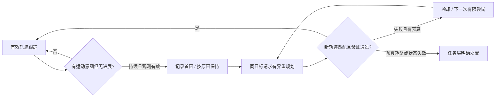

# 停滞治理、避免复发与边界情况

2026-09-19设计评审；未实施代码或启动仿真。本文细化[旧方案](../high_view_search_20260913/CORRIDOR_REPLAN_20260915.md)，不撤销已保留的下降解耦。

## 1. 把问题定义成“任务有运动意图，但系统失去推进能力”

当前任务层仍认为目标有效，规划端已给完整轨迹，执行端却停在初段。FSM现有三类重规划条件依赖投影误差、投影进度耗尽、部分轨迹推进；一条完整曲线如果投影进度停住，同时误差不大，就可能没有任何分支负责恢复。**空间上接近曲线并不代表任务在推进。**

新证据使前视/投影停推成为主假设。保持锁是另一种仍须覆盖的机制；前视偏差与投影偏差是两种量，0.20m和0.45m不能简单当作同一误差的上下限。既有0.25m离线反例证明存在某种自锁组合，不证明seed36就是那一组合。

应分别记录和处理四类情况：

| 类型 | 可见事实 | 处理原则 |
|---|---|---|
| 本来就不该运动 | 对准驻留、机构动作、落地确认、人工HOLD、正在切换模式 | 不触发运动无进展重规划 |
| 无轨迹/不可达 | 未收到新轨迹、计划失败、目标/通道被占据 | 规划恢复或任务层明确终止；与执行停推分开 |
| 有轨迹但不推进 | 同一有效目标、轨迹新鲜、位置/弧长进度长期很小 | 同目标受控恢复；不等到90s才有反馈 |
| 不允许继续当前曲线 | 地图/定位失效、障碍进入、安全保持 | 先保证保持有效；不能因超时直接解除安全锁 |

## 2. 第一步观测必须能捕获首次触发，而不只是事后平均

原设计的10Hz独立诊断方向合理，但控制回调更快：一次10ms量级的越限可能已经锁住执行。建议**10Hz状态心跳 + 状态变化事件 + 首次触发快照**；必要时使用内存环形缓冲保存前后短窗，事件触发后由记录线程落盘，不在控制线程同步写大文件。

| 记录组 | 最少字段 | 关键用途 |
|---|---|---|
| 身份 | mission/定位epoch、decision_seq、goal_seq、traj_id/generation、planner attempt、FSM状态、任务阶段 | 将旧消息与当前控制分开；不能只靠traj_id数值 |
| 时间 | ROS源时间、接收时间、观测年龄、轨迹start_time、实际回调间隔 | 区分模拟暂停、时钟回跳、陈旧输入与真正无进展 |
| 推进 | FSM与server各自的projection_t/arc_s、best_t/arc_s、duration、是否搜到候选、截断原因 | 两端各算进度，不应假定二者相等 |
| 位置 | odom XYZ/速度及frame、投影点、原始前视点、最终发布点、姿态/高度 | 看出卡在哪一层；可分别计算XY/Z误差 |
| 保持 | tracking_hold、trajectory_interrupted、保持原因、首次触发时刻/触发前误差、恢复条件 | 在心跳间仍保留首个触发事实 |
| 控制 | 原始及保持/限幅后cmd速度、加速度；patrol接管状态、接受/拒绝原因、MAVROS最终设定点 | 轨迹消息有速度不等于位置接口已使用速度前馈 |
| 生效限制 | target_dist、控制位置球、命令准入、速度/加速度上限、跟踪阈值、有效高度上下界 | 配置dump不等于阶段切换后实际生效值 |
| 活性 | 目标剩余距离、窗内沿程/实际位移、连续无进展时长、恢复次数/预算、最后恢复原因 | 支撑新兜底判据与复发检查 |

10Hz记录32个数值，二进制量级约2.6KB/s；10分钟约1.5MB，CSV/事件会更大。建议本轮诊断总量上限10MB/run，短窗最多几秒、次数封顶，queue_size=1；最终按实际CPU/P95延迟/RSS测量。默认关闭，不常开全图bag或重复全图推理。诊断字段先在导航与视觉记录端形成书面契约，名称在评审后确定，本次不新增公共接口。

## 3. 应补充的系统不变量

1. **活性有出口**：对于定位/地图新鲜且有运动意图的有效目标，有限时间内必须出现实测推进、有限恢复动作或明确终止；“一直等新轨迹”不是出口。
2. **到达必须有事实**：`TRAJECTORY_FINISHED`/航点完成仍以实际到达语义为准。停滞、超时或时间曲线走完不能伪装成到达；另用STALLED/恢复原因事件表达。
3. **同一动作不因重规划重生**：普通重规划替换轨迹generation，保留外层decision/goal及原deadline。不能每次重规划重新给90s，也不能误动槽位/覆盖游标。
4. **旧消息不能解新锁**：恢复只能接受与当前epoch/goal匹配且已验证的新轨迹；延迟回包、ID复用、节点重启均不能解除当前保持。
5. **恢复仍受几何与控制约束**：不跨曲线回环分支、不穿障碍、不跳到遥远终点、不解除碰撞停机理由、不放宽有效目标偏移来跨过门。
6. **场景改变与修复效果分离**：不移动旧近墙靶、不替换失败样本、不用提高高度阈值制造PASS；每项修复独立配置/验证。

## 4. 无进展判据：三种进度一起看

建议同时看：

- 同一轨迹上的**弧长进度**，而不只看参数t；非均匀B样条经重定时后相同Δt不代表相同距离。
- 实际位置的推进和目标剩余路径成本；不能只看欧氏距离是否减少，合法绕障初段可能离目标更远。
- 当前发布点/候选点是否前移，以及运动是否有意被抑制。

候选定义：在有效运动阶段，距离到达区域仍有余量，窗内弧长推进和物理推进均低于标定门槛，且没有预期驻留/模式切换，记为无进展。曲线参考在变而飞机没跟上，归为跟踪/执行异常；飞机沿合法绕路运动则不要只因目标距离增加判停滞。

暂定设计范围：连续3–5s无有效推进后请求恢复，位移门槛按定位噪声、实际最小速度和采样率标定，可从2–5cm离线检查起；这不是已验证参数。接收/启动新轨迹有有限宽限期。物理窗口累计不能被频繁新traj_id清零，必须受目标级总恢复预算约束。

## 5. 分因修复，同时保留共通的有限兜底

### A. 若确认前视/投影停推

保留单调分支约束，检查短曲线、重复控制点、近零导数、投影前向窗、20ms离散步长、曲率较大而前视球很小等情况。输出“没有满足条件的推进点”的显式原因，不把当前点当作正常可推进命令而长期沉默。

可以评估沿弧长有界选点、局部投影重捕或自适应采样。任何推进候选都必须满足局部连续、碰撞检查和控制可接受范围；**不通过强加最小t步长、按墙钟硬推进或直接取终点让飞机跳过曲线**。若没有安全候选，触发有界重规划。

### B. 若确认保持锁

把保持原因送入FSM，区分跟踪误差保持与碰撞/定位失效保持。阈值恢复要有滞回和连续有效观测；安全类保持优先等待验证过的新轨迹。**有界超时应触发恢复请求或终止，不等于自动放开保持。**

仅把0.45m改成0.20m不充分：两端比较量不同、还存在小偏差停推，并可能因噪声造成重规划风暴。修复应形成明确的请求—受理—新轨迹—恢复状态关系。

### 共通恢复流程

可先评估每目标2次恢复、约1s冷却的离线方案；这些只是限制候选，最终取值需用36/39等日志标定。90s仍是最后动作安全窗，任务总时间不延长。失败后的处置必须分场景：高位观测点可替代/跳过，**必经门不能跳过后记完成**；无安全路径时保持/请求接管或进入已定义的终止流程，不凭空宣布自主返航总可行。

## 6. 必须覆盖的edge cases与预期结果

| 优先 | 场景 | 要防的错误 | 期望验证结果 |
|---|---|---|---|
| P0 | 36完整轨迹、贴近曲线但不推进 | 三个FSM条件均不触发 | 有原因记录，并在有限窗口内恢复/明确退出 |
| P0 | 一拍超过保持阈值，随后误差变小 | 10Hz均值漏掉首次触发、锁永不解 | 首因事件可见；只按匹配恢复条件解锁 |
| P0 | 小前视球+紧转弯/重定时 | 所有后续采样不满足、静默返回同一点 | 显式no-lookahead、无跳段恢复 |
| P0 | 轨迹自交/近旁后续分支 | 全局最近点或最远时间跳过障碍 | 只在当前局部分支推进 |
| P0 | 重复点、零速度、极短/零duration | 除零、NaN、永不耗尽 | 输入校验和可解释终止，不发布异常命令 |
| P0 | 非均匀knot/高速度采样步长 | 固定0.02s跨过窄可行窗口 | 重定时前后几何与推进一致，采样误差受限 |
| P0 | 服务器保持但FSM仍EXEC_TRAJ | 两节点互等 | 明确保持/无进展反馈及恢复确认 |
| P0 | planner ready了但BSpline丢失/迟到 | “规划成功”被当“执行已接收” | 区分ready、server accepted和真实开始推进 |
| P0 | 错traj_id/旧goal结果/epoch重用 | 延迟消息重开旧曲线 | 拒绝旧代结果，不推进覆盖游标 |
| P0 | 高频重规划但物理位置不动 | 反复重置无进展窗和90s | 目标级预算封顶，不能无限刷事件冒充活性 |
| P0 | 障碍突入、曲线安全性失效 | 到超时就解除安全保持 | 新曲线验证前不继续旧危险路径 |
| P0 | 地图陈旧/空点云/区域未观测 | 把无占据当已知自由 | 拒绝/降级提案，3D规划检查与观测语义明确 |
| P0 | LIO跳变、map↔camera_init重置 | 旧线索和轨迹继续使用新坐标 | epoch统一失效；不可仅改frame字符串 |
| P0 | 限幅后命令与原前视点不一致 | planner以为推进，实际patrol拒收或夹住 | 同时记录限幅前后及拒绝原因 |
| P0 | 切档1.0→0.15m后上一拍仍在途 | 新阈值误拒旧命令、瞬间假停滞 | 切换序号/确认及短宽限，不放行任意旧命令 |
| P0 | 32/38/40近墙目标 | 高位线索外偏+超调耗尽余量 | 从内侧安全可见点复访，再低位确认和有界对准 |
| P0 | 近墙偏航/滚转/俯仰 | 只按静态0.275m半宽计算净空 | 按姿态包络、安装偏置及不确定度核算 |
| P0 | 8号必经航点effective_goal被挪动 | 到替代点就算过门 | 保留目标偏移上限与独立门穿越事实 |
| P0 | 33 H捕获爬升与走廊限高交接 | 阶段各自合法、组合却超界 | 统一真值/估计/指令高度口径，过渡有余量 |
| P0 | ACK晚到/重复释放请求 | 重规划或模式交接重新投递 | 槽位事务跨策略保留，释放只认新鲜且匹配证据 |
| P1 | 主动ALIGN/HOLD/机构稳定/着地 | 低速或静止被误判无进展 | 只对有运动意图的阶段启用看门狗 |
| P1 | 垂直升降、原地转向 | 只看XY位移误触发 | 按阶段观察XYZ/姿态目标，不把yaw率当平移 |
| P1 | 合法绕路先远离终点 | 欧氏距离增加就重规划 | 沿程推进优先，不追短直线穿障碍 |
| P1 | 低速飞行叠加噪声或摆动 | 噪声不断“刷新进度” | 噪声门槛、持续窗和净推进分离 |
| P1 | ROS时间回跳、暂停、RTF突降 | 瞬间超时或一直不超时 | 明确仿真暂停、源时间与实际链路陈旧的语义 |
| P1 | 前视无点但末端已经实际到达 | 不必要恢复抖动 | 先检查实测到达与dwell，正常完成 |
| P1 | 只有1–2个高位线索、低位重捕失败 | 回牛耕从起点重复、丢已投状态 | 继承游标/槽位/预算，从合法接入点继续 |
| P1 | 同类多实例、跨ID合并、强矛盾证据 | 无条件保留旧线索或永久悬置 | 解释确认/暂停/失效原因，有限复核，低位释放不继承陈旧性 |
| P1 | 保护圈/相机外参/分辨率更换 | 继续沿用旧净空和FOV预算 | 型号/标定版本关联，重新计算几何有效域 |
| P1 | CPU抢占/点云积压/诊断日志爆量 | 观测补丁改变故障触发并造成新延迟 | 回调耗时P95/P99、输入年龄、队列丢弃可见，记录有上限 |
| P1 | 仿真RTF低而推理按墙钟运行 | 仿真每米可用算力增加，误判高速识别能力 | 分开ROS运动时间和墙钟算法时延，记录输入/处理FPS，端侧独立验证 |
| P1 | UAV_WS/VISION_WS或devel混用 | 实跑的不是待测源码 | 包解析与manifest双仓revision匹配，启动前拒绝错误overlay |

## 7. 近墙恢复必须和速度设计共同约束

55cm已是用户指定的主动膨胀近10cm鲁棒包络；不能把它当裸机尺寸，再叠加同一份10cm裕度。也不能仅因工程包络触墙便认定实机必然触墙。两种预算口径应分开：

`工程包络余量 = 靶心至墙距离 − 鲁棒包络姿态投影半宽 − 实测提示外偏 − 实测跟踪外冲`，用于解释既有Guard事件；这些实测位移不是额外人为膨胀。

未来真实飞行预算则从**实测机体外形**出发，分配定位/提示/跟踪/制动误差与一次设计裕度；若继续用55cm包络作为规划约束，只增加明确未被已有设计覆盖的增量，不能两种口径重复累计。原场景不因0.425m经验分界被删除。

矩形设计包络在水平面偏航ψ下，x向半宽为 `hx|cosψ|+hy|sinψ|`；完整姿态应加入z半高及FC到包络中心偏置。误差可能相关，不能未经标定直接按独立高斯平方和缩小预算。制动项可用 `v·时延 + v²/(2a)` 做量级分析，但a要来自可验证的制动能力，不是直接把规划max_acc当实机保证。

0.55m守护盒是本批仿真模型，实机须用其实际包络；毫米级仿真接触/余量不作为同精度的实机测量，也不靠缩小碰撞盒把本次FAIL改写为PASS。

高位坐标只定义复访区域；可达点应在“感知自由空间、包络净空、目标可见范围、允许高度”的交集中。降到低位后用新鲜证据精对准；没有足够余量时减速、换内侧视角或明确放弃该次接近，不能静默裁剪目标再当成投递成功。历史近墙场景继续保留。

## 8. 防复发验收建议

先把新观测作为独立提交，证明默认关闭且不改求解分支；离线覆盖上表P0。之后在获授权的诊断运行里区分A/B并记录首因，再做最小修复。关键对照至少包含：36停滞样本、37直接成功、39失败后恢复、32/38/40近墙、33限高。分批执行，避免一次扩展成大量矩阵。

验收应要求：不出现未解释的长时间静默、恢复次数/总耗时有界、同动作deadline不重置、没有旧轨迹复活/重复投递、没有新增碰撞/高度违规，并保留所有FAIL。内部诊断不可用时不能宣称根因已证实；一轮成功也不能宣称“避免复发”已经完成。
