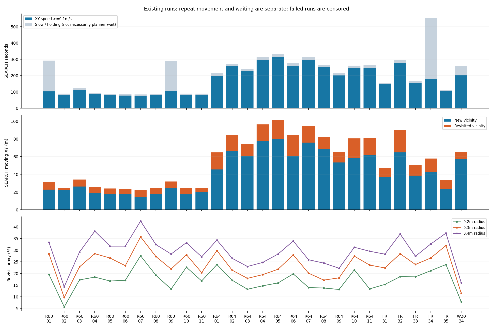
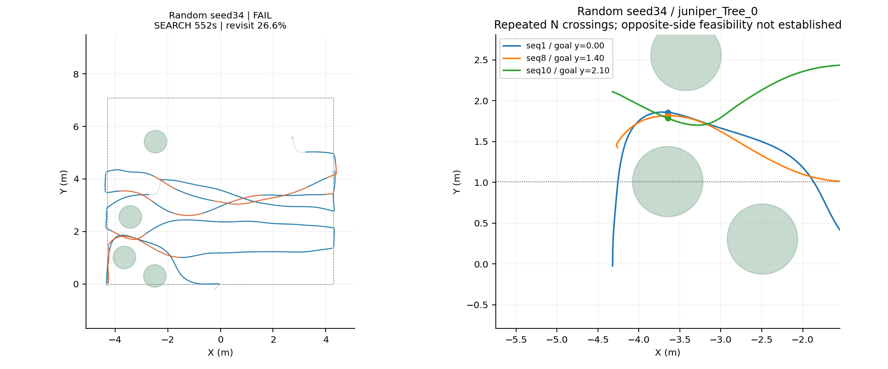

# 搜索效率优化计划——已审阅，分阶段实施

2026-09-12阶段3准备：有界局部航段建议已接通Fast-Planner原膨胀栅格只读预检，两个离线夹具验证选侧和受阻拒绝；95组历史候选仅完成生成，旧记录缺原栅格，未作可达性通过或节时结论。默认关闭且未接管任务，下一步先在线核验预检服务和原规划开销，再接入有限中间段。见[阶段报告](../../verification/local_search_proposals_20260912/REPORT.md)，优先级继续以ROADMAP为准。

2026-09-12增补：按用户要求加入端侧资源约束，已实现分块点云投影、字节缓存上限、CPU软预算、过期计算回滚和32候选上限；77项离线测试通过，252份历史样本两环境一致。详见[资源结果与端侧接入边界](../../verification/coverage_resources_20260911/REPORT.md)。本轮不新增飞行，后续局部补扫/恢复阶段复用原地图与规划器，限制候选查询工作量；板端并发资源与有效观测频率尚未验收。优先级继续只在ROADMAP维护。

2026-09-11用户已审阅并批准必要历史布局验证与后续开发。已完成第一阶段原型、在线接入修正、只读区域查询/历史账本，以及seed32的0.70/0.80m同图配对和seed34的0.80m/等待20s回归；三轮完整SITL均37/37通过，另保留一轮诊断中止。最新结果见[研究报告](../../verification/coverage_stage2_20260911/REPORT.md)，早期成果见[第一阶段报告](STAGE1.md)。实际航带只在研究候选runtime中改变；历史账本未自动驱动改道或跳点，正赛部署保持隔离。原28轮数据与初始计划保留。

纸箱布设已核实：仅在四棵障碍树下用于垫高，场内没有独立纸箱。后续模型/场景维持四组树+垫箱，不再把“是否独立布设”作为不确定项。

研究分支：`feat/coverage-efficiency-research`；独立工作树：`/home/xhj/liftrace-worktrees/r2026-coverage-efficiency-research`；从整机/driver2基线`86e382d`分出。当前正赛整机工作树及c369e6f8交付包保持原状。研究分支不合入整机开发/验收分支，也不用于正赛机载部署，直至另行完成稳定性验收并获准采用。

## 1. 目标与建议选择

核心目标是**以更少的搜索时间和无效路程，发现足够的高价值目标并完成可靠三投**。全场覆盖是避免漏靶的保障；规则没有要求走完24个航点，也没有要求每棵树两侧各飞一次。三投完成后仍走既有返程；需要保留发现红十字等高价值目标的机会，不能用提前选低价值目标制造“提速”。

已审阅的分阶段顺序：

1. 建立实际观测覆盖记录，先只旁路记录，不控制飞机；确认哪些重飞有必要、哪里仍未观测。
2. 做最小航带对照：0.70m基线，0.75m/0.80m候选，结合实际视场边界处理最后一条窄航带；0.60m作为召回对照。先保持固定航向、高度和速度。
3. 加入障碍附近局部补扫与未覆盖侧入口选择，随后才允许投递后从最近的未覆盖段恢复。
4. 待前三项稳定后，再比较变间距、航向匹配及搜索收益参与候选排序。辅助相机与全局规划器重写不作为首轮前置工作。

**不建议简单强制“上次北侧、下次必须南侧”。** 南侧可能未观测、受其它树箱阻塞、净空不足或规划不收敛。记录已观测区域和剩余空洞，让任务层优先给出能增加观测的安全子目标；规划器仍负责判定可达和生成轨迹。允许必要的复访，不把“换侧次数”当作优化目标。

## 2. 新规则对优化的约束

完整逐条复盘已同步到原[技术会规则修订文档](../../competition/RULES_20260906.md)，最新依据为根目录20260911 PDF。

- 新版明确要求桨叶保护装置；现场含保护装置的真实包络、重量和传感器遮挡会改变可达净空、有效视场。计划中的裕量不能只从裸机推导。
- 纸箱只用于垫高障碍树；当前矩阵采用0.60×0.60×0.30m垫箱尺寸假设。后续只对垫箱尺寸/树冠作实测和敏感性对照，不添加独立纸箱；相同场景配对，避免把改图收益算成算法收益。
- 搜索使用在线规划，4m限高与不得全程高于障碍物的计分约束保留；首轮不提高飞行高度来扩大视场。
- 靶位和裁判调整后的布局未知。真实目标/树位只参与本地历史评测，未来飞行策略只能使用当时的传感器观测及已知场地几何。
- 排名以分数优先，再比较时间。三投率、红十字/高权重靶机会、无碰撞与过门/落地结果要与时间一起考核。
- 降落新定义使用电机轴心圆。此项与搜索效率分开整改，不通过修改历史Gate掩盖失败。

## 3. 多轮实录给出的事实

本轮读取28个已有run目录的`truth_pose.csv`、`key_events.jsonl`、各轮冻结runtime和world：R60先导+十seed、R64先导+十seed、全随机31–35、seed34等待上限20s重跑。**这是历史记录汇集，不是新的28轮测试，也不混算成功率。**

| 数据组 | 轮数与历史全流程PASS | SEARCH时长中位s | SEARCH移动路程中位m | 近路复访占比中位 |
|---|---|---:|---:|---:|
| R60旧场地 | 11轮，先导1/1+矩阵2/10 | 89.50 | 24.88 | 26.63% |
| R64 | 11轮，先导1/1+矩阵7/10 | 267.10 | 82.49 | 21.39% |
| 全随机31–35 | 5轮，2/5 | 166.03 | 50.75 | 26.62% |
| seed34等待上限20s | 单轮1/1 | 258.00 | 64.95 | 11.49% |

R60搜索范围较小、目标布设和机架不同，时长短不能证明其策略更优。R64旧seed5/7/8靶板压墙，图中标记并保留；排除它们后的8轮SEARCH中位262.02s、复访中位22.49%，只是合法性敏感性复核。失败轮保留实际观察时长/路程，未完成三投的第三次释放时间记空，不填0。

“近路复访”的本次定义：只选Mission状态为SEARCH的连续位姿段，采样间隔≤0.5s，水平速度≥0.10m/s；当前段中点距至少15s前的搜索移动段中点≤0.30m，则将本段长度记入复访。另报告0.20/0.40m阈值。该值是运动重叠线索，**不是有效观测面积、可删路线比例或可实现节时比例**；相邻航带、避障和再次确认可能合理重叠。RESUME归属的其它阶段未合并进本表，未来任务级统计需补齐。

全随机五组逐轮数值：

| seed | SEARCH s | 其中低速/保持s | 移动m | 0.30m复访 | 第三次mock释放距首个指令记录s |
|---|---:|---:|---:|---:|---:|
| 31 | 155.8 | 8.7 | 47.1 | 22.4% | 182.096 |
| 32 | 294.2 | 15.6 | 90.3 | 28.5% | 321.104 |
| 33 | 166.0 | 9.5 | 50.7 | 23.9% | 202.376 |
| 34原版 | 551.6 | 372.1 | 57.8 | 26.6% | 未完成，仅2投 |
| 35 | 113.4 | 8.7 | 33.8 | 32.0% | 142.622 |
| 34等待20s重跑 | 258.0 | 54.4 | 65.0 | 11.5% | 298.896 |

本表释放时延以首个记录到的任务指令为起点，并非裁判指令；R60个别日志的首个指令晚于SEARCH状态出现，因此不拿该时间口径直接比较不同批次的官方成绩。SEARCH时长始终按阶段记录统计。

低速/保持还含正常减速、转弯和任务切换，不全部叫规划等待。seed34此前从事件确认的360.056→39.996秒“无初始轨迹等待”，见[既有修复报告](../../verification/search_wait_candidate_20260911/rerun/REPORT.md)。等待修复与路线优化分别测量；重跑成功不能全部归因于路线复访变少。

### 用户指出的“北侧飞过后又走北侧”已有实例

全随机seed34，树`juniper_Tree_0`位于(-3.6477,1.0086)。三个不同搜索指令的目标Y分别为0.0、1.4、2.1；实录在树X截面处的Y为1.8554、1.8161、1.7841，**三次均从北侧经过，截面位置最大仅差7.1cm**，时刻分别为35.605、413.363、465.704 ROS s。首个目标虽然在树南侧，实际绕到北侧；此后游标仍按既定端点推进，北侧观测未用于调整后续航段。

这证实重复同侧的现象；仅凭XY轨迹不能证明南侧安全可达、南侧未被相机看见，或该段全部可删。图中的圆仅标记历史树位置/半径代理，不是完整树冠、箱体和动态ESDF。

全随机seed32还出现镜像情况：树(1.2671,3.2049)附近，目标Y=2.1和3.5的两条航段在树X处分别落在Y=2.1682、2.1230，均偏南且相差4.5cm。问题并非固定偏好北侧，而是任务端点不携带“哪块区域还需要观测”的约束。

完整航迹总览：[R60十一轮](routes_r60.png)、[R64十一轮](routes_r64.png)、[全随机五组及重跑](routes_random.png)。橙色为上述近路复访，蓝色为新的轨迹邻域，灰色为全程参考轨迹（也含未纳入移动统计的低速段）；所有图片基于已有实际航迹。

## 4. 源码机制与航带间距

`search_policy.py::_generate_waypoints`按Y递增生成每条航带的左右两个端点。`coverage_route.py`只记录游标、重试、跳点和中断；成功到点推进，失败达到上限也跳过。规划器调整有效目标或中途绕障时，这个游标并不知道原航带哪里已看过、哪里被遮挡。`kinodynamic_astar.cpp`的代价主要是控制努力、时间和高度；本次读取未发现基于历史图像覆盖的收益项。

当前仿真0.70m航带范围Y[0,7.1]，实际生成0、0.7、…、7.0、7.1，**最后两条只隔0.10m**，形成12条航带/24个端点。最后一条是否必要应按北边缘的真实有效视场判断；不能见到0.10m就删除，因为靠墙倾斜/遮挡可能仍留下空洞，也不能把不曾飞到末带的试次算进其节时收益。

| 候选间距 | 此范围按原生成方式的航带/端点 | 最后一段间距 | 评审定位 |
|---|---:|---:|---|
| 0.60m | 13 / 26 | 0.50m | 较密召回对照，预期耗时增加 |
| 0.70m | 12 / 24 | 0.10m | 当前基线，检查末带边缘覆盖 |
| 0.75m | 11 / 22 | 0.35m | 第一批温和放宽候选 |
| 0.80m | 10 / 20 | 0.70m | 第一批主要提速候选，必须有遗漏评估 |
| 0.90m | 9 / 18 | 0.80m | 后续上界对照，不作为首轮默认 |

表为原生成方式的算术计数，未生成或执行新航线。名义少两条航带不等于任务少飞两条：实际会绕障、接近、投递中断，并可能提前完成三投。

现有CameraInfo为1280×720、fx≈fy≈725.35；光心名义AGL1.24m时，零倾斜针孔地面视野约2.19×1.23m。这只是几何量级，长边到场地横向的对应还须完整相机TF和机体yaw；畸变、滚俯、曝光、模糊、树冠遮挡和模型检出条件会缩小有效带宽。搜索粗发现可允许部分靶入画，完整圆环精修则要求更严格；不能一律用“视野宽减1m”或“视野宽×固定重叠率”直接定间距。

拟采用的间距约束是：`航带间距 ≤ 可用于搜索的横向有效带宽 − 两侧定位/跟踪/标定裕量`。有效带宽需用真实标注或可信的有姿态回放确定，并按低分位/不利姿态留裕量；不同高度、相机方向和障碍邻域可有不同间距，但首轮先测试固定值便于归因。

已有9月9日[几何比较](../r64_time_camera/PLAN.md)曾给出X/yaw0、0.70→0.80m的名义全搜索265.93→227.46s（少14.5%），但合法8布局平均精修几何可见4.750→4.625/5；1.00m又降到4.500/5。它采用理想地图、固定姿态和简化速度，**不能作为本轮收益预测**，也不能用新的规则箱体场景直接继承该结论。此次未重跑候选几何仿真。

## 5. 拟实施方案与取舍

| 方案 | 拟做内容 | 预期作用 | 成本/主要风险 |
|---|---|---|---|
| A：固定间距微调 | 0.70基线与0.75/0.80对照；边缘末带单独验证 | 减少整幅横穿和端点转折，实现小、易回滚 | 对实际绕行没有记忆；可能牺牲红十字发现和树后可见性 |
| B：有效观测覆盖记忆 | 用时间同步位姿、相机标定和观测质量投影已看区域；先只旁路输出 | 分清已观测、遮挡、未知、低质量与确认失败 | 误把未观察区标为完成会造成漏靶；完整视锥不等于有效识别 |
| C：障碍附近分段补扫 | 将被障碍截断的航带划为自由区间，优先访问能补空洞的安全入口 | 直接针对重复同侧，减少“换一条名义航带却重飞旧路” | 子目标太近/太碎可能增加转弯和接管；必须考虑horizon与地图新鲜度 |
| D：投递后就近恢复 | 保留目标事务，恢复到最近可达且仍有新增观测的航段 | 减少回旧端点、横穿已看区域 | 会改变任务顺序；游标/过期结果/目标去重必须保留一致性 |
| E：变间距/方向 | 开阔区较宽、障碍/边缘较密；与视场长轴匹配的方向和固定yaw对照 | 在同等召回下减少路程 | 选择复杂、归因困难；旋转包络与图像稳定性受影响 |

用户已同意分阶段实施，本轮先完成B的旁路原型；A的对照和C/D的调度接入随后依据验证结果逐步推进。B旁路阶段不发布`/fastplanner/goal`，由现有Planner Bridge保持唯一出口；C/D也只经过既有任务→桥接链，保持许可、槽位、防重复投递和安全接近规则。

### 覆盖记录与安全入口的设计原则（第一阶段实现范围见STAGE1报告）

- 地图状态至少区分：未知、已观测自由、遮挡、观测质量不足、可达性待确认；只对实际收到且时间/TF有效的图像累计。未确认目标、未检测到目标不能自动等于空地证据。
- 实际看到的新区域按面积/置信度累计，投递往返途中具备有效观测的图像也可记账；停止条件依赖足够目标证据和已投槽位，不能只看游标比例。
- 对树两侧分别计算“剩余待观测面积、候选路径时长、净空与地图可信度”。先过滤不可达/未知风险过高入口，再用新增观测收益和代价排序；重复路径的惩罚是有限偏好，不覆盖安全约束。
- 南侧不确定时先选能观察南侧入口的安全视点，若无可达视点则记录暂不可补扫并继续其它区域；不得直接把地图真值的南侧通路塞给飞机。
- 大跨度目标与当前约7m规划horizon、8.5m局部更新窗的关系要单列记录。只在可达自由区设置少量必要子目标，避免又产生密集刚性航点和来回振荡。
- 地图更新/起飞前布局调整后作废相应覆盖；投递中断后保留有效历史观测但不把旧计划的“应当经过”算成实际覆盖。

## 6. 用户审阅后的阶段安排

用户已批准开始分阶段地图记忆，当前已完成旁路实跑、只读后续模块与部分阶段2间距对照；阶段3主动调度尚未接入。后续调度、航带试飞和正式部署按各阶段证据推进，列出的仿真轮数不会自动启动。

| 阶段 | 执行内容 | 交付及继续条件 |
|---|---|---|
| 0 先审阅本文 | 确认优先A/B及之后C/D，确认现场保护装置/相机与箱体信息 | 用户已审阅并要求开始分阶段地图记忆 |
| 1 观测基线 | 实现B的纯记录模式，离线有标注回放校准有效视场/遮挡；补SEARCH+RESUME和每米新增观测量 | 时间/TF失效、图像模糊和未知区不会错误累计覆盖；任务输出与基线一致 |
| 2 单因素候选 | 保持高度/速度/yaw/地图和等待上限一致，只比较0.70、0.75、0.80；另留0.60召回对照 | 搜索三投效率提高且漏靶/红十字损失不增加；末带及树旁空洞有单独检查 |
| 3 同侧绕行与恢复 | C补扫先行，D最后加入；加入必要子目标但不改旧控制状态机 | 展示与seed32/33/34类似树两侧实例的真实新增观测，而非仅端点更少 |
| 4 单实例SITL配对 | 在用户明确授权的轮次内，同world/seed运行基线与候选；依sim_run规范收尾 | 全部失败保留，比较三投、得分构成、搜索时长、接近/恢复/返程、碰撞和完赛 |
| 5 保留集及板端 | 在未用于选择参数的新合法布局、四种门组合和量测后的树下垫箱场景验证；板端shadow资源与真实图像 | 研究稳定性证据、回滚方式和局限写入独立报告，用户另行批准才能替换正赛部署 |

建议初筛使用5个合法历史布局作成对回归，保留31/33降落与门问题作为边界观察、34作为等待/绕行分离案例。0.70与单一获选候选做同条件对照，再用预先登记的12个新布局（每种门组合3个）作保留集，每布局每方案重复2次，共48轮；该规模供审阅，不自动排队开跑。固定基线/候选的seed34等待参数相同（都0或都20），不同时切换两种修复。资源不足时先缩小筛选轮数并如实报告，不将小样本“无失败”称作鲁棒保证。

原R64非法布局只作历史诊断，不能进入新合法验收成功率。调整垫箱尺寸的场景与既有场景分别统计；先检场景合法性再冻结world，任何失败重跑必须保留原始结果并说明更改原因。

## 7. 拟验收指标与停止条件

| 维度 | 指标/拟判断 |
|---|---|
| 任务收益 | 三投完成率、各类投递数、红十字机会、实际落点可得分（具备物理证据时）；mock只报事务完成，不宣称分数 |
| 搜索效率 | 首次/第三次确认与释放时间；SEARCH+RESUME累计时长；每米/每秒新增有效观测面积；路线复访及补扫开销 |
| 稳定性 | 规划无轨迹等待、端点失败/跳点、补扫振荡、地图/图像年龄；碰撞/越界/超高与完整任务结果 |
| 时间 | 成对原始数据及中位/最大值、失败截尾；足够样本时给差值区间，不从少数成功轮宣称尾部保证 |
| 资源 | 板端新增覆盖模块CPU/RSS、周期耗时与图像/控制延迟；先旁路测量，不能挤占原定位/对准链 |

建议继续投入的目标为：同等投递价值和成功率下，成对第三次释放时间中位改善≥10%、搜索移动路程中位改善≥10%，且没有新增碰撞/漏靶模式。数值是待批准的工程目标，不是已有结果；初筛达标不能直接部署。红十字明显漏检、总体三投率下降、只能在知道真值地图时改善，或补扫开销抵消收益时，停止该候选并保留基线。

seed31/33故障整改与硬件runtime旧默认值仍需独立任务处理。搜索提速不能宣称修好了近地落地或门后占据，不能删除它们的失败。部署比较必须明确源码、PX4补丁、设备参数和场景版本。

## 8. 本轮产物与复现

- [最新规则与整机检查](../../competition/RULES_20260906.md)：在原技术会文件内同步，保留历史解释。
- [28轮结构化统计](recorded_metrics.json)：含原始run路径、配置、阶段、近路复访阈值和树截面事件。
- [只读分析工具](analyze_existing.py)：仅读取已有文件并绘图，不连接ROS，不生成优化航线。可在既有`rl_drone`环境执行，源run目录须仍存在。
- 本文与5张新图均为审阅材料。相机/姿态或检测标签不足处明确留待阶段1，未将轨迹邻域指标包装成全覆盖率。

用户已批准实施；当前已完成上述历史布局SITL与查询/历史账本开发，详见研究报告。seed32有单次配对节时，seed34反映等待和任务事务仍会抵消路径缩短；0.80m未设为默认。主动地图驱动改航、真实标签、联合epoch和板端仍需后续验证，继续保持正赛部署隔离。
