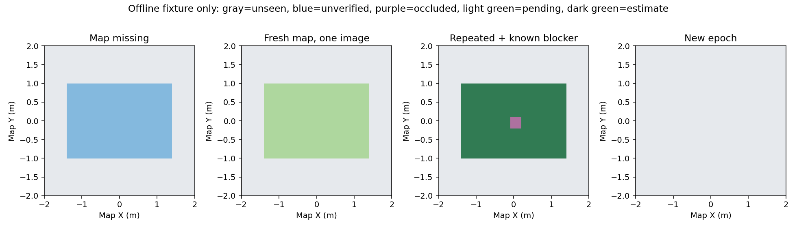
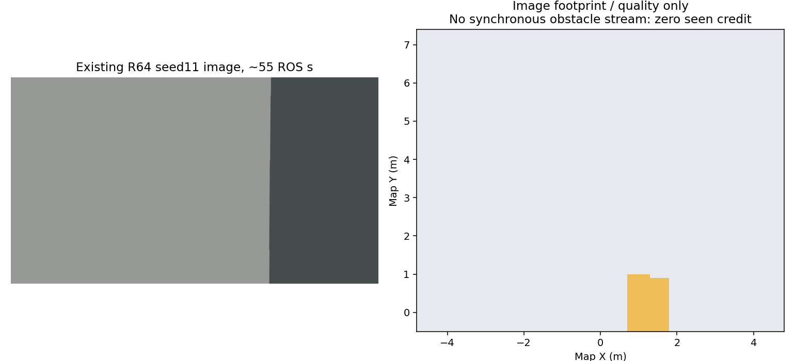

# 第一阶段：旁路观测地图记忆原型

后续在线验证及开发已完成一轮研究周期，最新见[阶段研究报告](../../verification/coverage_stage2_20260911/REPORT.md)。以下保留首版原型的当时状态。

2026-09-11。用户已审阅优化计划并要求分阶段实施。本轮在`feat/coverage-efficiency-research`完成独立旁路包和离线验证；没有修改0.70m航带、覆盖游标、任务状态机、规划器或部署包，没有启动ROS/Gazebo/PX4仿真或实机。

纸箱口径同时纠正：**只在四棵障碍树下用于垫高，不存在独立纸箱。** 原规则复盘和计划已同步，用途不再待确认；垫箱长宽高和树冠尺寸仍需要现场量测。未向场景加入独立箱，也未改动历史world。

## 本轮已实现

新增[独立研究包](../../../vision_ws/src/uav_coverage_memory/README.md)：

- 图像源时间戳、匹配CameraInfo和完整相机TF投影，支持原始图像畸变；不使用机体中心画理想航带代替实际图像观测。
- 固定范围、有界0.10m栅格，每格中心+四个内缩角点；默认7584格，边缘部分格按实际面积计数。
- 局部亮暗比例及拉普拉斯方差质量代理；已知点云投影的保守遮挡；缺失/过期/空/超量地图保留未确认。
- 多帧/时间间隔/持续时长门槛，新观测与复访面积分列；TTL、任务ID、时钟回退、标定变化及显式重置。
- CameraInfo最多8份、占据点云最多4份按源时间匹配，图像只保留最新1帧；较新地图不冒充旧图像时刻的环境。
- 只发布研究状态栅格及诊断JSON，默认关闭；原比赛launch未包含该节点，模块也没有导航/投递指令或外部服务客户端。

状态说明：未知0、可见性未确认20、质量不足40、已知遮挡60、待累计80、多帧可见估计100。详细接口及限制见包README。

**当前100不等于“已知自由”或“搜索完成”。** FreeDOM是占据点云，不能由无点证明空地；图像质量代理也没有给出目标检出率。因此当前不会据此跳过航点、绕到另一侧或改变投递选择。

## 验证结果

| 项目 | 结果与范围 |
|---|---|
| 独立ROS1包构建/安装 | Catkin通过；仅新包+系统Noetic依赖，安装后launch/config/module可解析 |
| 离线单元与接口测试 | 40项：帧时序、重复/乱序、曝光/低纹理、畸变、遮挡、缺图/图龄/TF、标定变化、重置/TTL、内存范围和旁路接口等 |
| 静态launch | 默认0节点；显式enabled时仅1个研究观察器；读取安装目录内配置，无飞行节点或自动include |
| 既有图像回放 | R64先导seed11已有录像25–55 ROS s，按约3Hz选75帧；75帧输入处理通过，无同步障碍流时估计覆盖量保持0 |
| 核心计算量 | 本机x86/WSL离线、1280×720、7584格、5万点、15次；中位18.73ms、P95 20.24ms、最大20.37ms；不含ROS解码/TF/传输，也不是OrangePi结果 |

统计附件：[offline_results.json](../../verification/coverage_memory_stage1_20260911/offline_results.json)。日志留在`logs/_artifacts/coverage_memory_stage1_20260911/`。核心与适配器单元测试使用系统ROS Python；图像回放/绘图/计算量检查使用已有`rl_drone`环境，未安装新依赖。

回放只读取实际视频、视频源时间表、估计位姿和标定。估计位姿插值与静态相机外参用于离线几何重建；历史只有一份CameraInfo快照，回放单独允许600s标定年龄，**在线默认仍为2s**。这不算在线TF/标定时序验收。缺失的同时刻占据地图没有用返程时的地图快照、world树位置或真值补齐。

这75帧内的可投影格主要被当前局部纹理阈值判为质量不足。输入处理成功不代表图像足以确认空地；平坦清晰背景与失焦/运动模糊尚需真实标注区分。保留这种保守拒绝，不通过下调阈值制造“覆盖提高”。

回放曾暴露一处实际缺陷：若对全场任意远射线直接套用布朗畸变多项式，标定视场外的点可能折返到像素范围内，形成虚假的环状覆盖。本轮已增加成像有效域限制及专项回归；图中不再累计这种外推区域。

## 尚未完成的阶段1验收

1. 在线同步采集RGB/CameraInfo/TF/占据点云，验证旁路处理频率、消息年龄和上游地图实际范围；独立包编译与静态展开不代替在线运行。
2. 用标注图像校准质量/有效带宽，区分低纹理清晰地面与模糊；验证细树枝、遮挡边缘和部分靶入画。当前5点采样和点云分块只是保守近似。
3. 定义并验证联合地图epoch：现场调整、LIO重定位、上游地图重建须同步使覆盖失效。现在的local reset不会替代FreeDOM/目标记忆的真实清空。
4. 验证占据射线/深度或其它观测能否提供自由空间证据，建立覆盖标签误报/漏报指标，再决定是否允许估计地图参与调度。

以上仍在已审阅的分阶段方向内；新的SITL运行须有明确运行请求。本轮未执行新仿真，不能宣称搜索更快、另一侧可达或达到实机稳定性。

下一阶段先补齐在线旁路和标注验证，再考虑航带间距与局部补扫。原正赛工作树保持86e382d，交付CURRENT仍c369e6f8；研究分支在稳定验收及获准采用前不会替换它们。
