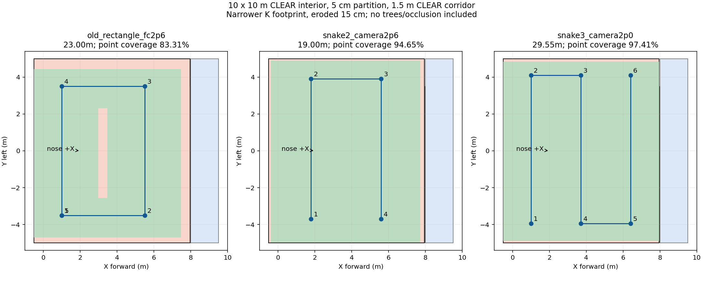

# 高位蛇形搜索设计：净空10×10m与薄墙压力情形

日期：2026-10-04。当前仅航线设计、可复算几何与后续仿真参数方案；没有修改生产field、仿真world、飞行速度、阈值或启动任何ROS/SITL/硬件。候选尚未部署，不能直接把本目录YAML交给飞行入口。

## 1. 设计选择

推荐优先验证**镜头离地2.60m、飞控中心约2.76m、两条横向扫描线**。机头固定+X，图像长边沿+X，飞行沿±Y来回扫描，换道沿+X。保持当前规划器避障，不强迫直线穿越树柱。高位只收集粗线索，低位仍要重访确认、对准和取得投递许可。

坐标原点沿用起飞点，+X朝场内、+Y机体左侧。主候选：
```text
低位入场staging (0.60, 0.05)，按现有净空逻辑升高
P1 (1.80, -3.70)
P2 (1.80, +3.90)
P3 (5.60, +3.90)
P4 (5.60, -3.70)
之后按候选情况进入低位重访，不为了闭合图形返回P1
```
P1→P2→P3→P4共19.00m；staging到P1直线距离另约3.94m。原矩形搜索段23.00m，19m少17.39%。不同末点会影响后续重访路程，所以不能直接宣称整场节时17%。点间停顿/轨迹交接沿用当前实现，本方案没有实施之前暂缓的提速代码。

备用为**镜头2.00m、FC约2.16m、三条扫描线**：
```text
(1.00,-3.95) → (1.00,+4.10)
→ (3.70,+4.10) → (3.70,-3.95)
→ (6.40,-3.95) → (6.40,+4.10)
```
搜索段29.55m，代价更高但目标像素更大；是否改善panzer需实拍/仿真识别比较，不由几何面积代替。若场地限的是FC最高2m，此备用也不满足，需要按镜头1.84m重新生成，不能直接使用。

## 2. 不再依靠20cm外围墙压小分母

净空定义为墙内面之间的距离；外围墙放在净空以外，不能一边声明净空10m、一边再扣外围墙厚。走廊1.5m亦是两墙内面的净宽。内部隔墙仍占地。

| 几何情形 | 内净尺寸 | 内隔墙厚 | 靶区面积 |
|---|---|---:|---:|
| 旧回归：外沿10m、20cm墙 | 9.6×9.6m | 0.20m | 75.84㎡ |
| 净空10m、20cm墙 | 10×10m | 0.20m | 83.00㎡ |
| **设计主压力情形：净空10m、5cm墙** | **10×10m** | **0.05m** | **84.50㎡** |
| 外沿10m、5cm墙 | 9.9×9.9m | 0.05m | 82.665㎡ |

主设计内边界X[-0.5,9.5]、Y[-5,5]；走廊X[8.0,9.5]；5cm隔墙X[7.95,8.0]；靶区X[-0.5,7.95]、Y[-5,5]。20cm隔墙情形靶区上限X7.8。

旧模型若把真实净空10m缩成9.6m，会低估待搜索面积，对旧覆盖率产生乐观偏差。这不表示20cm必然错误；保留旧模型供历史对照，但新设计不依赖该假设。5cm为压力测试假设，不冒称现场实测墙厚。薄墙也可能加重雷达稀疏观测与离散地图问题，不能只考核面积。

## 3. 高度和视场口径

`camera_agl`是本设计文件的镜头离地高度，不是现有生产参数。当前`high_agl`仍表示FC离地高度。镜头低于FC约0.16m，水平时：
```text
FC_AGL = camera_AGL + 0.16
地面local_Z = 落地FC_local_Z - fc_ground_clearance(0.22)
FC目标local_Z = 地面local_Z + FC_AGL
```
主方案镜头2.6m与旧FC2.6m不同，前者FC2.76、后者镜头2.44。真正接入时须统一高位判定窗口、命令上限与元数据，不能只改覆盖报告或偷偷改high_agl含义。

复算两套模型：
- 现场尺度：FC2m/镜头1.84m时3.6×1.8m，线性外推镜头2.6m约5.09×2.54m。
- 当前CameraInfo：镜头2.6m约4.59×2.59m，长边较窄。保留主点偏移，不擅自放大K或修改Gazebo相机来提高覆盖率。

两套各算名义值与视场四边内缩15cm。内缩是误差敏感性情形，不是定位/姿态误差上界，未模拟树遮挡、镜头畸变、动态倾斜和非直线轨迹。

## 4. 允许外缘少量盲区，但不能把摆靶经验写成事实

设“中心搜索区域”为靶区向内缩25cm后的矩形。允许几何残余盲区位于这条外缘带，中心区域不得产生新的点可见性盲带。25cm是本轮设计取舍，不是比赛摆靶规则。

标准靶纸1×1m完全在场内时，即使纸边贴墙，靶心也至少距边0.5m；额外假设纸边离墙0.15m，则中心域内缩0.65m。**高位看到靶心不等于完整圆环入镜**，分别计算两种指标。完整指标使用直径1m圆或与场地轴对齐的1m方板，不保证任意旋转方板四角全部入镜。

红十字正式尺寸约0.35m，中心合法距边可仅0.175m，不能借“所有靶都1m”跳过红十字边缘漏检。数据保留红十字中心可见性单项；它也不能代表红十字整体检出率。

主压力场景（净空10m、5cm隔墙）结果：

| 路线/高度 | 模型与余量 | 靶区点覆盖 | 内缩25cm区点覆盖 | 1m圆环完整入镜（纸边距边≥15cm） |
|---|---|---:|---:|---:|
| 原矩形，FC2.6m | 实测名义 | 92.82% | 98.09% | 89.85% |
| 原矩形，镜头2.6m | K+内缩15cm | 88.01% | 95.09% | 81.66% |
| **两线，镜头2.6m** | **实测名义** | **100.00%** | **100.00%** | **100.00%** |
| 两线，镜头2.6m | K名义 | 98.99% | 100.00% | 97.51% |
| **两线，镜头2.6m** | **K+内缩15cm** | **94.65%** | **100.00%** | **92.65%** |
| 三线，镜头2.0m | K+内缩15cm | 97.41% | 100.00% | 87.76% |

同样镜头2.6m的原矩形对照已纳入，避免把抬高镜头的收益都归功于换航线。两线最保守项约4.53㎡不可见，全部在25cm外缘带内；边缘带细长，面积看起来不小。红十字合法中心域点可见率在此项约99.25%，仍非100%。

圆环完整入镜的缺口可能出现在两扫描线中间，不能把“没有中央点盲区”表述成“没有任何中央识别盲区”。高位粗类别允许无需圆环，故接受这一折中；若panzer实测仍要求更完整图案/长时间观测，应增加中央局部复看或采用三线，而不是降低低位释放条件。保留冲突、未确认及被树遮挡区域，优先局部重访，不因理想几何覆盖而清空这些任务。



图的左列是旧FC2.6m、右两列采用明确镜头高度；同高度数值对照见上表及JSON。绿色是点可见、浅红是不可见，蓝色是走廊；为覆盖示意，未画树、随机门与H，不能当成可飞地图。

## 5. 后续仿真几何改造与验收

`route_candidates.yaml`记录四种几何规格和两条设计路线，`design_only=true`，不是生产field覆盖文件。本轮**尚未修改world导出器**，不能认为这些规格已经进入Gazebo。

场景接入必须同时改变world、目标/树可布设区、真实碰撞/Gate边界、任务场地边界、地图尺寸和已知入口/H，避免只扩大面积报表。严禁用整体缩放把80cm门、1m靶、1.5m净走廊一起变形。
- 主场景净空10×10、外围4m、走廊净宽1.5m、内墙高1.5m；内隔墙/外墙均分别考核0.20与0.05m。
- 固定两扇门所在平面Y=±1.6，开口宽0.80m在走廊横向连续变化。只向控制侧提供固定门前/后中线引导点；随机门真值只进入world/Gate。
- 净空10m时走廊中线X8.75，入口沿正Y端最后1.5m，H示例(8.75,-4.2)，80cm靶；这些是设计参考坐标，实地须测量。控制侧不要继续硬套旧中线8.35。
- 走廊保持此前低空目标0.9m/指令上限1.0m的待统一要求；高位镜头高度不能套到走廊。
- 标准靶纸合法不压墙的样本，以及额外离墙0.15/0.30m样本分别测；红十字按0.35m单列。不要只生成远离墙的容易样本。
- 先保留seed31/38旧几何回归，再在大净空薄墙场景检查中央panzer、树后遮挡、边缘红十字与不同随机门。比较完成三投/门/H、实际视觉覆盖、真实中心误差、识别时窗与总耗时。
- 扫描线是规划目标而非绕过避障的强制直线。按实际相机姿态/轨迹累计覆盖；未走到或绕行留下缺口必须记录。
- 树位置、可达性、动态飞行、检测召回均未在本次离线几何计算中验证。启动新仿真须另有明确运行请求。

## 6. 复现和交付

激活既有rl_drone后执行：
```bash
python docs/planning/serpentine_20261004/evaluate.py
```
生成[design.json](design.json)、[候选规格](route_candidates.yaml)和上图。共4条路线（含同高度对照）×4种场地×2种视场×2种内缩=64项几何比较；脚本检查面积、候选FC限高、目标点离场地边界至少0.275m及主压力场景中心域覆盖。后者不检查尚未布设的内部树木。本轮不编造实飞/SITL PASS，未部署、未改变生产入口。
