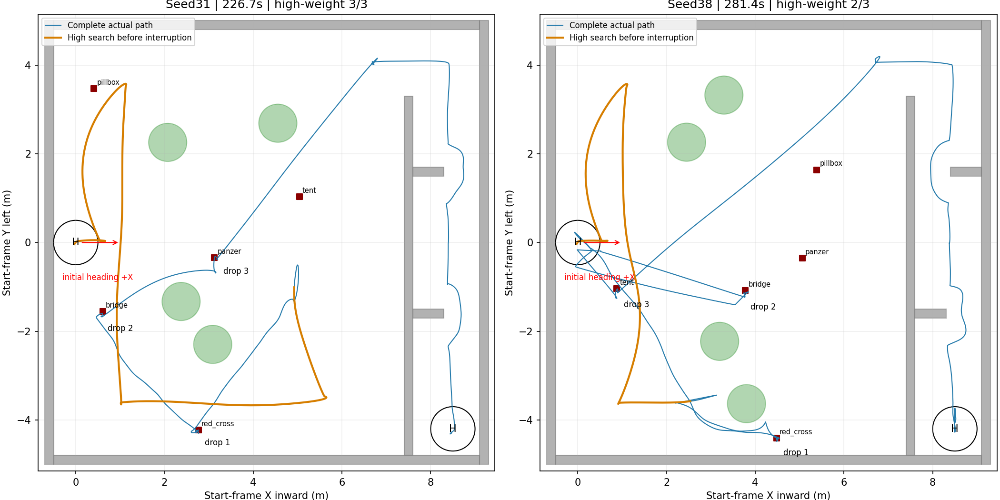
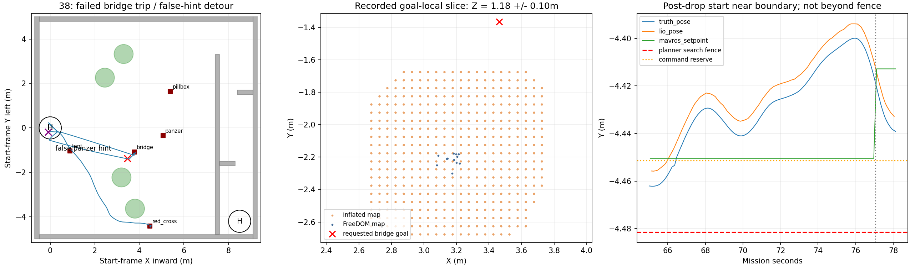
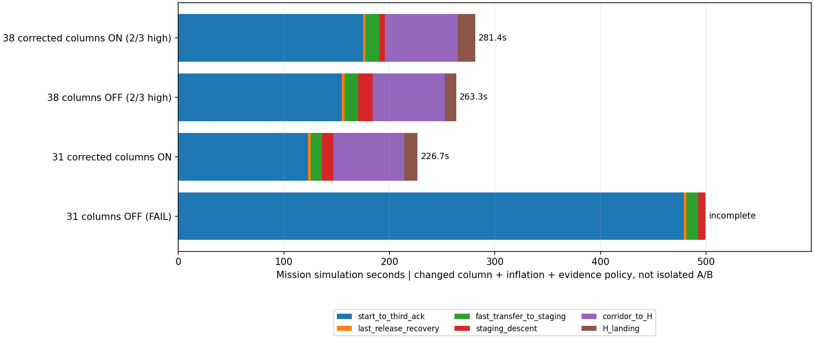
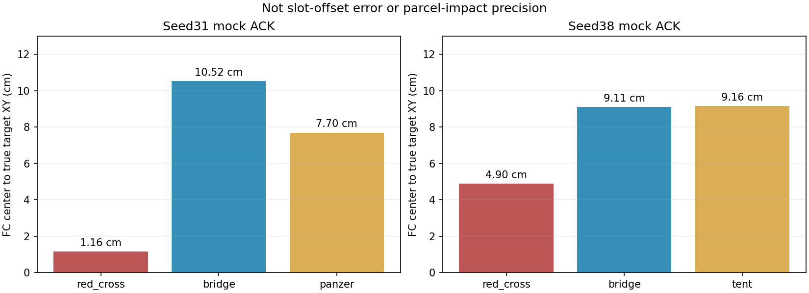

# 修正障碍柱＋分级高位搜索：seed31/38回归

2026-09-27。用户指定的两轮均已完成，**修正后的障碍柱开启，XY膨胀配置0.275m**。任务Gate均为PASS、无碰撞包络接触；seed31完成三个高权重目标，seed38完成红十字、bridge、tent，仍缺panzer。

[视频与全部图表](index.html) · [实现说明](../../planning/high_view_balance_20260927/IMPLEMENTATION.md) · [运行清单](matrix.json) · [汇总数据](summary.json)

## 1. 验收结论

| 指标 | seed31 | seed38 |
|---|---:|---:|
| 整场Gate：三投、两门、H降落 | PASS | PASS |
| 任务时间 | 226.723s，约3分47秒 | 281.353s，约4分41秒 |
| 实际模拟投递顺序 | red_cross → bridge → panzer | red_cross → bridge → tent |
| 三个高权重目标完成 | **3/3** | **2/3** |
| 高位提前中断（任务时间） | 34.631s | 26.577s |
| 第三投ACK（任务时间） | 122.846s | 175.171s |
| 水平累计航程 | 48.99m | 56.56m |
| 升高动作耗时 | 2.419s | 2.472s |
| 首轨迹终端超时 | 0 | 1，桥梁第一次重访12.05s |
| 轨迹停滞恢复请求/预算耗尽 | 0 / 否 | 0 / 否 |
| 碰撞包络接触、搜索包络越界、限高违规 | 均0 | 均0 |
| 全套牛耕补搜 | 未进入 | 未进入 |
| 仿真进程收尾 | PASS，零残留 | PASS，零残留 |

**本次证明修正开柱配置可以完成这两个布局的升高及整场。不能由两轮推断所有布局已稳定，不能把seed38的降级三投称为高权重搜索全部成功。** 0次轨迹停滞恢复也不等于从未等待：seed38确实经历了一次首轨迹等待失败。

时间采用第一条任务指令至Gate完成的ROS仿真时间，初次解锁/起飞准备在此前；不是笔记本运行墙钟时间，也不包含实物机构释放耗时的完整模拟。报告视频包含准备段，因此略长。

图中X朝场内、Y朝起飞机体左侧，红箭头为初始机头+X；橙色标出高位结束前的运动（包含入场/升高）。树圆为位置示意，不是当前膨胀柱的精确边界。

## 2. 冻结版本、地图与膨胀

- 视觉/整机：`liftrace-visionwork`，`feat/high-view-search-research`，`74ec4bd5185a7a3a56c40f32f6306ed17f8944dc`。
- 导航来源：`liftrace-controlwork`，`feat/high-view-liveness-20260919`，`d71b8fe1fdf83873c0b7a2be48167effb984acad`。导航所有权代码先在该仓提交，再逐文件集成到视觉仓；配套NavigationMemory/SurveyPolicy来自上述视觉revision。
- 复用`history_31_40_20260920/seed_31`、`seed_38`冻结的world及场景覆盖文件，没有重新抽树/门/靶位置。两轮同代码，中途不修改，不追加重试。
- 2.6m高位、1.4m低位、原有快走廊、FOV、模型、投递许可与速度策略保持此前设计；未在此次运行中提速。
- 修正中部柱开启：40–60%中部带；仅对限定跨度≤1.6m的小组件进行受实测支撑距离≤0.35m约束的填实；墙连接/大组件不再用大凸包填空，保留其自身实测柱和真实三维膨胀。具体算法与旧环带订正见[障碍柱报告](../column_fix_20260927/REPORT.md)。
- XY配置**0.275m**，上0.20m、下0.10m。SDF分辨率0.05m，水平膨胀`ceil(0.275/0.05)=6格`，有效约**0.30m**。粗路径排序栅格同样接收0.275参数，但不能把它当作SDF连续空间净空证明。
- 55cm是工程碰撞盒边长，其半宽27.5cm；规划器不是先自动识别这半宽再额外叠加0.275m。偏航、体素化、地图/跟踪误差仍影响实际净空。
- 参数预检、运行实际参数及六个视频解码结果见[产物验证](artifact_validation.json)。底层柱修复已有18项C++测试，本批另有192项任务/执行链及86项高位组件回归，导航和视觉构建通过。

运行目录：

- `logs/balanced_columns_seed31_20260927_141240`
- `logs/balanced_columns_seed38_20260927_142607`

## 3. seed31：正确panzer证据能够替换早期弱线索

高位阶段曾同时存在起飞H附近的panzer粗框和真panzer附近的位置；同级矛盾时没有直接按“历史检出三类”提前结束。随后真panzer处出现更强的精修Hint，三类形成可使用的中断依据，任务34.631s结束高位。

中断时选用的三个位置都是真目标附近。panzer高位点约(3.049,-0.636)，距真靶30.4cm；低位重新确认点距真靶12.5cm。低位与最终投递精修继续执行，不把这30.4cm粗定位当成投递许可。

顺序为红十字、bridge、panzer。没有再去H处或pillbox处核查错误panzer，也没有进入长时间牛耕补搜。三投ACK为任务75.310、109.320、122.846s；随后原走廊/H链完成。

本轮实际覆盖了“弱线索被后续强证据取代”的路径；没有动态触发所有冲突地点消歧用例。多类别正式候选纠错、同帧去重、TTL/时钟恢复等仍主要由对应离线测试覆盖。

## 4. seed38：整场完成，但提前中断仍可能接受持续误分类

**这是错误类别位置，不是把真实panzer粗坐标偏了几十厘米。** 中断时panzer Hint在(-0.098,-0.184)，距真实panzer(5.058,-0.349)约5.159m，靠近起飞H。两张源图像相隔0.172s且位置一致，因此满足本轮两帧粗中断条件；真实panzer此时没有进入可使用队列。

任务时间线（原日志ROS时间减11.832s）：

| 任务时间 | 事件及含义 |
|---|---|
| 26.577s | 三类粗Hint满足提前中断；panzer仍是错误位置 |
| 30.625–45.189s | 重访红十字；之后低空确认并通过近墙有界接近 |
| 60.049s | 红十字模拟投递ACK |
| 65.003–77.053s | 第一次bridge重访没有产生可执行首轨迹，12.05s后延期该目标 |
| 77.054–124.887s | 飞往H附近的错误panzer线索，航段约47.83s |
| 124.896–129.977s | 第一次低位复核；1s后一次换位，5s观察总预算不重置；未形成正式panzer |
| 129.977–139.377s | 原有延期队列再次复访同点及换位，仍无正式panzer；每次观察各有5s上限 |
| 139.377–146.077s | 返回bridge，这次正常重捕并进入投递 |
| 153.570s | bridge投递ACK |
| 156.293–165.687s | 原有近墙局部复核仍未确认panzer，标记降级并选择tent |
| 175.171s | tent投递ACK；三槽完成 |
| 281.353s | 两门及H降落全部完成 |

本轮新换位确实执行，两次各受自己的5s观察窗口约束，没有无限延长。**这不表示同一点全任务只访问一次**：本次是原有延期重试队列，冲突假设的按地点去重机制没有被触发（`conflict_checked=[]`）。原有近墙局部复核又增加约9.39s。这种分散在不同分支的总复访预算，仍有压缩空间。

`NEAR_WALL_TARGET_UNREACHABLE`只是当前降级事件名；这里并未证明真正panzer物理不可达。实际证据是错误位置多次没有新正式panzer候选，随后转投tent。两帧一致降低孤立误检风险，**不能消除同一外观连续误分类**。本次无下视原始检测图像的全量归档，不直接断言YOLO究竟把H的哪一块纹理误认成了装甲车。

### bridge第一次规划超时能确认什么

- 执行器记录反复`planner_attempt_failed_nonterminal`，最后`initial_plan_timeout`；运行日志有kinodynamic search fail/open set empty。
- ROS77.209s保存的目标局部快照中，目标(3.462,-1.366,1.18)附近没有占据体素中心；最近膨胀点约0.310m，最近FreeDOM点约0.773m。**不能把这次故障解释为bridge目标格被柱直接填死。**
- 起点在红十字投后近墙区，ROS77.174s LIO约(4.502,-4.456,1.063)，实际搜索中心硬边界Y下限约-4.4814，仍在边界内约2.6cm。命令预留线为-4.4514，不能把这两条边界混为一谈。
- 快照围绕目标裁剪，没有包含远处投后起点的完整占据。因此目前不能区分起点周围膨胀、首层动力学原语、局部路径连通或其他搜索约束。后续从另一位置去同一bridge可以成功，也说明不是该目标永久不可达。
- 最合适的后续补证是**一次失败时同时保存起点和终点占据、第一层拒绝计数和局部云**，而非继续缩全场膨胀或循环重跑。本轮只记录诊断，未补改飞行代码。

## 5. 与此前对照及阶段耗时

[此前关柱对照](../columns_off_20260927/REPORT.md)使用旧记忆逻辑、0.25m膨胀；当前同时改了柱、证据策略和膨胀，因此是**整套方案回归，不是单一参数A/B，也不证明这是全局最快方案**。

| 项目 | 31关柱旧轮 | 31修正开柱 | 38关柱旧轮 | 38修正开柱 |
|---|---:|---:|---:|---:|
| 升高动作 | 2.567s | 2.419s | 2.465s | 2.472s |
| 三投ACK | 478.898s | 122.846s | 155.184s | 175.171s |
| 整场 | FAIL，第二门包络接触 | PASS，226.723s | PASS，263.300s | PASS，281.353s |
| 高权重完成 | 3/3 | 3/3 | 2/3，改投tent | 2/3，改投tent |

seed31第三投确认提前356.052s，主要观察到长时间错误复访/补搜消失；旧轮未完成，不能计算合法的“完赛节时百分比”。seed38反而慢18.053s（约6.86%），三投前增加19.987s，是下一步该优先改进的样本。更早的损坏开柱轮两seed均在升高时12秒超时、0投；本次未复现该入口故障。

| 本轮阶段 | seed31 | seed38 |
|---|---:|---:|
| 任务开始至第三投ACK | 122.846s | 175.171s |
| 最后一投恢复 | 2.440s | 2.319s |
| 快速转场至走廊准备点 | 10.764s | 12.991s |
| 入廊前下降 | 10.858s | 5.231s |
| 走廊至H接近完成 | 67.335s | 69.145s |
| H降落事务 | 12.480s | 16.496s |

旧seed31的堆积条仅包含有完整前后里程碑的阶段，尾段未完成部分省略，不能把条形末端当其实际停止时刻。

**速度未加新档。** 实际运动样本（水平速度>0.03m/s）中位数：近边重访31/38为0.146/0.155m/s，入廊转场0.771/0.848m/s，廊内开放段0.298/0.300m/s，门段0.115/0.116m/s。近边重访标签累计64.97/96.63s，标签时长含等待，并非全部等速运动；该慢档覆盖范围与错误线索的长距离返程，比最后一投约2.4s恢复更值得优先处理。本轮先完成修复验收，不继续更改速度。

## 6. 精度、高度、越树与验收边界

### 模拟ACK时FC中心到真靶的水平距离

| seed | red_cross | bridge | 第三投 |
|---|---:|---:|---:|
| 31 | 1.16cm | 10.52cm | panzer 7.70cm |
| 38 | 4.90cm | 9.11cm | tent 9.16cm |

这些是**模拟释放确认时的飞控中心误差**，不是含槽位外参、释放延迟、物体运动的真实落点精度；不能据此承诺实机厘米级投递。

高位最大FC离地高度31/38约2.780/2.778m，走廊区域最大FC高度1.028/1.058m；廊内工程包络顶部最大1.209/1.241m，FC限高1.2m与包络顶部不是同一指标。正式Gate未记录限高或搜索包络违规。

离线保守“全树＋底座水平凸投影”检查：两轮FC直接位于树投影内的采样均0；在**整个55cm旋转包络高于树顶**的采样里，两轮投影重叠均0，最小分离轴间隔约32.25/5.83cm。seed38另一个较宽松高度条件的检查（只要求FC高于树顶、用27.5cm圆盘）有56个边缘重叠采样：不能混成“整机飞越”，也不能据前一项宣称所有部分机体投影都无交叠。两个脚本检查口径和逐树数据保留在各seed目录。当前中部柱设计本就允许经过下部外缘上方并保留真实三维避撞，不冒充最宽树冠投影的严格全时域保证。

分析脚本还订正了一个统计口径：`top_hints`会被低位正式确认更新，不能在结束时把其中坐标误当最初高位点。当前`target_hint_evaluation`固定取TOP3事件快照，再与低位重捕点比较。原始日志中的`hint_delta`不作高低坐标误差的唯一依据。精修升级后保留的`distinct_image_stamps`是历史粗框支持帧，不是新精修结果的采样时刻。

## 7. 下一步优先级

1. **panzer粗线索保留，但不足以轻易证明三高权重已齐。** 比较“panzer需至少一次类别＋几何联合支持”与“不同位置/视角支持”的提前退出条件；其它类别仍可宽松记忆。若只有H附近重复粗框，继续短剩余高位航段或去未覆盖片区，不先花长途低速返程验证。不要只把相邻重复图像凑够次数。
2. **同一物理地点共享复核总预算。** 延期重试、换位和近墙复核应互相知道已经核查过，区分“未确认类别”和“真实目标位置不可达”；有可靠低空反证时退休该地点，而不是把整类真实目标标成不可达。现有正式候选纠错机制继续保留。
3. **补起点侧规划诊断，再处理释放后恢复交接。** 本轮bridge故障是局部首轨迹问题，不能靠提高视觉阈值解决。优先读取实测占据和首层拒绝，而非继续堆任务FSM。
4. 上述识别/交接缺口收敛后，再讨论近边慢档只覆盖末段、转场提速及机构真实耗时。先提高高权重完成率，再看是否缩短总时长。

这些为本轮结果后的建议，**没有在两轮之间或之后继续修改飞行策略、模型、板载部署或追加仿真**。

## 8. 产物与复现

- 每seed：实际/命令/目标航迹、三维航迹、阶段路线、速度、高度/倾角、阶段/投递时序、停滞监督、降落估计图。
- 总览：双场地航迹、阶段比较、释放中心误差、seed38局部地图及边界诊断。
- 原始俯视、低位跟随及1920×1080合成汇报视频，各保留两组，见[index.html](index.html)。合成视频是按源ROS时钟配对的1倍速回放；原始相机MP4固定10fps写入，丢采样时片长会压缩（31约171.7s、38约206.6s），不能拿原片长度当完赛时间；缺帧保持上一图像，最大图龄见验证JSON。视频上的“三投PASS”指任务Gate，seed38真实类别另在网页显著标出。
- `process_results.py`复用既有分析及合成器；`summarize_results.py`纠正可变Hint统计、生成本轮比较图；`verify_artifacts.py`完整解码六个视频并核对运行参数。再由`finalize_report.py`生成网页和验收摘要；生成顺序为这四步。既有合成器拒绝覆盖同名视频，需为再次导出另选输出文件。
- 本轮只按授权运行两次，运行期间冻结代码，使用单实例sim_run.sh和统一清理。视频/原始日志不进入Git；图片、摘要、可复现脚本及文档入库，原始数据留在本机run目录。
产物终检：六个视频均完整解码通过，合成录像seed31 237.7s / seed38 292.0s；合成画面、轨迹/高度图和局部诊断图已抽查，网页本地资源链接已核查。

## 2026-09-27后续订正

随后已修复本报告指出的seed38提前TOP3与错误整类降级问题，并按用户新授权重跑一次：仍开启修正障碍柱和0.275m膨胀，三高权重、两门、H降落PASS，193.650s。该结果不覆盖本报告原始两轮数据；见[后续完整报告和视频](../panzer_location_repair_20260927/REPORT.md)。
