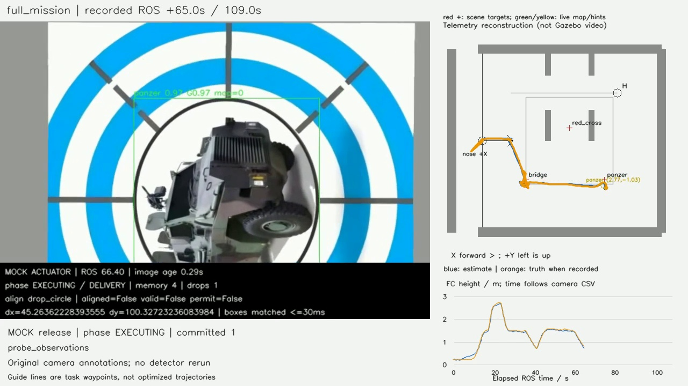

# 八组板端专项：实际仿真与录像验收

> 后续配置更新：板端负载/建图档案与0.25m膨胀见[交接说明](../../deployment/board_reference_20260927/README.md)。下列实跑仍是改参前记录，不代表新配置已动态通过。

2026-09-27。八组均已运行真实Gazebo/PX4、LIO、FreeDOM、Fast-Planner、任务管理器及视觉链，并全部保留录像。**6组完整通过；走廊专项04与完整任务08在门边触发55cm工程包络接触，未完成末端H。08已完成三次模拟投递及转入走廊。** 按用户最新意见，走廊已有实飞通过记录，本轮保留事实，不追加走廊修正/重跑；不能把本次两个INCOMPLETE改写为完整PASS。

没有启动真实飞控、解锁实机或操作真实投递机构。以下验证属于笔记本同链仿真，不是板端RKNN或真实机构验收。

## 结果

| 专项 | 结果 | 模拟投递/预期 | 任务ROS秒 | 实际观察 |
| --- | --- | ---: | ---: | --- |
| 01 视觉中断 | PASS | 1/1 | 27.68s | 完成一投，恢复后原地降落 |
| 02 完整高位环线/重访 | PASS | 3/3 | 111.62s | 全圈完成，3个记忆目标全部重访投递 |
| 03 H降落 | PASS | 0/0 | 34.22s | 低空接近、升高、10帧H对齐、降落 |
| 04 走廊/H | INCOMPLETE | 0/0 | 28.31s | 第二门边包络接触，停止；未走到H |
| 05 低空连续多投 | PASS | 2/2 | 45.06s | 红十字后恢复搜索，再投装甲车，原地降落 |
| 06 高位提前中断/重访 | PASS | 3/3 | 103.44s | 观察到TOP3提前中断，3次投递后原地降落 |
| 07 只记忆不投递 | PASS | 0/0 | 50.66s | 完成全圈、记忆2个目标、零APPROACH/投递、下降降落 |
| 08 三投接走廊/H | INCOMPLETE | 3/3 | 95.65s | 完成3投并切入走廊，第一门边包络接触后停止 |

任务计时由手动启动服务被接受起，到观察器结束为止，包含结束确认等待，**不含前置自动起飞**。相机录像覆盖起飞准备至退出；因此不能把上表27.68s当作从地面起飞到落地的全部时间。原始时刻、阶段、命令、释放次数和接触细节见各run的gate_status.json及generated/vision_events.jsonl。

三类专项区分已验证：02按要求走完整环线后才冻结记忆；06在满足支持条件后提前下降；07冻结2个目标、无APPROACH/释放，下降后本地降落。03的运行日志在ROS30.109s记下 `fresh H alignment latched with 10 frames`，随后完成落地。08在ROS89.51s进入TAIL/投后航线，随后进入双门区域。

02与06使用相同摆靶，任务时间本轮111.62s与103.44s，少8.18s；高位阶段结束时刻53.27s与36.69s。这里只是各一次专项样本，01–03与后续轮的控制版本还相差一项边界补丁，**不把这组时间当正式效率统计**。

## 录像与图表

统一入口：[全部视频和图表 index.html](index.html)。每组有四种回放：原下视相机、视觉叠加、Gazebo俯视，以及“视觉叠加＋航迹动画＋高度”的同屏回放。共24份直接录制、8份记录重建；首/中/末帧解码抽检全部通过，[检查结果](video_validation.json)。

- 01 视觉中断：[同屏回放](../../../logs/board8_01_visual_interrupt_20260927_171550/generated/report_replay.mp4)、[相机与视觉视频](../../../logs/board8_01_visual_interrupt_20260927_171550/generated/index.html)、[轨迹/高度/速度图](visual_interrupt.png)。
- 02 完整高位环线/重访：[同屏回放](../../../logs/board8_02_high_view_20260927_172021/generated/report_replay.mp4)、[相机与视觉视频](../../../logs/board8_02_high_view_20260927_172021/generated/index.html)、[轨迹/高度/速度图](high_view.png)。
- 03 H降落：[同屏回放](../../../logs/board8_03_landing_20260927_172727/generated/report_replay.mp4)、[相机与视觉视频](../../../logs/board8_03_landing_20260927_172727/generated/index.html)、[轨迹/高度/速度图](landing.png)。
- 04 走廊/H：[同屏回放](../../../logs/board8_04_corridor_landing_20260927_173237/generated/report_replay.mp4)、[相机与视觉视频](../../../logs/board8_04_corridor_landing_20260927_173237/generated/index.html)、[轨迹/高度/速度图](corridor_landing.png)。
- 05 低空连续多投：[同屏回放](../../../logs/board8_05_low_multi_20260927_173632/generated/report_replay.mp4)、[相机与视觉视频](../../../logs/board8_05_low_multi_20260927_173632/generated/index.html)、[轨迹/高度/速度图](low_multi.png)。
- 06 高位提前中断/重访：[同屏回放](../../../logs/board8_06_high_priority_20260927_174228/generated/report_replay.mp4)、[相机与视觉视频](../../../logs/board8_06_high_priority_20260927_174228/generated/index.html)、[轨迹/高度/速度图](high_priority.png)。
- 07 只记忆不投递：[同屏回放](../../../logs/board8_07_memory_only_20260927_174935/generated/report_replay.mp4)、[相机与视觉视频](../../../logs/board8_07_memory_only_20260927_174935/generated/index.html)、[轨迹/高度/速度图](memory_only.png)。
- 08 三投接走廊/H：[同屏回放](../../../logs/board8_08_full_mission_20260927_175414/generated/report_replay.mp4)、[相机与视觉视频](../../../logs/board8_08_full_mission_20260927_175414/generated/index.html)、[轨迹/高度/速度图](full_mission.png)。

同屏右侧是记录重建，明确标注并非Gazebo画面。灰线是任务引导点，不冒充优化轨迹；蓝线为FC/导航估计，橙线为Gazebo真值（04以后有独立记录）。红十字标记是仿真场景靶位，仅用于事后参照；绿色/黄色为新鲜有效的视觉投影/粗线索，并显示坐标。地图真值没有传给在线识别/选点策略。

原俯视相机视场较宽，4×4区域在画面中较小，因此新增同屏轨迹动画便于汇报。相机raw/annotated和同屏固定5fps；本轮相机视频时长与其ROS记录跨度相差约一帧。**Gazebo俯视录制有丢帧压时**，例如02为93.2s，而相机为125.6s，不能按俯视视频长度估计完赛时间；俯视时间以overview.csv为准。所有视频不是同时从第0秒互相对齐的四个流。

01–03只保留估计轨迹，没有新加的独立真值CSV；02落地过程估计Z有负值，不据此称机体穿地。04以后以独立truth_pose.csv区分。07最终FC真值约0.22m，符合地面机架高度。

## 本轮修正及继承

- `98e1800`：继承研究视觉/导航和板端成果，原四组一起更新，新增低位多投、高位提前中断、只记忆、完整任务四组；加入独立同链仿真和观察器。导航/视觉来源清单见[sources.json](../../deployment/modular_trials_20260927/sources.json)。
- `c1d0d67`：发现板端工作树遗漏了研究版的近墙对准设定点约束与释放边界校验，按旧链规则先保存完整源码快照，再最小继承。**01–03完成轮在该补丁前，04–08在该补丁后**；前3组不用于证明这项近墙补丁已动态验收。没有删除旧状态机或叠加一个新控制器。
- 仿真接线修正：模拟MAVROS pose的frame_id从camera_init改为map输入，交给与板端相同的双向适配器。否则板端适配器会合法拒绝标签不匹配输入，任务无法开始。此项是仿真输入修正，不更改板端静态TF关系。
- 支撑面验收修正：平放的固定5mm靶纸碰撞与地面/H一样单独记为支撑接触，墙、门、树仍作为障碍；不删除原始contact事件。曾在01下降落靶纸处停止的录像保留。
- 结束判定修正：COMPLETE时核心会清零active_decision_seq；报告器用已记录的同mission_id、同LAND序号与AUTO.LAND交接相配，避免把成功落地误判。错误mission/序号仍拒绝。01的原始Gate结果与纠正说明都保留，未重新解释成新飞行。

共同有效配置：单位静态map→camera_init＋原双向数值适配；虚拟顶棚−0.1，阶段切换后仍关闭；水平/向上/向下膨胀0.275/0.20/0.10m；0.10m体素下水平离散半径约0.30m。02/06/07/08启用修正后的树冠中部障碍柱，限制小组件凸包跨度与补实距离；其他模块真实3D避障。巡航上限0.5m/s，任务按已知rig自动计算地面零点；03低位接近1.0m，搜索低位1.4m，本次04/08走廊夹具为1.0m（实机走廊按所填航点，04的H前transit默认1.4m）；高位2.6m；投递默认FC0.60m，H识别升高1.8m。

高位允许0.60类别粗线索入导航记忆；提前TOP3中断仍需支持，其中panzer要求精修，其他类别两次相隔至少0.1s、间隔至多1s的一致观测；低位确认允许有效观测间隔1s；最终对齐、释放新鲜度与许可没有因粗检测放宽而取消。

现场舵机服务继承 `/legacy/Servo_raw` 与三槽旧偏移，实投必须显式start_real.sh；本次全部为mock，**软件ACK不是包裹落点准确性或成功脱离机构的证明**。没有人为等待10秒去伪装机构反馈。既有10s实物机构预算仍需实测标定。

## 走廊接触记录

04：第二门下侧墙角两次55cm包络接触，最大穿透约0.015mm/0.029mm，最终真值(2.824,0.990,1.050)m；08：第一门下侧墙角两次接触，最大约0.009mm/0.025mm，结束真值(1.813,1.034,0.917)m。小穿透深度是求解器接触状态，不能单独证明没有擦碰；也不能直接推导裸机碰撞。按用户意见不继续为这两轮追加修复，本次只确认其余模块与三投后交接。

门宽0.80m、55cm方形工程包络与转向/跟踪共同影响净空；膨胀不等于方形机体在任意偏航下的精确Minkowski和。此处保留复查材料，不缩小验收包络、不扩大门宽来制造PASS。04/08真机设置仍保留空航点/H位置，必须用现场实测点填写；仿真夹具不会自动上板。

## 场景与验证边界

场景工作区4×4m，起飞边后方另留0.6m净空，边界墙4m；02/06/07使用已有树网格但底座未抬高到整场竞赛地图的0.30m，因此验证的是该专项障碍输入与环线路径，不当作比赛树高回归。08为三靶加双门集成夹具，不含额外树，不冒充完全随机赛场。

24项模块测试通过、8组preview/flight共16入口静态展开通过、8个仿真launch展开通过、完整catkin构建成功；18项障碍柱C++回归及近墙对准断言通过。录像自检与本次实际录制分开记录。每轮都经统一sim_run.sh启动并清理，最终精确进程检查无ROS/Gazebo/PX4/RViz残留。

八组运行、前置失败轮与录像合计约0.3GB，保留关键过程用于复盘；没有清理原始bag/试飞产物。视频、日志与build/devel不入Git。研究分支新的实测FOV复算仅为离线文档，**未悄悄更换本次仿真相机参数**；[本次实测与原内参对照](FOV_MEASUREMENT.md)。

## 试飞交接

从视觉仓 `feat/board-deployment-flight-20260920` 拉完整源码，依照[八组说明](../../../deployment/board_trials_4x4/MODULES.md)编译两个工作区，使用板端现有RKNN模型和设备驱动。默认mock，实投另有显式入口；不只复制一个settings.yaml到旧二进制。此次没有SSH部署、没有覆盖试飞组 `sakelier/liftrace-controlwork:板载代码`，也没有替换正赛main。

建议先复验01和03，再05，之后02/07/06；08最后填现场走廊点接全链。仿真通过不能替代板端输入时延、NPU并发、里程计偏置与真实机构试验。
