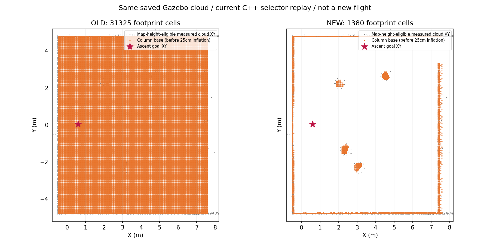

# 障碍柱凸包填空修复

2026-09-27。本轮代码修复＋单元回归＋真实点云离线重建，无新增Gazebo飞行。上一轮实时取图保留在[原始报告](../column_rviz_20260927/REPORT.md)。

## 已改什么

导航权威工作树 high-view-liveness-20260919 提交d8c991d修改五个文件，再逐文件集成高位研究分支：vertical_obstacle_support.h、sdf_map.h/.cpp、test_vertical_obstacle_support.cpp、horizontal_planner.yaml。没有改视觉、速度、任务FSM、走廊、释放或机载部署。

此前任意XY连通结构都能用中部轮廓做凸包填实；连通U墙甚至封闭墙会把场内空地封住。现在：

- 支持组件的完整XY包围盒，最长边含体素宽不超过1.60m，且有40%–60%中部观测，才允许对中部轮廓作有界补实。
- 新增补实点必须在小凸包内部，且离实测中部轮廓不超过0.35m。这个距离是允许插值的上限，不是额外膨胀。
- 超大连通组件（典型是墙、墙和树粘连）保留每个实测支持格及自己的柱底，不填全局凸包。缺失中部回波也不凭空补一个实心轮廓。
- 实际三维点云的0.25m水平、上0.20m/下0.10m膨胀代码未改。真实点云始终参与避撞；障碍柱只额外限制向上跨越。

这不是已经实现“树/墙语义识别”。大组件回退仍会保留观测位置的向上柱，靠墙树可能比独立树保守；避免为消除错误填空而删除真实结构。相邻树合并后如果尺寸超限也回退，不虚构两树之间填充。大树/稀疏树的完整禁越覆盖仍需后续布局验收。

## 验证

18/18 C++测试通过，包括U形墙、封闭围墙、墙连接低树、中部缺测、限制远距离补实、独立树空心轮廓补实、三维下方留空及点云重建清理。实际catkin构建 plan_env 与 fast_planner_node 成功；构建中的REPLAN_NEW枚举warning来自未修改的既有FSM文件。

用本次真实Gazebo保存的同一份FreeDOM点云，分别编译0706a9a旧头文件和当前头文件，使用同一支持过滤与候选区域：

| 同一输入 | 修复前柱底格 | 修复后柱底格 | 高位目标的附加柱占据 |
|---|---:|---:|---|
| 真实地图快照 | 31,325 | 1,380 | 有 → 无 |
| U墙＋独立圆锥树构造场景 | 28,734 | 385 | 有 → 无 |

查询目标为(0.6,0.05,2.38)，包含不变的25cm水平/10cm向下膨胀。这里统计的是附加柱底格，不能与上一轮274万三维占据点直接比较。真实点云原始目标最近距离1.101m的事实保持；本轮没有重跑完整SDF局部更新、ESDF、规划与飞行，因此不写成“起飞实跑已通过”。

橙色为附加柱底轮廓，未画其25cm膨胀；灰色只画地图高度内且满足最低障碍高度的原始点XY投影。修复后主要剩墙边和四处树冠，不再有先前的大环带。图只验证这份快照，不能保证所有动态地图都正确。

三次离线进程计时（含文本I/O）真实旧版约49–52ms、新版约45–51ms，计时受文件缓存和宿主调度影响；仅证明没有明显数量级恶化，不能当板端时延基准。算法不引入神经网络，插值工作限制在小组件及局部距离内。

## 大环带更正：离线工具必须继承生产输入边界

用户指出第一版修复图仍有大环带，检查发现：旧离线重建漏了SDFMap::isInMap的Z过滤，把约5m高、在生产规划地图之外的回波混入支持计算。生产cloudCallback原本已有该过滤，不能把离线生成的环带归因于修复后的在线算法，也不能继续用31,131→7,805的数据验收。

最终工具直接读取本轮rosparams.yaml的22×12×3.8m地图，原点(-11,-6,-0.2)、5cm体素，匹配1e-4边界容差和pcl::PointXYZ的float输入类型；重建前严格过滤Z∈[-0.2,3.6]。最终为31,325→1,380格；先前临时用double读文本得到31,425→1,387，因边界体素取整差异也不作为最终数值。保存点云本身有5位小数序列化，因此这些是对同一快照的离线对照格数，不要求与实时原始float逐位相等。

增加了“完整输入 vs 预裁剪地图范围输入输出完全一致”的回归，PASS。约5m高的回波来源本轮未确认，不能只按高度叫它真实屋顶。上一轮真实RViz截图中的巨大占据仍是旧运行实际输出；这里纠正的是修复对比图的输入口径。

## 可调参数

参数位于 sdf_map/horizontal_avoidance 下：

| 参数 | 默认 | 现场意义 |
|---|---:|---|
| column_band_low_ratio / high_ratio | 0.40 / 0.60 | 相对每个支持组件实测高度范围的中部；不是固定树高 |
| column_max_hull_span | 1.60m | 全组件最长XY边（含体素宽）；超过只保留实测支持柱，不填凸包 |
| column_max_fill_distance | 0.35m | 小轮廓内部允许插值的最大离测点距离；不是机体包络或安全间距 |
| support_radius / min_vertical_span | 0.15 / 0.20m | 既有局部垂直支持条件 |
| obstacles_inflation / up / down | 0.25 / 0.20 / 0.10m | 不变的物理点云膨胀 |

树高变化由实测相对高度带适应；树横向尺寸明显变化需要检查max_hull_span/fill_distance，不能把它们扩大到整个场地。存在遮挡时实测最高/最低点可能不等于完整树高，尚无语义或完整树高估计保证。

## 复现与边界

replay_comparison.py（rl_drone）调用实际C++头文件，输出replay_results.json和图；logs/column_fix_20260927保存二进制、旧头文件和柱底数组，原始点云引用上一轮logs/column_rviz_20260927/live_raw.xyz。老报告结果不覆盖。

源码已修、编译与离线通过；下一次获得明确飞行授权后用31/38验收开柱升高、绕树和走廊，不把本轮离线验证冒充整场鲁棒性。高位搜索比较与panzer后续方案见[评估](../../planning/high_view_balance_20260927/REPORT.md)。
