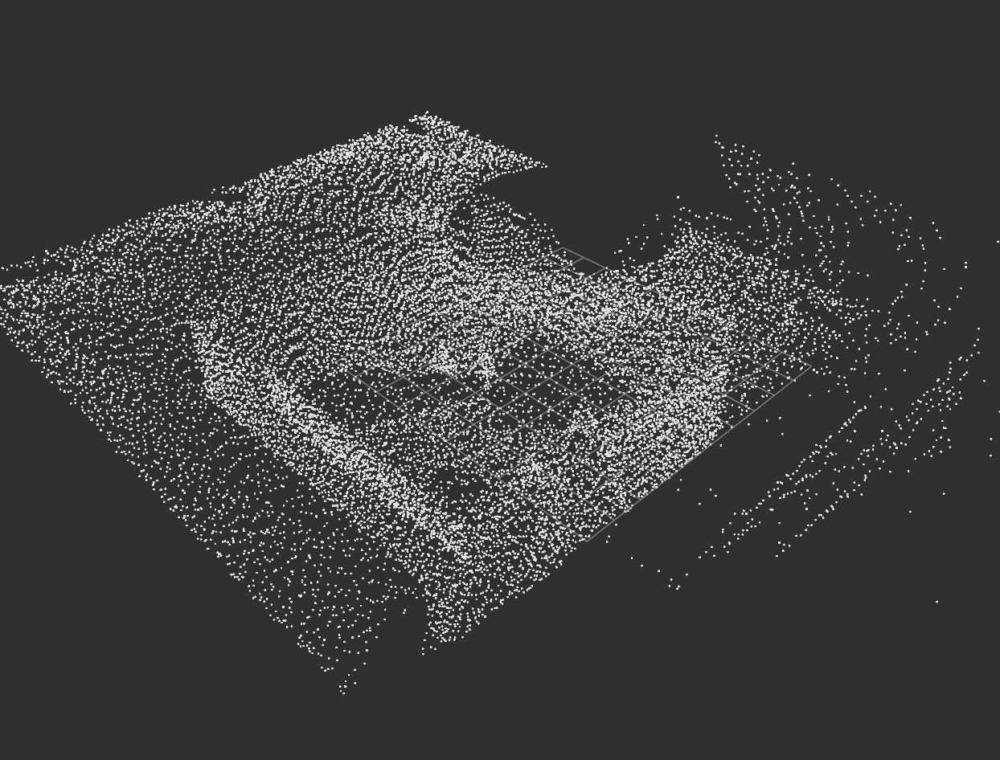
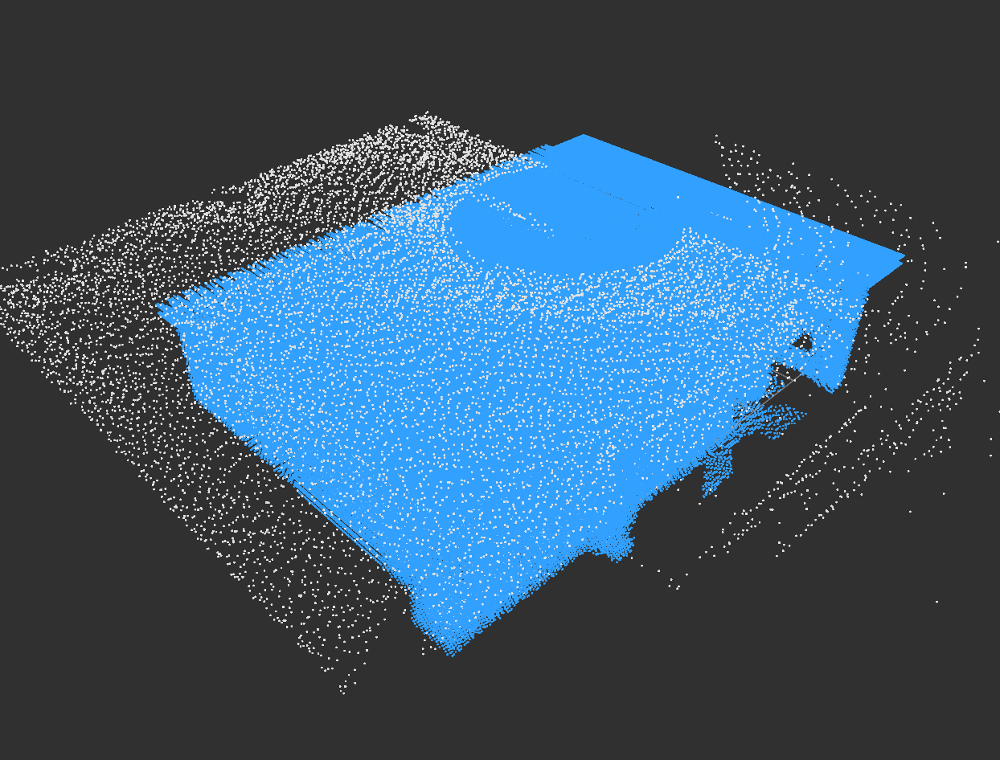
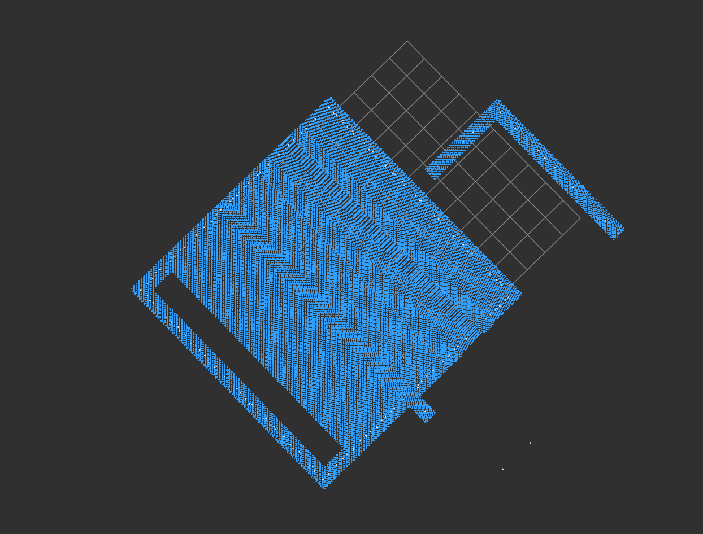

# 开启障碍柱：真实Gazebo点云与RViz截图

2026-09-27。运行：logs/column_rviz_seed31_20260927_131600。seed31，障碍柱开启；水平膨胀0.25m、上0.20m、下0.10m。本轮未修改导航算法。

## 结果

高位入场再次manager_failed，没有投递、没有碰撞。仿真正常收尾。

实时保存了/freedom/static_pointcloud（90,055点）与/sdf_map/occupancy_inflate（2,739,869点）。后者包含三维膨胀、障碍柱及地图边界等全部占据，不能把所有蓝点都称作树柱。

下面是RViz实际渲染本轮真实地图快照的图，不是概念图。WSLg的Qt抓屏出现花屏，最终改用RViz/Ogre渲染缓冲导出。显示每5点取1点，统计使用全量数据。白色为FreeDOM地图（非雷达原始扫描），蓝色为规划占据，网格1m。坐标沿用camera_init，无几何旋转。两话题取各自最近帧，不保证严格同步；占据消息时间戳为0。

## 原始与膨胀地图

## 高位切片

保留camera_init Z=2.38±0.06m，即本轮2.6m离地高位目标附近，不是全高度投影。

目标(0.6,0.05,2.38)距原始点最近约1.101m，距占据体素中心最近约0.0357m。后者不是连续表面的净空。该切片含947个原始点、121,845个占据点。大片没有对应原始点的空地被填充，已不是树体周围的小范围膨胀。

## 机制与改进建议

当前MiddleHeightColumnSelector按XY连通分组，取组件40%–60%高度带，对该带轮廓取凸包填充，再向上延伸。没有树/墙区分。凹形相连墙体可能被当作一个组件，凸包跨越中间空地，生成大片占据。

本目录rebuild_footprint.cpp调用当前真实C++选择器；prepare_clouds.py构造U形墙与独立圆锥树：普通三维膨胀不占据测试目标，附加柱会占据。合成复现支持上述机制；真实截图证实大面积填充，但具体哪些墙段连接成组件，还需输出组件ID逐一核验。

建议：
1. 保留实际三维避撞，仅对合适的紧凑树状组件向上延伸；墙体按真实三维点云膨胀。
2. 限制全局凸包填空；凹形、长条、贴边界的大组件需要分割或拒绝凸包填充。
3. 输出组件ID、中部高度带、柱底轮廓、纯新增柱四个调试层。
4. 用本次真实快照做离线回归：入口应空闲，树中部柱应保留，真实树体不能删除；随后再进行获授权的飞行验证。

不应靠继续缩小全场膨胀掩盖问题。本轮未实施算法修复。

## 产物

- live_capture.json、live_stats.json：现场采样与全量统计。
- logs/column_rviz_20260927/live_raw.xyz、live_inflated.xyz：真实点云，大文件不入Git。
- replay_live.py：RViz重放与截图。
- capture.cpp、build_capture.py：底层截图辅助。
- live.rviz：现场配置。
- summary.json：早期合成场景/历史裁剪快照统计，不是本次实时统计。

复现：source ROS Noetic，单独启动roscore，执行build_capture.py，再执行replay_live.py；需要本机logs中的点云和切片文件。使用系统Python仅因ROS/RViz绑定依赖Python3.8，没有模型推理或安装系统包。不要与另一套仿真并行，结束后停止roscore。

## 2026-09-27 后续订正

以上实时点云/RViz图是修复前真实运行产物。该目录的早期离线重建器没有完整继承规划地图Z范围，不能用它生成的修复后环带判断在线结果。后续工具改为读取实际rosparams并匹配SDFMap边界与float量化，见[最终修复与输入过滤订正](../column_fix_20260927/REPORT.md)。原始图不覆盖；旧重建器仅作为该提交的历史资产，当前诊断请使用column_fix目录的工具。
