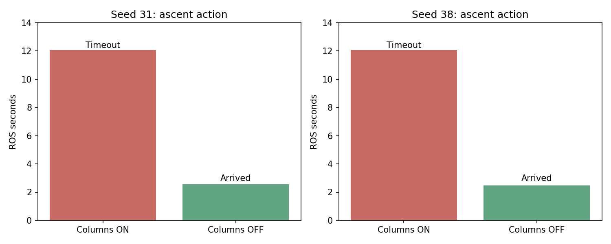

# 关闭障碍柱诊断对照：seed31 / seed38（2026-09-27）

## 结论

关闭合成向上障碍柱后，两轮原本失败的2.6m升高目标均正常到达；均完成三次模拟投递。seed31走廊第二门附近发生55cm工程包络接触，整场FAIL；seed38三槽/两门/H降落Gate为PASS，用时263.3s，但第三投是降级后的tent，并非panzer。

本轮是隔离变量诊断，不是最终比赛配置。离线保守树体投影检查发现高位穿越；任务Gate PASS不包含对此禁越约束的完整验收。

| 项目 | seed31 | seed38 |
| --- | --- | --- |
| 开柱原轮 | 第二升高目标占据，12.061s超时 | 第二升高目标占据，12.070s超时 |
| 关柱本轮 | 升高约2.57s到达 | 升高约2.47s到达 |
| 三投类别 | bridge、red_cross、panzer | red_cross、bridge、tent |
| 第三投ACK（任务时间） | 478.898s | 155.184s |
| 任务Gate | FAIL：actual_collision | PASS：all_checks_passed |
| 完赛用时 | 未完成，观察约552.58s | 263.3s |
| 接触 | 55cm包络 / Wall_22_north | 0 |
| 过门 / H降落 | 两门有穿越记录，未到H降落 | 两门 / H降落完成 |
| 进程清理 | PASS | PASS |

## 控制变量与复现

- 正常运行代码仍为前轮179d6ec后的同一套实现；本轮源提交c35e391仅增加诊断入口、预检摘要和台账。
- 独立replay.launch在正常研究入口之后覆盖 /fast_planner_node/sdf_map/horizontal_avoidance/enabled=false。
- 真实点云三维膨胀仍为水平0.25m、上0.20m、下0.10m；搜索边界、虚拟飞行顶棚、速度、视觉、模型、历史地图均未修改。
- seed31/38串行、单实例、sim_run.sh包装；无中途修补和追加重试。正常研究入口未关闭障碍柱，未覆盖板端。
- 两轮运行rosparams再次确认开关false及膨胀0.25；离线预检成功，复用前轮已成功构建的二进制。
- 与开柱轮相比，本轮取消了所有合成柱，也改变了相应地图重建Z范围的分支；因此验证的是开关整体效果，不能声称只隔离了凸包某一行代码。结合前轮U形墙离线探针，凸包补实仍是首要修复方向。
- 原始run、命令、版本、收尾状态见matrix.json / runs.json。

## seed31：为何复核panzer后去了pillbox

这次没有成功复核出panzer。高位航线结束时只有bridge/red_cross处于有效记忆队列；不是TOP3提前中断。

绝对ROS时间：
1. 61.840s：PARTIAL_HINT_FALLBACK，已有bridge/red_cross，开始下降。
2. 119.173s：两投后去panzer冲突假设1；144.173s动作25秒到期，144.191s记录revisit_unreachable。
3. 144.191s：改查pillbox冲突位置；169.196s动作同样25秒到期。
4. 169.200s：去panzer假设0，170.621s收到到达确认；到185.703s仍无合格重捕，记录reacquisition_timeout，交接低空补搜。
5. 481.242s才在补搜时对panzer发起APPROACH；最终完成第三投。

真panzer=(3.1268,-0.3424)。两处假设约(-0.0963,0.0103)、(0.3334,3.3684)，距真靶约3.24/4.64m；后一处距pillbox约13cm。不能把“发起复核”误说成“复核确认”。日志中的confirmed_evidence_conflict是事件名，不证明这些单帧bbox已满足正式低空confirmed条件。

本轮两次25秒超时由decision_deadline_reached触发；revisit_unreachable是上层归类，不能仅凭这个字符串认定几何上绝对不可达。回放应同时查看轨迹是否在移动。

## seed31是否中央盲区

真实靶位较中央，两条高位航带之间完整靶板视场覆盖薄弱，但目前未找到历史文档明确确认“完全盲区”。

按本轮真值姿态、CameraInfo、相机下置16cm/旋转(0,1,0,0)、地面靶板几何做离线投影：高位阶段431个采样中，靶心入画119个，1m板四角均入画16个。见panzer_coverage.json及脚本。该检查使用地面高度和靶面近似、未模拟遮挡，也未计算检测召回；不以采样数量直接断言YOLO必然能识别。

9月21日同布局成功轮曾在正确位置形成panzer记忆，三次投递后238.64s完成；其记录未包含冲突复核。用户记得的“两处panzer一次复核成功”尚未定位到具体run，不能与该成功轮混称同一证据。

因此应同时处理覆盖薄弱与粗记忆冲突：本轮仍未证明真正panzer从未短暂检出，也未证明正确后续观察一定能够替换早期错误假设。

## 高位结束与低空顺序的实际逻辑

当前提前中断条件：已验证升高完成，bridge/panzer/red_cross三类都有当前有效、未冲突暂停的导航Hint。**不要求三个正式confirmed**；单次≥0.60类别框、有效投影及规定时间/高度门槛也可成为导航Hint。圆环、正式三次确认和释放许可仍在后续低空链中。

另一出口是航线走完：不足三类也结束高位，先处理有效目标，再冲突复核/补搜。seed31走此出口。seed38在任务33.257s提前中断，但其中panzer位置后来无法低空确认，说明三条粗线索并不保证三条正确目标。

有效目标按占据栅格绕障代价优化访问顺序，包含当前位置、剩余目标及出口；每次更新后再排序，实际运动交给三维规划器。不能称为连续空间全局最短路径保证。冲突假设另走有预算的复核选择，不是完整三点巡回最短规划；seed31的panzer→pillbox→panzer属于这条调度。

建议后续修订（本轮未实施）：区分“有待验证位置”与“已可信位置”；允许三类有可复核位置时结束高位，但需维护可更新的多个假设、支持强新证据替换弱旧线索、避免不同类别相互污染；优先解决高权重目标的位置歧义，再考虑低分降级。不能简单按历史检出次数判TOP3或放宽释放条件。

## seed38与速度开销

seed38三投后完整过门、H对齐降落，263.3s约4分23秒。panzer两次低空重捕不足，最终投tent，不是最高权重三目标成功。

阶段用时（从第一任务指令算）：
- 至第三投ACK：155.184s。
- 最后一投恢复：2.451s。
- 转场至走廊staging：12.904s。
- staging下降：13.720s。
- 走廊至H：68.305s。
- H降落：10.736s。

seed31 BOUNDARY_REVISIT速度标签累计约357.635s，运动样本中位速度0.160m/s；这覆盖了很长的重访/补搜段，值得进一步核查慢档退出条件。标签时长包含等待，不是全程匀速飞行。seed38同标签约89.507s；两轮不新增提速。

## 接触及越树解释

seed31在ROS563.223s触发competition_guard_collision与Wall_22_north接触；首个记录点(8.29999,-1.68326,1.01185)，记录穿深约7.5微米。此数值是首次接触采样，不是可继续飞行的保证，也不能单独推定裸机撞墙。Gate随即终止，两门有穿越记录但H未执行。

保守树体+底座凸投影检查：seed31机体包络在juniper_Tree_2上方有重叠；seed38飞控中心在juniper_Tree_0的保守投影内有采样。该检查沿用旧全树体投影，不等同新中部轮廓验收；仍足以说明关闭柱后轨迹发生了重要改变，不能只看无碰撞Gate就交付比赛。

## 下一步

1. 修中部轮廓补实：避免连通墙/开放围合结构被凸包填成实心；保留真实三维避撞和经验证的树中部禁越柱。先离线覆盖U形墙、树靠墙、相邻树粘连、缺失中部点云。
2. 核查粗panzer的输入图像/框及投影，改进冲突后新证据更新；补高位退出和低位消歧的针对性测试。
3. 核查近边慢档是否残留到整套补搜，以及第二门包络余量。避免通过继续縮小膨胀或关闭接触Gate掩盖。
4. 本轮仅诊断配置和报告；未在运行中修改上述逻辑，也未重新跑第三轮。

[视频与完整图表](index.html)。原始日志、相机两视角和合成视频保留在logs，不进Git；历史矩阵不覆盖。

## 产物检查

两轮六个视频均经ffmpeg完整解码通过，合成录像分别562.3s、273.8s（包含任务前起飞准备），10fps；图表及合成画面已抽查。长录像与原始日志仅本地保留。仿真进程零残留，未启动后续重跑。
