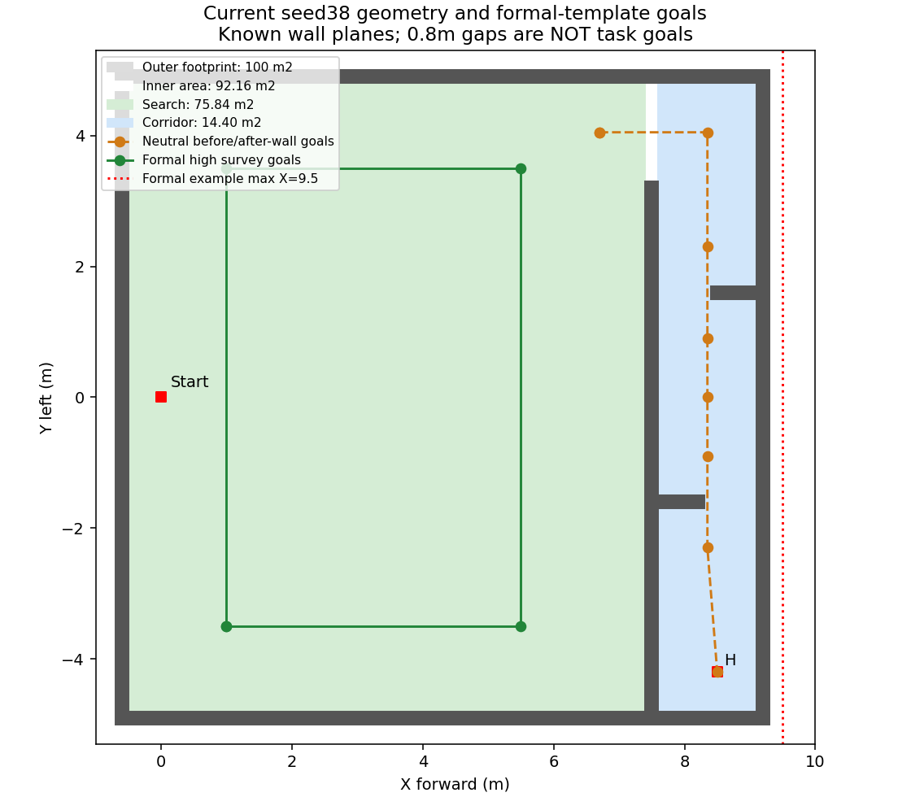

# 场地面积、门引导点、实飞高度与航迹补充核对

2026-10-04。按用户纠正重新核对已运行的seed31/38世界和runtime、10月3日第五/六组实际配置及回放产物、此前按1m靶板人工标点的相机测量。本轮未重新飞行、未启动仿真、未修改场地或速度配置。并行完成的LIO修复合入单独见[候选部署说明](../../deployment/lio_candidate_20261004/README.md)。

## 1. 整场100㎡与搜索区75.84㎡没有矛盾

规则场地名义为10×10m。现用仿真将外围墙体外边缘做成10×10m，墙厚0.2m，净空内边界为9.6×9.6m。旋转后的坐标如下：

| 区域 | 坐标/尺寸 | 面积 |
|---|---|---:|
| 外围外边缘 | X[-0.7,9.3]，Y[-5,5]，10×10m | 100㎡ |
| 内部净空矩形 | X[-0.5,9.1]，Y[-4.8,4.8]，9.6×9.6m | 92.16㎡ |
| 靶标搜索区 | X[-0.5,7.4]，Y[-4.8,4.8]，7.9×9.6m | **75.84㎡** |
| 走廊区域 | X[7.6,9.1]，Y[-4.8,4.8]，1.5×9.6m | 14.40㎡ |
| 隔墙及入口占的条带 | X[7.4,7.6]，宽0.2m | 1.92㎡ |

其中1.92㎡条带实际包含8.1m长隔墙的1.62㎡和1.5m入口对应的0.30㎡空隙，不是整条都是墙。75.84+14.40+1.92=92.16。100减去外围墙占地7.84，才是净空92.16。

所以之前74.01/75.84的分母是靶标可搜索区，绝非把比赛场地改成75.84㎡，也不要求在走廊/H区继续按五类靶标搜索。技术会提到边框可能导致9.6m净尺寸；现场最终是内净10m还是外沿10m仍要以实际测量为准，不能把仿真墙厚换算当场馆实测。

若现场明确是**内净10×10m**，仍按1.5m走廊与0.2m隔墙条带估算，搜索区应约 `(10-1.5-0.2)×10=83㎡`，就不能继续用75.84作分母；航点、边界和覆盖也必须一起重算。

## 2. 门确实已经改成门前后中性引导点

上一份报告没有充分区分“能力已实现并有仿真通过”与“独立正赛现场未填写”。当前实现不是把随机门心坐标交给任务层。

- `simulation_tools/tools/export_r2026_scene.py` 将门前后航点保持在走廊中线8.35，不随随机左右开口变化；门洞边界只写入独立Gate几何和world。
- 最新seed31/38的投后路线相同，门所在固定平面为Y=+1.6/-1.6；引导点Y=2.3/0.9及-0.9/-2.3，位于两侧约0.7m处。X均8.35，另有中间点Y=0。
- seed31两门实际开口X均[8.3,9.1]；seed38第一门为[7.6,8.4]、第二门为[8.3,9.1]。路线不因门真值改变，机载地图及规划器负责在这些点间穿过开口。
- 两轮已完成三投、两门、H降落并通过Gate。因此应承认已有随机左右开口组合的仿真证据，不能写成从未验证随机门。
- 生成器另支持0.8m开口连续移动；现有两轮不是对所有连续位置、全部真实感知误差的穷举验收。

独立正赛field中的 `corridor_waypoints` 仍为空，后续填写的应是按实际固定墙体和入口确定的门前后引导点。比赛中的随机门心无需也不应提前填入。H已知位置可配置。

## 3. 当前仿真与正赛模板是否完全匹配

| 项目 | 已通过的seed31/38 | 独立正赛模板现状 |
|---|---|---|
| 整场名义10×10 | 外墙外沿10×10；净空9.6×9.6 | flight_bounds X[-0.5,9.5]、Y±4.8，与仿真净空不完全一致 |
| 4m限制 | 外墙可视/碰撞高度4m；实际任务另有更低限高 | max_agl=3.0m，低于规则最高4m |
| 1.5m走廊 | X[7.6,9.1]；墙高1.5m | 需按现场填写固定几何引导点 |
| 随机门 | 0.8m开口；固定墙面、开口变化；真实地图规划 | 使用实时规划链，field不预置未知门心 |
| 入口/H | 入口X=7.5、Y[3.3,4.8]；H=(8.5,-4.2) | landing_xy尚未填，不能直接用空模板飞行 |
| 走廊飞行高度 | FC目标0.9m AGL；最终指令上限1.0m AGL；Gate上限1.2m AGL | 只校验corridor点AGL在0.5–1.8m，投后仍允许约1.85m指令上限，未完整继承仿真低空限高 |
| H | 80cm×80cm；观察0.9m AGL、笔画兜底true | 观察高度和兜底已对齐；实际H位置须填写 |
| 高位路线点序 | 从(1,+3.5)开始完整环路 | 从(1,-3.5)开始，矩形相同，但前缀覆盖与中断时序不同 |

**两处实质配置差距：** 模板max_x=9.5比当前仿真内边界9.1多0.4m；走廊也没有沿用1.0m指令上限。配置校验能通过不等于现场尺寸/走廊高度已经正确。此轮按用户要求集中合入LIO，没有将这些额外行为修改混入补丁；后续正式field及走廊分段限高需对齐后才可称同版正赛配置。

1.5m是走廊内墙高度，1.0m是现有工程指令上限，1.2m是现有验收上限，三者不能混为一条“规则规定飞控高度”。规则要求穿门且不跨越障碍上方；本轮没有找到一条独立规定“走廊FC必须低于1.0m”的技术会条款。采用0.9/1.0m有机体上缘净空方面的工程理由。

## 4. 实飞配置2m，为什么FC记录常在1.8附近

10月3日三轮实际 `ground_reference.json` 中：

| 轮次 | 配置高位AGL | 任务坐标ground_z | 高位本地Z命令 |
|---|---:|---:|---:|
| 17:39:29第五组 | 2.000m | -0.26699m | 1.73301m |
| 17:56:04第五组成功轮 | 2.000m | -0.25402m | 1.74598m |
| 18:11:36第六组高速轮 | 2.000m | -0.26341m | 1.73659m |

换算是 `本地Z = 本轮ground_z + FC离地高度`。飞控中心停在地面时约离地0.22m，估计器初始化原点又不一定恰为地面0，因此不能将local Z直接当AGL。任务坐标由FC位姿及现场TF转换而来；若看原始MAVROS/PX4的Z，还应计入对应坐标变换，不能跨轮套同一个ground_z。

已有回放按各自ground_z计算，高位运动中FC估计AGL中位数约2.071m（第五组成功轮）、2.016m（高速轮）。因此“配置2m但本地Z约1.7–1.8”并不证明少飞了20cm。此前EV重置引发的瞬时跳差是另一个问题，不能用地面基准解释掉真正的飞控状态突变；这些数据也不是测距仪独立真值。

## 5. 不同高度的视场：角度不变，地面覆盖变大

复用9月26日bag原图、姿态、高度、1×1m靶纸四角标注及用户的2m现场测量。前者5帧重建靶边存在-8.6%到+6.8%差异，尤其有升降过程和曝光时间不确定性，不能据此声称精确重标定。

按较直观的现场尺度3.6×1.8m，镜头低于FC0.16m，水平平面估计为：

`长边=3.6×(FC_AGL-0.16)/1.84；短边=1.8×(FC_AGL-0.16)/1.84`。

| FC离地高度 | 镜头离地 | 地面长×短边 | 面积 |
|---:|---:|---|---:|
| 0.6m | 0.44m | 0.861×0.430m | 0.371㎡ |
| 0.9m | 0.74m | 1.448×0.724m | 1.048㎡ |
| 1.0m | 0.84m | 1.643×0.822m | 1.351㎡ |
| 1.4m | 1.24m | 2.426×1.213m | 2.943㎡ |
| 1.8m | 1.64m | 3.209×1.604m | 5.148㎡ |
| 2.0m | 1.84m | 3.600×1.800m | 6.480㎡ |
| 2.6m | 2.44m | 4.774×2.387m | 11.395㎡ |
| 3.0m | 2.84m | 5.557×2.778m | 15.437㎡ |

按该测量作对称近似，角视场约88.74°×52.13°，**不会随着高度变成另一个FOV角**。上表是地面覆盖随高度变化，且不表示所有高度都适合识别或允许飞行。

5帧bag按各自姿态/估计高度外推到2.6m，视场面积范围约9.98–13.29㎡；2m为5.68–7.56㎡，包含现场6.48㎡估计，但波动较大。不能拿这个范围当统计置信区间，它混合了倾斜和动态高度误差。更精确的相机尺度仍需稳定姿态、完整靶板及独立镜头离地测量。

现用K和仿真SDF的水平视场约82.85°，并没有自动改成现场测量反推的88.74°；仿真1280×720、horizontal_fov=1.44593453。2.6m下名义视场约4.31×2.43m。模拟相机与原标定近似一致，但与新人工实测长边有差距，本轮未通过直接扩大仿真FOV掩盖它。

## 6. 航线直线与相机朝向

当前高位目标点组成矩形，但目标点之间由kinodynamic搜索和B-spline优化生成可行轨迹。控制器跟踪曲线，**没有强制每段必须贴合直线的几何约束**。速度、加速度初态、避障地图和优化均可能使路径弯曲；不能只凭看似净空就断言一定规划直线。

10月3日第六组18:11:36记录中，四条腿的实际最大横向偏移约0.181、1.272、0.189、0.993m；规划曲线约0.159、1.285、0.220、1.035m。返程弧线在kinodynamic前端已出现，不是机体偏离一条直线。现存小范围点云不足以单独确定是地图还是动力学初态造成，不能无根据归咎障碍柱。该轮当时是中线往返1.0m/s档，后来高速专项才改成第五组外围路线＋1.2m/s上限；不能把旧轮当新档验收。

正赛及上述航线默认yaw=0，返回时不是先转180°再向前飞。相机固定安装，无主动云台转向，长边沿机头方向。第六组在高位本地Z±0.3m范围内，实测yaw中位-0.12°，5–95分位约-3.51°至+2.51°，没有跟着返程掉头；这个取样含部分升降过渡，不是纯巡航精度验收。机体仍会滚转/俯仰来运动，所以相机光轴和地面投影不可能绝对不变。

当前97.59%为理想完整直线连点计算。实际轨迹拱出会改变覆盖并可能留下别处间隙；提前中断还会截断路线。连贯飞行优化后应按实际相机投影累计已观测区域，而不是只统计航点抵达。按用户此前要求，本轮只记录这项改进方向，不实现提速或航点不停顿。

复现：[`field_followup.py`](field_followup.py) 只读既有json/csv/SDF并生成 [`field_followup.json`](field_followup.json) 与场地图；不重跑检测器、不启动ROS。本机原始实飞分析位于板端工作树 `logs/new_site_routes_20261003/`；已有测量报告为 `docs/deployment/flight_fov_20260926/REPORT.md`。

## 7. 本轮LIO合入代码提交

| 仓库/分支 | LIO代码提交 |
|---|---|
| 视觉整机 `feat/r2026-competition-integrated` | ab800574 |
| 视觉研究 `feat/high-view-search-research` | 00fc33d9 |
| 视觉板端 `feat/board-deployment-flight-20260920` | 47a76986 |
| 导航 `feat/high-view-liveness-20260919` | 8a6dcd9c |
| 导航 `板端参考分支` | e37737a9 |

这些是同一组生产修复的逐分支兼容合入，未合入main、未在本轮连接飞机。整机/研究/导航三个实现变体均显式3线程构建、4/4 CTest通过；板端参考保持与整机补丁文件一致。实验分支 `feat/ev-continuity-20261004@df29c381` 原样保留，后续预测、坐标对齐和重置恢复在该支继续；下次上板更新0928原目录，显式三线程编译。
