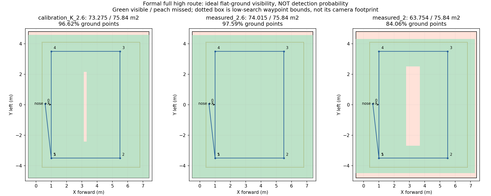

# 正赛入口、规则与视场覆盖复核（2026-10-04）

本报告核查独立整机分支 `feat/r2026-competition-integrated` 的 `cb19c20f`。结论是：完整任务链已有独立入口，主要研究参数没有被现场2m/0.5m/s测试档覆盖，但它仍是待填写现场参数并验收的正赛候选，不能认定所有比赛要求已经闭环。

后续订正见[场地、实飞高度、门引导点与航迹](FIELD_FOV_FOLLOWUP.md)：名义整场100㎡，75.84㎡只是靶标搜索区；现有门前后中性引导点已经有seed31/38过门证据，并非依赖预填随机门心。另明确独立模板边界/走廊指令限高与已通过仿真的差异。LIO已完成修复按用户要求纳入下一轮候选，见[合入与部署说明](../../deployment/lio_candidate_20261004/README.md)，不再等待EV全部实验完成。

本轮只读代码、展开launch参数、复算几何和核查远端；未启动ROS节点、仿真或硬件，未改变运行时配置。下面生成的runtime/control是使用虚构走廊/H坐标展开的分析样本，**禁止作为现场飞行配置使用**。

## 1. 实际入口与参数来源

入口为 [`deployment/competition/start.sh`](../../../deployment/competition/start.sh)，经过 `competition_supervisor.py`、`competition_config.py` 和 `competition_application.launch`，最终使用 `navigation_high_view_full.py` 的硬件版FullManager/HighViewFull/MissionCore。

它不是九组专项中的一个快捷入口，也不自动读取 `deployment/site_20260928` 的现场缩小场地配置。权威模板是 [`field.example.yaml`](../../../deployment/competition/field.example.yaml)，本工作树没有已完成现场测量的 `field.yaml`。模板 `site_confirmed=false`、走廊点为空、H位置为空，配置校验会阻止直接飞行。

| 项目 | 当前独立正赛值 | 含义及边界 |
|---|---|---|
| 低位/高位搜索 | 1.4 / 2.6m AGL | 飞控中心相对地面高度 |
| 最大指令高度 | 3.0m AGL | 任务指令限制，不等同飞控独立地理围栏或实际高度绝不超调 |
| 投递高度 | 0.6m AGL | 仍须通过视觉、对准、稳定及任务许可 |
| H过渡/捕获高度 | 1.0 / 0.9m AGL | 已撤销独立模板原1.8m覆盖；现场H专项仍独立保留其配置 |
| H笔画补充路径 | true | 仍检查H结构，并非任意黑色区域均可通过 |
| 规划速度/加速度上限 | 1.2m/s、1.0m/s² | 不代表全程均速，也未新增到点不停顿优化 |
| 前视距离 | 巡航1.0、精修0.4、走廊0.15m | 这些值是距离，不能解读为各阶段m/s速度 |
| 低空牛耕间距 | 0.7m | 覆盖点区域见下节 |
| 点云膨胀 | 左右0.25、上0.20、下0.10m | 0.10m体素水平向上取整为3格，离散有效距离约0.30m；不是再加机体半径 |
| 障碍柱 | 开启 | 使用支持点及中部轮廓；详见下文规则限制 |
| 虚拟顶棚 | 关闭 | 仍保留任务高度约束 |
| 定位现场负载档 | 特征提取开启、20m局部地图 | filter_point=3、迭代3、面/地图滤波0.15m、探测范围6m，不自动包含EV实验分支 |
| 启动 | 人工解锁＋人工OFFBOARD | 自动任务开关为true，但监督器不主动请求OFFBOARD；达到起飞悬停条件后启动任务 |
| 投递执行 | real，`/legacy/Servo_raw` | 三槽偏移分别(-0.12,0)、(0,-0.12)、(0,0.12)m，经正式许可代理调用 |
| 位姿保护 | 保留 | 相邻位姿位移超过 `3×dt+0.25m` 可抛异常进入ABORT，未因本次复核放宽 |
| 录制 | 5Hz压缩图＋任务/定位等话题＋局部膨胀云 | 不录完整地图云，不启用独立MP4编码 |

高度会统一换算到本次初始化的地面基准。例如静止FC本地Z=0、机体中心离地0.22m时，ground_z=-0.22；高位本地Z=2.38，投递Z=0.38，H捕获Z=0.68，AUTO.LAND交接Z=0.33。不要将这些本地Z直接当AGL。

任务流为低位入场、升高巡航、稳定高位线索集齐后提前转低位复核/投递；不能提前结束时继续航线，必要时按预算处理备选和低位补搜。三投后进入走廊及H降落。异常或无法完成时走对应恢复/返航分支，不能将所有结束都描述为三投接H。

## 2. 视觉判断门槛

实际launch展开见 [`effective_parameters.json`](effective_parameters.json)，仅列与本次问题直接相关的值：

| 环节 | 当前要求 |
|---|---|
| 模型 | 五分类 `flight_5cls_20260928_fp16.rknn`；不含tank |
| 检测器初筛 | confidence 0.50、IoU 0.45、输入640 |
| 高位粗线索 | confidence≥0.60且投影有效，可以不等圆环 |
| 高位提前中断 | 三个优先类别的线索需独立观测支持；相邻支持间隔0.1–1.0s、空间一致性0.5m，并通过冲突判断。不是“每类曾出现一次就立刻返回” |
| 精修线索积累 | 默认3次、跨度≥0.2s、间隔≥0.1s；类别置信度0.70、几何质量0.50、类别投票0.80、位置不确定度≤0.45m |
| 低位记忆确认 | 3帧，相邻有效帧间隔最多1s；使用时还要求新鲜度，任务候选最大年龄0.5s |
| 低位普通类别/红十字 | 类别门槛0.60 / 0.80；几何门槛0.70 |
| 搜索圆环、H辅助圆环 | 0.80 |
| 投递圆环重新确认 | 0.75；不将此改动外推为所有阶段统一0.75 |
| 投递对准 | 视觉端置信度0.60、稳定5帧、偏移30px等；控制端另有20px/稳定计数及高度稳定判断，不能只满足圆环分数就释放 |
| H降落 | landing阶段暂停类别YOLO，使用OpenCV H检测；对准误差0.08m、观测最大年龄0.5s、稳定10帧、观察超时120s |

`candidate_min_streak=1` 是高位策略适配层的配置，不等于低空MissionCore确认和释放只需一帧。`interrupt_refined_classes=[]` 允许有效的粗框线索参与提前中断，但独立支持和冲突约束仍有效。

## 3. 规则书与技术会的核对

来源为 [`RULES_20260906.md`](../../competition/RULES_20260906.md)、规则书原页[第12页](../../competition/rule_extracts/rulepage-12.png)/[第15页](../../competition/rule_extracts/rulepage-15.png)，并重新读取根仓原始 `20260906141528-转写_2026无人机赛项规则说明会-逐字稿文本-1.docx`。以下段号按本轮去空段提取计，仅方便定位，不替代原文。

已对齐的设计包括：五个静态类别且取消tank；目标位置靠视觉搜索而非提前填靶标坐标；三槽许可投递；人工准备后由遥控器进入自主任务；具备走廊和H阶段；默认指令高度小于4m。原文关于起飞得分是超过1m并稳定飞行10秒，不能额外解释为必须定点悬停10秒。

仍需补齐或验证：

1. **场地坐标尚未最终填写。** 模板flight_bounds为10×9.6m、面积96m²，不是完整10×10m，也不是9.6×9.6m。技术会说明场地边框可能使净尺寸缩至9.6m（P356–372）。需按实际边界、起飞点和航向填写；走廊/H缺省正是为避免拿未测坐标飞行。
2. **随机80cm门采用门前后中性引导点。** P118–121、P273–287和P403–410明确门宽及开口左右变化。复核确认场景导出器没有把门洞真值传给任务航点；seed31/38在相同门前后航点、不同开口组合下均已穿门通过。独立现场field仍须填写固定墙体两侧引导点，并继续验收真实感知和更多开口位置，不能将这项待验收误写成当前依赖预填门心。
3. **避障得分不只取决于未碰撞。** 规则书还限制直接从障碍上方跨越、全程高于障碍的行为。2.6m巡航必须结合实际树高/墙高与轨迹判断。当前柱体支持阈值3、支持半径0.15m、竖向跨度0.20m，取40–60%中部轮廓；它不等同树最宽投影，之前允许下部外缘上方空间的选择不能自动视为规则保证。柱体搜索边界也不覆盖整个后续走廊。此项需要几何/轨迹验收，不能仅凭开关开启判合规。
4. **总时间预算起点未与裁判计时一致。** 规则书第15页从下达起飞指令起计时，当前600秒从起飞悬停后 `/navigation/start_mission` 接受时开始。runtime的420秒返航/180秒余量在 `early_return_enabled=false` 下不是有效提前返航保障；超时后仍可能执行安全返航/降落。因此不能保证裁判口径10分钟内落地。后续应统一起点并预留返航时间，不能用到时停电机替代。
5. **摆靶后的初始化/记忆刷新需要验证。** 技术会P93/P96、P114–117要求申请起飞后摆靶、允许事先准备后遥控器启动，不能再依赖现场电脑调整靶位。任务启动会重置高位catalog，线索有阶段与新鲜度限制，但这不代替完整验证启动前地图/记忆在摆靶后均不残留错误观测。
6. 重量、轴距、载荷、实际RC紧急接管等不能由代码参数证明。现有两轮SITL通过也不等同独立正赛包的同版实机全场验收。

## 4. 视场是否算对

已知实测是**飞控中心离地2m，画面长边3.6m、短边1.8m**。known_rig中镜头在FC下方0.16m，因此测量时镜头离地1.84m。下视、水平地面时，按实测尺度外推：

```text
L(h) = 3.6 × (h - 0.16) / 1.84
W(h) = 1.8 × (h - 0.16) / 1.84
```

2.6m AGL下单帧约 **4.7739×2.3870m，11.3951m²**。假设对称主点，实测对应FOV约88.74°×52.13°。此前将2m飞控高度当作镜头高度的简化不能继续用于精确换算。

但是线上CameraInfo仍来自 `calibration_1280x720.yaml`，fx=725.3510、fy=723.3404，主点(631.6719,397.5664)。该K在2m FC高度推算 **3.2470×1.8315m**，与实测相比长边小约10.87%、短边大约1.75%（以K为基准，实测短边变化-1.72%）。所以：**旧覆盖估算可以复现，但现用投影内参与实测视场还不能称为完全一致。**

实测比例2:1与1280:720本身不同，测量边缘、图像裁切、畸变、倾斜和主点偏移都需复核。两个长度不足以重标定内参，本轮没有用长度反算值覆盖K。精确靶心误差仍应使用原始相机画面与已知尺寸、姿态联合验证。

## 5. 当前航线的理想覆盖面积

在固定机头+X、图像长边沿机身前后的条件下，航线为：

```text
高位入场 (.6,.05)
→ (1,-3.5) → (5.5,-3.5) → (5.5,3.5)
→ (1,3.5) → (1,-3.5)
```

矩形一圈23m，加高位入场斜线约26.57m。1.2m/s下22.14秒只是这段纯水平匀速运动下限，不含起飞、爬升、加减速、航点停顿、识别、重访和投递。

搜索区按target_bounds计算：X[-0.5,7.4]、Y[-4.8,4.8]，面积**75.84m²**。低空牛耕航点所在矩形52.48m²是航点范围，不是相机覆盖范围。

| 几何模型 | 单帧视场 | 完整高位航线覆盖搜索区 | 比例 |
|---|---|---:|---:|
| 现用K，2.6m | 4.306×2.429m | 73.275m² | 96.62% |
| 实测尺度，2.6m | 4.774×2.387m | **74.015m²** | **97.59%** |
| 实测尺度，2.0m，仍用同一航线 | 3.600×1.800m | 63.754m² | 84.06% |
| 实测尺度，3.0m，仅敏感性计算 | 5.557×2.778m | 75.399m² | 99.42% |



按实测2.6m，未覆盖约1.825m²，主要是边缘；沿X的两条长边扫描视场交叠约0.274m，现用K反而存在约0.194m间隙。主点偏移沿用原标定比例时，+Y边缘约0.231m带状区域未覆盖；假设主点居中则覆盖97.78%，两者均不是100%。

74.015m²是裁切到搜索区后的面积。未裁切视场扫掠并集约88.719m²，含场外区域，不能报为有效场内搜索面积；裁切到96m²飞行边界后约78.286m²，也不表示覆盖整场搜索任务。

“靶心曾进入画面”与“完整圆环进入单帧”不同：对直径1m圆环，以能完整放在搜索区内的59.34m²靶心位置集合为分母，完整高位路线约**90.45%**能至少一次容纳完整圆环。识别器可能凭局部画面检出类别，该数字不是识别召回率。

提前中断也会改变覆盖：按当前点序，走完第1/2/3/4/5个高位点时，累计理想覆盖约29.16/41.79/81.21/92.48/97.59%。不能拿整圈97.59%描述只飞前两个点即中断的任务。

全低位牛耕在1.4m下26点、约91.4m（不含从当前位置接入），理想覆盖74.363m²/98.05%；若高低两套均完整执行，合并约74.602m²/98.37%，仍有边缘遗漏。实际策略可能提前终止或优先补漏，不默认每次走完整牛耕。

计算脚本 [`coverage.py`](coverage.py) 采用连续线段扫掠多边形并集，无栅格计数误差；数据见 [`coverage.json`](coverage.json)。假设水平地面、固定航向、直线连接、不计畸变、遮挡、姿态倾斜和跟踪偏差。测量尺度模型仅借用既有主点比例，并不是一次新相机标定。**当前survey_xy是固定配置，改变FOV不会自动重新生成巡航点。** 因此几何结果约等于旧报告97.6%，但不能据此保证真实识别全覆盖。

## 6. 同步与部署状态

以下为首次复核时实际查询GitHub的远端快照（LIO后续合入提交见[补充报告第7节](FIELD_FOV_FOLLOWUP.md)，不能将此表旧HEAD当作当前最新）：

| 位置 | 当时远端HEAD | 状态 |
|---|---|---|
| 视觉整机 `feat/r2026-competition-integrated` | cb19c20f | 独立正赛入口及H默认对齐已推；本报告随后单独提交 |
| 视觉研究 `feat/high-view-search-research` | b9778b05 | 主要视觉/任务/控制文件与整机一致；不含独立competition打包入口 |
| 视觉板端 `feat/board-deployment-flight-20260920` | 5a08f9f0 | 公共补丁及部署/事故报告已推 |
| 导航 `板端参考分支` | 8c131b5f | 本轮抽查的八个视觉/任务/控制核心文件与整机一致；不含独立competition入口 |
| 导航 `feat/high-view-liveness-20260919` | 3cf127cc | high_view_probe/full一致，但内附视觉/旧控制副本不同且缺uav_high_view记忆模块，不能单独当当前完整整机发行包 |
| EV实验 `feat/ev-continuity-20261004` | df29c381 | 并行匹配修复、EV连续性实验独立保存，未自动纳入正赛 |
| 视觉main | 2f405bef | 仍是既有验收基线，本轮未合入 |

文件级比较见 [`sync_comparison.json`](sync_comparison.json)。这是指定文件比较，不声称不同分支整个目录完全相同。

板端以[10月4日部署记录](../../../../r2026-board-vision-tests/docs/deployment/board_redeploy_20261001/FIELD_DEPLOYMENT_20261004.md)为准：0928目录已应用34项公共文件补丁，H反光/YOLO门控、人工OFFBOARD、接管清理、投递测高与时间戳等已编译及离线检查；保留现场FAST-LIO、大核绑定、场地参数、位姿保护和轻量录包。旧r64本轮未更新。

**待同步/待完成的具体项：**

- 新的独立正赛发行包尚未安装板端；需要填实测field.yaml，包括走廊引导与H位置，并核实上述规则差距。0928公共补丁更新不等于此项完成。
- 正赛H捕获0.9m与笔画兜底true的独立入口参数已在远端；板端专项默认不随之自动变化。不要将专项1.8m抄回正赛，也不要把正赛默认直接覆盖所有专项。
- 后续按用户要求已将FAST-LIO容器边界、并行匹配及其他已验证修复合入整机/研究/板端/导航feature，仍待上板；EV平缓目前继续留在独立实验分支，不能直接接入飞控并宣称根治跳变。
- 研究/导航参考分支已对齐抽查的公共核心，独立硬件入口应以整机分支发行，不能仅拉导航liveness仓便认为具备最新完整视觉与硬件链。
- main未接收本次独立硬件入口及实验变更；需同版整机验收后按既定合并流程处理。

本轮没有更改阈值、航线、速度或部署。几何重算不代替新相机标定；规则差距也不应靠调小膨胀或自动放宽定位年龄掩盖。


2026-10-04补充：[净空10m高位蛇形设计](../../planning/serpentine_20261004/PLAN.md)：镜头2.6m两线/镜头2m三线、薄墙压力规格与边缘盲区；仅离线设计，未替换生产field/world。
