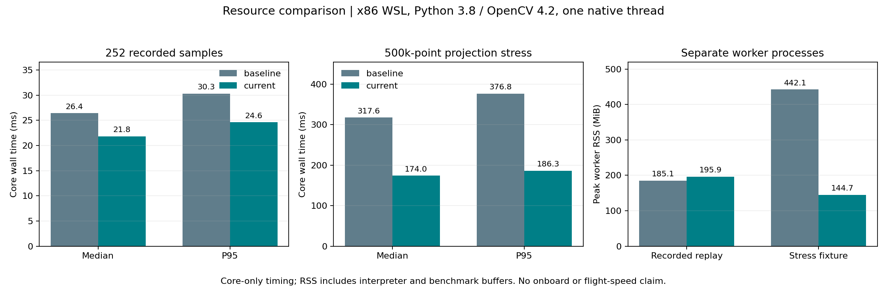
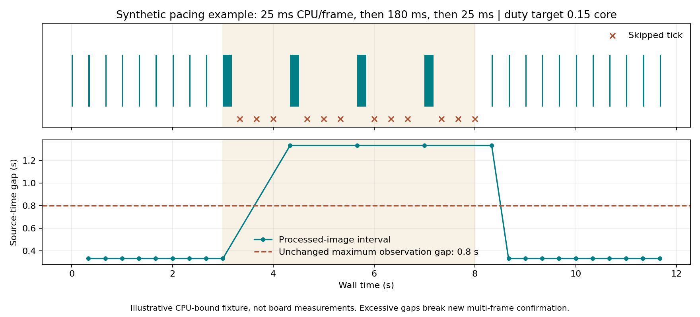

# 搜索记忆的端侧资源准备与离线验证

2026-09-12存储维护：按用户要求，已清理8份可重建的基准比较NPZ（约95.16MiB）；本报告数值、脚本和输入PNG/点云仍保留。下文比较数组路径为当时产物位置，需要时由benchmark.py重建。[维护记录](../local_entry_execution_20260912/storage.json)。

2026-09-12完成，沿用20260911研究批次目录。分支：`feat/coverage-efficiency-research`；比较基线：`80445c0`。本轮根据用户“考虑未来端侧有限计算资源，继续推进”的要求，完成旁路资源优化和只读候选数量约束。没有启动新SITL、连接实机、修改航带默认值或生成部署包。

**252份历史同步样本在两个本地Python/OpenCV环境中，优化前后的逐格状态、连续帧计数、last_seen和结果字段全部一致。实际ROS库环境下，核心P95耗时30.33→24.63ms；50万点压力场景峰值进程RSS442.12→144.72MiB。** 这些是笔记本x86离线结果，不代表OrangePi性能或任务用时改善。

## 实现

- 占据点云按16384点一块进行投影，每个点仍参与同一个全局最近深度缓冲，再统一做邻域遮挡扩张。没有截断点云、随机抽点、改变遮挡裕量或图像标定。
- 只缓存一份相机标定对应的有效射线域；图像质量计算减少浮点中间副本。原图尺寸、质量阈值、五点/格、多帧累计与TTL保持原值。
- 点云保留上限从“最多4份、每份50万点”补充为每份16MiB、缓存总计32MiB。完整消息按时间淘汰；超限输入使当前地图不可用，不截去障碍后继续授予可见估计。图像上限为2073600像素及8MiB，进入cv_bridge前检查。
- 输入回调使用短锁，只更新最新图像和有界消息窗。计算/提交与任务重置仍串行，避免跨任务提交；回调可以在上一帧计算时更新最新输入。
- 新增软CPU预算：墙钟最高3Hz，按照一次工作实际进程CPU耗时与单核15%的目标比例计算冷却时间。跳过期间不处理旧队列，不累计新帧，仍更新TTL和诊断。150ms是告警阈值，不能中断正在运行的OpenCV/NumPy调用。
- 已过期图像在TF/解码前拒绝；若图像在核心计算期间过期，则回滚本次五组小栅格数组的修改。计算异常也回滚，计算期间时钟回退清除未来历史。新状态不会因一次慢帧错误增加信用。
- 只读区域排序默认最多32个候选，超限整次拒绝，可显式配置上限。依然输出“需要规划可达性验证”，没有导航目标、跳点或投递服务调用。

参数位于包内`config/shadow.yaml`和`config/resource_budget.yaml`。`shadow.launch`默认关闭、原始记录默认关闭；研究试验入口仍可显式开启限量采样。新指标包括`work_cpu_ms`、`work_wall_ms`、`budget_skips`、`budget_overruns`、`cooldown_ms`、输入缓存字节数、解码/地图转换/核心分段耗时与计算完成时的图像年龄。

## 测量与图表

输入是已完成三轮的原始PNG、相机标定、源时刻TF和地图：seed32/0.70m共88份，seed32/0.80m共77份，seed34/0.80m/等待20s共87份；最大地图177172点。没有重新渲染图像或使用目标/树真值帮助判断。按各轮6s稀疏样本顺序输入新旧模块，比较同一离线序列；不是复现线上每一帧的覆盖历史。

性能计时包括核心`Memory.observe`，不含PNG/NPZ读取、ROS传输、TF等待、消息转换、发布和Recorder。新旧版本分别在独立进程中运行，OpenCV/OpenBLAS/OMP各限1线程；最终计时在构建结束后单独进行。压力场景是50万点全部位于标定视域内的确定性人工输入，连续10次计算，专门检查投影临时数组峰值，不代表真实场地布设。

| ROS实际库环境：Python 3.8.10、NumPy 1.23.5、OpenCV 4.2.0 | 原版 | 优化版 |
|---|---:|---:|
| 历史252样本核心中位耗时 | 26.42ms | 21.83ms |
| 历史样本核心P95 | 30.33ms | 24.63ms |
| 历史回放进程峰值RSS | 185.10MiB | 195.94MiB |
| 50万点压力核心中位耗时 | 317.59ms | 173.96ms |
| 压力核心P95，10次 | 376.78ms | 186.27ms |
| 压力进程峰值RSS | 442.12MiB | 144.72MiB |
| 栅格/计数/历史时间/结果差异 | — | 0 |

历史P95下降18.8%，压力峰值RSS下降67.3%。**普通历史回放RSS增加了10.84MiB，未证明普通场景整体内存下降。** 该指标包含解释器、输入和基准脚本保留的比较数组；资源优势主要是避免全部点同时投影产生的大块临时数组，不能把压力场景比例推广为整个机载工程的节省。

已有conda环境独立复核：Python 3.9.25、NumPy 2.0.2、OpenCV实际4.11.0。历史P95为28.09→22.73ms，压力RSS393.99→96.12MiB，同样零状态差异。以运行时实际版本为准。完整数值见[ROS结果](benchmark_ros.json)和[conda结果](benchmark.json)，复现程序为[benchmark.py](benchmark.py)。比较数组留在忽略的`logs/_artifacts/coverage_resources_20260911/`。

旧seed32/0.70m线上日志的`processing_ms`中位163.39ms、P95 287.34ms，包含适配/同步采样且处于完整SITL资源争用环境。它不能与本轮24.63ms核心P95直接比较，也不能据此宣称端到端快了十倍。新的锁、限频和消息缓存行为仍待下一次获授权的在线运行验证。

## 有限计算能力下如何退化

预算按`下次最早开始=max(本次结束, 本次开始+1/最高频率, 本次开始+CPU耗时/预算比例)`计算。时间基于单调墙钟，不随仿真倍率变化；ROS Timer到点也要通过预算检查。该预算覆盖重处理路径及同步样本写入的进程CPU统计，包含期间本进程其它线程的CPU；轻量诊断发布、回调在空闲期的耗时及其它节点不受此配额限制，因此它不是整节点/整机硬CPU限额。

例如单帧CPU耗时180ms、目标为0.15核时，下一次至少间隔1.2s；在3Hz定时器上通常要到1.33s才处理下一张。原`max_observation_gap=0.8s`会中断新的多帧确认。不能为了增加覆盖估计而自动放宽这项条件。原有历史/活动估计仍按各自语义保留或过期，预算跳过不证明环境没变。

上图是明确标注的CPU工作时间模拟，不是OrangePi实测。若板端出现这种长期退化，需要继续减少计算或调整已验证的运行配置；当前实现会报告不足，不把低频输入伪装成持续有效观测。

字节上限也不是操作系统RSS上限：一个正在处理的旧快照与新缓存可以同时存在，最多各持有一个32MiB窗口；还有地图转换、图像、TF缓存、ROS接收与解释器开销。ROS消息在回调前已反序列化，本模块无法阻止上游先分配超大消息。端侧应在相机/点云源和系统资源监测中同时约束，不能只检查本包参数。

## 端侧接入目标与剩余验证

1. 保持RKNN/NPU视觉主路、LIO/规划控制优先。旁路使用CPU小栅格，不增加第二套检测大模型、全局稠密语义图或点云历史堆积；原始采样默认关闭。
2. 本包先以3Hz上限、0.15核重处理预算和32MiB原始点云缓存作为起始配置。板端并发场景中，暂以观察器RSS不超过256MiB、整节点平均CPU不超过0.25核作为待实测目标，尚未验收；还必须检查LIO、规划、RKNN延迟和内存余量，不能只让观察器单独达标。
3. 继续沿已审阅计划推进局部候选与原规划器可达性衔接，限制候选数和查询频率，复用原地图，不另跑一套重全局规划。联合地图/定位epoch、真实质量/遮挡标注、主动补扫与投后恢复仍未完成。
4. 下次显式授权的在线验证应先记录有效采样率、间隔、预算跳过与原链延迟，确认旁路没有让原规划等待变差，再评价搜索效率。当前不将0.80m升级默认，也不把本轮CPU优化记成新的航线收益。

本轮77项Catkin离线测试通过，视觉工作区实际构建通过；shadow入口静态展开确认只有观察器一个节点、资源参数生效、记录关闭。测试覆盖字节超限、回调不被计算锁阻塞、预算冷却、陈旧帧前置拒绝、计算过期/异常回滚、时钟回退、候选上限、分块边界及原观测/查询行为。没有启动ROS Master、Gazebo或PX4。

复核Catkin时先`source /opt/ros/noetic/setup.bash`和当前研究`vision_ws/devel/setup.bash`，再运行`catkin_make run_tests_uav_coverage_memory -DPYTHON_EXECUTABLE=/usr/bin/python3 -j2`及`catkin_test_results build/test_results/uav_coverage_memory`。未加载当前overlay会找不到该Python包；一次漏加载的调用已纠正，不是算法测试失败。检查汇总见[validation.json](validation.json)。

正赛整机仍为`86e382d`，交付CURRENT仍为`c369e6f8`；研究实现未经板端并发和在线稳定性验收，保持独立分支。
