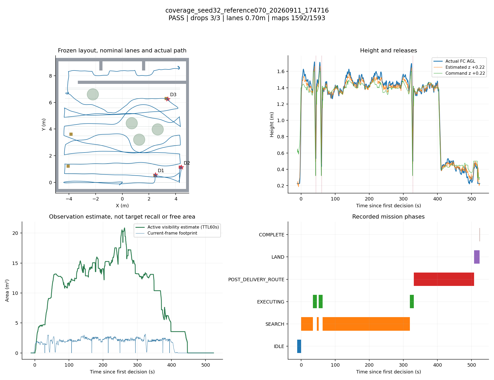
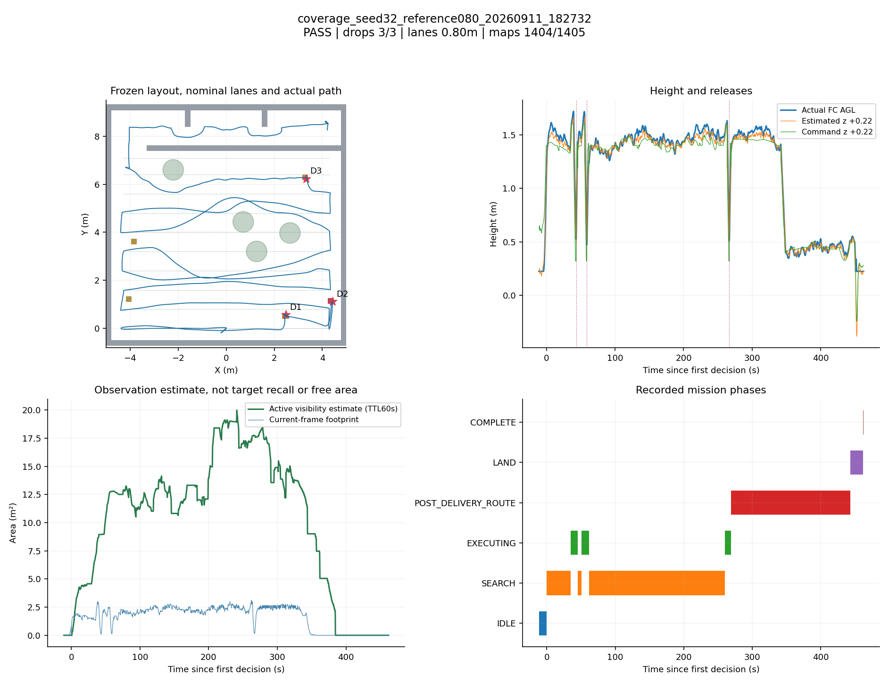
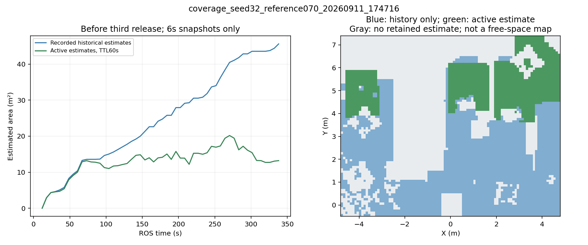
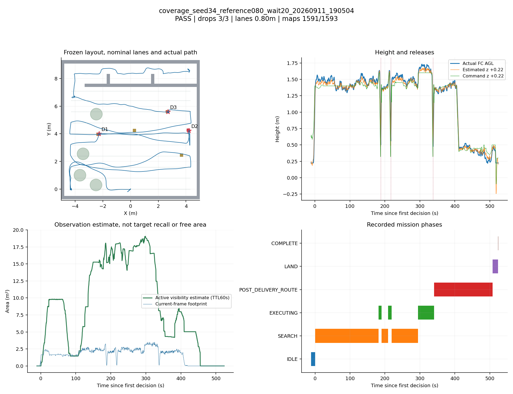

# 搜索效率研究：在线旁路、历史查询与航带候选验证

2026-09-11，研究分支`feat/coverage-efficiency-research`。用户已明确授权必要历史布局验证和后续开发。正赛整机工作树86e382d及交付c369e6f8保持隔离。

本轮已结束：1次诊断中止、3次完整SITL均通过原37项工程Gate。诊断轮单独保留，三个通过包含同布局对照，不能合并当作独立随机成功率。没有把研究配置写入正赛默认入口。

## 已完成的开发与问题修正

1. 新增显式研究SITL入口及限量同步采样。图像、标定、图像时刻TF、占据点云和状态使用同一来源时刻，最多120份，每6 ROS秒至多一份；保留关键CSV/事件，无全场视频或bag。
2. 首次在线诊断发现实际地图超过原10万点上限。95 ROS秒时结束诊断，记录DIAGNOSTIC_STOP、无完整Gate；修正为50万点有界容量、数组化PointCloud2解码、明确拒绝原因和旁路线程限制。没有截断地图冒充空地。
3. 增加默认关闭的同帧清晰参考质量选项：在分散清晰边缘存在时允许正常曝光的平坦区域进入可见估计。16份初始实采样本中13份有参考；合成sigma6模糊/全暗样本均0/16。这是仿真样本检查，不是实拍标定或检出召回验收。
4. 新增只读区域查询与MissionLedger。当前视角遮挡不抹去历史，TTL后的历史与当前状态分开；epoch/generation/几何或真实时钟重置清空，过期/重复/乱序拒绝。输出只是需要可达性验证的观察建议，没有导航目标或跳点许可。详见[接口边界](QUERY_LAYER.md)。

相关离线测试61项通过，研究工作树两工作区整机构建及后续视觉包构建通过。在线仍运行固定端点航线，历史查询模块没有驱动本轮飞行；间距候选是单独的参数研究。

## seed32同图配对：已完成

| 指标 | 0.70m | 0.80m | 变化 |
|---|---:|---:|---:|
| 原工程Gate | 37/37 PASS | 37/37 PASS | 均完整通过 |
| Gate任务时间 | 523.659s | 461.978s | 减少61.681s，11.78% |
| 第三次释放距首个指令 | 327.572s | 266.725s | 减少60.847s，18.58% |
| SEARCH阶段时间 | 296.124s | 238.485s | 减少19.46% |
| SEARCH实际XY路程 | 91.483m | 73.345m | 减少19.83% |
| 全程实际XY路程 | 116.668m | 97.420m | 减少16.50% |
| 三投类别 | bridge、red_cross、panzer | 相同 | 未改变本对照的类别组合 |

两轮实际靶位相同，world/field/gate输入相同，在线观察器、模型、控制与等待参数相同。飞行配置只改`search/lane_spacing`和路线版本标记；0.80实际参数已读取确认。

这是一组配对，不足以估计鲁棒成功率或全场最优间距。改变间距也改变相同高度带上的飞行方向及目标出现时序；不得将本布局的收益直接外推。两轮均在搜索后段三投完成，没有飞完全部末端航带，不能把本轮节时都归功于消除7.0/7.1m两条近邻末带。

时间起点区分：Gate保留原验收时钟；第三次释放以首个记录指令为起点，不是官方裁判计时。释放为mock ACK，三投类别相同不等于实际货物落点达到72.5分。

[配对数字](seed32_pair.json) · [逐轮统计](run_metrics.json)

## 地图记忆的在线含义

修正后的0.70m轮被处理图像中99.94%匹配有效占据地图，活动估计峰值20.86m²。三投前按6s采样重建的历史估计45.61m²，当时活动估计13.21m²；该差别说明新鲜度与历史观察应分开。采样可能遗漏短暂状态，数值不是实际自由面积或目标召回。

占据点云无点不能证明畅通；局部质量与同帧参考都只是代理；历史账本仍依赖正确的上游epoch。当前区域排序使用只读快照，未触发补扫、改道或跳点。需要进一步完成可达性联动和有效观测标签验证，才能评估主动绕到树另一侧的闭环效果。

## seed34历史难例

本轮0.80m/等待20s完成37/37 PASS、3投/9返程点/两门/落地，当前过滤后的碰撞计数为0；实际靶位与原seed34相同。三投仍为panzer、red_cross、bridge。

| 指标 | 历史0.70m/等待20s | 本轮0.80m/等待20s |
|---|---:|---:|
| Gate任务时间 | 495.735s | 523.840s |
| 第三次释放距首个指令 | 298.896s | 337.928s |
| SEARCH/RESUME命令运动时间 | 257.926s | 275.623s |
| SEARCH/RESUME实际XY路程 | 66.704m | 60.035m |
| 初始无轨迹等待 | 2次，39.996s | 4次，80.109s |

本轮路程减少约10%，整场却多28.105s（约5.67%）、三投多39.032s。多出的约40.113s初始等待解释了重要一部分时间差，捕获/恢复与返程也各有变化，不能机械地将所有差值归因于间距。历史轮卡在起始左端，本轮起始左端成功后卡在右端0.0/0.8m两目标；底层可达性/规划时序问题仍有波动。

这是历史参考，不是同观察器/同版本连续配对；旧轮d7346c2没有新增旁路负载。本轮沿用20s上限，未把等待修复与间距改变混称同一个修复，也未用新结果改写原五seed2/5。

[逐项历史比较](seed34_historical_comparison.json) · [输入一致性](input_parity.json)

## 观察到的近地估计异常

seed32的0.80m轮在AUTO.LAND阶段出现一次局部高度瞬态：估计z加固定地面偏移最低-0.382m，外发setpoint同口径最低-0.242m；实际FC最低约0.225m，始终没有飞到地面以下，工程Gate仍通过。seed34候选也保留了类似的近地估计瞬态，具体最小值/时刻/模式见附件。图中的估计/外发值不等于真实高度，也不等于该时刻PX4正在执行的轨迹；近地估计问题未因搜索提速得到解决。[对应时刻与模式](landing_height_check.json)。

另有一个需要保留的边界：seed32的0.70m轮及seed34候选在走廊末段（x约2.7m、y约8.4m）的实际FC高度已接近名义支撑高度0.22m。当前接触监测明确过滤ground_plane，因此“碰撞计数0”不能证明全程无擦地；支撑间隙还受姿态影响，不能仅凭FC高度确认接触力。本轮保留原Gate，未改过滤器，也未把此现象归因于航带间距。

## 决策与下一步

保留点云容量/解码、限量同步记录、只读查询与历史账本；同帧参考和0.80m间距继续作为研究候选。seed32显示了单次配对收益，seed34显示路径缩短仍可能被等待和目标事务开销抵消，**不统一替换0.70m默认值**。

下一步优先把候选观察区域与规划可达性/有效窗口衔接，降低“已到起点却无法给远端目标出轨迹”的重复等待；再验证按实际观测空洞补扫、投递后就近恢复。历史账本只有观察估计，联合地图epoch和真实质量/遮挡标签未完成，因此尚未让它自动驱动改道或跳点。

全部正式运行后均复查ROS/Gazebo/PX4及旁路观察器零残留。原始数据见各run_dir，图表/统计脚本已提供；没有新打包或正赛部署。

## 复现与附图索引

当前研究入口要求SIM_RUN_DIR，由sim_run.sh提供；缺失时静态展开失败，避免误把样本写到根目录。该最终入口检查只做静态/单元验证，不增加实跑轮数。

- [诊断轮图](coverage_seed32_shadow_20260911_173209.png)
- [seed32 0.80m历史估计图](coverage_seed32_reference080_20260911_182732_history.png)
- [seed34历史估计图](coverage_seed34_reference080_wait20_20260911_190504_history.png)
- [历史账本复盘数据](history_review.json)
- [图表与指标生成](analyze_trials.py)、[只读历史复盘工具](history_review.py)
- 场景/候选配置与run路径见[candidate_specs.json](candidate_specs.json)、[输入一致性](input_parity.json)；两个候选只改间距与路线版本，seed34另显式保留等待20s。

## 保留边界

本轮保持四组树下垫箱，不增加独立纸箱；历史垫箱尺寸假设未改。没有把SITL结果当作板端、机械实投或最新规则全部条款的验收。研究结果不替换正赛部署；0.80m和同帧参考均保持研究候选。
