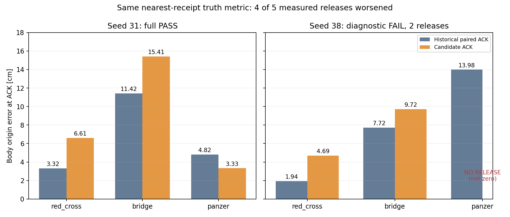
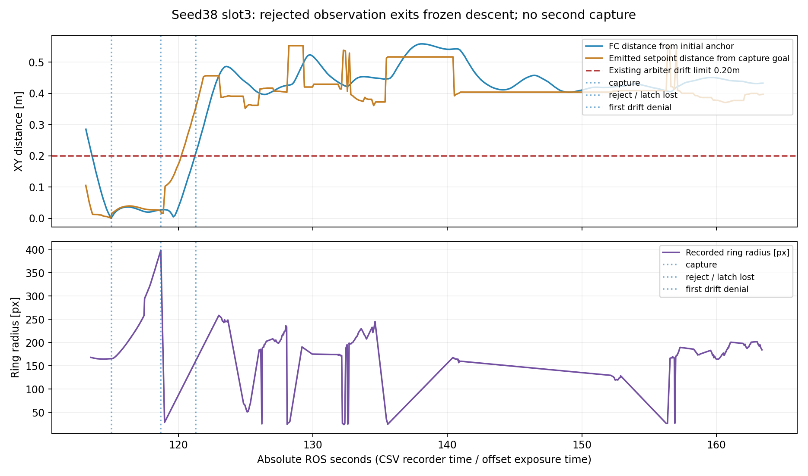

# 投递精度候选评测：seed31 PASS，seed38 两槽后诊断 FAIL

本轮最终候选为 `7d312fa252d02ee937640839b6aac8d74bd11ad7`。seed31 自然完成三投、三恢复、走廊两门、H降落及解除解锁，原 Gate PASS；seed38 第三槽在低位发生许可漂移阻断，经主代理明确授权采样后中止，保留两次实际释放，记为 `INTERRUPTED_DIAGNOSTIC_FAIL`。**候选不满足推广条件，exact 默认保持 off；不修改默认、阈值或生产代码，不再重跑。**

五次可配对释放中四次误差劣于历史，缺失的第六次不补零。当前结果没有稳定的整体精度改善；任务完成性与精度结论分开。

## 轮次、基线与实际路径

| 轮次 | H/logs 原始目录 | 完成/停止事实 | 清理 |
|---|---|---|---|
| 新31 | `drop_precision_seed31_20261007_020102` | 原 Gate PASS，exit0；3正确释放/3恢复/两门按序/H支撑接触/ON_GROUND/armed=false；0碰撞、越界、超高 | wrapper PASS，规定检查零残留；source unchanged |
| 新38 | `drop_precision_seed38_20261007_022323` | 2正确释放/2恢复/0碰撞；slot3 panzer无ACK；ROS163.002采样后TERM自有wrapper22621；未完成走廊/降落 | 原 cleanup FAIL保留（rosmaster22776/rosout22786）；规定停止脚本后独立检查PASS、两PID消失；原matrix INFRA_STOP未改写 |

配对历史源码 `337b583689f46d907546d1d28a8fc52b13f47398`：

- 31：`snake3_camera2m_snake3_seed31_20261005_095902`。
- 38：`snake3_camera2m_snake3_seed38_20261005_101903`。

历史两轮均三次正确模拟释放、零碰撞，但原软件 Gate FAIL，不能改称整场软件PASS。它们使用相同冻结10×10m、四树、三扫描线、镜头2m场景；复用原field.world/YAML，未重新按seed生成。更早布局、2.6m镜头、seed38续扫补充轮不混为配对基线。历史碰撞停止选项与本轮不同，保留此差异；本轮始终 `stop_on_collision=false`，碰撞仅记录。

两轮启动前及运行时32项预检均通过：视觉 `/drop_aligner/exact_drop_projection=true`、控制 `/uav_vision/drop_exact_projection_enabled=true`；`circle_quality_ordered_nms=false`；slot zero；body=`vision_body`、map=`camera_init`、ground_z=-0.22；实际相机namespace/CameraInfo/optical frame一致；两overlay均解析到H。容差继承原30px的曝光投影Jacobian，没有硬塞5cm；冻结镜头2m、续扫关闭。评测真值不进入控制。

闭包bag实际记录新路径：31有233个fresh valid exact offset，38有467个；这证明视觉分支确实运行。控制接受还需结合事务与捕获日志，不能把所有后续offset当作控制消费的冻结目标。31捕获源时间76.110/110.724/132.908已由B结合FC位姿与原限幅器输出重建，固定目标确实进入下降命令；38第三槽冻结被拒绝路径解除，详见后文。

## 同口径逐目标释放精度

主比较列严格复现历史口径：成功ACK接收时刻附近 `truth_pose.csv` 最近样本的**机体/model-origin XY**到对应真实靶心距离。另列ACK源时刻、两侧真值线性插值；两口径不能混算。单位cm。

| seed/槽位/目标 | 历史ACK最近样本 | 新ACK最近样本 | 历史ACK源插值 | 新ACK源插值 | 新ACK源ROS秒 |
|---|---:|---:|---:|---:|---:|
| 31/1/red_cross | 3.317 | 6.613 | 3.474 | 6.646 | 81.249 |
| 31/2/bridge | 11.420 | 15.407 | 11.431 | 15.378 | 116.491 |
| 31/3/panzer | 4.815 | 3.332 | 4.871 | 3.346 | 137.006 |
| 38/1/red_cross | 1.941 | 4.693 | 1.861 | 4.704 | 70.439 |
| 38/2/bridge | 7.725 | 9.722 | 7.927 | 9.771 | 91.391 |
| 38/3/panzer | 13.982 | **未释放** | 13.972 | **未释放** | — |

五次新释放的最近真实类别均正确，均在对应旋转标称靶板内；板内不等于环区计分或实物落点验收。slot/mission/decision/attempt/execution身份及RAW_CALL_STARTED→成功COMPLETED均已关联，无重复ACK或未完成调用。

| 配对范围（ACK最近样本） | 历史平均→新平均 | 历史最大→新最大 |
|---|---:|---:|
| 31三目标 | 6.517→8.451 | 11.420→15.407 |
| 38仅已释放两目标 | 4.833→7.208 | 7.725→9.722 |
| 五次实际配对 | **5.844→7.954** | **11.420→15.407** |

38全三槽的新平均/最大没有完整数据，不计算。不得把前面诊断轮较好的单次误差混入本表。



真实靶心取本轮归档random_field_truth.yaml的world_xy，标准环心与模型中心对应，不取图案重心或bbox中心；红十字取其模型几何中心。truth CSV已经减去记录的world offset=[0,0,0.22]，XY与场景一致，ground plane在camera_init为-0.22；未拟合真值变换。源时刻插值只用两侧样本、间隔≤0.25s，不外推；实际GT间隔约100–102ms，且ModelStates按recorder接收时刻写入，仍有传输/曲率误差。历史ACK缺执行开始与完整事务身份，不能反推物理脱离时刻。**所有厘米数是mock调用/ACK时机体中心误差，不是快递盒实际落点。**

## 投影分解与相机/时间边界

B的31分解见[精简分解](results_seed31_capture/ack_decomposition.json)、[方法说明](results_seed31_capture/ACK_DECOMPOSITION.md)。捕获相对投影项为red_cross/bridge/panzer约9.817/11.377/7.136cm；tracking项3.037/4.624/5.657cm，定位偏差变化项1.663/4.087/2.389cm。它们是向量相加，不是模长直接相加；panzer最终3.346cm部分来自抵消，不能据此称投影改善。旧轮没有同等捕获分解，不能把这一分解当作旧新退化的独立因果证明。

B进一步确认实际start_fov Gazebo相机外参经optical轴转换与bag静态TF一致，未发现明显安装错配；三次捕获FC与GT姿态差约1.492/1.268/0.831°。三帧数组/geometry/保留circle的header stamp及center一致，没有证实这三帧串帧。仍有边界：fusion允许50ms跨源合桶，refiner不独立核验circle时间；bag缺原Image和prefusion检测，不能保证全链严格同曝光，也不能把异步/几何/标定猜测写成已证根因。姿态估计、图像中心、渲染内参、地面高度与采样时间的贡献尚未完全分离。


## 仿真相机主点一致性：最终补充

实际1280×720模型没有 `lens/intrinsics`，渲染基础针孔投影按FOV居中；ROS插件发布的主点却是(631.672,397.566)。模型中的畸变系数及畸变中心确实参与渲染，但畸变中心不是针孔投影主点，不能代替偏心投影设置。主代理独立核对了匹配安装版本的 [Gazebo Camera实现](https://github.com/gazebosim/gazebo-classic/blob/gazebo11_11.15.1/gazebo/rendering/Camera.cc#L1936)、[畸变映射](https://github.com/gazebosim/gazebo-classic/blob/gazebo11_11.15.1/gazebo/rendering/Distortion.cc#L488) 和 [ROS CameraInfo发布实现](https://github.com/ros-simulation/gazebo_ros_pkgs/blob/2.9.3/gazebo_plugins/src/gazebo_ros_camera_utils.cpp#L516)。

只固定三次捕获的同像素、真值姿态、外参和地面，取按尺寸/FOV计算的居中K、D=0作诊断近似（不拟合参数），投影残差由7.08/8.70/5.97cm变为0.21/1.35/1.45cm。仅去掉D而保留原主点几乎不改善。该结果强烈支持主点不自洽解释三帧共同的负Y偏差。

这不是飞行重跑，也不是新的释放精度结果。真实渲染有畸变，D=0不是精确逆模型；未记录运行时投影矩阵，剩余采样、检测与地面误差尚未分离。不能据此修改真实相机内参，也不能宣称三槽已达到上述厘米精度。历史与新轮的配对误差仍按原数据保留；应先修正并独立校验仿真标定一致性，再比较算法，不能将本轮结果直接归因于完整姿态投影思路无效。seed38的低位清捕获状态缺口是独立问题，仍须处理。

详见[源码核对](independent_review/drop31_renderer_intrinsics_notes.md)与[三帧诊断数值](independent_review/drop31_renderer_K_diagnostic.json)。本轮不修改模型、不再启动仿真，候选保持默认关闭、未推广。

## seed38第三槽：冻结退出后低位追新目标

| 绝对ROS秒 | 实际事件 |
|---:|---|
| 101.498 | 高位粗panzer被低位否定，进入LOW_COVERAGE；该status随后停留，不能当作实时运动推进 |
| 113.366 / 113.382 | 新panzer APPROACH到达 / ALIGN接收（decision15、attempt1、slot3） |
| 114.998 | strict context valid；arbiter锁点约(7.007,-4.242) |
| 115.022 | control捕获曝光114.943的目标(7.018559,-4.227048)，容差0.059202m；与初始arbiter锁点仅差约1.88cm |
| 118.670 | 最后仍输出原固定目标 |
| 118.686 | `rejected stale/invalid/unbound exact drop projection`；冻结路径退出 |
| 118.721 | 实际adjust目标变为约(7.04,-4.19) |
| 119.002 | 新offset曝光118.977跳到(7.470622,-3.983952)，ring radius从398.72px骤降28.46px；几何ID8及map_valid仍保留 |
| 119.020 | 低位追新目标命令约(7.42,-4.01)，原0.5m approach clamp仍生效 |
| 121.102 / 121.306 | arbiter曾短暂许可，随后首次拒绝`commitment_position_drift`（源121.301） |
| 163.002 | 主代理授权后完成采样并TERM自有wrapper；第三槽无实际释放，无成功二次捕获记录 |

对应只读源码机制：`dropOffsetCallback`校验失败→`clearExactDropCommitment`清capture和count_aligning；尚无执行/ACK时不重置低align_height，随后有效offset再次进入未捕获目标更新路径。冻结可以退出并在低释放Z追新XY，**没有稳定二次捕获**。既有arbiter锁点未随之重置，它检查FC相对锁点漂移，超过原0.20m边界后拒绝。初始锁点与capture并不明显冲突，不能把问题归为需要放宽许可。

118.686附近offset本身有限、map_valid、源龄约0.1s、action身份未变；bag该时刻context header=118.689，约超前3ms。严格fresh检查可能因此拒绝，但通用日志未记录失败谓词，控制订阅顺序也不等于bag接收顺序，**时间戳是强线索，未确证具体触发谓词**。本轮不修这个边界、不改默认、不重跑。[B路径核对](results_seed38_capture/SLOT3_DIAGNOSIS.md)、[精简时间线](results_seed38_capture/panzer_context_changes.json)、[清理补充](results_seed38_capture/cleanup_recovery.json)。



## 时间与前三个诊断轮

计时统一从首个decision源时刻开始（31=11.842、38=11.630）。31三ACK任务秒69.407/104.649/125.164；恢复交接绝对ROS83.762/119.258/138.560。H持续支撑接触绝对213.831、任务201.989秒；严格ON_GROUND/disarm/settle确认218.659、任务206.817秒。历史31同物理触地端点204.517秒；仅一次配对、版本修复与识别/规划时序均不同，不能把约2.528秒差归因于投影。新31 mission墙钟1021.531秒、RTF约0.2025；曾观测WSL工作集约8.15GB，非固定全过程峰值。

38两ACK任务秒58.809/79.761；恢复73.270/92.966。旧38物理触地363.540秒，新38中止而无触地终点，不能计算整场节时。低位否定、补搜与第三槽阻断分别列出，不把高status停留时间当动作结束，不把完整场景时间直接归为投影收益。

前三轮只用于定位过程问题，**全部独立列为诊断FAIL，不并入最终精度统计**：

| 源码/run后缀 | 实际释放 | 原因与事实 | 清理 |
|---|---:|---|---|
| 8c4be891 /002621 | 0 | Cross局部静态waypoint遮蔽；连续fresh gate停滞，最终释放deadline；4碰撞仍仅记录 | 原FAIL、cleanup PASS |
| 71dc1f54 /011730 | 1 | 首槽ACK87.931成功；context清理把count_aligning清零，已完成动作无法进入原恢复；3碰撞 | 原cleanup FAIL master10953/rosout10963，后续零残留补充保留 |
| d393faef /013415 | 2 | 后释放恢复已修；第三槽下降追新geometry中心越出原承诺，许可漂移拒绝；0碰撞，授权诊断中止 | 原INFRA_STOP/cleanup FAIL master20626/rosout20636，后续零残留补充保留 |

原始事实与报告分别见[第一诊断](results_seed31/REPORT.md)、[第二诊断](results_seed31_exactfix/REPORT.md)、[第三诊断](results_seed31_recoveryfix/REPORT.md)。不为旧诊断另编码长视频。

## 可观看视频、归档与复现

- [seed31完整报告视频](results_seed31_capture/review_seed31_full_v2.mp4)：完整搜索→三槽→回升→走廊→H落地；末帧源时间218.688并停留2秒显示COMPLETE。
- [seed38诊断关键段](results_seed38_capture/review_seed38_diagnostic_v2.mp4)：两次投递及恢复、第三槽捕获/冻结退出、停止前阻断；全程明确标DIAGNOSTIC FAIL，不剪成三投成功。源ROS段60.439–75.439、81.391–96.391、110–127、153.213–163.213；跳时有源时间标注。
- [逐释放CSV](results_capture/release_comparison.csv)、[精简metrics](results_capture/metrics.json)、两轮[31精度](results_seed31_capture/precision.json)/[38精度](results_seed38_capture/precision.json)。31/38原overview/follow/downward MP4及CSV、bag、key_events、truth/FC/setpoint CSV均仍在原run，未覆盖。

视频用[薄离线标注适配器](results_capture/compose_precision.py)复用既有`failed_six_20260921/compose_review.py`的source-clock Stream、任务/阶段与三维视角流水线；增加下视观测中心、真实靶心XY、槽位、时间、ACK误差。黄色十字只取曝光相邻≤120ms的记录观测，缺失时不补画旧中心，不冒充真值像素或包裹落点。报告中的厘米值取独立CSV评测，不取视频画面读数。

最终视频验证通过：31为219.4秒、38为57.4秒，均1920×1080/H.264/10fps，完整ffmpeg解码exit0；已目视检查投递/阻断画面及31最终COMPLETE帧。[视频验证](results_capture/video_validation.json)、[31完成帧](results_seed31_capture/review_seed31_complete.jpg)、[38关键帧](results_seed38_capture/review_seed38_contactsheet.jpg)。

实际运行入口是`run_case.py`→临时授权变量→规定`sim_run.sh`；命令与双overlay/场景完整参数留在原batch matrix。以下仅记已执行命令，不构成新仿真授权；执行前overlay/conda准备方式见[PLAN](PLAN.md)：

```bash
python -B docs/verification/drop_precision_20261006/run_case.py --case 0 --batch-name drop_precision_20261006_capture_batch --reviewed-head 7d312fa252d02ee937640839b6aac8d74bd11ad7 --execute-authorized
python -B docs/verification/drop_precision_20261006/run_case.py --case 1 --batch-name drop_precision_20261006_capture_batch --reviewed-head 7d312fa252d02ee937640839b6aac8d74bd11ad7 --previous-run-reviewed /home/xhj/liftrace-worktrees/r2026-high-view-search/logs/drop_precision_seed31_20261007_020102 --execute-authorized
```

离线处理入口：closed bag经`projection_evidence.py --bag <run>/vision_metrics.bag --export`导出到新results JSONL；`precision_eval.py analyze --run <run> --scene <冻结scene> --exact-offset-data <新JSONL>`重算31精度。38原Gate文件未产生，改用`results_capture/evaluate_closed.py --run logs/drop_precision_seed38_20261007_022323 --scene docs/verification/snake3_camera2m_20261005/generated/snake3_38/snake3_seed38 --exact-offset-data docs/verification/drop_precision_20261006/results_seed38_capture/exact_offsets.jsonl --stop-record docs/verification/drop_precision_20261006/results_seed38_capture/stop_request.json`输出stdout，保留`raw_gate=null`和`gate_status_file_present=false`，未伪造Gate。`results_capture/summarize.py`生成本表CSV/metrics/比较图；视频命令如下，`NEW_OUT`须为不存在的新路径：

```bash
python -B docs/verification/drop_precision_20261006/results_capture/compose_precision.py logs/drop_precision_seed31_20261007_020102 --output NEW_OUT31.mp4 --precision-json docs/verification/drop_precision_20261006/results_seed31_capture/precision.json --exact-offset-data docs/verification/drop_precision_20261006/results_seed31_capture/exact_offsets.jsonl --case-label seed31_capture_7d312_FULL_PASS --flight-limit 4 --corridor-limit 1.2 --wall-height 4 --corridor-bounds 8 9.5 -5 5
python -B docs/verification/drop_precision_20261006/results_capture/compose_precision.py logs/drop_precision_seed38_20261007_022323 --output NEW_OUT38.mp4 --precision-json docs/verification/drop_precision_20261006/results_seed38_capture/precision.json --exact-offset-data docs/verification/drop_precision_20261006/results_seed38_capture/exact_offsets.jsonl --keys-only --case-label seed38_capture_7d312_DIAGNOSTIC_FAIL --flight-limit 4 --corridor-limit 1.2 --wall-height 4 --corridor-bounds 8 9.5 -5 5
```

Windows调用统一`workdir C:\Users\ASUS`、`login:false`，使用`wsl -e bash -c 'cd /home/xhj/liftrace-worktrees/r2026-high-view-search && …'`；分析/编码使用已有rl_drone，ROS bag读取使用已source overlay的系统Python，不启动节点。原始bag/JSONL/MP4与大上下文不入git；仅报告、精简JSON/CSV、比较图及薄分析工具供主代理选择提交。共享changelog、REVIEW、commit由主代理处理。
