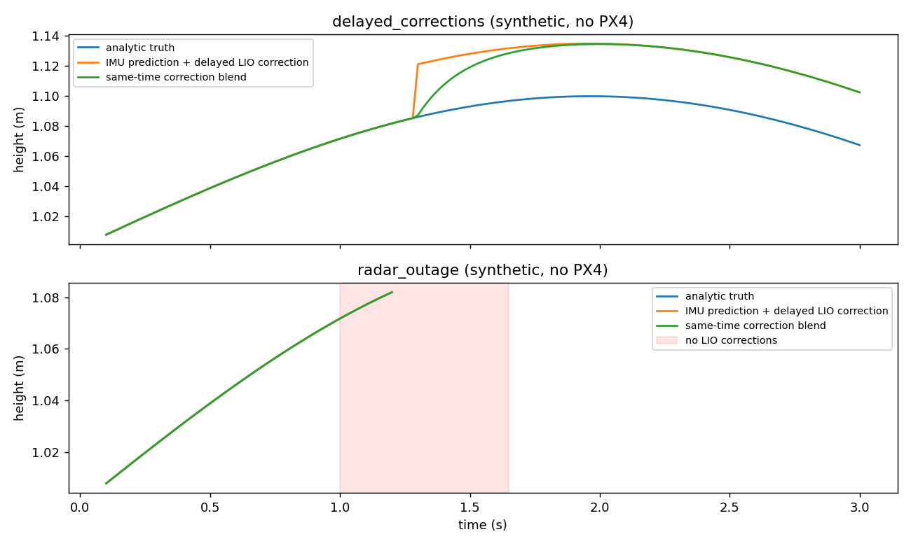

# EV 连续性第一阶段验证（2026-10-04）

代码基线为整机 `e5fb382d`；修改只在 `feat/ev-continuity-20261004`。本轮没有连接飞机、启动仿真或修改 PX4 参数。已完成确定性 LIO 修复、独立 IMU 预测观察原型与离线测试，**尚未验收正式 EV 替换和实机高度跳变消除**。[实现、参数及后续计划](../../planning/ev_continuity_20261004/README.md)。

## 原始第五组数据复核

只读 `r2026-board-vision-tests/logs/board_high_priority_20261003_171424/flight_debug_0.bag`，按记录的 MAVROS armed 状态划分；未跨停机区间计算相邻间隔。

| 解锁期间 | LIO | EV |
|---|---:|---:|
| 消息数 | 2060 | 2047 |
| bag 接收年龄 P50 | 71.23 ms | 72.38 ms |
| P95 | 154.48 ms | 150.27 ms |
| P99 | 284.07 ms | 234.84 ms |
| 最大接收间隔 | 388.06 ms | 635.40 ms |
| 最大源 stamp 间隔 | 118.60 ms | 399.84 ms |
| 源 stamp 非递增 | 0 | 0 |

与用户 PDF 和既有报告的主要时效结论一致。bag 到达年龄还含录制调度：本次有 14 条 LIO 的到达 age 超过 300 ms、1 条 EV 的 bag age 约 301.9 ms；不能据此说桥接转发了 14 条过期值或违背 300 ms 检查。原报告用相同源 stamp 配对得到 13 条未转发，是不同口径。

本包缺 `/livox/imu`，也没有新增完整状态快照，因此不能复跑真实独立 IMU 预测。工具已经验证会明确拒绝这种输入，没有用零偏置/猜测重力/飞控融合结果补齐。[完整时序摘要](original_timing.json)。

## 离线测试

| 检查 | 结果 | 范围 |
|---|---|---|
| FAST-LIO Catkin 构建 | PASS | 本机 x86，新工作树，默认与显式2线程配置；依赖借用已编译整机 overlay |
| 预处理真实 C++ 输入 | 6 组 PASS | driver2、Gazebo、短线、全盲、尾部耗尽、初始化门槛 |
| 预处理 ASan/UBSan | PASS | 同一边界测试；未测长时内存压力 |
| 地图步长测试 | PASS | 双向边界、静止、20/24/30/200 m、非法参数 |
| IMU 处理有效性 | PASS | 空 IMU 和初始化帧不允许用旧点云/状态发布新 stamp |
| 预测核心 | 19 项 PASS | 延迟校正、真实加速/转动、时间戳、偏置/比例/时差、缺口与故障边界 |
| ROS 序列化＋bag 离线重放 | 2 项 PASS | 生成的完整状态/IMU 真正写入并读回 ROS bag；禁止输出重映射至 MAVROS |
| shadow launch 参数展开 | PASS | 不启动 ROS 节点/飞行 |
| 原旧包缺少完整状态时拒绝 | PASS | 明确报缺失 IMU 和 PredictionState |

独立代码复核发现并修复了三项预测边界：校正消息先到时必须等待 IMU 覆盖；已有平滑偏移不能掩盖原始正负跳差；姿态平滑偏差也应进入不确定度代理。修后独立测试 14/14、补充 3/3 通过。另发现并修复旧慢路径空 IMU 时复用旧点云/时间锚点未初始化的问题，新增实际 IMU 处理 C++ 测试。

预处理修复前，通过真实 C++ 输入复现了全盲扫描越界，GDB 定位到 `give_feature()`；修复后同样输入通过。ASan 测试关闭泄漏检测及 ASan SIGSEGV handler，不能因此宣称完成内存泄漏检查。

地图计算中，20 m/6 m 静止反例原 100 帧移动 100 次，新步长只移动 1 次。该测试验证算法往返被消除，不是 KD-tree 删除耗时或板端提速百分比。

## 合成时序实验

解析轨迹含水平/竖直加速；IMU 200 Hz、LIO 10 Hz，LIO 到达延迟通常 75 ms、局部 180 ms，且注入一次 3.5 cm 校正。完整位置、速度、重力和偏置均为已知解析数据，并非现场数据。

- 延迟校正案例：有效阶段 146 次输出、间隔 20 ms；最大位置误差约 3.50 cm，与故意保留的校正偏移同量级。小校正平缓接续，没有把真实运动整体低通。
- 雷达丢失案例：IMU 继续，雷达校正在 1.0–1.65 s 不到达；校正年龄超过候选 300 ms 后停止，最后输出 1.20 s，故障为 `correction_timeout_requires_restart`。后续校正到来不会自行恢复。
- 原始校正 ±15 cm（实际跳差 30 cm）、姿态 ±9°（实际跳差 18°）仍会拒绝，不能被已有平滑 offset 抵消而绕过门槛。
- 输出耗时数据仅代表笔记本上的纯数值部分，不包括 ROS 调度、RK3588 负载和生产者构建快照，不能用于承诺板端频率。

[数值结果](synthetic_results.json)、[延迟案例 CSV](delayed_corrections.csv)、[断流案例 CSV](radar_outage.csv)。

## 结论与下一步

可进入“前线源码对比＋地面观察”阶段，不能跳过实测直接切换飞控输入。需要新包记录原始 IMU 和完整快照；做 LIO 算法性能对比还需要原始雷达输入。新预测只发布 `/ev_shadow/*`，正式 `lio_external_pose` 接线、PX4 配置和任务保护均未改。

性能优化降低超期概率，短时预测填补有限延迟；它们都不保证长失援恢复时 PX4 不重置。完整根治仍需坐标标定、融合输入相关性评估和重置后最终设定点/限高的接续验证。
