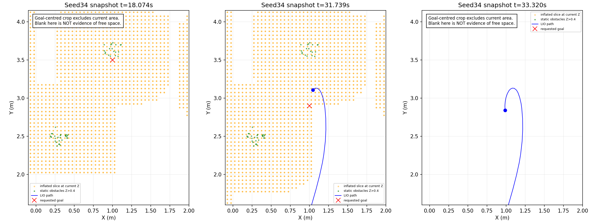
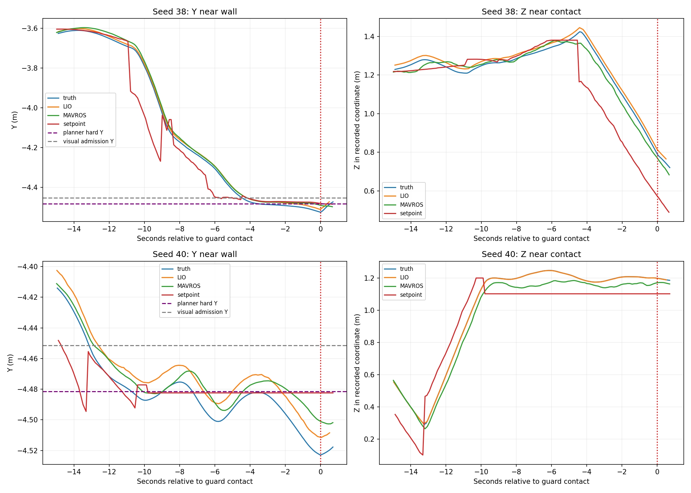

# 六轮首个异常、修复覆盖及下一步

## 结论

原失败子集本轮严格Gate为3/6通过：31、32、37。34仍任务失败；38、40为55cm鲁棒包络接触Wall_11触发FAIL。该接触记录不是地面碰撞，也不是实际裸机强烈撞墙的证据。保持原Gate结果，不事后改判或补跑筛选成功。

### 31、32、37：本轮通过的含义

- 31：原走廊首轨迹长等待未重现，本轮三投/两门/H降落完成，任务238.640秒。
- 32：低空进场、升高及完整任务通过，任务247.580秒。此前242.59秒先导单列，不替换本轮结果。
- 37：本轮降落位姿跳变未导致失败，任务173.901秒。没有针对性修复或故障注入证据，不能据单轮PASS称LAND估计跳变根治。
- 三者只证明当前组合版本在这三个冻结布局这一次成功，不分离每个补丁的因果作用，也不代表未复测的原四个成功seed通过。

## Seed34：起飞已通过，失效发生在高位航点与占据起点的恢复

1. 低空进场15.050秒确认到达，升高17.661秒确认到达；ascent_verified=true。不是再次在起飞首轨迹失败。
2. 首个高位点(1,3.5,2.38)从18.074秒开始规划失败，记录有goal_occ=1。近时快照显示该XY位于树障碍的高位膨胀柱内；飞机所在航层高于树，并不代表规则允许穿过其投影禁区。
3. 25.8秒任务层换到(1,2.9)，实际规划有效终点调整为(1.05,2.85)，26.348秒轨迹READY。
4. 31.739秒重规划失败时，LIO位置约(1.0456,3.1070,2.4868)，已经越过有效终点Y约0.257m；快照膨胀点中心最近约2.98cm。该距离不是精确SDF净空，但与运行时start_occ=1相符。
5. 33.024秒任务执行层仍给出motion_arrival_confirmed；随后从约(1,2.9)发布新目标，反复出现start_occ=1。高位任务每约8秒换点/跳点；改变终点并不能解决起点已占据。
6. 97.9秒结束高位路线，未获得合格高权重线索，尝试原地下撤；109.932秒以initial_plan_timeout结束。low_limits_applied=false，不能把这次下降失败归因于过早启用低位顶棚。

本轮运行日志中的拒绝摘要有222行start_occ=1/goal_occ=0，另20行起终点均占据。这是日志行数，不是222次独立故障。没有物理碰撞记录。

独立整盒树投影还记录到38个插值重叠采样：31.347秒对juniper_Tree_0的最小分离轴间距约-14.43cm。这是55cm保守盒与树/垫箱凸包的投影重叠，不是3D碰撞深度；其幅度也不宜简单当作毫米舍入。需要把实际跟踪偏移、计划曲线净空与地图投影口径一起核对。

第三张快照以远处请求目标为裁剪中心，不包含当前飞机附近，空白不能当作当前净空证据。inflated_map头时间为0，快照只提供近时参考；记录器最多保留前三个失败目标，下降时的地图没有新的独立快照。下一轮应在同等存储预算下保留起点和目标附近的小窗口及有效时间，而非只记录最早三个目标。

处置重点：在现有规划/执行交接中区分“终点不可达”和“当前起点占据”；后者停止反复更换远端目标。在重规划失败、起点已占据时，不能仅凭位置接近就确认一个新的安全出发点。近障碍替代点还要给跟踪/制动留余量，不能只优化候选距离。无需再加一个通用看门狗。

## Seed38、40：低空补搜绕过边界许可，以及投后交接余量不足

### 共同代码路径

高位策略在REACQUIRE阶段会调用BoundaryRevisit.admissible；但LOW_COVERAGE直接调用MissionRuntime.ingest与调度，并未经过相同的边界许可。这是可见的路径分歧，不是SERVER消息本身的故障。

共享配置只统一了高位视觉许可与SDF人工区域的几何来源，并未自动约束所有低空视觉控制动作，也没有保证RECOVERY成功时实际位姿仍在可规划区域。此次六轮暴露了修复的覆盖边界，不能再说“各条路径都已对齐”。

### Seed38

- 高位只确认bridge/panzer，102.922秒两投后转LOW_COVERAGE；435.751秒补搜触发red_cross中断。
- 444.506秒在第三目标对齐/下降过程中，competition_guard_collision接触Wall_11；第三投尚未提交。
- 首次接触消息中最大深度2.41×10^-7m（约0.00024mm），该采样合力0N。actual事件只在接触开始时记录，并非整段最大穿透/峰值力；不能由此断言整个接触很轻，也不能称为裸机猛烈撞击。
- 接触附近真值Y约-4.5244，MAVROS约-4.4889，差约3.55cm；因此只按估计位姿及3cm静态余量不能保证真值包络不触边。这里既有低空入口许可缺口，也有估计/跟踪余量问题。

### Seed40

- 高位在54.402秒累计三目标后中断。第一个red_cross复核期间边界拒绝累计149次，131.302秒reacquisition_timeout进入LOW_COVERAGE。
- 131.416秒低空补搜随即对red_cross发APPROACH；143.720秒报告release_recovery_confirmed并开始下一段RESUME。
- 144.070秒后出现start_occ=1，当前LIO Y已越过共享规划硬边界约-4.4814；153.635秒鲁棒包络接触Wall_11。
- 首次接触采样深度1.95×10^-6m（约0.00195mm），该采样合力约0.0603N，均不是整段峰值。真值Y约-4.5230，MAVROS约-4.5010，差约2.19cm。后段飞控设定点Y固定约-4.4824，已经没有向场内退让的有效规划轨迹。
- 与原seed40的2700秒墙钟截尾不同，本轮是提前发生的接触失败；不能把它算成解决了原超时或取得节时。

两轮接触均发生在55cm代理包络；按用户已说明“55cm本身含鲁棒膨胀”理解，可确认保守包络余量已耗尽，但无法据首次采样推断整个冲击强度或真实机体一定碰墙。本报告保留严格Gate FAIL，并单列接触对象与数值；不通过删接触记录或缩盒将本轮改成PASS。

## 下一步应做什么

1. **统一APPROACH入口许可**：把已有边界判定放在所有视觉中断共享的入口，高位重捕、LOW_COVERAGE和后续重试共用；不要在每条支路复制一套阈值。
2. **统一恢复交接条件**：RECOVERY成功除了高度/投递事务完成，还应确认实际位姿可交回规划。针对近边目标设计返回已验证内侧观察位置的恢复，并验证轨迹/净空；不能仅将下一条动作更早超时。
3. **区分失败类别**：seed34为起点占据时，不继续给每个新终点刷新完整预算。沿用现有FSM及明确失败结果处理，避免增加层层嵌套的通用兜底。
4. **保留鲁棒包络、核算误差预算**：实测/回放LIO与MAVROS差异、控制跟踪误差、制动距离，统一到同一坐标系和净空口径；不凭毫米级接触直接缩膨胀。
5. 后续先离线回放34/38/40上述小窗口，再经明确授权做对应实跑；本轮不修改飞行代码或追加仿真。

详细原始摘要见[failure_evidence.json](failure_evidence.json)和[failure_geometry.json](failure_geometry.json)。完整新旧航迹、阶段耗时、投递误差及视频入口见[统一报告](REPORT.md)。
