# 历史失败六seed统一回归报告

本批仅重跑历史失败的31、32、34、37、38、40，各一次。结果为 **3/6 PASS**。原十轮其他4个通过seed未复测，不能将此推算为当前版本十轮成功率。

**优先结论：** 起飞组合修正使32完成整场、34完成升高，但34随后陷入占据起点；38/40暴露低空补搜未共享边界许可、以及恢复交接余量不足。不能据前三个PASS宣布停滞或边界问题全部根治。

[详细首因及下一步](DIAGNOSIS.md) · [补搜、速度、历史图及远端说明](FOLLOWUP.md) · [视频和全部图表总览](index.html)

38/40的`actual_collision`来自55cm鲁棒代理包络与Wall_11接触，不是地面接触；首次采样深度不代表整段冲击峰值，也不证明真实裸机撞墙。严格Gate FAIL保持不变，详见诊断说明。

## 版本、场地和计时

统一HEAD `57c1003ac3a91568e1bdb38e90570ac8634824f3`，实际导航/视觉包路径均核对为本工作树。六轮未调参、未补跑替换失败。与原十轮直接比对实际生成的五类靶位，最大XY差均小于0.1mm；树/门复用同一冻结world。2.6m高位、既有快走廊和录像配置一致。宿主墙钟改为6000秒，ROS任务600秒不变，避免旧seed40墙钟截尾；因此该项属于评测环境变化。

本批是历史失败子集的可靠性复测，原六轮均未完整完赛，不计算所谓完整完赛节时百分比；只有双方确实达到的同一阶段才比较耗时。视频按ROS图像时间校正，宿主运行时长不等于飞行时间。

## 配对结果

| seed | 原结果 | 本轮 | 原投递数 | 本轮投递数 | 原三投/s | 本轮三投/s | 本轮完赛/s | 本轮原因 |
|---|---|---|---|---|---|---|---|---|
| 31 | FAIL | PASS | 3 | 3 | 107.98 | 133.63 | 238.64 | all_checks_passed |
| 32 | FAIL | PASS | 0 | 3 | — | 133.84 | 247.58 | all_checks_passed |
| 34 | FAIL | FAIL | 0 | 0 | — | — | — | manager_failed |
| 37 | FAIL | PASS | 3 | 3 | 73.28 | 77.34 | 173.90 | all_checks_passed |
| 38 | FAIL | FAIL | 2 | 2 | — | — | — | actual_collision |
| 40 | FAIL | FAIL | 3 | 1 | 499.85 | — | — | actual_collision |

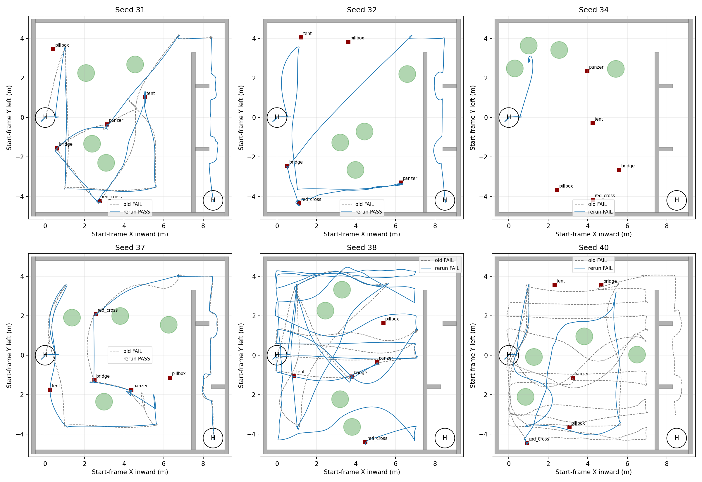

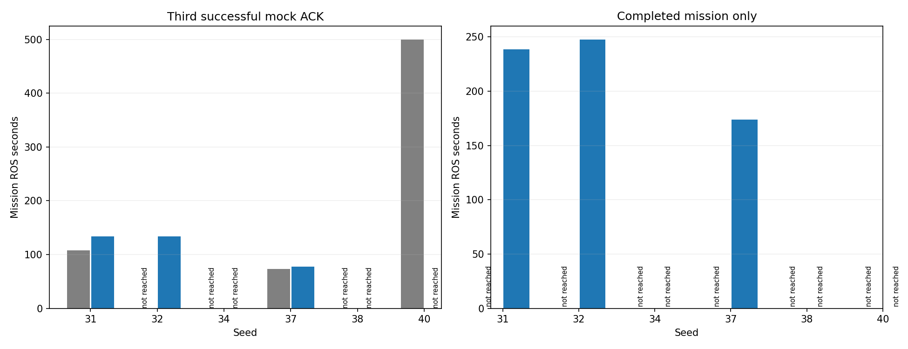

## 分阶段耗时与对准

任务计时从首条mission决策起，不含此前起飞准备；视频包含启动和少量收尾。相同阶段对比：31三投用时比旧轮增加约25.65秒，37增加约4.06秒。当前没有完整完赛节时的双成功配对，本批不能声称提速。

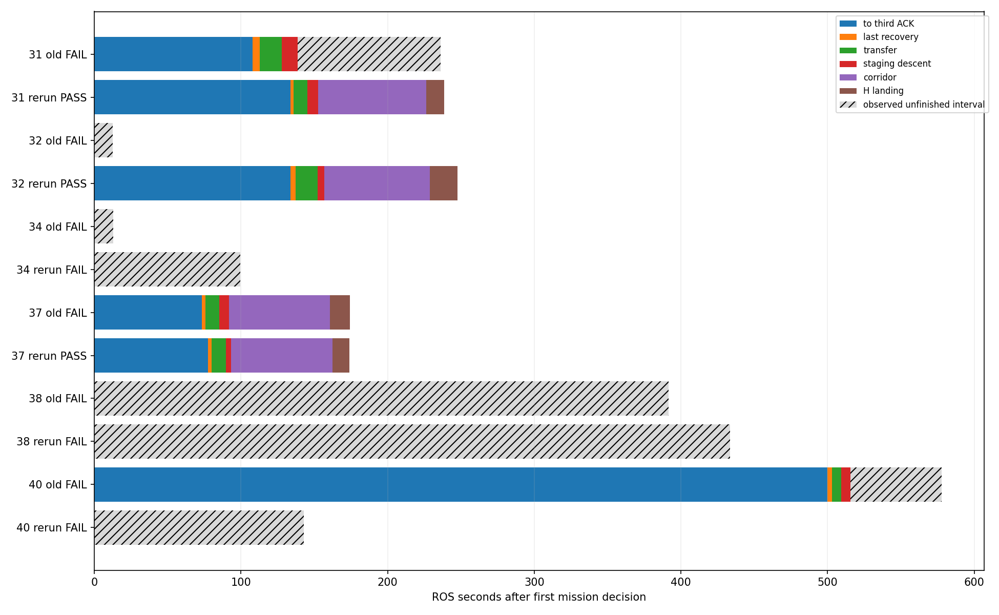

斜线部分是失败轮尚未闭合阶段的已观察时间，不是成功完赛时间；静止时间还可能包含必要的对齐、投递和等待，不能全部称作停滞浪费。

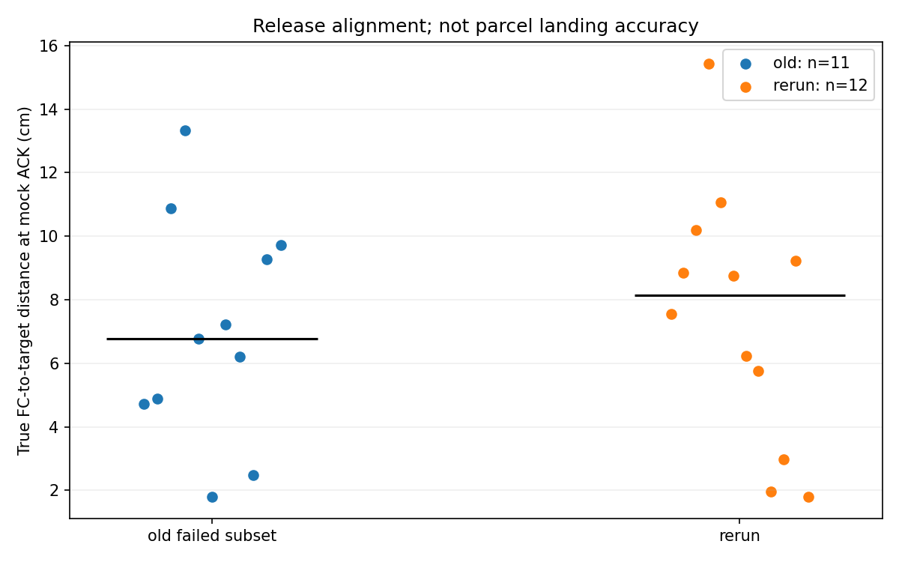

| 样本 | ACK数 | 中位/cm | P95/cm | 最大/cm |
| --- | --- | --- | --- | --- |
| old | 11 | 6.77 | 12.11 | 13.33 |
| rerun | 12 | 8.15 | 13.03 | 15.43 |

成功ACK集合不同，以上不是严格同目标配对精度改善结论；仅统计已成功提交的mock样本，不是包裹落点。保守树投影独立结果见[汇总](body_projection_summary.json)，与接触Gate分开解释。

## 单轮指标和材料

### Seed 31

结果PASS，原因`all_checks_passed`；记录XY航程52.14m，仿真接触事件0，样本间隔缺口0。失败轮航程/时长只是已执行部分。

[完整指标](31_rerun/metrics.json) · [跟随+俯视视频](../../../logs/failedsix_seed31_20260921_151434/presentation.mp4)

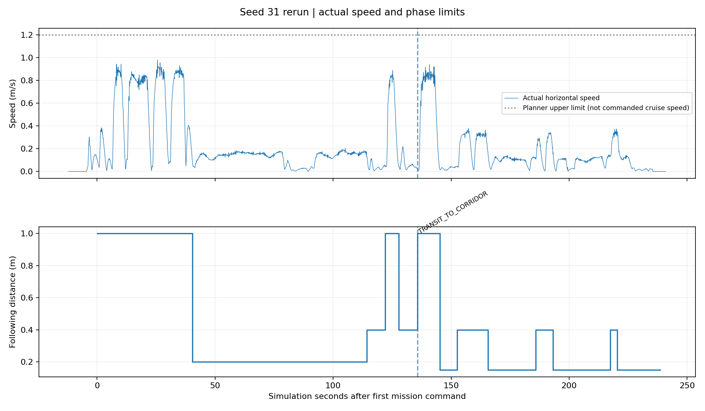

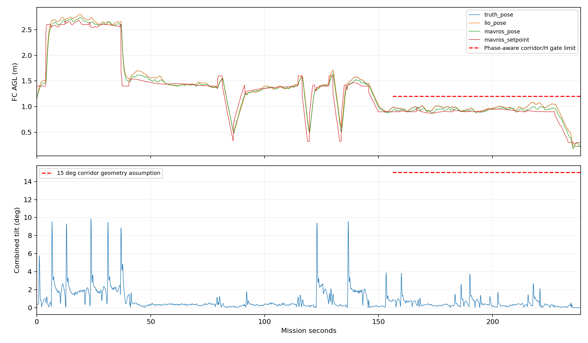

恢复事件：`{}`。未出现事件不等于该故障分支已经动态验证。

### Seed 32

结果PASS，原因`all_checks_passed`；记录XY航程49.05m，仿真接触事件0，样本间隔缺口0。失败轮航程/时长只是已执行部分。

[完整指标](32_rerun/metrics.json) · [跟随+俯视视频](../../../logs/failedsix_seed32_20260921_153029/presentation.mp4)

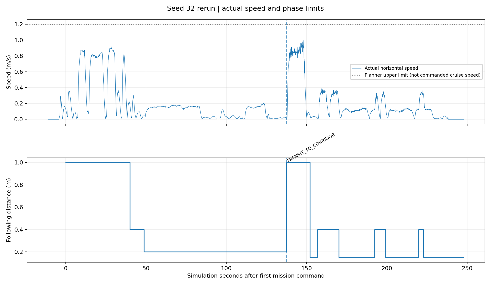

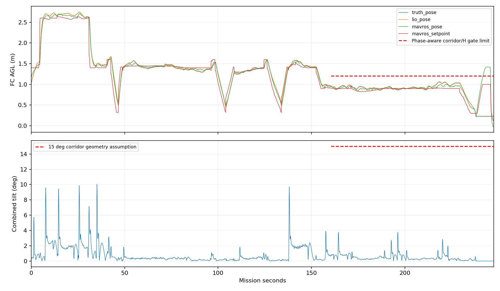

恢复事件：`{}`。未出现事件不等于该故障分支已经动态验证。

### Seed 34

结果FAIL，原因`manager_failed`；记录XY航程6.22m，仿真接触事件0，样本间隔缺口0。失败轮航程/时长只是已执行部分。

[完整指标](34_rerun/metrics.json) · [跟随+俯视视频](../../../logs/failedsix_seed34_20260921_154427/presentation.mp4)

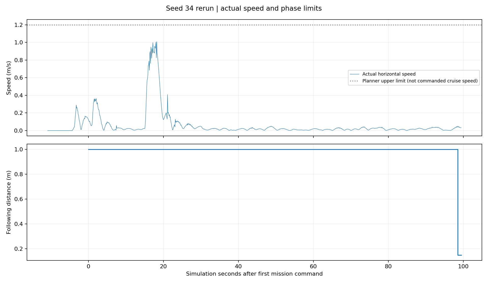

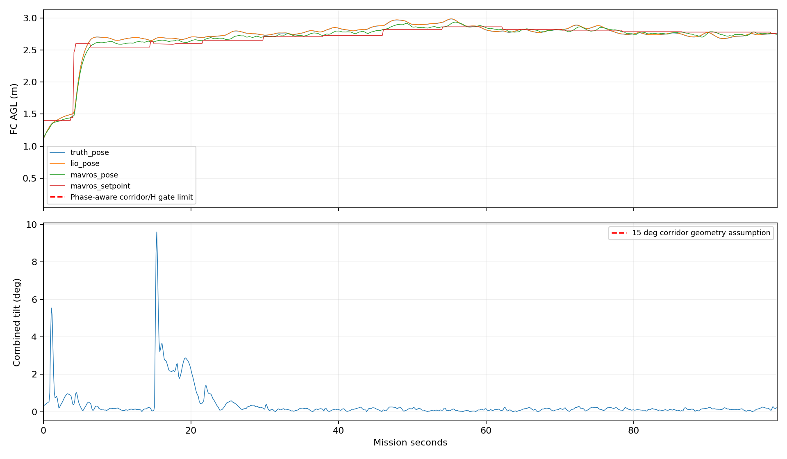

恢复事件：`{}`。未出现事件不等于该故障分支已经动态验证。

### Seed 37

结果PASS，原因`all_checks_passed`；记录XY航程44.26m，仿真接触事件0，样本间隔缺口0。失败轮航程/时长只是已执行部分。

[完整指标](37_rerun/metrics.json) · [跟随+俯视视频](../../../logs/failedsix_seed37_20260921_155049/presentation.mp4)

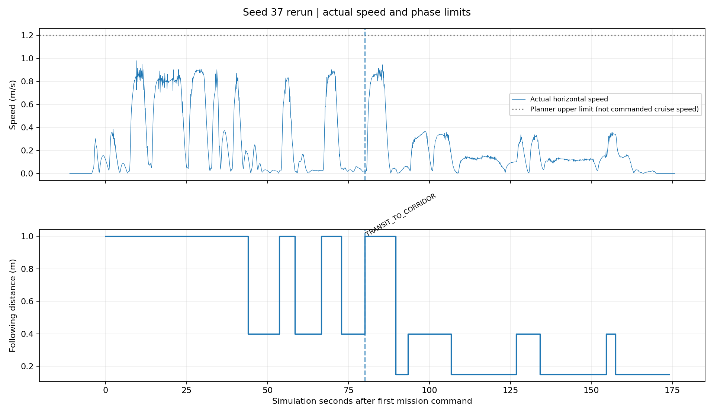

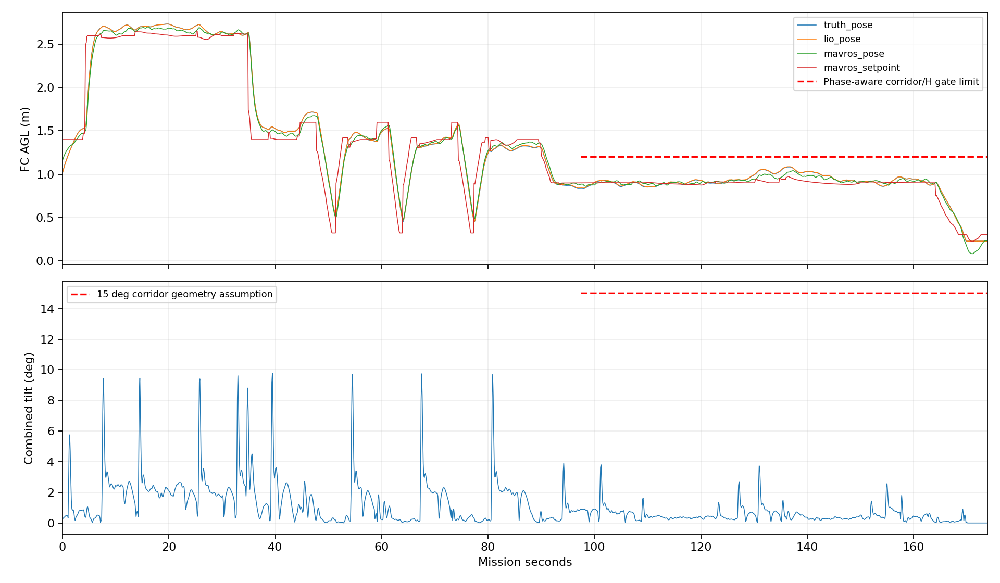

恢复事件：`{}`。未出现事件不等于该故障分支已经动态验证。

### Seed 38

结果FAIL，原因`actual_collision`；记录XY航程125.78m，仿真接触事件1，样本间隔缺口0。失败轮航程/时长只是已执行部分。

[完整指标](38_rerun/metrics.json) · [跟随+俯视视频](../../../logs/failedsix_seed38_20260921_160134/presentation_review.mp4)

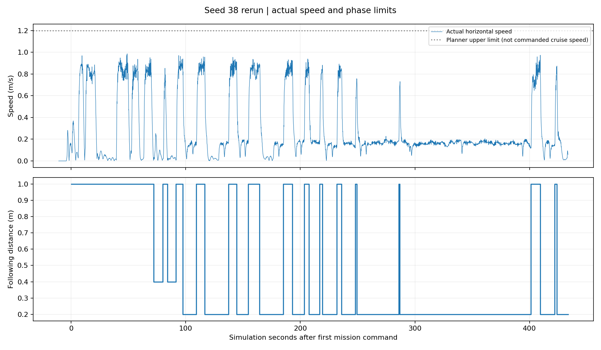

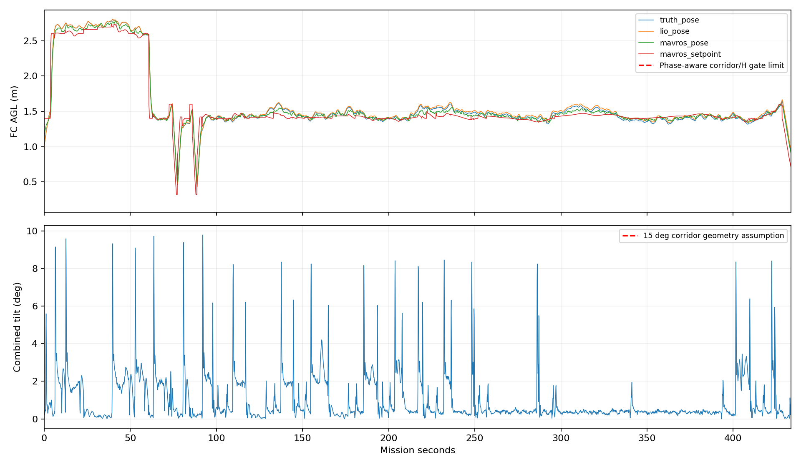

恢复事件：`{}`。未出现事件不等于该故障分支已经动态验证。

### Seed 40

结果FAIL，原因`actual_collision`；记录XY航程35.70m，仿真接触事件1，样本间隔缺口0。失败轮航程/时长只是已执行部分。

[完整指标](40_rerun/metrics.json) · [跟随+俯视视频](../../../logs/failedsix_seed40_20260921_162515/presentation_review.mp4)

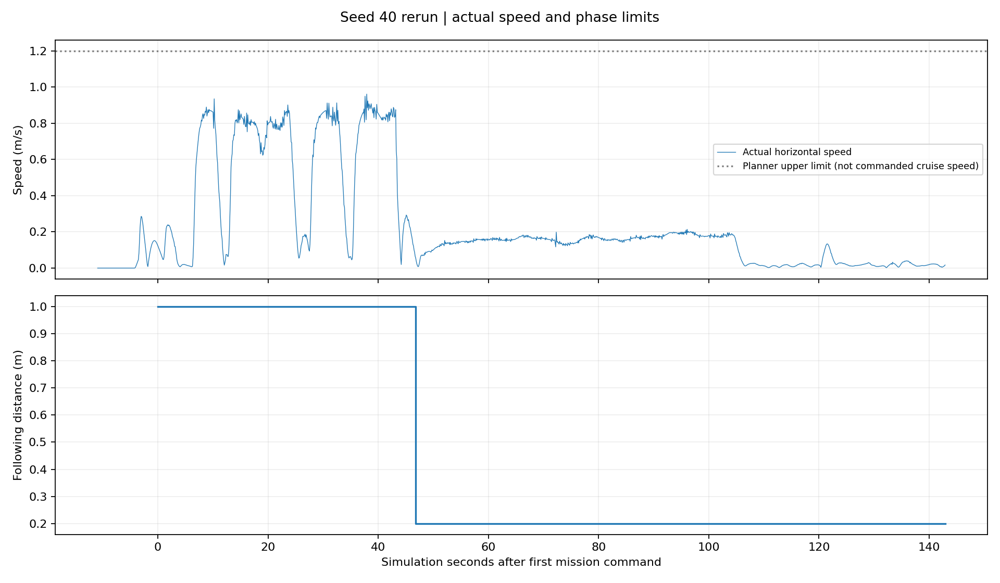

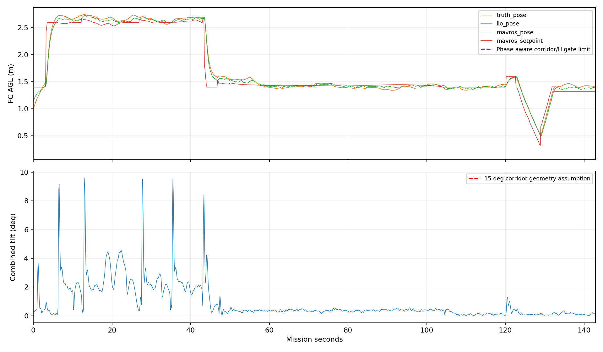

恢复事件：`{}`。未出现事件不等于该故障分支已经动态验证。

## 统计边界

投递误差按mock成功ACK时真实飞控中心到靶心距离统计，不是包裹落点；真实机构耗时及释放口偏置仍未标定。原始与新Gate都保留，另有保守机体/树投影结果，不把保守包络重叠自动称为仿真接触事件。失败原因和下一步处置需结合逐轮首个异常分析，不能只看最终ABORT。

## 独立保守树投影检查

| seed | 整盒投影重叠采样数 | 最小分离轴间距/cm |
| --- | --- | --- |
| 31 | 0 | 38.77 |
| 32 | 0 | 33.49 |
| 34 | 38 | -14.43 |
| 37 | 0 | 13.12 |
| 38 | 1 | -0.31 |
| 40 | 0 | 16.70 |

采用55×55×40cm保守盒及树/垫箱凸包，在整盒高于障碍时以最多2.5cm间隔插值。负间距表示投影重叠，不是3D碰撞深度。34的约14.43cm重叠需要认真诊断；38约3mm应与已膨胀包络的余量区别解读，其余四轮本项无重叠采样。

视频原始follow/overview保留。38/40另生成presentation_review.mp4，修正“低空补搜内部已进入投递但字幕仍显示补搜”的展示问题，并将接触字幕标明为鲁棒包络；没有改动图像时序、飞行数据或Gate结果。

离线复现顺序：process_results.py生成基础分析/视频，failure_evidence.py、failure_plots.py、failure_timeline.py生成失败证据，enhance_report.py补充分段与精度；DIAGNOSIS.md和FOLLOWUP.md为人工复核说明。原始视频/日志不入Git，网页中的视频链接仅在保留logs的本机可直接播放，远端提供图表、摘要和复现脚本。
